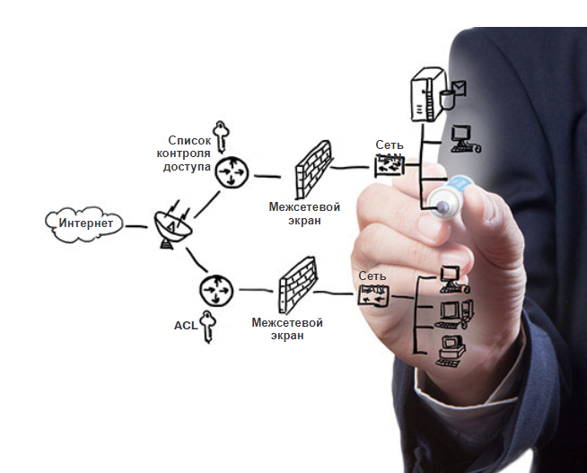

<!-- verified: agorbachev 03.05.2022 -->

<!-- 1.8.1 -->
## Угрозы безопасности

Вы, без сомнения, слышали или читали новости о проникновении в корпоративную сеть, когда злоумышленники получили доступ к личной информации тысяч клиентов. По этой причине безопасность сети всегда будет одним из главных приоритетов администраторов.

Обеспечение сетевой безопасности является неотъемлемой частью вычислительных сетей, независимо от их масштабов: от домашней сети, в которой к Интернету подключен только один компьютер, до корпоративной сети, насчитывающей тысячи пользователей. Обеспечивая сетевую безопасность, вы должны учитывать существующую среду передачи данных, а также инструменты и требования сети. Необходимо защищать данные, поддерживая качество обслуживания на заявленном уровне.

К обеспечению безопасности сети относятся различные протоколы, технологии, устройства, инструменты и методы обеспечения безопасности данных и остановки угроз. Угрозы безопасности могут быть как внешними, так и внутренними. Многие внешние угрозы сегодня распространяются через Интернет.

Существует несколько распространенных внешних угроз для сетей:

* **Вирусы, черви и «троянские кони»**  — вредоносное программное обеспечение и произвольный код, исполняемые на пользовательских устройствах
* **Шпионские и рекламные программы**  - Это типы программного обеспечения, которые установлены на устройстве пользователя. Такая программа тайно собирает информацию о пользователе.
* **Атаки нулевого дня** - также называемые атаками нулевого часа, осуществляются в первый день, когда об уязвимости становится известно
* **Атаки злоумышленника** - Злоумышленник атакует пользовательские устройства или сетевые ресурсы.
* **Атаки типа «отказ в обслуживании»**  — атаки, разработанные для снижения производительности или аварийного завершения процессов на сетевом устройстве
* **Перехват и хищение данных**  — атака с целью сбора частной информации из корпоративной сети
* **Кража личной информации ** — атака для хищения учетных данных пользователя, чтобы получить доступ к данным частного характера

Не менее важно учитывать внутренние угрозы. Многие исследования показывают, что наиболее распространенные нарушения информационной безопасности связаны с внутренними пользователями сети. Это могут быть случаи потери или кражи устройств, ошибки сотрудников и даже их злонамеренные действия. При использовании концепции «Принеси на работу свое собственное устройство» корпоративные данные еще намного более уязвимы. Таким образом, при создании политики обеспечения безопасности важно учитывать и внешние, и внутренние угрозы безопасности, как показано на рисунке.

<!-- /courses/itn-dl/aeec9260-34fa-11eb-ad9a-f74babed41a6/af1e77d2-34fa-11eb-ad9a-f74babed41a6/assets/2d988780-1c25-11ea-81a0-ffc2c49b96bc.svg -->

<!-- 1.8.2 -->
## Решения обеспечения безопасности

Ни одно отдельное решение не может полностью обезопасить сеть от многочисленных современных угроз. Именно поэтому меры по обеспечению сетевой безопасности необходимо внедрять сразу на нескольких уровнях, задействовав одновременно несколько решений. Если какой-либо один компонент системы безопасности не может определить угрозы и защитить сеть, то ему на помощью придут другие компоненты.

Реализовать политики безопасности в домашней сети, как правило, достаточно просто. Такие политики обычно внедряются на подключающихся оконечных устройствах, а также в точке подключения к Интернету, и даже могут быть реализованы как сервисы, предоставляемые по договору Интернет-провайдером.

Компоненты системы безопасности для домашней сети или сети небольшого офиса:

* **Антивирусное и антишпионское ПО**  позволяет предотвратить заражение оконечных устройств вредоносными программами.
* **Фильтрация брандмауэра** - Фильтрация брандмауэра блокирует несанкционированный доступ в сеть и выход из нее. Сюда может входить система реализованных на узле межсетевых экранов, которая используется для предотвращения несанкционированного доступа к оконечному устройству, или базовый сервис фильтрации на домашнем маршрутизаторе для предотвращения несанкционированного доступа в сеть извне.

Реализация политик сетевой безопасности для корпоративной сети, напротив, обычно включает в себя множество компонентов, встроенных в сети для контроля и фильтрации трафика. В идеале предполагается, что все компоненты работают вместе, что снижает объем обслуживания и повышает безопасность. Более крупные сети и корпоративные сети используют антивирусные, антишпионские программы и брандмауэры, но они также имеют другие требования безопасности:

* **Выделенные межсетевые экраны**  — более широкие возможности межсетевого экрана, который может фильтровать большой объем трафика с повышенной детализацией.
* **Списки контроля доступа (ACL)**  - они дополнительно фильтруют доступ и пересылку трафика на основе IP-адресов и приложений.
* **Системы предотвращения вторжений (Intrusion prevention system, IPS)**  — определение быстро распространяющихся угроз, таких как атаки нулевого дня или нулевого часа.
* **Виртуальные частные сети (VPN)**  — используются для обеспечения защищенного доступа удаленных сотрудников.

Требования безопасности должны учитывать сетевую среду, а также различные приложения и требования к вычислительным устройствам. И в домашних, и в корпоративных сетях необходимо обеспечивать безопасность данных, предлагая то качество обслуживания, которое ожидают пользователи любой технологии. Кроме того, внедренные решения для обеспечения безопасности должны легко адаптироваться к росту сетей и меняющимся требованиям.

Изучение угроз сетевой безопасности и методов их отражения начинается с четкого понимания инфраструктуры коммутации и маршрутизации, используемой для организации сетевых сервисов.

<!-- /courses/itn-dl/aeec9260-34fa-11eb-ad9a-f74babed41a6/af1e77d2-34fa-11eb-ad9a-f74babed41a6/assets/2d98ae94-1c25-11ea-81a0-ffc2c49b96bc.svg -->

<!-- 1.8.3 -->
<!-- quiz -->

