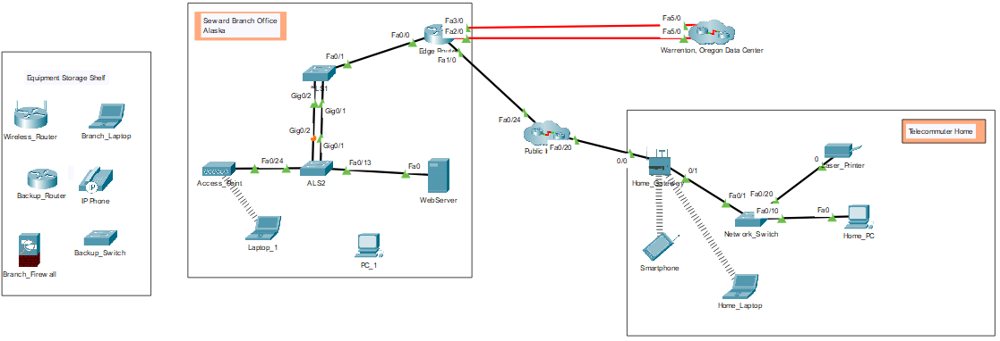

## Топология



## Задачи

Часть 1. Исследование нижней панели инструментов

Часть 2: Исследование устройств в стойке

Часть 3. Подключение конечных устройств к сетевым устройствам

Часть 4. Установка резервного маршрутизатора

Часть 5. Настройка имени узла

Часть 6: Изучение остальную часть сети

## Общие сведения и сценарий

Модель сети в этом задании в режиме симуляции сетевого оборудования (PTPM) включает в себя многие технологии, которые можно освоить на курсах Cisco Networking Academy. Эта модель является упрощенной версией небольшой сети предприятия среднего бизнеса.

Большинство устройств в филиале Seward и центре обработки данных Warrenton уже развернуты и настроены. Вы только что были наняты для оценки качества развернутых устройств и сетей. В этом задании необязательно вникать во все детали происходящего. Изучите те аспекты сети, которые вам интересны. Для более систематического и подробного изучения выполните следующие действия. Ответьте на вопросы, тщательно обдумывая каждый ответ.

**Примечание.** Это задание открывается и фокусируется на режиме симуляции **физического** оборудования. Многие задания Packet Tracer, с которыми вы сталкиваетесь на курсах Cisco Networking Academy, будут использовать **логический** режим. Вы можете переключаться между этими режимами в любое время, чтобы сравнить различия, нажав кнопки **Логический** (Shift+L) и **Физический** (Shift+P). Тем не менее, в других действиях в этом курсе вы можете быть заблокированы в том или ином режиме.

## Инструкции

### Часть 1. Исследование нижней панели инструментов

Панель инструментов со значками в левом нижнем углу содержит сетевые компоненты различных категорий. Эти категории соответствуют промежуточным устройствам **Network Devices**, оконечным устройствам **End Devices** и компоненты **Components**. Категория **Connections** (Подключения) (со значком молнии) представляет средства подключения, поддерживаемые программой Packet Tracer. Последние две категории: **Miscellaneous** и **Multiuser Connection.**

Вопрос: Каковы подкатегории для **Network Devices**?

**Введите ваш ответ здесь.**

### Часть 2. Исследование устройств в стойке

1.  Если вы отправились исследовать, вернитесь в **Физический** режим и нажмите **Intercity** На верхней синей панели нажмите кнопку **Physical** и затем, с помощью кнопок **Navigation Panel** или **Back level** перейдите в **Intercity**.

2.  Нажмите на **Seward** и затем нажмите на **Branch Office**.

3.  Нажмите на **Branch Office Wiring Closet**. Обратите внимание, что в стойке есть **Rack**, **Cable Pegboard**, **Table** и **Shelf**.

    **Rack** содержит устройства, которые могут быть установлены в стойку. При увеличении масштаба стойки (инструмент масштабирования или Ctrl+колесо прокрутки) можно увидеть, что устройства ввинчены (смонтированы) в стойке. Под устройством распределения питания вы найдете маршрутизатор. С помощью маршрутизаторов можно объединять сети различных типов.

4.  Под маршрутизатором находятся два коммутатора. Эти коммутаторы обеспечивают проводные соединения для подключения к другим устройствам. Обратите внимание, что у устройств есть имя, назначенное сетевым администратором. Какие устройства используют проводное соединение для подключения к коммутатору **ALS2**?

    **Введите ваш ответ здесь.**

5.  Под коммутаторами в **стойке** находится беспроводная точка доступа с именем **Access_Point**. Беспроводные точки доступа используют беспроводное подключение для подключения к другим устройствам. Переключитесь в **логический** режим. Какое устройство подключено к **Access_Point**?

    **Введите ваш ответ здесь.**

6.  Переключитесь в **физический** режим. Вы должны вернуться в **Branch Office Wiring Closet**. Где физически находится устройство, подключенное к **Access_Point** ?

    **Введите ваш ответ здесь.**

### Часть 3. Подключение конечных устройств к сетевым устройствам

Устройства могут быть подключены различными способами. Для подключения к сети устройства обычно подключаются с помощью прямого кабеля или по беспроводной сети. Для подключения к управлению устройства обычно подключаются с помощью консольного кабеля или кабеля USB.

**Примечание.** Packet Tracer будет оценивать остальную часть этого задания. В любое время можно нажать кнопку **Check Results** в нижней части окна **Tasks**. Затем нажмите на **Assessment Items**, чтобы узнать, какие элементы задания еще не завершены.

1.  Исследуйте **Cable Pegboard**. Он включает в себя два **консольных** кабеля, десять **медных прямых** кабелей, четыре **оптоволоконных** кабеля, два **коаксиальных** кабеля и два кабеля **USB**. Обратите внимание, что представления кабелей в **физическом** режиме более похоже на их реальные аналоги. Переключитесь в **логический** режим. Обратите внимание, что вид кабелей в этом режиме отличаются.

2.  Переключитесь в **физический** режим. Нажмите на **медный прямой** кабель на кабельной панели **Cable Pegboard**.

3.  Наведите курсор мыши на порты **PC_1**, пока не увидите всплывающее окно **FastEthernet0**. Другой порт **RS232** предназначен для подключения **консольных** кабелей.

4.  Выбрав **медный прямой** кабель, нажмите на порт **FastEthernet0** для подключения кабеля. Теперь порт должен стать выделенным зеленым цветом.

5.  Подключите другой конец кабеля к коммутатору **ALS2**, щелкнув пустой порт Fast Ethernet. Теперь кабель должен быть между **PC_1** и портом **ALS2**.

6.  ПК и ноутбуки также можно подключить к сетевым устройствам с помощью консольного кабеля или кабеля USB. Это подключение обеспечивает доступ к управлению. Нажмите на **консольный** кабель в кабельной панели **Cable Pegboard**.

7.  Нажмите на порт **RS232** на **PC_1**. Теперь порт должен стать выделенным зеленым цветом.

8.  Наведите курсор мыши на **Edge_Router** и найдите **консольный** порт. Можно **щелкнуть правой кнопкой мыши** \> **Ispect Front**, чтобы увеличить масштаб и упростить поиск порта.

9.  Нажмите на **консольный** порт на **Edge_Router**, чтобы подключить **консольный** кабель. Теперь кабель должен быть между **PC_1** и **консольным** портом на **Edge_Router**.

### Часть 4. Установка резервного маршрутизатора

Доступ к новым моделям сетевых устройств можно получить через USB-порт для настройки управления. Это необходимо, поскольку новые ноутбуки и ПК обычно не включают порт RS232 для подключения консольных кабелей.

1.  Исследуйте **Shelf**. Исследование включает в себя инвентаризацию устройств в филиале Seward, которые в данный момент не установлены.

2.  Нажмите на **Backup_Router** и перетащите его в пустое место в стойке**Rack**.

3.  Некоторые устройства не включаются автоматически при установке в стойку**Rack**. Выберите **Backup_Router** \> **Inspect Rear**. Найдите кнопку питания и включите маршрутизатор.

4.  На **Cable Pegboard**выберите **USB-кабель**. Вернитесь к виду сзади **Backup_Router** и найдите порт **консоли USB** в крайнем левом углу. Нажмите на порт, чтобы подключить кабель USB. Теперь порт должен стать выделенным зеленым цветом.

5.  Подключите другой конец кабеля USB к любому из портов USB на **Laptop_1**. Кабель не будет провисать так, как кабели для подключения к **PC_1**.

### Часть 5. Настройка имени узла

Сетевые администраторы обычно назначают имя сетевым устройствам. Для этого вы будете использовать консольное подключение к **Backup_Router**.

1.  Нажмите на **Laptop_1** \> вкладка **Desktop** \> **Terminal**.

2.  Конфигурация терминала **Terminal Configuration** уже настроена с необходимыми параметрами конфигурацией порта. Нажмите **ОК**.

3.  Теперь вы находитесь в командной строке для **Backup_Router** и должны увидеть следующее.

    ```
    <output omitted>
    cisco ISR4331/K9 (1RU) processor with 1795999K/6147K bytes of memory.
    Processor board ID FLM232010G0
    3 Gigabit Ethernet interfaces
    2 Serial interfaces
    32768K bytes of non-volatile configuration memory.
    4194304K bytes of physical memory.
    3207167K bytes of flash memory at bootflash:.
    0K bytes of WebUI ODM Files at webui:.


    --- Диалоговое окно настройки системы ---

    Would you like to enter the initial configuration dialog? [yes/no]: no
    ```

4.  Ответьте **нет** на вопрос и нажмите клавишу ВВОД, чтобы попасть в командную строку на **Router**.

    ```
    Press RETURN to get started!

    <ENTER>

    Router>
    ```

5.  Введите следующие команды, чтобы присвоить имя маршрутизатору **Edge_Router_Backup**.

    ```
    Router> enable
    Router# configure terminal
    Введите построчно команды настройки. В конце нажмите CNTL/Z.
    Router(config)# hostname Edge_Router_Backup
    Edge_Router_Backup(config)# end
    Edge_Router_Backup#
    ```

    Обратите внимание, что имя хоста изменилось с **Router** на **Edge_Router_Backup**.

6.  Закройте окно **Laptop_1** и вернитесь в **Branch Office Wiring Closet**.

7.  Обратите внимание, что отображаемое имя Backup_Router не изменилось. Нажмите на **Backup_Router** \> **Config tab**. В разделе «Глобальные параметры» обратите внимание, что трассировщик пакетов поддерживает два имени устройства: **Display Name** и **Hostname**.

### Часть 6. Изучените остальную часть сети

Потратьте некоторое время, чтобы исследовать остальную часть сети. Ознакомьтесь с сетевыми представлениями как в **логическом**, так и в **физическом** режимах. В **физическом** режиме перейдите к другим областям, таким как **Wellington Data Center** и **Teleworker Home**. Технологии, используемые в этих местах, более подробно обсуждаются на курсах сетевой академии Cisco. На данный момент посмотрите, что вы можете обнаружить самостоятельно. Не беспокойся о том, чтобы что-либо сломать. Вы всегда можете закрыть Packet Tracer и открыть новую копию, чтобы начать изучение снова.

**Введите ваш ответ здесь.**

[Скачать файл Packet Tracer для локального запуска](./assets/1.0.5-packet-tracer---logical-and-physical-mode-exploration_ru-RU.pka)
