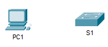

## Топология



## Задачи

Часть 1. Создание основных подключений, доступ к интерфейсу командной строки (CLI) и изучение справки

Часть 2. Изучение режимов EXEC

Часть 3. Настройка часов

## Общие сведения и сценарий

В этом упражнении вы сможете на практике отработать навыки, необходимые для навигации по операционной системе Cisco IOS, включая различные пользовательские режимы доступа, всевозможные режимы конфигурации, а также наиболее распространенные команды, используемые регулярно. Кроме того, вы поработаете с контекстной справкой при настройке команды **clock**.

## Инструкции

### Часть 1. Создание основных подключений, доступ к интерфейсу командной строки (CLI) и изучение справки

**Шаг 1. Подключите PC1 к S1 с помощью консольного кабеля.**

1.  Нажмите значок **Connections** (Подключения) (в виде молнии) в левом нижнем углу окна Packet Tracer.

2.  Выберите светло-голубой консольный кабель, щелкнув по нему. Указатель мыши примет вид разъема со свисающим концом кабеля.

3.  Нажмите **PC1**. В окне будет показан вариант для подключения RS-232. Подключите кабель к порту RS-232.

4.  Перетащите другой конец консольного подключения к коммутатору S1 и щелкните коммутатор, чтобы открыть список подключений.

5.  Выберите порт **Console** (Консольный), чтобы завершить подключение.

**Шаг 2. Установите сеанс диалога с коммутатором S1.**

1.  Нажмите **PC1** и откройте вкладку **Desktop** (Рабочий стол).

2.  Нажмите значок приложения **Terminal** (Терминал). Проверьте правильность параметров конфигурации портов, заданных по умолчанию.

    - Ответьте на вопрос №1

3.  Нажмите **OK**.

4.  В появившемся окне может отображаться несколько сообщений. В окне должно появиться сообщение **Press RETURN to get started!** (Нажмите ВОЗВРАТ, чтобы начать работу). Нажмите клавишу ввода.

    - Ответьте на вопрос №2

**Шаг 3. Изучите справку по IOS.**

1.  В IOS доступна справка по командам в зависимости от уровня работы. В данный момент отображается приглашение **User EXEC** (Пользовательский режим EXEC), и устройство ожидает ввода команды. Самый простой способ вызова справки — ввести вопросительный знак (?) в командной строке, чтобы получить список команд.

    ```
    S1> ?
    ```

    - Ответьте на вопрос №3

2.  В командной строке введите t с вопросительным знаком в конце (?).

    ```
    S1> t?
    ```

    - Ответьте на вопрос №4

    В командной строке введите te с вопросительным знаком в конце (?).

    ```
    S1> te?
    ```

    - Ответьте на вопрос №5

    Справка такого вида называется контекстной. Чем подробнее вводятся команды, тем больше сведений может предоставить справка.

### Часть 2. Изучение режимов EXEC

В части 2 этого упражнения вы переключитесь в привилегированный режим EXEC и выполните дополнительные команды.

**Шаг 1. Войдите в привилегированный режим EXEC.**

1.  В командной строке введите вопросительный знак (**?**).

    ```
    S1> ?
    ```

    - Ответьте на вопрос №6

2.  Введите **en** и нажмите клавишу **TAB**.

    ```
    S1> en<Tab>
    ```

    - Ответьте на вопрос №7

    Это называется завершением команды (или завершение нажатием клавиши TAB). Введя часть команды, можно нажать клавишу **TAB** и завершить частичный ввод этой команды. Если введенных символов достаточно для уникального определения команды (например, как в случае с командой **enable**), оставшаяся часть будет введена автоматически.

    - Ответьте на вопрос №8

3.  Введите команду **enable** и нажмите клавишу ввода.

    - Ответьте на вопрос №9

4.  Введите в строке вопросительный знак (**?**).

    ```
    S1# ?
    ```

    - Ответьте на вопрос №10

**Шаг 2. Войдите в режим глобальной настройки.**

1.  В привилегированном режиме EXEC одна из команд, начинающихся с буквы «с», — **configure**. Введите либо команду полностью, либо столько символов, сколько будет нужно для уникального определения команды. Нажмите клавишу \<**Tab**\>, чтобы выполнить команду, и нажмите клавишу ввода.

    ```
    S1# configure
    ```

    - Ответьте на вопрос №11

2.  Нажмите клавишу ввода, чтобы принять параметр по умолчанию, заключенный в квадратные скобки, —**\[terminal\]**.

    - Ответьте на вопрос №12

3.  Такой режим называется режимом глобальной конфигурации. Он будет более подробно рассмотрен в последующих упражнениях и лабораторных работах. А теперь вернитесь в привилегированный режим EXEC, введя команду **end** или **exit** либо нажав клавиши **Ctrl+Z**.

    ```
    S1(config)# exit
    S1#
    ```

### Часть 3. Настройка часов

**Шаг 1. Используйте команду clock.**

1.  Используйте команду **clock**, чтобы подробнее изучить справку и синтаксис команды. Введите **show clock** в привилегированном режиме EXEC.

    ```
    S1# show clock
    ```

    - Ответьте на вопрос №13

2.  Используйте контекстную справку и команду **clock**, чтобы установить текущее время на коммутаторе. Введите команду **clock** и нажмите клавишу ввода.

    ```
    S1# clock<ENTER>
    ```

    - Ответьте на вопрос №14

3.  IOS вернет сообщение «% Incomplete command». Это означает, что для команды **clock** требуются дополнительные параметры. В справке можно получить дополнительные сведения, если ввести после команды пробел и вопросительный знак (?).

    ```
    S1# clock ?
    ```

    - Ответьте на вопрос №15

4.  Настройте время с помощью команды **clock set**. Продолжайте выполнять команду поэтапно.

    ```
    S1# clock set ?
    ```

    - Ответьте на вопрос №16

5.  Взяв за основу сведения, запрошенные при помощи команды **clock set ?**, введите время 15:00 в 24-часовом формате (15:00:00). Проверьте, нужны ли дополнительные параметры.

    ```
    S1# clock set 15:00:00 ?
    ```

    Система возвращает запрос на получение дополнительных сведений.

    ```
    <1-31> Day of the month
    MONTH Month of the year
    ```

6.  Попробуйте установить дату 31 января 2035 г., используя запрошенный формат. Для этого может потребоваться запросить дополнительную информацию с помощью контекстной справки. По окончании выполните команду **show clock**, чтобы отобразить настройку часов. В результате на экране должны отобразиться следующие данные.

    ```
    S1# show clock
    *15:0:4.869 UTC Tue Jan 31 2035
    ```

7.  Если ваши выходные данные отличаются, попробуйте выполнить следующую команду.

    ```
    S1# clock set 15:00:00 31 Jan 2035
    ```

**Шаг 2. Изучите дополнительные командные сообщения.**

1.  В случае ввода неправильных или неполных команд, IOS выводит на экран различные сообщения. Продолжайте работать с командой **clock**, чтобы изучить дополнительные сообщения, которые могут появиться в ходе обучения работе с IOS.

2.  Введите следующие команды и обратите внимание на сообщение.

    ```
    S1# cl<tab>
    ```

    ```
    S1# clock
    ```

    ```
    S1# clock set 25:00:00
    ```

    ```
    S1# clock set 15:00:00 32
    ```

[Скачать файл Packet Tracer для локального запуска](./assets/2.3.7-lab.pka)
