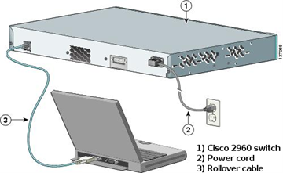
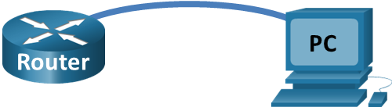
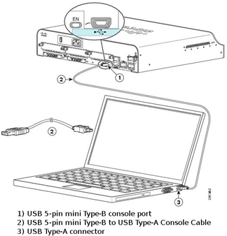

---

> **ВАЖНО**
> 
> Форма для ответов на вопросы будет доступна только при развертывании лабораторной работы 

---

## Топология


## Задачи

Часть 1. Получение доступа к коммутатору Cisco через консольный порт последовательного подключения

Часть 2. Отображение и настройка основных параметров устройства

Часть 3. Получение доступа к маршрутизатору Cisco с помощью консольного кабеля mini-USB (дополнительно)

**Примечание**. Пользователи NetLab или другого оборудования для удаленного доступа должны выполнить только часть 2.

## Общие сведения/сценарий

Во всех типах сетей используют различные модели маршрутизаторов и коммутаторов Cisco. Для управления этими устройствами используется локальное консольное подключение или удаленное подключение. Практически все устройства Cisco оснащены консольным портом последовательного подключения. Более новые модели, используемые в этой лабораторной работе, такие как Cisco 4221, также имеют порт консоли USB.

В этой лабораторной работе вы узнаете, как получить доступ к устройству Cisco через прямое локальное подключение к консольному порту, используя программу эмуляции терминала Tera Term. Вы также научитесь настраивать последовательный порт для консольного подключения Tera Term. Установив консольное подключение к устройству Cisco, можно отобразить или настроить параметры устройства. В этой лабораторной работе вы только отобразите параметры и настроите часы.

**Примечание**: Маршрутизаторы, используемые в практических лабораторных работах CCNA, - это Cisco 4221 с Cisco IOS XE Release 16.9.3 (образ universalk9). В лабораторных работах используются коммутаторы Cisco Catalyst 2960 с Cisco IOS версии 15.0(2) (образ lanbasek9). Можно использовать другие маршрутизаторы, коммутаторы и версии Cisco IOS. В зависимости от модели устройства и версии Cisco IOS доступные команды и результаты их выполнения могут отличаться от тех, которые показаны в лабораторных работах. Правильные идентификаторы интерфейса см. в сводной таблице по интерфейсам маршрутизаторов в конце лабораторной работы.

**Примечание.** Убедитесь, что все настройки коммутатора и маршрутизатора удалены, и загрузочная конфигурация отсутствует. Если вы не уверены, обратитесь к инструктору.

## Необходимые ресурсы

-   1 Маршрутизатор (Cisco 4221 с универсальным образом Cisco IOS XE версии 16.9.3 или аналогичным)
-   1 коммутатор (Cisco 2960 с ПО Cisco IOS версии 15.0(2) с образом lanbasek9 или аналогичная модель)
-   1 ПК (под управлением Windows с программой эмуляции терминала, например, Tera Term)
-   Инвертированный консольный кабель (DB-9–RJ-45) для настройки коммутатора или маршрутизатора через консольный порт RJ-45
-   Кабель mini-USB для настройки маршрутизатора через консольный порт USB

## Инструкции

### Часть 1. Получение доступа к коммутатору Cisco через консольный порт последовательного подключения

Вы подключите ПК к коммутатору Cisco с помощью инвертированного консольного кабеля. Это подключение обеспечит доступ к интерфейсу командной строки (CLI) и позволит просмотреть параметры или настроить коммутатор.

**Шаг 1. Соедините коммутатор Cisco и компьютер с помощью инвертированного консольного кабеля.**

1.  Подключите один конец инвертированного консольного кабеля к консольному порту RJ-45 на коммутаторе. Другой конец кабеля подключите к последовательному порту COM на компьютере.



**Примечание.** Последовательные порты COM больше не доступны на большинстве компьютеров. Для консольного подключения между компьютером и устройством Cisco можно использовать адаптер USB–DB9 с инвертированным консольным кабелем. Адаптеры USB–DB9 можно приобрести в любом магазине электроники.

**Примечание.** При использовании адаптера USB–DB9 для подключения к порту COM может потребоваться установка драйвера для адаптера. Этот драйвер предоставляется изготовителем компьютера. Как определить порт COM, используемый адаптером, см. часть 3, шаг 3. Номер порта COM требуется для подключения к устройству под управлением Cisco IOS при помощи эмулятора терминала в шаге 2.

2.  Включите коммутатор Cisco и компьютер.

**Шаг 2. Настройте Tera Term, чтобы установить сеанс консоли с коммутатором.**

**Tera Term** — это программа эмуляции терминала. Она обеспечивает доступ к выходным данным терминала коммутатора, а также позволяет настроить коммутатор.

1.  Запустите программу Tera Term, нажав кнопку Пуск на панели задач Windows. Найдите **Tera Term** в списке **Все программы**.

**Примечание**. Если программа Tera Term не установлена на компьютере, ее можно загрузить, перейдя по следующей ссылке и выбрав Tera Term:

<https://ttssh2.osdn.jp/>

2.  В диалоговом окне **New Connection** (Новое подключение) выберите **Serial** (Последовательное). Убедитесь, что выбран правильный порт COM, и для продолжения нажмите OK.

3.  В меню **Setup** (Настройка) программы Tera Term выберите **Serial port**… (Последовательный порт...) и проверьте параметры последовательного порта. Параметры консольного порта по умолчанию: 9600 бод, 8 бит данных, без контроля четности, 1 стоповый бит, без управления потоком. Параметры Tera Term по умолчанию совпадают с параметрами консольного порта для связи с коммутатором Cisco IOS.

4.  Когда отобразятся выходные данные терминала, все готово к настройке коммутатора Cisco.

### Часть 2. Отображение и настройка основных параметров устройства

В этом разделе вы познакомитесь с пользовательским и привилегированным режимами EXEC. Вы определите версию IOS, отобразите параметры часов и настроите часы на коммутаторе.

**Шаг 1. Отобразите версию образа IOS на коммутаторе.**

1.  Когда процесс запуска коммутатора завершится, появится следующее сообщение. Для продолжения введите n.

Откройте окно конфигурации

```
Would you like to enter the initial configuration dialog? [yes/no]: n
```

**Примечание**. Если вышеуказанное сообщение не отображается, попросите инструктора вернуть исходную конфигурацию коммутатора.

2.  В пользовательском режиме EXEC отобразите версию IOS на коммутаторе.

```
Switch> show version
Cisco IOS Software, C2960 Software (C2960-LANBASEK9-M), Version 15.0(2)SE, RELEASE SOFTWARE (fc1)
Technical Support: http://www.cisco.com/techsupport
Copyright (c) 1986-2012 by Cisco Systems, Inc.
Compiled Sat 28-Jul-12 00:29 by prod_rel_team

ROM: Bootstrap program is C2960 boot loader
BOOTLDR: C2960 Boot Loader (C2960-HBOOT-M) Version 12.2(53r)SEY3, RELEASE SOFTWARE (fc1)

Время безотказной работы коммутатора составляет 2 минуты
System returned to ROM by power-on
System image file is "flash://c2960-lanbasek9-mz.150-2.SE.bin"
<output omitted>
```

#### Вопрос:

Какая версия образа IOS используется на коммутаторе?

**Введите ваш ответ здесь.**

**Шаг 2. Настройте часы.**

Узнавая о сетях все больше, вы поймете, что настройка правильного времени на коммутаторе Cisco может упростить поиск и устранение неполадок. Далее описан порядок настройки внутренних часов коммутатора вручную.

1. Отобразите текущие настройки часов.

```
Switch> show clock
*00:30:05.261 UTC Mon Mar 1 1993
```

2. Часы можно настроить в привилегированном режиме EXEC. Перейдите в привилегированный режим EXEC, введя **enable** в командной строке пользовательского режима EXEC.

```
Switch> enable
```

3. Настройте часы. При вводе вопросительного знака (?) отображается справка, помогающая определить, какие данные нужно ввести для настройки текущего времени, даты и года. Нажмите клавишу ввода для завершения настройки часов.

```
Switch# clock set ?
  hh:mm:ss Current Time

Switch# clock set 15:08:00 ? 
  <1-31> Day of the month
  MONTH Month of the year

Switch# clock set 15:08:00 Oct 26 ?? 
  <1993-2035> Year

Switch# clock set 15:08:00 Oct 26 2012
Switch#
*Oct 26 15:08:00.000: %SYS-6-CLOCKUPDATE: System clock has been updated from 00:31:43 UTC Mon Mar 1 1993 to 15:08:00 UTC Fri Oct 26 2012, configured from console by console.
```

4. Введите команду **show clock**, чтобы убедиться, что настройки времени были обновлены.

```
Switch# show clock
15:08:07.205 UTC Fri Oct 26 2012
```

### Часть 3. Получение доступа к маршрутизатору Cisco с помощью консольного кабеля mini-USB (дополнительно)

Если вы используете маршрутизатор Cisco 4221 или другие устройства под управлением Cisco IOS с консольным портом mini-USB, то для доступа к консольному порту устройства можно использовать кабель mini-USB, подключенный к порту USB на компьютере.

**Примечание.** Консольный кабель mini-USB аналогичен кабелям mini-USB, которые используются с другими электронными устройствами, такими как жесткие диски USB, принтеры USB и концентраторы USB. Эти кабели mini-USB можно приобрести в корпорации Cisco Systems или у других поставщиков. Убедитесь, что вы используете именно кабель mini-USB, а не micro-USB для подключения к консольному порту mini-USB на устройстве с Cisco IOS.



**Примечание.** Необходимо использовать либо порт USB, либо порт RJ-45. Нельзя использовать оба порта одновременно. Если используется порт USB, он имеет приоритет над консольным портом RJ-45.

**Шаг 1. Создайте физическое подключение с помощью кабеля mini-USB.**

1. Подключите один конец кабеля mini-USB к консольному порту mini-USB на маршрутизаторе. Другой конец кабеля подключите к порту USB на компьютере.



2. Включите маршрутизатор Cisco и компьютер.

**Шаг 2. Проверьте готовность консоли USB.**

Если вы используете ПК под управлением Microsoft Windows и индикатор консольного порта USB (с маркировкой EN) не горит зеленым, установите драйвер Cisco для консоли USB.

Перед подключением ПК с Microsoft Windows к устройству под управлением Cisco IOS при помощи кабеля USB необходимо установить драйвер USB. Драйвер для соответствующего устройства под управлением Cisco IOS можно найти на сайте [www.cisco.com](http://www.cisco.com). Драйвер USB можно загрузить по следующей ссылке:

<http://www.cisco.com/cisco/software/release.html?mdfid=282774238&flowid=714&softwareid=282855122&release=3.1&relind=AVAILABLE&rellifecycle=&reltype=latest>

**Примечание**. Для загрузки этого файла требуется действительная учетная запись Cisco Connection Online (CCO).

**Примечание.** Эта ссылка относится к маршрутизатору Cisco 1941. Однако драйвер консоли USB не зависит от модели устройства под управлением Cisco IOS. Этот драйвер работает только с маршрутизаторами и коммутаторами Cisco. По завершении установки драйвера USB необходимо перезагрузить компьютер.

**Примечание.** После извлечения файлов папка будет содержать инструкции по установке и удалению, а также необходимые драйверы для разных операционных систем и архитектур. Выберите подходящую версию для своей системы.

Когда индикатор консольного порта USB загорится зеленым, порт доступен.

**Шаг 3. Включите порт COM для ПК под управлением Windows 7 (дополнительно).**

На ПК под управлением Microsoft Windows 7 могут потребоваться следующие действия для включения порта COM.

1. Нажмите кнопку **Пуск**, чтобы открыть **Панель управления**.

2. Откройте Диспетчер устройств.

3. Щелкните **Порты (COM и LPT)**, чтобы развернуть древовидную структуру. Щелкните правой кнопкой мыши значок **Последовательный порт USB** и выберите **Обновить драйверы**.

4. Выберите **Выполнить поиск драйверов на этом компьютере**.

5. Выберите **Выбрать драйвер из списка уже установленных драйверов** и нажмите кнопку **Далее**.

6. Выберите драйвер **Cisco Serial** и нажмите кнопку **Далее**.

7. Запишите назначенный номер порта, который отображается вверху окна. В данном примере для связи с маршрутизатором используется порт COM 5. Нажмите **Закрыть**.

8. Откройте программу Tera Term. Установите переключатель **Serial** (Последовательное) и выберите соответствующий последовательный порт. В данном примере это **Port COM5: Cisco Serial (COM 5)**. Теперь этот порт должен стать доступным для связи с маршрутизатором. Нажмите **OK**.

## Вопрос для повторения

1.  Как предотвратить несанкционированный доступ к устройству Cisco через консольный порт?

Введите ваш ответ здесь.

2.  Назовите достоинства и недостатки использования последовательного консольного подключения по сравнению с консольным подключением USB к маршрутизатору или коммутатору Cisco.

Введите ваш ответ здесь.

## Сводная таблица по интерфейсам маршрутизаторов

| Модель маршрутизатора | Интерфейс Ethernet № 1          | Интерфейс Ethernet № 2          | Последовательный интерфейс № 1 | Последовательный интерфейс № 2 |
|-----------------------|---------------------------------|---------------------------------|--------------------------------|--------------------------------|
| 1800                  | Fast Ethernet 0/0 (F0/0)        | Fast Ethernet 0/1 (F0/1)        | Serial 0/0/0 (S0/0/0)          | Serial 0/0/1 (S0/0/1)          |
| 1900                  | Gigabit Ethernet 0/0 (G0/0)     | Gigabit Ethernet 0/1 (G0/1)     | Serial 0/0/0 (S0/0/0)          | Serial 0/0/1 (S0/0/1)          |
| 2801                  | Fast Ethernet 0/0 (F0/0)        | Fast Ethernet 0/1 (F0/1)        | Serial 0/1/0 (S0/1/0)          | Serial 0/1/1 (S0/1/1)          |
| 2811                  | Fast Ethernet 0/0 (F0/0)        | Fast Ethernet 0/1 (F0/1)        | Serial 0/0/0 (S0/0/0)          | Serial 0/0/1 (S0/0/1)          |
| 2900                  | Gigabit Ethernet 0/0 (G0/0)     | Gigabit Ethernet 0/1 (G0/1)     | Serial 0/0/0 (S0/0/0)          | Serial 0/0/1 (S0/0/1)          |
| 4221                  | Gigabit Ethernet 0/0/0 (G0/0/0) | Gigabit Ethernet 0/0/1 (G0/0/1) | Serial 0/1/0 (S0/1/0)          | Serial 0/1/1 (S0/1/1)          |
| 4300                  | Gigabit Ethernet 0/0/0 (G0/0/0) | Gigabit Ethernet 0/0/1 (G0/0/1) | Serial 0/1/0 (S0/1/0)          | Serial 0/1/1 (S0/1/1)          |

**Примечание**. Чтобы определить конфигурацию маршрутизатора, можно посмотреть на интерфейсы и установить тип маршрутизатора и количество его интерфейсов. Перечислить все комбинации конфигураций для каждого класса маршрутизаторов невозможно. Эта таблица содержит идентификаторы для возможных комбинаций интерфейсов Ethernet и последовательных интерфейсов на устройстве. Другие типы интерфейсов в таблице не представлены, хотя они могут присутствовать в данном конкретном маршрутизаторе. В качестве примера можно привести интерфейс ISDN BRI. Строка в скобках — это официальное сокращение, которое можно использовать в командах Cisco IOS для обозначения интерфейса.
