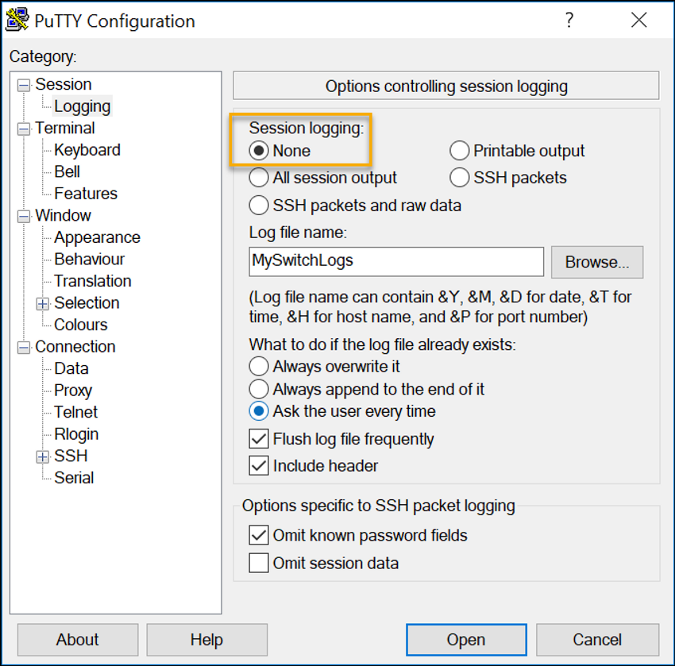

<!-- verified: agorbachev 03.05.2022 -->

<!-- 2.5.1 -->
## Файлы конфигурации

Теперь вы знаете, как выполнять базовую настройку коммутатора, включая пароли и баннерные сообщения. В этом разделе показано, как сохранить конфигурацию.

Конфигурация устройства хранится в двух системных файлах.

* **startup-config** — сохраненный файл конфигурации, который хранится в NVRAM. Он содержит все команды, которые будут использоваться при загрузке или перезагрузке Содержимое Флеш-накопителя не теряется при выключении питания устройства.
* **running-config** — файл текущей конфигурации, хранится в оперативной памяти (RAM). Он отражает текущую конфигурацию. Изменения текущей конфигурации незамедлительно влияют на работу устройства Cisco. RAM — энергозависимая память. После отключения питания или перезагрузки устройства RAM теряет все свое содержимое.

Команда привилегированного режима EXEC **show running-config** используется для просмотра текущей конфигурации. Как показано в примере, команда выведет список полной конфигурации, хранящейся в настоящее время в RAM.

```
Sw-Floor-1# show running-config
Building configuration...
Current configuration : 1351 bytes
!
! Last configuration change at 00:01:20 UTC Mon Mar 1 1993
!
version 15.0
no service pad
service timestamps debug datetime msec
service timestamps log datetime msec
service password-encryption
!
hostname Sw-Floor-1
!
(output omitted)
```

Для просмотра файла загрузочной конфигурации используйте команду привилегированного режима EXEC **show startup-config**.

Однако при отключении питания или перезапуске устройства все несохраненные изменения конфигурации будут потеряны. Чтобы сохранить изменения, используйте команду привилегированного режима EXEC **copy running-config startup-config**.

<!-- 2.5.2 -->
## Изменение текущей конфигурации

Если изменения текущей конфигурации не принесли желаемых результатов и файл **running-config** пока не был сохранен, чтобы вернуться к начальной конфигурации, можно удалить  команды по отдельности или перезагрузить устройство с помощью команды привилегированного режима EXEC **reload**.

Недостатком использования команды **reload** для удаления несохраненной текущей конфигурации является кратковременный переход устройства в автономный режим и, как следствие, простой сети.

Выполняя перезагрузку, IOS определит, что изменения текущей конфигурации не были сохранены. Появится сообщение с вопросом, нужно ли сохранить их. Для отмены изменений введите **n** или **no**.

Если были сохранены нежелательные изменения, возможно, придется удалить все конфигурации. Для этого нужно удалить начальную конфигурацию и перезапустить устройство. Загрузочную конфигурацию можно удалить с помощью команды привилегированного режима EXEC **erase startup-config**. После ввода команды появится запрос о подтверждении. Нажмите клавишу **Enter**.

После удаления начальной конфигурации из NVRAM перезапустите устройство, чтобы удалить файл текущей конфигурации из RAM. При перезагрузке на коммутаторе применяется загрузочная конфигурация по умолчанию, с которой изначально поставлялось устройство.

<!-- 2.5.3 -->
## Видео: Изменение текущей конфигурации

Посмотрите видео, демонстрирующее сохранение файлов конфигурации коммутатора.


<!-- 2.5.4 -->
## Запись конфигурации в текстовый файл

Файлы конфигурации можно также сохранить и поместить в текстовый документ. Эта последовательность действий позволит в дальнейшем редактировать или повторно использовать рабочую копию файлов конфигурации.

Пусть, например, коммутатор был настроен и текущая конфигурация сохранена на устройстве.

**Шаг 1** Откройте программу эмуляции терминала, например PuTTY или Tera Term, связанную с коммутатором.


**Шаг 2** Активируйте ведение журнала в программе терминала и назначьте файлу журнала имя и место сохранения. На рисунке  показано, что **All session output** будут записываться в указанный файл (например, MySwitchLogs).


**Шаг 3** Выполните  команду **show running-config** или **show startup-config** в привилегированном режиме EXEC. Текст, отображенный в окне терминала, будет помещен в выбранный файл.

```
Switch# show running-config
Building configuration...

```

**Шаг 4** Отключите ведение журнала в программе терминала. На рисунке показано, как отключить ведение журнала сеанса, выбрав **None**.



Созданный текстовый файл можно использовать как протокол текущей конфигурации устройства. Возможно, файл придется отредактировать, прежде чем использовать его для восстановления сохраненной конфигурации на устройстве.

Чтобы восстановить файл конфигурации на устройстве, нужно совершить два действия.

**Шаг 1** Войти в режим глобальной конфигурации на устройстве.

**Шаг 2** Скопировать и вставить текстовый файл в окно терминала, подключенного к коммутатору.

В интерфейсе CLI текстовое содержимое этого файла будет использоваться в качестве команд и станет текущей конфигурацией устройства. Это удобный способ настроить устройство вручную.
