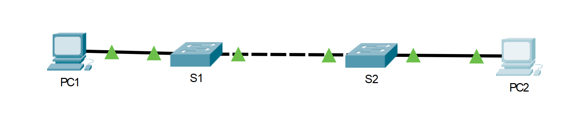

---

> **ВАЖНО**
> 
> Форма для ответов на вопросы будет доступна только при развертывании лабораторной работы 

---

## Топология



## Таблица адресации

| Устройство | Интерфейс | IP-адрес      | Маска подсети |
|------------|-----------|---------------|---------------|
| S1         | VLAN 1    | 192.168.1.253 | 255.255.255.0 |
| S2         | VLAN 1    | 192.168.1.254 | 255.255.255.0 |
| PC1        | NIC       | 192.168.1.1   | 255.255.255.0 |
| PC2        | NIC       | 192.168.1.2   | 255.255.255.0 |

## Цели

**Часть 1. Настройка основных параметров коммутаторов S1 и S2**

**Часть 2. Настройка ПК**

**Часть 3. Настройка интерфейса управления коммутатором**

## Общие сведения

В этом упражнении вы сначала создадите базовую конфигурацию коммутатора. Затем вы создадите основные подключения, настроив IP-адресацию на коммутаторах и ПК. Завершив настройку IP-адресации, вы будете использовать различные команды **show**, чтобы проверить настройки, а также команду **ping** для проверки основных подключений между устройствами.

## Инструкции

### Часть 1. Настройка основных параметров коммутаторов S1 и S2

Выполните следующие действия на коммутаторах S1 и S2.

**Шаг 1. Настройте имя узла для коммутатора S1.**

1.  Щелкните S1, а затем вкладку CLI.
2.  Введите нужную команду, чтобы присвоить узлу имя S1.

**Шаг 2. Настройте пароли для консоли и привилегированного режима EXEC.**

1.  В качестве пароля консоли используйте слово **cisco**.
2.  В качестве пароля привилегированного режима EXEC используйте слово **class**.

**Шаг 3. Проверьте пароли, настроенные для S1.**

- ответьте на вопрос №1

**Шаг 4. Настройте баннер MOTD (сообщение дня).**

Введите текст предупреждения о несанкционированном доступе. Ниже представлен пример текста.

``Authorized access only. Violators will be prosecuted to the full extent of the law.``

**Шаг 5. Сохраните файл конфигурации в NVRAM.**

- ответьте на вопрос №2

**Шаг 6. Повторите шаги 1–5 для коммутатора S2.**

### Часть 2. Настройка ПК

Настройте IP-адреса для PC1 и PC2.

**Шаг 1. Настройте IP-адреса для обоих ПК.**

1.  Щелкните PC1 и откройте вкладку Desktop (Рабочий стол).
2.  Щелкните IP Configuration (Настройка IP-адресов). В таблице адресации выше можно увидеть, что PC1 назначен IP-адрес 192.168.1.1 и маска подсети 255.255.255.0. Введите эти данные для PC1 в окне IP Configuration (Настройка IP-адресов).
3.  Повторите шаги 1.1 и 1.2 для PC2.

**Шаг 2. Проверьте связь с коммутаторами.**

1.  Щелкните PC1. Закройте окно IP Configuration (Настройка IP-адресов), если оно открыто. На вкладке Desktop (Рабочий стол) нажмите Command Prompt (Командная строка).
2.  Введите команду **ping** с IP-адресом коммутатора S1 и нажмите клавишу ВВОД.

```
Packet Tracer PC Command Line 1.0
PC> ping 192.168.1.253
```

- ответьте на вопрос №3

### Часть 3. Настройка интерфейса управления коммутатором

Настройте IP-адрес для коммутаторов S1 и S2.

**Шаг 1. Настройте IP-адрес для коммутатора S1.**

Коммутаторы можно использовать в режиме «подключи и работай». Это значит, что их необязательно настраивать для работы. Коммутаторы пересылают данные между портами по MAC-адресам.

- ответьте на вопрос №4

Чтобы настроить IP-адрес на коммутаторе S1, используйте следующие команды.

```
S1# configure terminal
Введите построчно команды настройки. В конце нажмите CNTL/Z.
S1(config)# interface vlan 1
S1(config-if)# ip address 192.168.1.253 255.255.255.0
S1(config-if)# no shutdown
%LINEPROTO-5-UPDOWN: Line protocol on Interface Vlan1, changed state to up
S1(config-if)#
S1(config-if)# exit
S1#
```

- ответьте на вопрос №5

**Шаг 2. Настройте IP-адреса для коммутатора S2.**

Используя данные из таблицы адресации, настройте IP-адрес для S2.

**Шаг 3. Проверьте настройки IP-адресов на коммутаторах S1 и S2.**

Команда **show ip interface brief** выводит сведения об IP-адресе, а также о состоянии всех портов и интерфейсов коммутатора. Для этого можно также использовать команду **show running-config**.

**Шаг 4. Сохраните настройки S1 и S2 в NVRAM.**

- ответьте на вопрос №6

**Шаг 5. Проверьте подключение к сети.**

Подключение к сети можно проверить с помощью команды **ping**. Очень важно, чтобы подключения работали во всей сети. В случае сбоя необходимо устранить неполадку. Проверьте связь коммутаторов S1 и S2 с компьютерами PC1 и PC2.

1.  Щелкните PC1 и откройте вкладку Desktop (Рабочий стол).
2.  Щелкните Command Prompt (Командная строка).
3.  С помощью команды ping проверьте доступность IP-адреса компьютера PC2.
4.  С помощью команды ping проверьте доступность IP-адреса коммутатора S1.
5.  С помощью команды ping проверьте доступность IP-адреса коммутатора S2.

**Примечание.** Команду **ping** можно использовать в интерфейсе командной строки коммутатора и на PC2.

Все проверки должны быть пройдены успешно. Если результат первой проверки — 80 %, повторите попытку. Теперь результат должен быть 100 %. Позже вы узнаете, почему первая проверка иногда завершается неудачно. Если проверить связь с устройствами не удается, проверьте конфигурацию на наличие ошибок.

[Скачать файл Packet Tracer для локального запуска](./assets/2.7.6-lab.pka)
