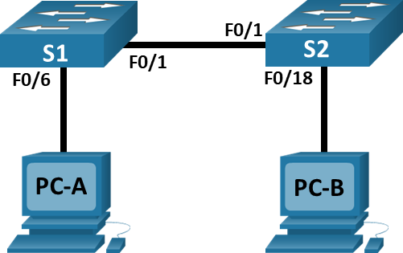

---

> **ВАЖНО**
> 
> Форма для ответов на вопросы будет доступна только при развертывании лабораторной работы 

---

## Топология



## Таблица адресации

| Устройство | Интерфейс | IP-адрес     | Маска подсети |
|------------|-----------|--------------|---------------|
| **S1**     | VLAN 1    | 192.168.1.1  | 255.255.255.0 |
| **S2**     | VLAN 1    | 192.168.1.2  | 255.255.255.0 |
| **PC-A**   | NIC       | 192.168.1.10 | 255.255.255.0 |
| **PC-B**   | NIC       | 192.168.1.11 | 255.255.255.0 |

## Цели

Часть 1. Спроектировать топологию сети

Часть 2. Настроить узлы ПК

Часть 3. Настроить и проверить основные параметрв коммутатора

## Общие сведения/сценарий

В этой лабораторной работе в режиме симуляции сетевого оборудования (PTPM) вам предстоит построить простую сеть с двумя узлами и двумя коммутаторами. Вы также должны настроить основные параметры, включая имя узла, локальные пароли и баннер входа в систему. С помощью команды **show** отобразите текущую конфигурацию, версию IOS и состояние интерфейса. С помощью команды **copy** сохраните конфигурации устройств.

Вам нужно применить к компьютерам IP-адресацию и обеспечить соединение между этими двумя устройствами. Для проверки подключения используйте команду **ping**.

## Инструкции

### Часть 1. Настройка топологии сети

Включите ПК и подключите устройства согласно топологии. Чтобы выбрать правильный порт на коммутаторе, щелкните правой кнопкой мыши и выберите **Inspect Front**. При необходимости используйте инструмент «Zoom». Наведите указатель мыши на порты, чтобы увидеть номера портов. Packet Tracer оценит правильность подключения кабеля и порта.

1.  На **полке** есть несколько коммутаторов, роутеров и других устройств. Нажмите и перетащите коммутаторы **S1** и **S2** в **стойку**. Нажмите и перетащите два компьютера на **стол**.

2.  Включите питание ПК.

3.  На монтажной панели **Cable Pegboard** щелкните медный перекрестный кабель **Copper Cross-Over**. Нажмите на порт **FastEthernet0/1** на **S1**, а затем нажмите на порт **Fastethernet0/1** на **S2**, чтобы подключить их. Вы должны увидеть кабель, соединяющий два порта.

4.  На монтажной панели **Cable Pegboard** щелкните медный прямой кабель **Copper Straight-Through**. Щелкните порт **FastetherNet0/6** на **S1**, а затем щелкните порт **FastetherNet0** на **PC-A**, чтобы подключить их.

5.  На монтажной панели **Cable Pegboard** щелкните медный прямой кабель **Copper Straight-Through**. Щелкните порт **FastetherNet0/18** на **S2**, а затем щелкните порт **FastetherNet0** на **PC-B**, чтобы подключить их.

6.  Осмотрите сетевые подключения. Первоначально, когда вы подключаете устройства к порту коммутатора, индикаторы соединения будут гореть желтым. Примерно через минуту они станут зелеными.

### Часть 2. Настройка узлов ПК

Настройте информацию статического IP-адреса на ПК в соответствии с **таблицей адресации**.

1.  **PC-ADesktopIP ConfigurationPC-A**.

2.  **PC-A**

3.  **PC-B** 

4.  **PC-ADesktopCommand Promptipconfig /all** для проверки параметров.

5.  **ping 192.168.1.11**.

    ```
    Packet Tracer PC Command Line 1.0
    C:\> ping 192.168.1.11

    Pinging 192.168.1.11 with 32 bytes of data:
    Reply from 192.168.1.11: bytes=32 time<1ms TTL=128
    Reply from 192.168.1.11: bytes=32 time<1ms TTL=128
    Reply from 192.168.1.11: bytes=32 time<1ms TTL=128
    Reply from 192.168.1.11: bytes=32 time<1ms TTL=128

    Ping statistics for 192.168.1.11:
        Packets: Sent = 4, Received = 4, Lost = 0 (0 % loss),
    Approximate round trip times in milli-seconds:
        Minimum = 0ms, Maximum = 0ms, Average = 0ms

    C:\>
    ```

### Часть 3. Настройка и проверка основных параметров коммутатора

1.  На монтажной панели **Cable Pegboard** щелкните консольный кабель **Console**. Подключите консольный кабель между S1 и PC-A.

2.  **Switch\>Switch#Switch(config)#** Настройте имя устройства в соответствии с **таблицей адресации**. Введите локальные пароли. Для перехода в пользовательский режим EXEC используйте пароль **cisco**, а для перехода в привилегированный режим EXEC — **class**.

3.  Настройте и активируйте на коммутаторе интерфейс **VLAN 1**, используя информацию, приведенную в **таблице адресации**.

4.  Настройте соответствующий баннер MOTD для предупреждения о несанкционированном доступе.

5.  Сохраните текущую конфигурацию.

6.  Отобразите версию IOS и другую информацию о коммутаторе.

7.  Отобразите состояние подключенных интерфейсов коммутатора.

8.  Повторите предыдущие шаги для коммутатора S2. Запишите состояние указанных ниже интерфейсов.

    | Интерфейс | S1 Status | S1 Protocol | S2 Status | S2 Protocol |
    |-----------|-----------|-------------|-----------|-------------|
    | F0/1      |           |             |           |             |
    | F0/6      |           |             |           |             |
    | F0/18     |           |             |           |             |
    | VLAN 1    |           |             |           |             |

9.  От ПК запустите **ping** до S1 и S2. Проверка связи должна быть успешной.

10. От коммутатора запустите **ping** до **PC-A** и **PC-B**. Проверка связи должна быть успешной.

## Вопросы для повторения

1. Ответьте на вопрос №1
2. Ответьте на вопрос №2

[Скачать файл Packet Tracer для локального запуска](./assets/2.9.2-lab.pka)
