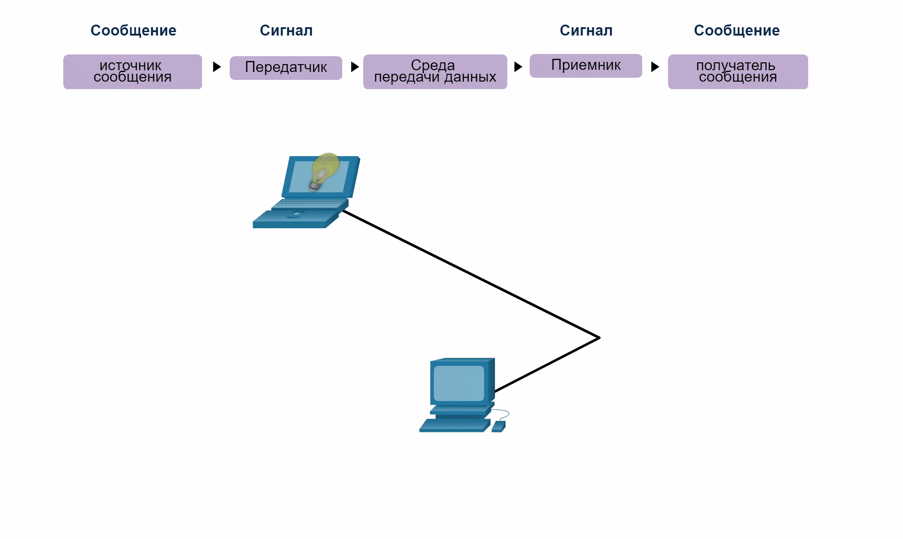
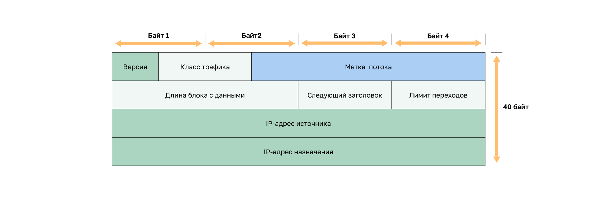
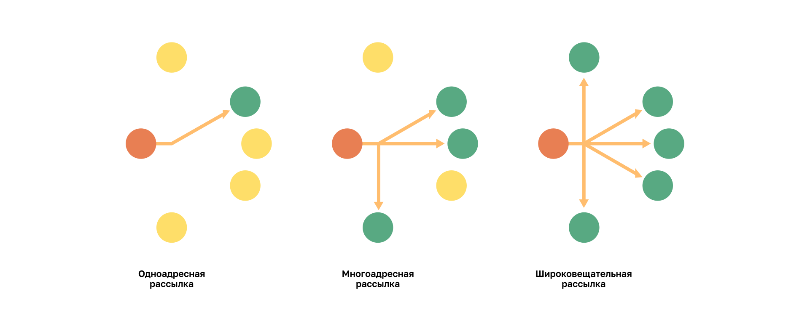

<!-- verified: agorbachev 03.05.2022 -->

<!-- 3.1.1 -->
## Видео: устройства в пузыре

Посмотрите видео, объясняющее, как сетевое устройство работает в сети.


<!-- 3.1.2 -->
## Основы коммуникаций

Сети могут различаться по размеру, форме и функциям. Они могут быть сложными (устройства, подключенные через Интернет) или простыми (два компьютера, подключенны напрямую с помощью одного кабеля). Возможно и что-то среднее. Тем не менее для связи недостаточно иметь только физическое соединение между оконечными устройствами. Для успешного обмена данными эти устройства должны «знать», как обмениваться информацией.

Люди обмениваются идеями разными способами. У всех методов обмена данными есть три общих элемента:

* **источник сообщения (отправитель)**  —  отправителем может быть человек или электронное устройство, которому нужно отправить сообщение другому человеку или устройству;
* **получатель сообщения (приемник)**  — адресат получает и интерпретирует сообщение;
* **канал**   — средство подключения, по которому сообщение передается от источника к получателю.

<!-- 3.1.3 -->
## Протоколы связи

Отправка этого сообщения посредством индивидуального общения или по сети регулируется правилами, которые называются **протоколами**. Эти протоколы зависят от типа используемого метода связи. При ежедневном личном общении правила обмена данными через одно средство связи, например, телефон, не обязательно совпадают с протоколом использования другого средства связи, например, почты. Процесс отправки письма похож на связь, которая происходит в компьютерных сетях.

На анимации представлены два человека, которые общаются лицом к лицу. До начала общения они должны договориться о способе общения. Если оно будет происходить с помощью голоса, сначала они должны решить, на каком языке они будут говорить. Затем, когда у них есть сообщение друг для друга, они должны суметь выразить его таким образом, чтобы оно стало понятным.

Например, если кто-то говорит на английском, но неправильно структурирует предложение, сообщение может быть истолковано неверно. Каждая из этих задач описывает протоколы, которые нужно применить для успешной коммуникации.


На следующей анимации представлено взаимодействие двух устройств. Она демонстрирует, что предыдущий пример справедлив и для компьютерной связи. Подумайте над тем, сколько разных правил или протоколов регулируют способы коммуникации, существующие в современном мире.



<!-- 3.1.4 -->
## Установление правил

Для начала общения друг с другом люди должны использовать установленные правила или соглашения, регулирующие разговор. Рассмотрим это сообщение, например:

```
общение между людьми регламентируется правилами, поэтому очень трудно понять сообщения, которые плохо отформатированыили не отвечают установленнымправилам и протоколам. Структура предложения, грамматическое и пунктуация выделает человеческую конфигурацию понятной для многих людей.
```

Обратите внимание, как трудно прочитать сообщение, которое не отформатировано должным образом. Оно должно быть написано с использованием правил (т.е. протоколов), необходимых для эффективной коммуникации. В следующем примере показано сообщение, которое теперь правильно отформатировано в соответствии с правилами русского языка.

```
Коммуникация между людьми подчиняется правилам. Понять сообщения, которые плохо отформатированы или не соблюдают установленные правила и протоколы, очень трудно. Структура грамматики, языка, пунктуации и синтаксиса помогает разным людям понять конфигурацию.
```

Протоколы должны учитывать следующие требования для успешной доставки сообщения, понятного получателю:

* известные отправитель и получатель;
* общепринятые язык и грамматика;
* скорость и время доставки;
* требования к утверждению или подтверждению.

<!-- 3.1.5 -->
## Требования к сетевому протоколу

Протоколам, применяемым для связи в сети, свойственны многие из этих фундаментальных особенностей. Помимо адреса источника и места назначения для соответствия упомянутым выше требованиям компьютерные и сетевые протоколы определяют способ передачи сообщения через сеть. Распространенные компьютерные протоколы включают в себя следующие требования:

- кодирование сообщений;
- форматирование и инкапсуляция сообщений;
- размер сообщений;
- синхронизация сообщений;
- варианты доставки сообщений.


<!-- 3.1.6 -->
## Кодирование сообщения

Один из первых этапов отправки сообщения — кодирование. **Кодирование** — это процесс преобразования информации в форму, приемлемую для последующей передачи. **Декодирование** — обратный процесс, в результате которого информация преобразуется в исходный вид.

Представьте, что девушка звонит другу, чтобы обсудить восхитительный закат. Чтобы выразить свои мысли, она выбирает случайный язык, произносит слова, используя звуки и интонацию. Друг слушает ее и декодирует звуки, чтобы понять полученное сообщение.


Кодировка данных при обмене между узлами должна быть в формате, соответствующем средству подключения. Прежде всего узел-отправитель преобразует передаваемое по сети сообщение в биты. Каждый бит закодирован в схеме напряжения на медных проводах, инфракрасном свете в оптических волокнах или микроволнах для беспроводных систем. Конечный хост принимает и декодирует сигналы и интерпретирует сообщение.


<!-- 3.1.7 -->
## Форматирование и инкапсуляция сообщений

При отправке сообщения от источника к адресату необходимо использовать определенный формат или структуру. Формат зависит от типа сообщения и канала доставки. Обычным примером требования правильного формата в человеческом общении является отправка письма. 

На конверте в специально отведенном месте указывается адрес отправителя и получателя. Если адресат или формат неверен, письмо не дойдет.

Процесс размещения одного формата сообщения (письмо) внутри другого (конверт) называется **инкапсуляцией**. **Деинкапсуляция** происходит в тот момент, когда получатель достает письмо из конверта.


<!--
поля пакета IPv6, включая IP-адрес источника и IP-адрес назначения
-->

Для доставки и обработки письма в компьютерной сети необходимо придерживаться определенных правил форматирования.

**Internet Protocol** (IP) — это протокол с функцией, аналогичной примеру конверта. На рисунке поля пакета протокола Интернета версии 6 (IPv6) определяют источник пакета и его назначение. IP отвечает за отправку сообщения из источника сообщения в пункт назначения по одной или нескольким сетям.

**Примечание.** Поля IPv6-пакета подробно обсуждаются в другом модуле.




<!-- 3.1.8 -->
## Размер сообщений

Еще одно правило коммуникации — это размер сообщения.

В процессе разговора люди делят свои высказывания на более мелкие части или предложения. Размер этих предложений ограничен тем, сколько принимающее лицо может воспринять за один раз, как показано на рисунке. Это также упрощает для получателя чтение и понимание.


Кодирование используется также при обмене данными с помощью компьютера. Кодировка данных при обмене между узлами должна быть в формате, соответствующем средству подключения. Прежде всего хост-отправитель преобразует передаваемое по сети сообщение в биты. Каждый бит кодируется набором звуков, световых волн или электрических импульсов в зависимости от средства сетевого подключения. Конечный хост принимает и декодирует сигналы и интерпретирует сообщение.


<!-- 3.1.9 -->
## Синхронизация сообщений

Синхронизация сообщений также очень важна в сетевых коммуникациях. Она включает 3 важных пункта.

* **Управление потоком** — процесс управления скоростью передачи данных. Управление потоком определяет, сколько информации можно отправить, и скорость, с которой она может быть доставлена. Если один человек говорит слишком быстро, другому сложно расслышать и понять сообщение. В сетевой связи существуют протоколы, используемые устройствами источника и назначения для согласования и управления потоком информации.
* **Время ожидания ответа** — если человек задает вопрос и не получает ответа за приемлемое время, он предполагает, что ответа не будет. Поэтому он может повторить вопрос или продолжить разговор. У сетевых хостов также существуют правила, определяющие время ожидания ответа и действие, выполняемое по истечении этого времени.
* **Способ доступа** — определяет, когда конкретный человек сможет отправить сообщение. На анимации представлены люди, говорящие одновременно, затем происходит «столкновение информации», и им необходимо отступить и начать снова. Аналогичным образом, когда устройство хочет передавать данные по беспроводной локальной сети, необходимо, чтобы сетевая карта WLAN (NIC) определяла, доступен ли беспроводной носитель.


<!-- 3.1.10 -->
## Варианты доставки сообщений

Сообщение может доставляться разными способами. Иногда информацию нужно передать только одному человеку. В других случаях ее нужно одновременно передать группе людей или даже всем жителям определенного района.


Сетевые коммуникации имеют аналогичные варианты доставки для связи. Как показано на рисунке, существует 3 типа передачи данных:

* **одноадресная передача** — информация передается на одно оконечное устройство;
* **многоадресная передача** — информация передается на одно или несколько оконечных устройств;
* **широковещательная передача** — информация передается на все оконечные устройства.


<!-- 3.1.11 -->
## Примечание о значке узлов

Сетевые документы и топологии часто представляют сети и конечные устройства с помощью значка узла. Узлы обычно представлены в виде круга. На рисунке показано сравнение трех различных вариантов доставки с использованием значков узлов вместо значков компьютера.




Слева направо показаны три топологии.
Топология слева изображает одноадресную передачу сообщения и состоит из одного красного узла, одного зеленого и четырех желтых. У него есть стрелка от красного узла, ведущая к зеленому.
Средняя топология изображает многоадресную передачу сообщения и состоит из одного красного узла, трех зеленых и двух желтых. У него есть стрелка от красного узла, ведущая к каждому из зеленых.
Топология справа изображает трансляцию. Она имеет один красный узел и пять зеленых. У него есть стрелка от красного узла, ведущая к каждому из зеленых.

<!-- 3.1.12 -->
<!-- quiz -->

