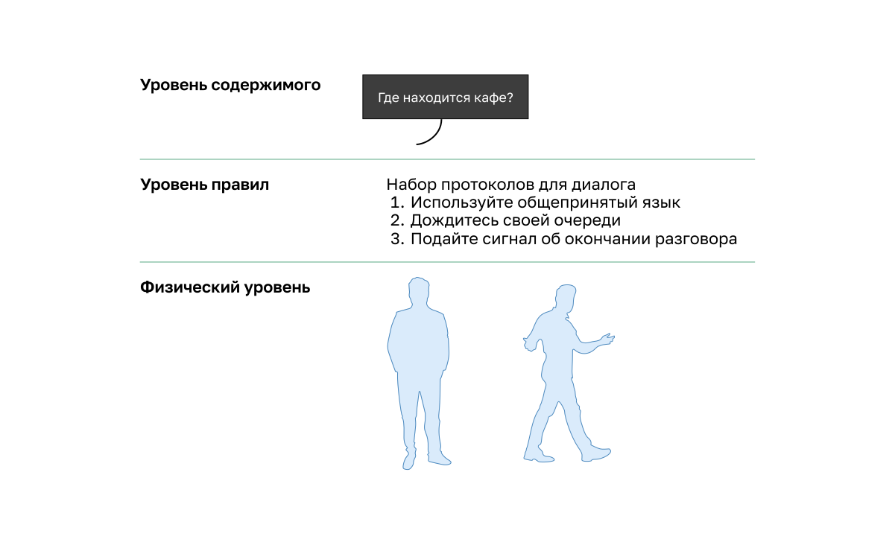
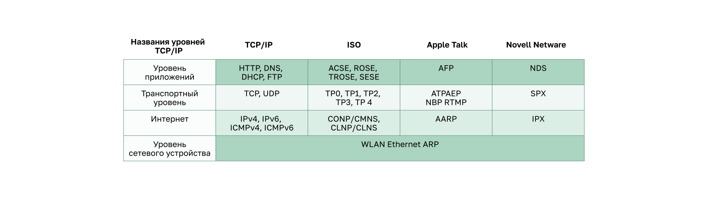
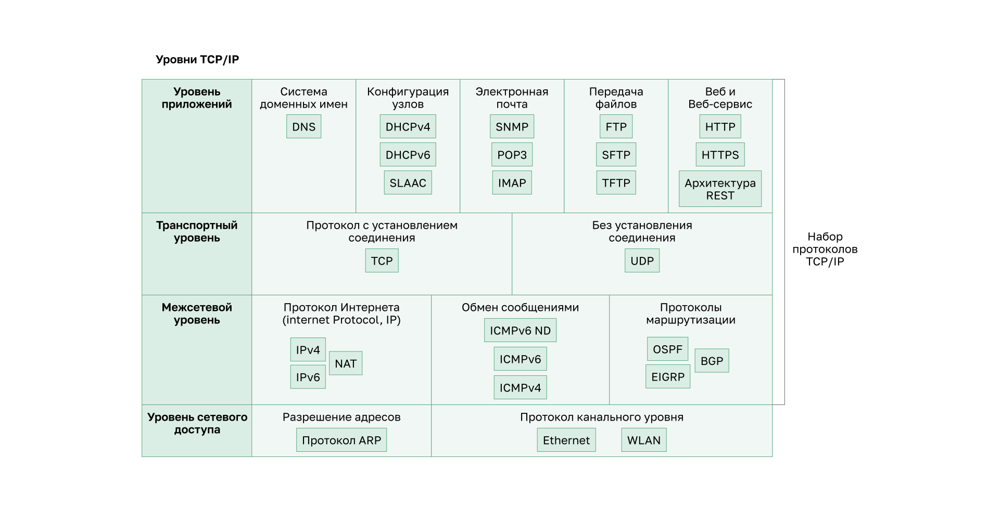

<!-- verified: agorbachev 03.05.2022 -->

<!-- 3.3.1 -->
## Стеки сетевых протоколов

Во многих случаях одни протоколы должны работать с другими. Протокольные пакеты предназначены для бесперебойной работы друг с другом.

Группа взаимосвязанных протоколов, необходимых для выполнения коммуникаций, называется **набором протоколов**.

Один из лучших способов представить, как протоколы взаимодействуют в одном наборе, — рассмотреть этот набор в виде стека. Стек протоколов показывает, как отдельные протоколы реализованы в одном наборе. Протоколы рассматриваются с точки зрения уровней. Причем каждый более высокий уровень обслуживания зависит от функций, определенных протоколами более низких. Нижние уровни стека отвечают за перемещение данных по сети и предоставление сервисов верхним, которые отвечают за содержание пересылаемых сообщений.

Как показано на рисунке, мы можем использовать уровни для описания действий, происходящих в нашем примере личного общения. На нижнем, физическом уровне есть два человека, каждый из которых может произнести слова вслух. В середине находится уровень правил, который определяет требования общения, в том числе, что должен быть выбран общий язык. Вверху находится уровень, на котором говорится о контенте общения.

**Наборы протоколов** — это наборы правил, применяющихся вместе для решения одной проблемы.

<!-- 3.3.2 -->
## Эволюция протоколов

Набор представляет собой множество протоколов, которые используются вместе для предоставления комплексных сетевых сервисов. Начиная с 1970-х годов было несколько различных пакетов протоколов, некоторые из которых были разработаны организацией по стандартизации, а другие — различными поставщиками.

Во время эволюции сетевых коммуникаций и Интернета существовало несколько конкурирующих пакетов протоколов, как показано на рисунке.

* **Internet Protocol Suite или TCP/IP** — наиболее распространенный и актуальный набор протоколов, используемый сегодня. Пакет протоколов TCP/IP представляет собой открытый стандартный набор, поддерживаемый рабочей группой Internet Engineering Task Force (IETF).
* **Протоколы взаимодействия открытых систем (OSI)** — семейство протоколов, разработанных совместно в 1977 году Международной организацией по стандартизации (ИСО) и Международным союзом электросвязи (МСЭ). Протокол OSI также включал семиуровневую модель, называемую эталонной. Эталонная модель OSI классифицирует функции ее протоколов. Сегодня OSI в основном известен своей многоуровневой моделью. Протоколы OSI в основном были заменены TCP/IP.
* **AppleTalk** — краткосрочный фирменный пакет протоколов, выпущенный компанией Apple Inc. в 1985 году для устройств Apple. В 1995 году Apple приняла использование TCP/IP вместо AppleTalk.
* **Novell NetWare** — недолговечный фирменный пакет протоколов и сетевой операционной системы, разработанный компанией Novell Inc. в 1983 году с использованием сетевого протокола IPX. В 1995 году Novell Inc. приняла использование TCP/IP вместо IPX.

<!-- 3.3.3 -->
## Пример протокола TCP/IP

Протоколы TCP/IP работают на транспортном, сетевом уровнях и уровне приложений. На уровне доступа к сети нет протоколов TCP/IP. Наиболее распространенными протоколами LAN (локальная сеть) уровня доступа являются протоколы Ethernet и WLAN (беспроводная локальная сеть). Протоколы уровня сетевого доступа обеспечивают доставку IP-пакетов по физическому средству подключения.

На рисунке показан пример трех протоколов TCP/IP, используемых для отправки пакетов между веб-браузером хоста и веб-сервером. HTTP, TCP и IP используют протоколы TCP/IP. На уровне доступа к сети в примере используется Ethernet. Однако это также может быть беспроводной стандарт, такой как WLAN или сотовая связь.

<!-- 3.3.4 -->
## Набор протоколов TCP/IP

Сегодня пакет TCP/IP включает в себя множество протоколов и продолжает развиваться для поддержки новых служб. Наиболее распространенные показаны на рисунке.

**TCP/IP** — это набор протоколов, используемый в Интернете и сетях сегодняшнего дня. Он имеет два важных аспекта для поставщиков и производителей:

* **открытый стандартный набор протоколов** (свободно доступен для общественности и может быть использован любым поставщиком на их оборудовании или в их программном обеспечении);
* **набор протоколов на основе стандартов** (был одобрен сетевой индустрией и одобрен организацией по стандартизации. Использование стандартов в разработке и реализации протоколов гарантирует, что продукты от разных производителей будет успешно взаимодействовать между собой).

### Уровень приложений

**Служба разрешения доменных имен (DNS)**

* **DNS** преобразует имена доменов, например cisco.com, в адреса IPv4 и IPv6.

**Автоматическая конфигурация хостов**

* **DHCPv4** — протокол динамической настройки узлов. Сервер DHCPv4 динамически назначает информацию IPv4-адресации клиентам DHCPv4 при запуске и позволяет повторно использовать адреса, когда они больше не нужны.
* **DHCPv6** — протокол динамической настройки узлов для протокола IPv6. DHCPv6 похож на DHCPv4. Сервер DHCPv6 динамически назначает информацию адресации IPv6 клиентам DHCPv6 при запуске.
* **SLAAC** — автоматическая конфигурация адреса без сохранения состояния (Stateless Address Autoconfiguration, SLAAC). Метод, позволяющий устройству получать информацию об IPv6-адресации без использования сервера DHCPv6.

**Электронная почта**

* **SMTP** — простой протокол пересылки почты; упрощенный протокол передачи электронной почты, с помощью которого клиенты отправляют письма на почтовый сервер, а серверы отправляют их на другие серверы.
* **POP3** — протокол почтового отделения (Post Office Protocol version 3, POP3); позволяет клиентам получать электронную почту с почтового сервера и загружать ее в локальное почтовое приложение клиента.  
* **IMAP** — протокол доступа к сообщениям в Интернете (IMAP); позволяет клиентам получать доступ к электронным сообщениям, которые хранятся на почтовом сервере.

**Передача файлов**

* **FTP** — протокол передачи файлов. Устанавливает правила, которые позволяют получать доступ к файлам на других узлах и обмениваться ими по сети. Это надежный протокол доставки файлов с подтверждением и установлением соединения
* **SFTP** — SSH-протокол передачи файлов. Протокол передачи файлов поверх SSH — SFTP. Он является расширением протокола Secure Shell (SSH) и может использоваться для создания защищенного сеанса передачи файлов. При этом, **SSH** — это метод безопасного удаленного входа, который обычно используется для доступа к командной строке устройства. 
* **TFTP** — простейший протокол передачи файлов без подключения с максимальными усилиями, неподтвержденными доставкой файлов. Он использует меньше накладных расходов, чем FTP.

**Гипертекстовая разметка и передача репрезентативного состояния** 

* **HTTP** — Hypertext Transfer Protocol (протокол передачи гипертекста) задает правила обмена в Интернете текстом, графическими изображениями, звуковыми, видео и другими файлами мультимедиа.
* **HTTPS** — защищенный HTTP, который шифрует данные, которые обмениваются через Интернет. 
* **REST** — Representational State Transfer, веб-служба, использующая интерфейсы прикладного программирования (API) и HTTP-запросы для создания веб-приложений.

### Транспортный уровень

* **TCP** — протокол управления передачей обеспечивает устойчивое взаимодействие между процессами, работающими на разных хостах, и надежную передачу данных с подтверждением успешной доставки.

* **UDP** — протокол пользовательских датаграмм, который позволяет процессу, запущенному на одном узле, отправлять пакеты процессу, запущенному на другом узле. Не подтверждает успешную доставку датаграммы.

### Межсетевой уровень

**Протокол Интернета (Internet Protocol, IР)**

* **IPv4** — Интернет-протокол версии 4 (IPv4). Получает сегменты сообщений из транспортного уровня, упаковывает сообщения в пакеты и направляет их для сквозной доставки по сети. IPv4 использует 32-разрядный адрес.
* **IPv6** — Интернет-протокол версии 6 (IPv6). Подобен IPv4, но использует 128-битный адрес.
* **NAT** — преобразование сетевых адресов. Преобразует IP-адреса частной сети в глобальные уникальные публичные IP-адреса.

**Обмен сообщениями**

* **ICMPv4** — протокол управляющих сообщений в Интернете (Internet Control Message Protocol, ICMP). Обеспечивает обратную связь от хоста назначения к исходному, чтобы сообщать об ошибках доставки пакетов.
* **ICMPv6** — ICMP для IPv6. Аналогичная функциональность ICMPv4, но используется для пакетов IPv6.
* **ICMPv6 ND** — ICMPv6-протокол обнаружения соседей. Включает четыре сообщения протокола, которые используются для разрешения адресов и обнаружения повторяющихся адресов.

**Протоколы маршрутизации**

* **OSPF** — открытый протокол предпочтения кратчайшего пути. Протокол маршрутизации состояния связи, который использует иерархическую структуру на основе областей.
* **EIGRP** — усовершенствованный внутренний протокол маршрутизации шлюзов, разработанный компанией Cisco, который использует составной показатель, строящийся на пропускной способности, задержке, нагрузке и надежности.
* **BGP** ― открытый стандартный протокол маршрутизации внешнего шлюза, используемый между Интернет-провайдерами (ISP). Протокол BGP также обеспечивает обмен данными маршрутизации между интернет-провайдерами и их крупными частными клиентами.

### Уровень сетевого доступа

**Разрешение адресов**

* **ARP** ― протокол разрешения адресов (ARP). Обеспечивает динамическое сопоставление между IP-адресами и аппаратными адресами.

Протокол канального уровня

* **Ethernet** определяет правила для стандартов прокладки кабелей и обмена сигналами на уровне доступа к сети.
* **WLAN** ― беспроводная локальная сеть (WLAN). Определяет правила беспроводной сигнализации на радиочастотах 2,4 ГГц и 5 ГГц.

<!-- 3.3.5 -->
## Обмен данными TCP/IP

На анимации ниже показан процесс инкапсуляции в рамках небольшой сети с веб-сервером и веб-клиентом. В данном процессе задействованы компоненты, которые составляют сообщение, такие как Ethernet-кадр и IP-пакет, сегмент TCP и пользовательские данные. 

* Веб-сервер подготавливает страницу на языке гипертекстовой разметки (HTML) в качестве данных для отправки. 
* Заголовок протокола HTTP-уровня приложений добавляется в начало данных в формате HTML. 
* Заголовок содержит различные данные, включая версию HTTP, которую использует сервер, а также код состояния, указывающий, что у него имеется информация для веб-клиента. 
* Протокол уровня приложений HTTP передает данные веб-страницы в формате HTML на транспортный уровень TCP. 
* Протокол транспортного уровня добавляет дополнительную информацию к данным HTTP для управления обменом информацией между веб-сервером и веб-клиентом. 
* Информация IP добавляется к информации TCP. 
* IP назначает соответствующие IP-адреса источника и места назначения. Такая информация называется IP-пакетом. 
* Протокол Ethernet добавляет информацию в начало и конец IP-пакета, чтобы создать кадр. 
* Затем кадр преобразуется в строку бинарных битов, отправляемых по сетевому пути веб-клиенту.

Следующая анимация показывает процесс приема веб-страницы и ее декапсуляции для отображения в веб-браузере клиента.

* Клиент получает поток битов с сервера. 
* Клиент принимает двоичную строку битов и преобразует ее в кадр Ethernet. 
* Кадр содержит заголовок Ethernet, IP-пакет, сегмент TCP и данные. 
* При обработке кадра заголовки протоколов удаляются в обратном порядке. Сначала обрабатывается и удаляется информация Ethernet, вслед за ней информация IP-протокола, затем TCP и, наконец, HTTP. 
* Затем данные веб-страницы передаются веб-браузеру клиента.

<!-- 3.3.6 -->
<!-- quiz -->

