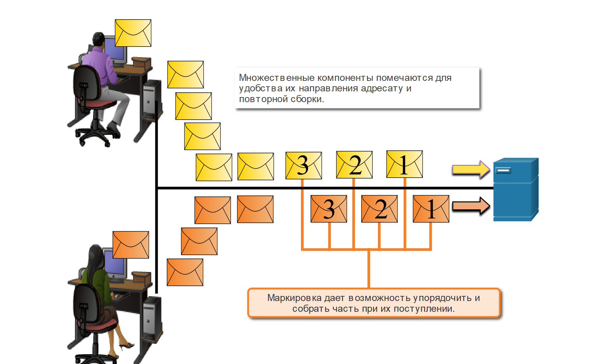

<!-- verified: agorbachev 03.05.2022 -->

<!-- 3.6.1 -->
## Сегментация сообщений

Знание эталонной модели OSI и модели протокола TCP/IP пригодится, когда вы узнаете о том, как данные инкапсулируются при перемещении по сети. Это не так просто, как физическое письмо, отправленное через почтовую систему.

Теоретически одно сообщение, например видеоклип или сообщение электронной почты, может быть отправлено по сети от источника к месту назначения как один массивный и непрерывный поток битов. Однако это создаст проблемы для других устройств, которым необходимо использовать те же каналы связи. Такие большие потоки данных приводили бы к существенным задержкам. Кроме того, если бы какое-либо из звеньев инфраструктуры сети отказало во время передачи данных, целое сообщение было бы утрачено и его необходимо было бы передать повторно в полном объеме.

В этом случае следует разделить данные на более мелкие и удобные части для передачи по сети. Сегментация представляет собой процесс разделения потока данных на более мелкие единицы для передачи данных по сети. Сегментация необходима, поскольку сети передачи данных используют пакет протоколов TCP/IP посылают данные в отдельных IP-пакетах. Каждый пакет отправляется отдельно, аналогично отправке длинного письма в виде серии отдельных открыток. Пакеты, содержащие сегменты одного и того же назначения, могут отправляться по разным путям.

Сегментация сообщения предоставляет два основных преимущества.

* **Повышает скорость** . Поскольку большой поток данных сегментирован на пакеты, большие объемы данных могут быть отправлены по сети без привязки канала связи. Отправка небольших фрагментов в сети позволяет поддерживать множество различных чередующихся сеансов обмена сообщениями, это называется мультиплексированием.
* **Повышает эффективность.** Если один сегмент не может достичь места назначения из-за сбоя в сети или перегрузки сети, необходимо повторно передать только этот сегмент вместо повторной передачи всего потока данных.

<!-- 3.6.2 -->
## Последовательность

Недостаток использования сегментации и мультиплексирования для передачи сообщений через сеть — сложность, которая свойственна всему процессу. Представьте себе, что необходимо отправить письмо из 100 страниц, но каждый конверт вмещает только одну страницу. Поэтому потребуется 100 конвертов, и каждый конверт должен рассматриваться индивидуально. Возможно, письмо из 100 страниц в 100 различных конвертах поступит не по порядку. Следовательно, информация в конверте должна включать порядковый номер, с тем чтобы получатель мог собрать страницы в надлежащем порядке.

В области сетевых коммуникаций все сегменты сообщения должны пройти подобный процесс, чтобы сообщение было доставлено до нужного места назначения и было воссоздано содержимое исходного сообщения, как показано на рисунке. TCP отвечает за последовательность отдельных сегментов.

<!-- 3.6.3 -->
## Единица данных протокола (PDU)

По мере того как данные приложений передаются по стеку протоколов до перемещения через средство сетевого подключения, различные протоколы добавляют в них информацию на каждом из уровней. Это называется процессом инкапсуляции.

**Примечание**: Хотя PDU UDP называется датаграммой, IP-пакеты иногда также называются IP-датаграммами.

Форма, которую принимает массив данных на каждом из уровней, называется единицей данных протокола (PDU). В ходе инкапсуляции каждый последующий уровень инкапсулирует PDU, полученную от вышестоящего уровня в соответствии с используемым протоколом. На каждом этапе процесса PDU получает другое имя, отражающее новые функции. Универсальной схемы именования для PDU нет, и в этом курсе PDU называются в соответствии с терминологией набора протоколов TCP/IP, как показано на рисунке. PDU для каждой формы данных показаны на рисунке.

* Данные — общий термин для обозначения PDU, используемой на уровне приложений
* Сегмент — PDU транспортного уровня
* Пакет — PDU сетевого уровня
* Кадр — PDU канального уровня
* Биты — PDU физического уровня, используемая при физической передаче данных по средству подключения

**Примечание**: Если заголовок транспорта TCP, то это сегмент. Если заголовком транспортного уровня является UDP, то это датаграмма.

<!-- 3.6.4 -->
## Пример инкапсуляции

При отправке сообщения по сети процесс инкапсуляции идет от верхнего уровня к нижнему. Данные на каждом уровне оказываются вложенными внутрь инкапсулированного протокола. Например, сегмент TCP является частью данных внутри IP-пакета. Посмотрите, как идет процесс инкапсуляции, когда веб-сервер отправляет веб-страницу веб-клиенту.

Анимация показывает небольшую сеть с веб-сервером и веб-клиентом, а также компоненты, которые составляют сообщение, такие как Ethernet кадр и IP-пакет, сегмент TCP и пользовательские данные.

* Анимация начинается с подготовки веб-сервером страницы на языке гипертекстовой разметки (HTML) в качестве данных для отправки. 
* Заголовок протокола HTTP уровня приложений добавляется в начало данных в формате HTML. 
* Заголовок содержит различные данные, включая версию HTTP, которую использует сервер, а также код состояния, указывающий, что у него имеется информация для веб-клиента. 
* Протокол уровня приложений HTTP передает данные веб-страницы в формате HTML на транспортный уровень TCP. 
* Протокол транспортного уровня добавляет дополнительную информацию к данным HTTP для управления обменом информацией между веб-сервером и веб-клиентом. 
* Информация IP добавляется к информации TCP. 
* IP назначает соответствующие IP-адреса источника и места назначения. Такая информация называется IP-пакетом. 
* Протокол Ethernet добавляет информацию в начало и конец IP-пакета, чтобы создать кадр. Затем кадр преобразуется в строку бинарных битов, отправляемых по сетевому пути веб-клиенту.

<!-- 3.6.5 -->
## Пример декапсуляции

Обратный процесс на принимающем узле называется деинкапсуляцией. Деинкапсуляция — это процесс удаления одного или нескольких заголовков принимающим устройством. По мере продвижения данных по стеку к приложениям для конечных пользователей они деинкапсулируются.

<!-- 3.6.6 -->
<!-- quiz -->

