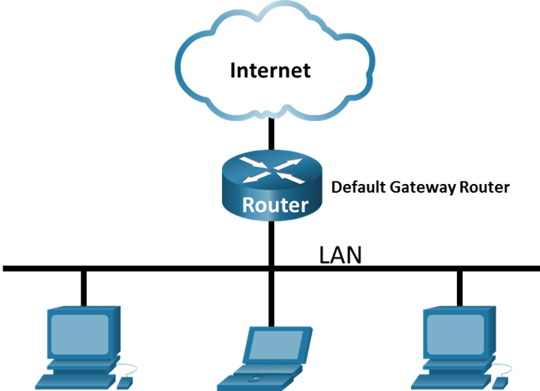
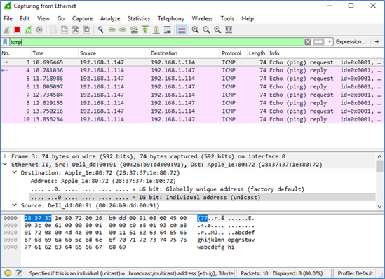

## Топология



## Задачи

**Часть 1. Сбор и анализ данных протокола ICMP по локальным узлам в программе Wireshark**

**Часть 2. Сбор и анализ данных протокола ICMP по удаленным узлам в программе Wireshark**

## Общие сведения/сценарий

Wireshark — это программа для анализа протоколов (анализатор пакетов), которая используется для поиска и устранения неполадок в сети, анализа, разработки программного обеспечения и протоколов, а также обучения. По мере движения потоков данных по сети анализатор «захватывает» каждую единицу данных протокола (PDU), после чего расшифровывает или анализирует ее содержание согласно соответствующему документу RFC или другим спецификациям.

Wireshark — полезный инструмент для всех, кто работает с сетями. Его можно использовать для анализа данных, а также для поиска и устранения неполадок при выполнении большинства лабораторных работ в рамках курсов CCNA. В ходе лабораторной работы вы научитесь пользоваться программой Wireshark для захвата IP-адресов пакетов данных ICMP и МАС-адресов Ethernet-кадров.

## Необходимые ресурсы

-   1 ПК (Windows с доступом в Интернет)
-   Дополнительные ПК в локальной сети будут использоваться для ответов на ping-запросы.

## Инструкции

### Часть 1. Сбор и анализ данных протокола ICMP по локальным узлам в программе Wireshark

В части 1 этой лабораторной работы вы должны отправить эхо-запрос с помощью команды ping на другой ПК в локальной сети и перехватить ICMP-запросы и отклики в программе Wireshark. Кроме того, вам нужно найти необходимую информацию в собранных кадрах. Этот анализ поможет понять, как используются заголовки пакетов для передачи данных по месту назначения.

**Шаг 1. Определение адресов интерфейсов своего ПК.**

В данной лабораторной работе вам необходимо узнать IP-адрес компьютера и физический адрес сетевой интерфейсной платы (NIC), который называется MAC-адресом.

1.  Откройте окно командной строки Windows.
2.  В окне командной строки введите `ipconfig/all`, чтобы узнать IP-адрес интерфейса компьютера, его описание и MAC-адрес (физический).

```
C:\Users\Student> ipconfig /all

Настройка IP для Windows

   Имя хоста. . . . . . . . . . . . : DESKTOP-NB48BTC
   Основной DNS-суффикс. . . . . . . :
   Тип узла. . . . . . . . . . . . : Гибрид
   Включена IP-маршрутизация. . . . . . . . : Нет
   Включен WINS-прокси. . . . . . . . : Нет

Ethernet adapter Ethernet:

   Connection-specific DNS Suffix . :
   Описание . . . . . . . . . . . : Intel(R) 82577LM Gigabit Network Connection
   Физический адрес. . . . . . . . . :00-26-B9-DD-00-91
   DHCP включен. . . . . . . . . . . : Нет
   Автонастройка включена . . . . : Да
   Link-local IPv6-адрес. . . . . : fe80::d809:d939:110f:1b7f%20(Preferred)
   IPv4-адрес. . . . . . . . . . . : 192.168.1.147(Preferred)
   Маска подсети . . . . . . . . . . . : 255.255.255.0
   Шлюз по умолчанию . . . . . . . . . : 192.168.1.1
<output omitted>
```

3.  Обменяйтесь IP-адресами ПК с другими студентами. но пока что не сообщайте им свой МАС-адрес.
4.  Закройте окно командной строки Windows.

**Шаг 2. Запустите программу Wireshark и начните сбор данных.**

1.  Перейдите к Wireshark. Дважды щелкните нужный интерфейс, чтобы начать захват пакетов. Убедитесь, что в нужном интерфейсе есть трафик.
2.  В верхней части окна программы Wireshark начнет прокручиваться информация. Строки данных выделяются различными цветами в зависимости от протокола.

Информация может прокручиваться очень быстро. Скорость прокрутки зависит от типа связи между ПК и локальной сетью. Чтобы облегчить просмотр и работу с данными, собранными программой Wireshark, можно применить фильтр.

В этой лабораторной работе нас интересуют только единицы данных протокола (PDU) ICMP (эхо-запрос с помощью команды ping). Для того чтобы вывести на экран только единицы данных протокола ICMP (ping-запрос), в поле **Filter (Фильтр)** в верхней части окна программы Wireshark введите **icmp** и нажмите клавишу **Enter (Ввод)** или кнопку **Apply (Применить)** (кнопка со значком стрелки).

3.  После этого все данные в верхнем окне исчезнут, однако захват трафика в интерфейсе продолжится. Откройте окно командной строки и отправьте эхо-запрос с помощью команды ping на IP-адрес, полученный от другого учащегося.

```
C:\> ping 192.168.1.114

Pinging 192.168.1.114 with 32 bytes of data:
Reply from 192.168.1.114: bytes=32 time<1ms TTL=128
Reply from 192.168.1.114: bytes=32 time<1мс TTL=128
Reply from 192.168.1.114: bytes=32 time<1ms TTL=128
Reply from 192.168.1.114: bytes=32 time<1ms TTL=128

Ping statistics for 192.168.1.114:
    Packets: Sent = 4, Received = 4, Lost = 0 (0 % loss),
Approximate round trip times in milli-seconds:
    Minimum = 0ms, Maximum = 0ms, Average = 0ms
```

Обратите внимание на то, что в верхней части окна программы Wireshark снова появятся данные.



**Примечание.** Если компьютер участника вашей рабочей группы не отвечает на ping-запросы, возможно, их блокирует межсетевой экран. Информацию о том, как обеспечить пропуск трафика ICMP через межсетевой экран на ПК с ОС Windows см. в Приложение А. Пропуск трафика ICMP через межсетевой экран.

4.  Остановите захват данных, нажав на значок **Stop Capture (Остановить захват)**.

**Шаг 3. Изучите полученные данные.**

На шаге 3 необходимо проверить данные, сформированные ping-запросами на ПК других студентов. Программа Wireshark отображает данные в трех разделах: 1) в верхнем разделе отображается список полученных кадров PDU со сводной информацией об IP-пакетах; 2) в среднем разделе приводится информация о PDU для кадра, выбранного в верхней части экрана, а также разделение захваченного кадра PDU по уровням протоколов; 3) в нижнем разделе показываются необработанные данные каждого уровня. Необработанные данные отображаются как в шестнадцатеричном, так и в десятичном форматах.

1.  Выберите кадры PDU первого запроса ICMP в верхнем разделе окна программы Wireshark. Обратите внимание на то, что в столбце **Source** (Источник) указывается IP-адрес вашего компьютера, а в столбце **Destination** (Назначение) — IP-адрес ПК другого участника, на который вы отправили ping-запрос.
2.  Не меняя выбор кадра PDU в верхнем разделе окна, перейдите в средний раздел. Нажмите символ + слева от строки Ethernet II, чтобы просмотреть МАС-адреса источника и назначения.

Вопросы:

Совпадает ли MAC-адрес источника с интерфейсом компьютера?

**Введите ваш ответ здесь.**

Совпадает ли MAC-адрес назначения в программе Wireshark с MAC-адресом другого участника рабочей группы?

**Введите ваш ответ здесь.**

Как ваш ПК определил MAC-адрес другого ПК, на который был отправлен эхо-запрос с помощью команды ping?

**Введите ваш ответ здесь.**

**Примечание**. В предыдущем примере перехваченного ICMP-запроса данные протокола ICMP инкапсулируются внутри PDU пакета IPv4 (заголовка IPv4), который затем инкапсулируется в PDU кадра Ethernet II (заголовок Ethernet II) для передачи по локальной сети.

### Часть 2. Сбор и анализ данных протокола ICMP по удаленным узлам в программе Wireshark

В части 2 вы должны будете отправить эхо-запросы с помощью команды ping на удаленные узлы (расположенные за пределами локальной сети) и изучить данные, сформированные этими запросами. Затем вам нужно будет определить различия между этими данными и данными, которые вы изучали в части 1.

**Шаг 1. Запустите захват данных в интерфейсе.**

1.  Снова начните захват данных.
2.  Появится окно с предложением сохранить полученные ранее данные перед началом нового захвата. Сохранять эти данные необязательно. Нажмите **Continue without Saving** (Продолжить без сохранения).
3.  Активировав захват данных, отправьте эхо-запрос с помощью команды ping на следующие три URL-адреса веб-сайтов с командной строки Windows:
    -   www.yahoo.com
    -   www.cisco.com
    -   www.google.com

**Примечание**. При отправке эхо-запросов с помощью команды ping на указанные URL-адреса обратите внимание на то, что служба доменных имен (DNS) преобразует адрес URL в IP-адрес. Запишите IP-адреса, полученные для каждого URL-адреса.

4.  Остановите захват данных, нажав на значок **Stop Capture** (Остановить захват).

**Шаг 2. Изучите и проанализируйте данные, полученные от удаленных узлов.**

Просмотрите собранные данные в программе Wireshark и изучите IP- и MAC-адреса трех веб-сайтов, на которые вы отправили ping-запросы. Ниже в оставленном месте укажите IP- и MAC-адреса назначения для всех трех веб-сайтов.

Вопросы:

IP-адрес для [www.yahoo.com](http://www.yahoo.com):

**Введите ваш ответ здесь.**

MAC-адрес для [www.yahoo.com](http://www.yahoo.com):

**Введите ваш ответ здесь.**

IP-адрес для [www.cisco.com](http://www.cisco.com):

**Введите ваш ответ здесь.**

MAC-адрес для [www.cisco.com](http://www.cisco.com):

**Введите ваш ответ здесь.**

IP-адрес для [www.google.com](http://www.google.com):

**Введите ваш ответ здесь.**

MAC-адрес для www.google.com:

**Введите ваш ответ здесь.**

Какова существенная особенность этих данных?

**Введите ваш ответ здесь.**

Как эта информация отличается от данных, полученных в результате эхо-запросов локальных узлов в части 1?

**Введите ваш ответ здесь.**

### Вопрос для повторения

Почему программа Wireshark показывает фактические MAC-адреса локальных узлов, но не показывает фактические MAC-адреса удаленных узлов?

**Введите ваш ответ здесь.**

## Приложение А. Пропуск трафика ICMP через межсетевой экран

Если эхо-запросы с помощью команды ping с других компьютеров не проходят на ваш ПК, возможно, их блокирует межсетевой экран. В этом приложении объясняется, как обеспечить пропуск эхо-запросов через межсетевой экран, а также как отменить новое правило ICMP по завершении лабораторной работы.

### Часть 1. Создайте новое правило, разрешающее прохождение ICMP-трафика через межсетевой экран.

1.  Перейдите на **панель управления** и выберите параметр «**Система и безопасность**» в представлении «**Категория**».
2.  В окне **System and Security** (Система и информационная безопасность) выберите **Windows Defender Firewall** или **Windows Firewall**.
3.  В левой части окна **Windows Firewall** или **Windows Defender Firewall** выберите **Advanced settings** (Дополнительные параметры).
4.  В окне **Advanced Security** (Расширенные функции безопасности) выберите параметр **Inbound Rules** (Правила для входящих подключений) на левой боковой панели, а затем щелкните **New Rule**… (Создать правило…) на правой боковой панели.
5.  Откроется мастер создания новых правил для входящих подключений. На **экране Rule Type** (Тип правила) нажмите селективную кнопку **Custom** (Настраиваемые) и нажмите **Next (Далее)**.
6.  На левой панели щелкните параметр **Protocol and Ports** (Протокол и порты) и выберите **ICMPv4** из раскрывающегося меню **Protocol Type** (Тип протокола), затем щелкните **Next (Далее)**.
7.  Убедитесь, что выбран **любой IP-адрес** для локальных и удаленных IP-адресов. Для продолжения нажмите кнопку **Next (Далее)**.
8.  Выберите **Разрешить подключение**. Для продолжения нажмите кнопку **Next (Далее)**.
9.  По умолчанию это правило применяется ко всем профилям. Для продолжения нажмите кнопку **Next (Далее).**
10. Назовите правило **Разрешить запросы ICMP**. Нажмите **Готово**, чтобы продолжить. Созданное правило позволит другим учащимся получать эхо-отклики с вашего ПК.

### Часть 2. Отключите и удалите новое правило ICMP.

По завершении лабораторной работы необходимо отключить или удалить новое правило, созданное в шаге 1. Опция **Отключить правило** позволяет снова включить его при необходимости. Полное удаление правила навсегда удалит его из списка правил для входящих подключений.

1.  В левой части окна **Advanced Security** (Расширенные функции безопасности) выберите **Inbound Rules** (Правила для входящих подключений) и найдите правило, созданное ранее.
2.  Щелкните правой кнопкой мыши правило **ICMP** и выберите **Отключить правило**, если это необходимо. Вы также можете выбрать **Удалить**, если хотите удалить его навсегда. Если после этого потребуется разрешить запросы ICMP, правило нужно будет создать заново.
