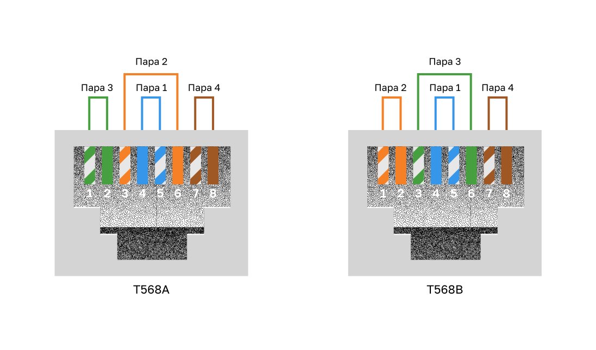

<!-- verified: agorbachev 03.05.2022 -->

<!-- 4.4.1 -->
## Свойства кабелей UTP

В предыдущей теме вы узнали немного о кабеле на основе неэкранированной витой пары (UTP). Поскольку кабели UTP являются стандартом для использования в локальных сетях, в этом разделе подробно рассматриваются его преимущества и ограничения, а также то, что можно сделать, чтобы избежать проблем.

Кабель на основе неэкранированной витой пары (UTP), используемый в качестве средства сетевого подключения, состоит из четырех скрученных пар медных проводников с цветовой маркировкой, заключенных в общую гибкую пластиковую оболочку. Благодаря небольшому диаметру кабеля его удобно монтировать.

В кабелях UTP не предусмотрено экранирование для защиты от ЭМП и РЧП. Вместо этого для ограничения отрицательного влияния переходных помех применяются следующие решения, в свое время найденные проектировщиками кабелей.

* **Взаимоподавление.**  Теперь проектировщики объединяют провода одной электрической цепи в пару. При размещении двух проводов одной электрической цепи в непосредственной близости друг к другу магнитные поля вокруг них противоположны друг другу. Поэтому два магнитных поля взаимно компенсируются, а также обеспечивается компенсация влияния внешних ЭМП и РЧП.
* **Различный шаг витков в парах.**  Для повышения эффекта подавления помех проектировщики используют различный шаг витков в соседних парах одного кабеля. Кабели UTP должны точно соответствовать спецификациям, регламентирующим допустимое количество витков на 1 метр кабеля. Обратите внимание, что на рисунке оранжевый и бело-оранжевый провода скручены реже, чем синий и бело-синий. Пары разных цветов скручены с разным шагом скрутки.

В кабелях UTP защита от искажений сигнала и эффективное самоэкранирование пар проводов осуществляются исключительно за счет эффекта подавления помех, достигаемого скручиванием проводов в паре.

<!-- 4.4.2 -->
## Стандарты прокладки кабелей UTP

Кабели UTP соответствуют требованиям стандартов, совместно выработанных организациями TIA и EIA. В частности, в стандарте TIA/EIA-568A описываются технические требования к прокладке кабеля в локальных сетях. Это наиболее часто применяемый в этой сфере стандарт. В нем определены следующие элементы.

- Типы кабелей
- Длина кабелей
- Разъемы
- Оконцовка кабелей
- Методы тестирования кабелей.

Электрические характеристики медных кабелей определяются Институтом инженеров по электротехнике и электронике (IEEE). IEEE классифицирует кабели UTP согласно их характеристикам. Кабели разделяются на категории в соответствии с возможной скоростью передачи данных по ним. Например, кабель категории 5 обычно используется в сетях Fast Ethernet 100BASE-TX. К другим категориям кабелей относятся: расширенная категория 5, категория 6 и категория 6а.

Кабели более высоких категорий предназначены для передачи данных на более высокой скорости. В результате разработки и внедрения новых технологий Ethernet для гигабитных скоростей передачи данных в настоящее время минимально допустимым типом кабелей является Категория 5e, а для прокладки новых сетей рекомендуется Категория 6.

На рисунке показаны три категории кабелей UTP:

- Категория 3 первоначально использовалась для голосовой связи по голосовым линиям, но впоследствии использовалась для передачи данных.
- Для передачи данных используются категории 5 и 5e. Категория 5 поддерживает 100 Мбит/с, а категория 5e поддерживает 1000 Мбит/с
- Категория 6 имеет дополнительный разделитель между каждой парой проводов для поддержки более высоких скоростей. Категория 6 поддерживает до 10 Гбит/с.
- Категория 7 также поддерживает 10 Гбит/с.
- Категория 8 поддерживает 40 Гбит/с.

Некоторые производители выпускают кабели с характеристиками выше, чем у кабелей категории 6a TIA/EIA, и позиционируют их как кабели категории 7.

Кабели UTP и STP обычно оснащаются разъемами RJ-45. В стандарте TIA/EIA 568 описано соответствие цветовой маркировки проводов и схем подключения контактов для кабелей Ethernet.

Как показано на рисунке, разъем RJ-45 является штекерным разъемом, устанавливаемым на конце кабеля обжимным способом.

### Штекерная часть разъема RJ-45 UTP (Коннектор)

Гнездовая часть этого разъема, как показано на рисунке, может устанавливаться в сетевом устройстве, на стене, офисной перегородке или коммутационной панели. При неправильной оконцовке каждый кабель становится потенциальной причиной снижения производительности на физическом уровне.

### Гнездовая часть разъема RJ-45 UTP

На этом рисунке показан пример кабелей UTP с плохим разъемом. Плохой разъем: провода открыты, раскручены и не полностью защищены оболочкой.

### Оконцовка оконцовка кабеля UTP

**Примечание**: Неправильная оконцовка кабелей может снизить производительность передачи.

На следующем рисунке показан правильно завершенный кабель UTP. Хороший разъем: провода раскручены в достаточной степени для подсоединения разъема.

Надлежащим образом оконеченый кабель UTP: оболочка кабеля заходит внутрь разъема RJ45 на столькло, чтобы надежно гофрировать проводники кабеля, все восемь проводников доходят до конца разъема

<!-- 4.4.3 -->
## Прямые и перекрестные кабели UTP

В различных ситуациях могут применяться различные схемы подключения проводов кабелей UTP к разъемам. Другими словами, отдельные провода кабеля могут подключаться к различным группам контактов разъема RJ-45 в разном порядке.

Ниже описаны основные типы кабелей, которые можно получить, применяя различный порядок подключения проводов.

* **Прямой кабель Ethernet:**  наиболее распространенный тип сетевого кабеля; как правило, используется для подключения узла к коммутатору и коммутатора к маршрутизатору.
* **Перекрестный кабель Ethernet:**  используется для соединения однотипных устройств, Например для подключения коммутатора к коммутатору, компьютера к компьютеру или маршрутизатора к маршрутизатору. Однако перекрестные кабели теперь считаются устаревшими, так как NIC используют среднезависимый интерфейс кроссовер (auto-MDIX) для автоматического определения типа кабеля и создания внутреннего подключения.

**Примечание**: Другой тип кабеля — консольный (rollover), который является собственностью Cisco. Он используется для подключения рабочей станции к маршрутизатору или коммутатору через консольный порт.

Неправильное использование перекрестного или прямого кабеля между устройствами не повредит им, но связь и взаимодействие между ними будут невозможны. Это распространенная ошибка,поэтому при отсутствии связи между устройствами в первую очередь нужно проверить правильность подключения.

### Стандарты T568A и T568B

На рисунке показаны схемы стандартов проводки T568A и T568B. Каждый из них показывает правильную разводку для отдельных пар проводов. Каждая цветовая пара проводов пронумерована и состоит из сплошной цветной проволоки и белого полосатого провода. 

* Пара 1 - синяя, пара 2 - оранжевая, пара 3 - зеленая, а пара 4 - коричневая. 
* Каждый стандарт чередуется между белыми полосатыми и сплошными проводами. 
* Для стандарта T568A синяя пара заканчивается на контактах 4 и 5, оранжевая пара заканчивается на контактах 3 и 6, зеленая пара заканчивается на контактах 1 и 2, а коричневая пара заканчивается на контактах 7 и 8. 
* Для стандарта T568B синяя пара заканчивается на контактах 4 и 5, оранжевая пара заканчивается на контактах 1 и 2, зеленая пара заканчивается на контактах 3 и 6, а коричневая пара заканчивается на контактах 7 и 8. 

В таблице приведена информация о типах кабелей UTP, соответствующих стандартах и типичных вариантах применения.

### Стандарты и типы кабелей

| Тип кабеля | Стандарт | Применение |
| --- | --- | --- |
| Прямой кабель Ethernet | Оба конца T568A или T568B | Подключает сетевой узел к сетевому устройству, например к коммутатору или концентратору. |
| Кроссовый кабель Ethernet | Один конец T568A, другой конец T568B | Соединяет два узла сети Соединяет два сетевых промежуточных устройства (коммутатор к коммутатору или маршрутизатор к маршрутизатору) |
| Консольный | Запатентован компанией Cisco | Присоединяет последовательный порт рабочей станции к порту консоли маршрутизатора, используя адаптер |

<!-- 4.4.4 -->
<!--  Упражнение. Схемы подключения кабельных контактов -->

