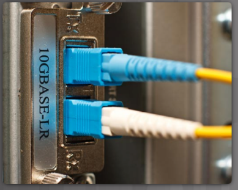
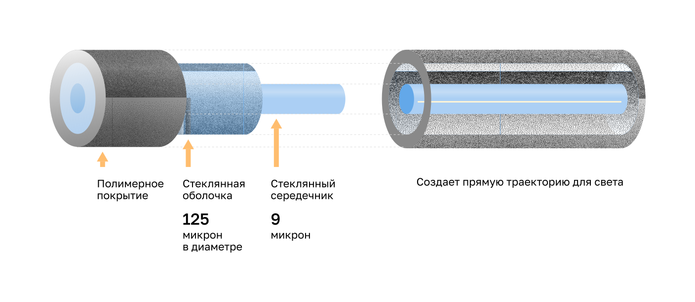
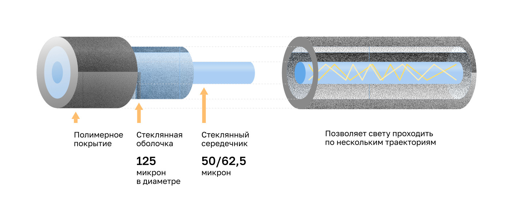
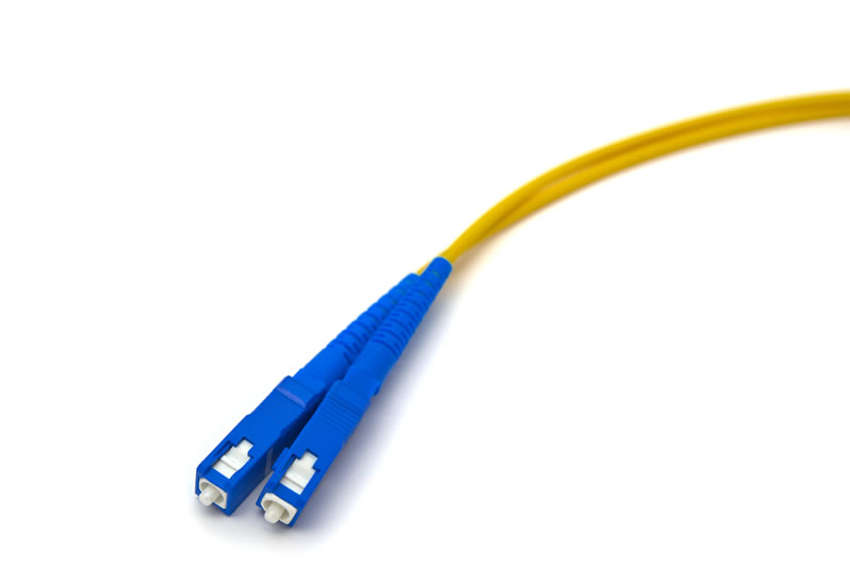
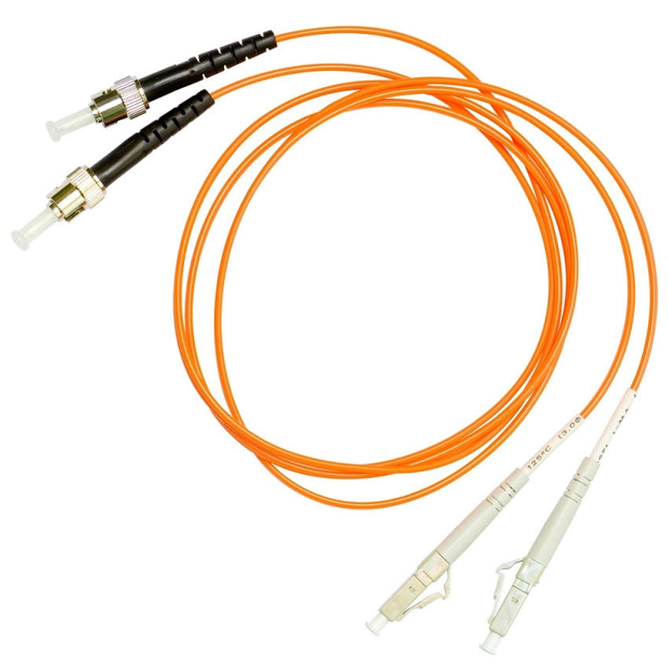

<!-- verified: agorbachev 03.05.2022 -->

<!-- 4.5.1 -->
## Свойства оптоволоконных кабелей

Как вы уже знаете, **оптоволоконные кабели** — это другой тип кабелей, используемых в сетях. Из-за своей высокой стоимости они используются не так широко. Но оптоволоконный кабель имеет такие свойства, которые делают его лучшим вариантом в определенных ситуациях. Об этом вы узнаете в этой теме.

Оптоволоконные кабели позволяют передавать данные на большие расстояния и с более высокой пропускной способностью, чем другие средства сетевого подключения. В отличие от медных проводов они передают сигналы с более низким затуханием. Такой кабель также очень устойчив к воздействию электромагнитных и радиочастотных волн. Оптические кабели обычно используются для соединения сетевых устройств друг с другом.

**Оптическое волокно** — это гибкая, очень тонкая и прозрачная нить из химически чистого стекла чуть толще человеческого волоса. Для передачи по оптоволоконному кабелю биты кодируются с помощью световых импульсов. Оптоволоконный кабель действует как световод, или «оптический волновод», обеспечивающий передачу светового сигнала между двумя концами кабеля с минимальными потерями.

В качестве аналогии представьте себе пустую втулку от рулона бумажных полотенец, внутренние стенки которой покрыты зеркально отражающим материалом. При этом ее длина равна километру. При помощи небольшой лазерной указки через эту втулку со скоростью света передаются сигналы азбуки Морзе. По сути именно так функционирует оптоволоконный кабель, только он имеет гораздо меньший диаметр и создан с применением самых современных оптических технологий.

<!-- 4.5.2 -->
## Типы оптоволоконных кабелей

Оптоволоконные кабели подразделяются на два основных типа:

* одномодовый (Single-mode Fiber, SMF);
* многомодовый (Multimode Fiber, MMF).

### Одномодовый оптоволоконный кабель (SMF)

SMF имеет сердечник очень малого диаметра. Для передачи луча света требуется лазерная технология, как показано на рисунке. SMF широко используется для организации линий связи протяженностью несколько сот километров, например, для дальней телефонии и кабельного телевидения.

Сечение одномодового оптоволоконного кабеля состоит из центрального стеклянного сердечника диаметром 9 мкм, окруженного стеклянной оболочкой диаметром 125 мкм с полимерным покрытием. В боковом разрезе показано, что этот тип кабельной конструкции создает прямую траекторию для света.

### Многомодовый оптоволоконный кабель

MMF имеет сердечник большего диаметра. Для передачи световых импульсов используются светодиодные излучатели. Как показано на рисунке, свет от светодиода, входит в MMF-волокно под разными углами. Такие кабели популярны в локальных сетях, поскольку позволяют использовать для работы недорогие светодиоды. MMF-кабель обеспечивает пропускную способность до 10 Гбит/с на расстоянии до 550 метров.

Сечение MMF-кабеля состоит из центрального стеклянного сердечника диаметром 50/62,5 мкм, окруженного стеклянной оболочкой диаметром 125 мкм с покрытием. В боковом разрезе показано, что этот тип кабельной конструкции позволяет свету проходить по нескольким траекториям.

Одно из основных отличий между MMF и SMF — **уровень дисперсии**. Под дисперсией в данном контексте понимается расширение светового импульса по мере его движения по оптическому волокну. Чем выше дисперсия, тем больше потери сигнала. MMF имеет большую дисперсию, чем SMF. Поэтому по MMF световой импульс может передвигаться до 500 метров без потери сигнала.

<!-- 4.5.3 -->
## Прокладка оптоволоконных кабелей

В настоящее время оптоволоконные кабели используются в следующих четырех областях.

* **Корпоративные сети.** Они служат магистральными кабелями, а также соединениями между устройствами сетевой инфраструктуры.
* **Технология «оптоволокно до квартиры» (Fiber-to-the-Home, FTTH).** Они используются для постоянного широкополосного доступа индивидуальных пользователей и небольших предприятий к сети.
* **Сети дальней связи.** Они нужны провайдерам услуг для международной и междугородной связи.
* **Подводные кабельные сети.** Они подходят для строительства надежных высокоскоростных линий связи, способных работать даже на больших глубинах и обеспечивать связь на внушительных расстояниях, вплоть до трансокеанских. Поищите в Интернете карты подводных кабелей, чтобы просмотреть различные карты онлайн.

В этом курсе мы будем рассматривать использование оптоволоконных кабелей в рамках предприятия.

<!-- 4.5.4 -->
## Оптоволоконные разъемы

Оптоволоконный разъем монтируется на конце оптического волокна. Существует несколько типов разъемов. Основные отличия между ними заключаются в размерах и методах механических соединений. Тип применяемых в сети разъемов определяется видом подключаемого оборудования.

**Примечание.** Некоторые коммутаторы и роутеры имеют порты, поддерживающие оптоволоконные коннекторы через SFP-трансиверы (small form-factor pluggable). Поищите в Интернете различные типы SFP.

### Разъемы ST (Straight-Tip, байонетного типа)

**ST разъем** — один из первых типов коннекторов. Разъем надежно фиксируется закручивающимся механизмом байонетного типа.

### Разъемы SC (Subscriber Connector)

Разъем SC иногда называют квадратным или стандартным. Этот тип разъема, широко используемый в локальных и глобальных сетях, оснащен механизмом с защёлкой push-pull для обеспечения надежного монтажа. Он используется с MMF и SMF оптоволоконными кабелями.

### Симплексные разъемы LC (Lucent Connector)

Разъем LC simplex представляет собой меньшую версию разъема SC. Он иногда называется малым или локальным разъемом, быстро набирает популярность из-за небольшого размера.

### Дуплексные MMF-разъемы LC

Дуплексные MMF-разъемы LC аналогичны симплексным разъемам LC, но с использованием дуплексного разъема.

До недавнего времени свет мог двигаться только в одном направлении по оптическому волокну. Для поддержки полного дуплексного режима было необходимо два волокна. Поэтому в оптических соединительных кабелях имеется два волокна, на концах каждого из которых смонтированы стандартные разъемы. Некоторые из них допускают подключение к ним как передающих, так и принимающих волокон. Такие разъемы называются дуплексными. Примером является дуплексный MMF-разъем типа LC, показанный на рисунке. Стандарты BX, такие как 100BASE-BX, используют различные длины волн для отправки и приема сигнала по одному волокну.

<!-- 4.5.5 -->
## Соединительные оптоволоконные кабели

Для подключения устройств сетевой инфраструктуры требуются соединительные оптоволоконные кабели. Чтобы различать SMF и MMF соединительные кабели, используется цветовая маркировка. Желтая используется для SMF оптоволоконных кабелей, а оранжевая (или голубая) — для MMF.

### Соединительный MMF-кабель SC-SC

### Соединительный SMF-кабель LC-LC

### Соединительный MMF-кабель ST-LC

### Соединительный SMF-кабель SC-ST

**Примечание.** Разъемы неиспользуемых оптоволоконных кабелей должны быть защищены небольшой пластиковой крышкой.

<!-- 4.5.6 -->
## Оптоволоконные кабели и медные кабели: сравнение

Оптоволоконные кабели имеют множество преимуществ перед медными. В таблице приведены некоторые из основных различий между ними.

В настоящее время в большинстве корпоративных сетей оптоволоконные кабели в основном используются в качестве магистральных для организации высокоскоростных соединений «точка-точка» между устройствами распределения данных. Они также используются для связи между зданиями в комплексах зданий. Поскольку оптоволокно не проводит электричество и отличается малыми потерями сигнала, оно оптимально подходит для этих целей.

### UTP and Fiber-Optic Cabling Comparison

| **Особенности при внедрении** | **Кабели типа UTP** | **Оптоволоконные кабели** |
| --- | --- | --- |
| Поддерживаемая пропускная способность | 10 Мбит/с — 10 Гбит/с | 10 Мбит/с — 100 Гбит/с |
| Расстояние | Относительно небольшое (от 1 до 100 метров) | Относительно большое ( 1 - 100,000 метров) |
| Устойчивость к электромагнитным и радиочастотным помехам | Низкая | Высокий (полностью защищенный) |
| Устойчивость к поражению электрическим током | Низкая | Высокий (полностью защищенный) |
| Расходы на средства передачи данных и разъемы | Минимум | Максимум |
| Навыки, требуемые для установки | Минимум | Максимум |
| Правила техники безопасности | Минимум | Максимум |

<!-- 4.5.7 -->
<!-- quiz -->

