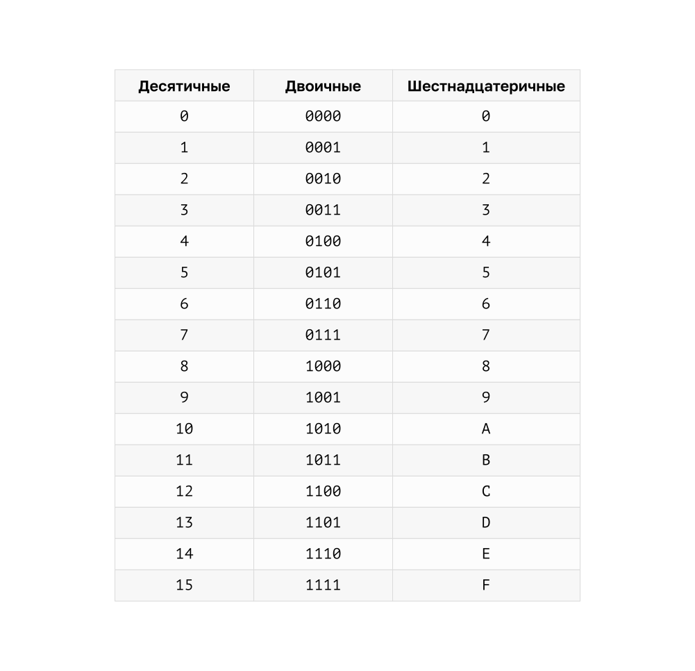
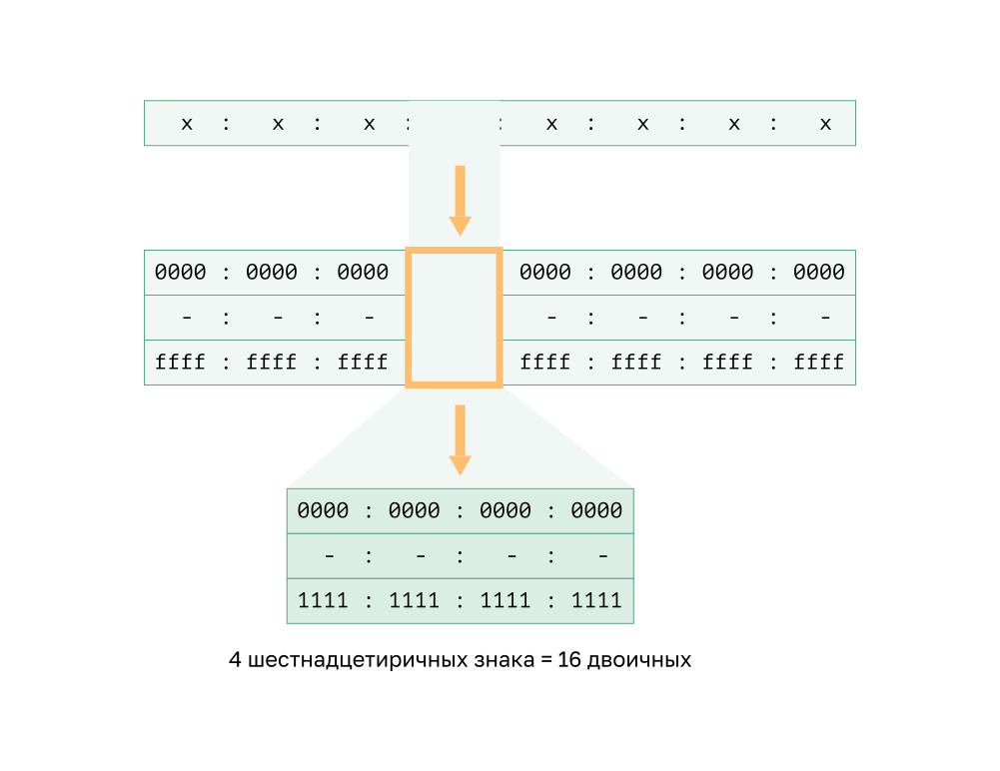

<!-- verified: agorbachev 03.05.2022 -->

<!-- 5.2.1 -->
## Шестнадцатеричные адреса и IPv6-адреса

Теперь вы знаете, как преобразовать двоичное число в десятичное и обратно. Этот навык необходим для понимания адресации IPv4 в сети. Но вы с такой же вероятностью будете использовать в своей сети IPv6-адреса. Чтобы понять их, вы должны иметь возможность конвертировать шестнадцатеричные числа в десятичные и наоборот.

Аналогично тому, как десятичный формат является системой счисления по основанию 10, шестнадцатеричный формат представляет собой систему счисления по основанию 16. В шестнадцатеричной системе используются числа от 0 до 9, а также буквы от A до Е. На рисунке показаны десятичные и шестнадцатеричные эквиваленты для двоичных значений от 0000 до 1111.

Проще представить значение в виде одной шестнадцатеричной цифры, чем в виде четырех двоичных разрядов.

Шестнадцатеричная система счисления используется для представления MAC-адресов Ethernet и IP-адресов версии 6.

Каждые 4 бита представляются одной шестнадцатеричной цифрой, образуя 32 шестнадцатеричных значения. IPv6-адреса нечувствительны к регистру, их можно записывать как строчными, так и прописными буквами.

Как показано на рисунке, IPv6-адреса записываются в формате x:x:x:x:x:x:x:x, где каждый x состоит из четырех шестнадцатеричных значений. Октеты — это термин, который используется для обозначения 8 бит IPv4-адреса. В IPv6-адресах сегмент из 16 бит или 4 шестнадцатеричных цифр неофициально называют гекстетом. Каждый х — это 1 гекстет, 16 бит или 4 шестнадцатеричные цифры.

Пример топологии на рисунке отображает шестнадцатеричные IPv6-адреса.

<!-- 5.2.2 -->
## Видео: преобразование между шестнадцатеричной и десятичной системами нумерации

Посмотрите видео о том, как конвертировать числа между шестнадцатеричной и десятичной системами.

<!-- 5.2.3 -->
## Преобразование десятичных чисел в шестнадцатеричные

Преобразовать десятичные числа в шестнадцатеричные значения довольно просто. Выполните перечисленные ниже действия.

1.  Преобразуйте десятичное число в 8-битные двоичные строки.
2.  Разделите двоичные строки на группы по четыре, начиная с самой правой позиции.
3.  Преобразуйте каждые четыре двоичных числа в их эквивалентные шестнадцатеричные цифры.

В примере приведены шаги для преобразования **168** в шестнадцатеричное.

Например, **168** преобразуется в шестнадцатеричный код с помощью трехэтапного процесса.

1.  **168** в двоичном формате составляет **10101000**.
2.  **10101000** в двух группах из четырех двоичных цифр **1010** и **1000**.
3.  **1010** является шестнадцатеричным **A**, а **1000** - шестнадцатеричным **8**.

**Ответ**: **168** в десятичном является **A8** в шестнадцатеричном.

<!-- 5.2.4 -->
## Преобразование шестнадцатеричного числа в десятичное

Преобразование шестнадцатеричных чисел в десятичные значения также просто. Выполните перечисленные ниже действия.

1.  Преобразуйте шестнадцатеричное число в 4-битные двоичные строки.
2.  Создайте 8-битную бинарную группировку, начиная с самой правой позиции.
3.  Преобразуйте каждую 8-битную бинарную группировку в эквивалентную десятичную цифру.

В этом примере показаны шаги для преобразования шестнадцатиричной **D2** в десятичную.

1.  **D2** в 4-битных двоичных строках составляет **1101** и **0010**.
2.  **1101** и **0010** — это **11010010** в 8-битной группировке.
3.  **11010010** в двоичном формате эквивалентно **210** в десятичной системе.

**Ответ**: **D2** в шестнадцатеричном коде — это **210** в десятичном.

<!-- 5.2.5 -->
<!-- quiz -->

