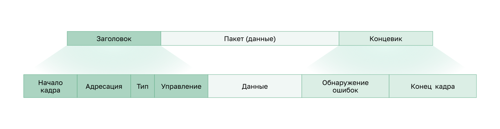

<!-- verified: agorbachev 03.05.2022 -->

<!-- 6.3.1 -->
## Кадр (ethernet frame)

В этом разделе подробно рассматривается, что происходит с кадром при его перемещении по сети. Информация, добавленная к кадру, определяется используемым протоколом.

Канальный уровень готовит инкапсулированные данные (обычно пакет IPv4 или IPv6) для перемещения по среде передачи данных локальной сети, добавляя к нему заголовок и окончание, чтобы создать кадр.

Протокол передачи данных отвечает за связь между двумя NIC в одной сети. Хотя кадры канального уровня описываются множеством различных протоколов этого уровня, кадры любого типа состоят из **3 основных компонентов**:

* заголовок;
* данные;
* окончание.

В отличие от других протоколов инкапсуляции, канальный уровень добавляет информацию в виде окончания в конце кадра.

Все протоколы канального уровня инкапсулируют единицу данных протокола (PDU) третьего уровня в пределах поля данных кадра. Однако структура кадра и полей, содержащихся в заголовке и окончании, отличается в зависимости от протокола.

Не существует такой структуры кадра, которая соответствовала бы требованиям всех видов передачи данных во всех типах средств подключения. Количество управляющей информации, которая должна присутствовать в кадре, зависит от окружения и изменяется в соответствии с требованиями управления доступом для конкретной среды и логической топологии. Например, кадр WLAN должен включать процедуры предотвращения столкновений и, следовательно, требует дополнительной управляющей информации по сравнению с кадром Ethernet.

Как показано на рисунке, для обеспечения доставки в нестабильной среде требуется больше средств управления. Поля заголовка и концевика увеличиваются, поскольку необходимо больше информации по управлению.

Необходимы более активные усилия для обеспечения доставки данных. Это означает более высокие накладные расходы и более медленные скорости передачи.

<!-- 6.3.2 -->
## Поля кадра

Механизм создания кадров делит поток на дешифруемые группы. Управляющая информация помещается в заголовок и окончание в виде значений в разных полях. Этот формат придает физическим сигналам структуру, которую узлы способны принимать и декодировать в пакеты в точке назначения.

Общие поля кадра показаны на рисунке. Не каждый протокол включает в себя все эти поля. Фактический формат кадра определяется стандартами для каждого конкретного канального протокола.

Поля кадра включают следующее:

* **флаги начала и конца кадра** (используются для определения границ начала и конца кадра);
* **адресация** (указывает узлы источника и назначения в среде передачи данных);
* **тип** (указывает протокол третьего уровня в поле данных);
* **управление** (указывает особые службы управления потоком, например качество обслуживания (QoS). Служба QoS используется для приоритетной пересылки определенных типов сообщений. Например, кадры протокола VoIP, обычно пользуются приоритетом, поскольку они чувствительны к задержкам);
* **данные** (содержит полезные данные кадра – заголовок пакета, заголовок сегмента и данные);
* **обнаружение ошибок** (идет после данных, чтобы сформировать окончание).

Протоколы канального уровня добавляют окончание в конец каждого кадра. В процессе, называемом обнаружением ошибок, окончание определяет, прибыл ли кадр без ошибок. Для этого в окончании кадра размещается специальная информация, полученная путем математической или логической обработки содержимого кадра. Биты обнаружения ошибок добавляются на канальном уровне, т.к. сигналы в среде передачи могут быть подвержены помехам, искажениям или потерям, в результате чего значения представленных этими сигналами битов могут изменяться.

Передающий узел путем логической обработки содержимого кадра создает так называемый циклический избыточный код (**cyclic redundancy check, CRC**). Значение этого кода помещается в поле контрольной последовательности кадра (**Frame Check Sequence, FCS**) и предоставляет информацию о содержимом кадра. Поле FCS в окончании кадра Ethernet позволяет принимающему узлу проверять кадр на наличие ошибок передачи.

<!-- 6.3.3 -->
## Адрес канального уровня

Канальный уровень обеспечивает адресацию, используемую при пересылке кадра по совместно используемой среде передачи данных в локальной сети. Адреса устройств на этом уровне называются **физическими адресами**. Адресация канального уровня содержится в заголовке кадра и указывает узел назначения кадра в локальной сети. Поэтому сетевой адаптер NIC может быстро определить, соответствует ли он своему собственному адресу второго уровня, прежде чем принимать остальную часть кадра. Заголовок кадра может также содержать адрес источника.

В отличие от логических адресов третьего уровня, которые являются иерархическими, физические адреса не указывают, в какой сети находится устройство. **Физический адрес** — это адрес конкретного физического устройства. Если устройство перемещается в другую сеть или подсеть, оно продолжит функционировать с тем же физическим адресом второго уровня. Поэтому адреса этого уровня используются только для подключения устройств в одной и той же общей среде, в одной IP-сети.

На рисунках 1–3 представлены функции адресов второго и третьего уровней. В ходе пересылки IP-пакетов от узла к роутеру, между роутерами и, наконец, от роутера к узлу в каждой точке на пути своего следования IP-пакет инкапсулируется в новый кадр канала передачи данных. Каждый кадр канального уровня содержит адрес канала источника (сетевой платы, передающей этот кадр) и адрес канала назначения (сетевой платы, принимающей этот кадр).

Исходный хост инкапсулирует IP-пакет третьего уровня в кадр второго уровня. В заголовке кадра хост добавляет свой адрес второго уровня в качестве источника и адрес этого же уровня для R1 в качестве назначения.

На изображении показана сеть, состоящая из исходного ПК, роутера R1, роутера R2 и конечного веб-сервера назначения. Показывается текстовое поле, представляющее NIC интерфейса каждого устройства. PC1 имеет IP-адрес 192.168.1.100. Сервер имеет IP-адрес 172.16.1.99. PC1 отправляет кадр L2 с адресом NIC назначения R1 и адресом NIC источника собственной NIC. Кадр инкапсулирует IP-пакет L3 с IP-адресом источника 192.168.1.110 и адресом назначения 172.16.1.99.

R1 инкапсулирует IP-пакет третьего уровня в новый кадр второго уровня. В заголовке кадра R1 добавляет свой адрес второго уровня в качестве источника и адрес этого же уровня для R2 в качестве назначения.

R2 инкапсулирует IP-пакет третьего уровня в новый кадр второго уровня. В заголовке кадра R2 добавляет свой адрес второго уровня в качестве источника и адрес этого же уровня для сервера в качестве назначения.

Адрес канального уровня используется только для локальной доставки пакетов. Адреса этого уровня не имеют смысла за пределами локальной сети. Сравните их с третьим уровнем, где адреса в заголовке пакета передаются от узла источника на узел назначения, независимо от количества транзитных участков сети на протяжении маршрута.

Если данные должны перейти в другой сегмент сети, необходимо промежуточное устройство, например, роутер. Он должен принять кадр согласно физическому адресу и деинкапсулировать его для анализа иерархического адреса или IP-адреса. С помощью IP-адреса роутер может определить местоположение устройства назначения в сети, а также найти лучший путь к нему. Узнав, куда необходимо переслать пакет, роутер создает для него новый кадр, который отправляется в следующий сетевой сегмент к месту назначения.

<!-- 6.3.4 -->
## Кадры LAN и WAN

Протоколы Ethernet используются проводными LAN. Беспроводная связь подпадает под протоколы WLAN (IEEE 802.11). Эти протоколы были разработаны для сетей с множественным доступом.

WAN традиционно используют другие типы протоколов для различных типов топологий «точка-точка», «звезда» и «полной ячеистой». Некоторые из общих протоколов WAN на протяжении многих лет включали:

* протокол «точка-точка» (PPP);
* высокоуровневый протокол управления каналом (HDLC);
* сеть Frame Relay;
* асинхронный режим передачи (ATM);
* X.25.

Эти протоколы второго уровня теперь заменены в глобальной сети Ethernet.

В сети на основе стека протоколов TCP/IP все протоколы второго уровня модели OSI работают с протоколом IP на третьем уровне модели OSI. Однако фактически используемый протокол второго уровня зависит от логической топологии сети и физической среды передачи данных.

Каждый протокол управляет доступом к среде для указанных логических топологий второго уровня. Это означает, что при реализации этих протоколов в качестве узлов, действующих на канальном уровне, может использоваться целый ряд различных сетевых устройств. К таким устройствам относятся сетевые платы на компьютерах, а также интерфейсы на роутерах и коммутаторах второго уровня.

Протокол второго уровня, используемый для конкретной топологии сети, определяется технологией, используемой для реализации этой топологии. Эта технология, в свою очередь, определяется размером сети (с точки зрения количества узлов и территории) и сервисами, предоставляемыми в этой сети.

В локальных сетях обычно используются технологии, которые обеспечивают высокую пропускную способность и поддерживают большое количество узлов. Сравнительно небольшая протяженность локальных сетей (в пределах одного здания или комплекса зданий) и высокая плотность пользователей обеспечивают рентабельность этой технологии.

Однако использование технологии с высокой пропускной способностью обычно нерентабельно для глобальных сетей, охватывающих обширные территории (например, города или целые регионы). Ввиду высокой стоимости физических каналов большой протяженности и технологий, используемых для передачи сигналов на большие расстояния, пропускная способность таких сетей, как правило, определяется уровнем рентабельности.

Разница в пропускной способности требует использования различных протоколов для локальных и глобальных сетей.

К протоколам канального уровня относятся:

* Ethernet;
* беспроводная сеть 802.11;
* протокол точка-точка (протокол PPP);
* высокоуровневый протокол управления каналом (HDLC);
* сеть Frame Relay.

<!-- 6.3.5 -->
<!-- quiz -->
