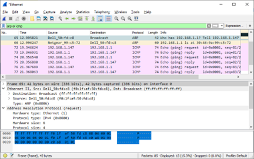
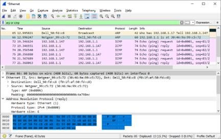

---

> **ВАЖНО**
> 
> Форма для ответов на вопросы будет доступна только при развертывании лабораторной работы 

---

## Топология


## Задачи

**Часть 1. Изучение полей заголовков в кадре Ethernet II**

**Часть 2. Захват и анализ кадров Ethernet с помощью программы Wireshark**

## Общие сведения и сценарий

При взаимодействии протоколов верхнего уровня данные проходят уровни модели взаимодействия открытых систем (OSI) и инкапсулируются в кадре уровня 2. Структура кадра зависит от типа доступа к среде передачи данных. Например, если в качестве протоколов верхнего уровня используются TCP и IP, а тип доступа к среде передачи — Ethernet, то инкапсуляция кадров уровня 2 происходит через Ethernet II. Это типично для среды локальных сетей.

При изучении концепций уровня 2 будет полезно проанализировать данные заголовков кадров. В первой части этой лабораторной работы вы сможете посмотреть поля в кадре Ethernet II. Во второй части вам предстоит перехватить и проанализировать поля заголовков кадра Ethernet II для локального и удаленного трафика с помощью программы Wireshark.

## Необходимые ресурсы

- 1 ПК (Windows с выходом в Интернет и программой Wireshark)

## Инструкции

### Часть 1. Изучение полей заголовков в кадре Ethernet II

В части 1 вы изучите поля и содержание заголовков в кадре Ethernet II. Для этого будет использован перехват данных программой Wireshark.

**Шаг 1. Просмотрите длины и описания полей заголовков Ethernet II.**

| Преамбула | Адрес назначения | Адрес источника | Тип кадра | Данные             | FCS     |
|-----------|------------------|-----------------|-----------|--------------------|---------|
| 8 байт    | 6 байт           | 6 байт          | 2 байта   | от 46 до 1500 байт | 4 байта |

**Шаг 2. Изучите конфигурацию сети ПК.**

Например, IP-адрес узла ПК — 192.168.1.147, IP-адрес шлюза по умолчанию — 192.168.1.1.

```
C:\> ipconfig /all

Ethernet adapter Ethernet:

   Connection-specific DNS Suffix . :
   Описание . . . . . . . . . . . : Intel(R) 82579LM Gigabit Network Connection
   Физический адрес. . . . . . . . . : F0-1F-AF-50-FD-C8
   DHCP включен. . . . . . . . . . . : Да
   Автонастройка включена . . . . : Да
   Link-local IPv6-адрес. . . . . : fe80::58c5:45f2:7e5e:29c2%11(Preferred)
   IPv4-адрес. . . . . . . . . . . : 192.168.1.147(Preferred)
   Маска подсети . . . . . . . . . . . : 255.255.255.0
   Аренда получена. . . . . . . . . . : Friday, September 6, 2019 11:08:36
   Аренда истекает . . . . . . . . . . : Saturday, September 7, 2019 11:08:36 AM
   Шлюз по умолчанию . . . . . . . . . : 192.168.1.1
   DHCP-сервер . . . . . . . . . . . : 192.168.1.1
<output omitted>
```

**Шаг 3. Изучите кадры Ethernet в данных, перехваченных программой Wireshark.**

Показанный ниже результат перехвата данных в программе Wireshark отображает пакеты, которые были созданы с помощью команды ping, отправленной с хоста ПК на шлюз по умолчанию. В программе Wireshark включен фильтр для просмотра только ARP- и ICMP-протоколов. ARP - Протокол разрешения адресов (ARP) ARP — это протокол связи, используемый для определения MAC-адреса, связанного с IP-адресом. Сеанс начинается с ARP-запроса МАС-адреса маршрутизатора шлюза, за которым следуют четыре эхозапроса и ответа.

На этом скриншоте показаны сведения о кадре для запроса ARP.



На этом скриншоте показаны сведения о кадре ответа ARP.



**Шаг 4. Изучите содержание заголовков Ethernet II в ARP-запросе.**

В приведенной ниже таблице выбран первый кадр из данных, перехваченных программой Wireshark, и отображаются данные в полях заголовков Ethernet II.

| Поле                                 | Значение                                                                               | Описание                                                                                                                                                                                                                                                                                                                                                                                                                                                                        |
|--------------------------------------|----------------------------------------------------------------------------------------|---------------------------------------------------------------------------------------------------------------------------------------------------------------------------------------------------------------------------------------------------------------------------------------------------------------------------------------------------------------------------------------------------------------------------------------------------------------------------------|
| Преамбула                            | Не показано в перехвате данных                                                         | В этом поле содержатся синхронизированные биты, обработанные сетевой платой.                                                                                                                                                                                                                                                                                                                                                                                                    |
| Адрес назначения    Адрес источника  | Широковещательная рассылка (ff:ff:ff:ff:ff:ff)    Netgear_99:c5:72 (30:46:9a:99:c5:72) | Адреса уровня 2 для кадра. Длина каждого адреса составляет 48 бит или 6 октетов, выраженных 12 шестнадцатеричными цифрами: **0-9,A-F**. Общий формат ― `12:34:56:78:9A:BC`. Первые шесть шестнадцатеричных чисел обозначают производителя сетевой платы, а последние — ее серийный номер. Адрес назначения может быть адресом широковещательной рассылки (состоящим только из единиц) или одноадресной рассылки. Адрес источника всегда является адресом одноадресной рассылки. |
| Тип кадра                            | 0x0806                                                                                 | В кадрах Ethernet II это поле содержит шестнадцатеричное значение, которое используется для указания типа протокола верхнего уровня в поле данных. Ethernet II поддерживает множество протоколов верхнего уровня. Наиболее распространены следующие два типа кадров. Значение Описание `0x0800` IPv4 Protocol `0x0806` Address Resolution Protocol (ARP)                                                                                                                        |
| Данные                               | ARP                                                                                    | Содержит инкапсулированный протокол верхнего уровня. Поле данных в диапазоне от 46 до 1500 байт.                                                                                                                                                                                                                                                                                                                                                                                |
| FCS                                  | Не показано в перехвате данных                                                         | Контрольная последовательность кадра (FCS), используемая сетевой платой для выявления ошибок при передаче данных. Значение вычисляется компьютером отправителя, включает адреса, тип и поле данных кадра и проверяется получателем.                                                                                                                                                                                                                                             |

Вопросы:

Какова особенность содержания поля адреса назначения?

**Введите ваш ответ здесь**

Почему перед первым эхо-запросом ПК отправляет широковещательную рассылку ARP?

**Введите ваш ответ здесь**

Назовите MAC-адрес источника в первом кадре.

**Введите ваш ответ здесь**

Назовите идентификатор производителя (OUI) сетевой платы источника в ответе ARP?

**Введите ваш ответ здесь**

Какая часть МАС-адреса соответствует OUI?

**Введите ваш ответ здесь**

Назовите серийный номер сетевой интерфейсной платы (NIC) источника.

**Введите ваш ответ здесь**

### Часть 2. Перехват и анализ кадров Ethernet с помощью программы Wireshark

В части 2 вы воспользуетесь программой Wireshark для перехвата локальных и удаленных кадров Ethernet. Затем вы изучите сведения, содержащиеся в полях заголовков кадров.

**Шаг 1. Определите IP-адрес шлюза по умолчанию на своем ПК.**

Откройте окно командной строки и введите ipconfig .

Назовите IP-адрес шлюза ПК по умолчанию.

**Введите ваш ответ здесь**

**Шаг 2. Начните захват трафика на сетевой интерфейсной плате своего ПК.**

1.  Откройте программу Wireshark и начните захват данных.
2.  Понаблюдайте за трафиком в окне списка пакетов.

**Шаг 3. С помощью фильтров программы Wireshark отобразите на экране только трафик ICMP.**

Чтобы скрыть ненужный трафик, установите соответствующий фильтр Wireshark. Фильтр не блокирует захват ненужных данных, а лишь отбирает то, что нужно показывать на экране. На данный момент разрешено отображение только трафика ICMP.

В поле **Filter** (Фильтр) программы Wireshark введите **icmp**. При правильной настройке фильтра поле должно стать зеленым. Если поле стало зеленым, нажмите кнопку **Apply** (Применить) (кнопка со стрелкой вправо), чтобы применить фильтр.

**Шаг 4. Из окна командной строки отправьте эхо-запрос на шлюз ПК по умолчанию.**

Из окна командной строки отправьте эхо-запрос на шлюз по умолчанию, используя IP-адрес, записанный в шаге 1.

**Шаг 5. Остановите захват трафика на сетевой плате.**

Нажмите значок **Stop Capture Packets** (Остановить захват), чтобы остановить захват трафика.

**Шаг 6. Изучите первый эхозапрос в программе Wireshark.**

Главное окно программы Wireshark состоит из трех разделов: панель списка пакетов (вверху), панель **Packet Details** (Сведения о пакете) (посередине) и панель **Packet Bytes** (Последовательность байтов пакета) (внизу). Если вы выбрали правильный интерфейс для захвата пакетов ранее, Wireshark должен отобразить информацию ICMP на панели списка пакетов Wireshark.

1.  На панели списка пакетов (верхний раздел) выберите первый указанный кадр. В столбце Info (Информация) появится значение **Echo (ping) request** (Эхо-запрос с помощью команды ping). Теперь линия должна быть выделена.
2.  Изучите первую строку на панели сведений о пакете в средней части экрана. В этой строке показана длина кадра.
3.  Вторая строка на панели сведений о пакете показывает, что это кадр Ethernet II. Также отображаются MAC-адреса источника и назначения.

Вопросы:

Назовите MAC-адрес сетевой интерфейсной платы этого ПК.

**Введите ваш ответ здесь**

Назовите MAC-адрес шлюза по умолчанию.

**Введите ваш ответ здесь**

4.  Вы можете щелкнуть знак больше (\>) в начале второй строки, чтобы получить больше информации о кадре Ethernet II.

Вопрос:

Назовите отображающийся тип кадра.

**Введите ваш ответ здесь**

5.  Последние две строки среднего раздела содержат информацию о поле данных кадра. Обратите внимание на то, что данные содержат IPv4-адреса источника и назначения.

Вопросы:

Назовите IP-адрес источника.

**Введите ваш ответ здесь**

Назовите IP-адрес назначения.

**Введите ваш ответ здесь**

6.  Для того чтобы выделить эту часть кадра (в шестнадцатеричной системе и в кодировке ASCII) на панели **Packet Bytes** (Последовательность байтов пакета) (нижний раздел), щелкните по любой строке в среднем разделе. Щелкните по строке **Internet Control Message Protocol** (Протокол ICMP) в среднем разделе и посмотрите, что будет выделено на панели **Packet Bytes** (Последовательность байтов пакета).

Вопрос:

Какое слово образуют последние два выделенных октета?

**Введите ваш ответ здесь**

7.  Нажмите следующий кадр в верхнем разделе и изучите кадр эхо-ответа. Обратите внимание на то, что МАС-адреса источника и назначения поменялись местами, поскольку маршрутизатор, который служит шлюзом по умолчанию, отправил этот кадр в ответ на первый эхо-запрос.

Вопрос:

Какое устройство и MAC-адрес отображаются в качестве адреса назначения?

**Введите ваш ответ здесь**

**Шаг 7. Захват пакетов для удаленного узла.**

1.  Нажмите пиктограмму **Start Capture** (Начать перехват), чтобы начать новый перехват данных в программе Wireshark. Откроется всплывающее окно с предложением сохранить предыдущие перехваченные пакеты в файл перед началом нового перехвата. Нажмите **Continue without Saving** (Продолжить без сохранения).
2.  Через окно командной строки отправьте эхо-запрос на веб-сайт www.cisco.com.
3.  Остановите захват пакетов.
4.  Изучите новые данные на панели списка пакетов в программе Wireshark.

Вопросы:

Назовите МАС-адреса источника и назначения в первом кадре эхозапроса.

**Введите ваш ответ здесь**

Назовите IP-адреса источника и назначения в поле данных кадра.

**Введите ваш ответ здесь**

Сравните эти адреса с адресами, полученными в шаге 6. Изменился только IP-адрес назначения. Почему IP-адрес назначения изменился, а MAC-адрес назначения остался прежним?

**Введите ваш ответ здесь.**

## Вопрос для повторения

Программа Wireshark не отображает поле преамбулы заголовка кадра. Что содержит преамбула?

**Введите ваш ответ здесь**
