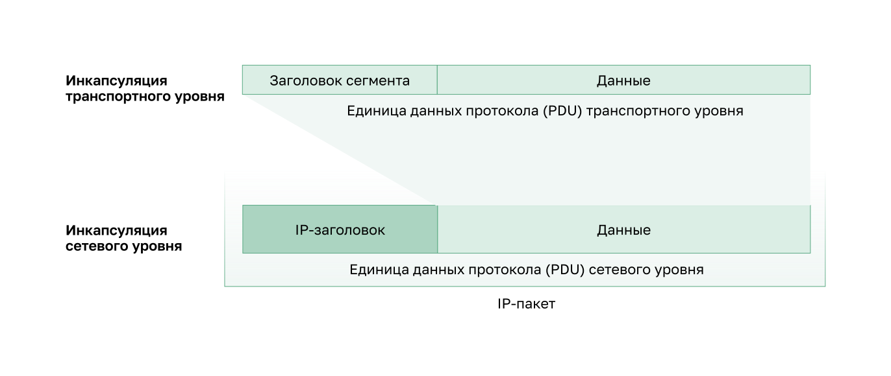

<!-- verified: agorbachev 03.05.2022 -->

<!-- 8.1.1 -->
## Сетевой уровень

Сетевой уровень, или третий уровень модели OSI, предоставляет сервисы, позволяющие оконечным устройствам обмениваться данными по сети. Как показано на рисунке, IP версии 4 (IPv4) и 6 (IPv6) являются протоколами связи основного сетевого уровня. Другие протоколы сетевого уровня включают протоколы маршрутизации, такие как Open Shortest Path First (OSPF), и протоколы обмена сообщениями, такие как Internet Control Message Protocol (ICMP).

### Протоколы сетевого уровня

Для выполнения сквозных коммуникаций через границы сети протоколы сетевого уровня выполняют четыре основные операции.

* **Адресация оконечных устройств**. Оконечным устройствам необходимо назначить уникальный IP-адрес для возможности их идентификации в сети.
* **Инкапсуляция**. Сетевой уровень получает единицу данных протокола (PDU) от транспортного уровня. Во время выполнения процесса, который называется инкапсуляцией, сетевой уровень добавляет информацию заголовка IP, например IP-адрес узла источника (отправляющего) и узла назначения (получающего). Процесс инкапсуляции выполняется источником IP-пакета.
* **Маршрутизация**. Сетевой уровень предоставляет сервисы, с помощью которых пакеты направляются к узлу назначения в другой сети Для перемещения к другим сетям пакет должен быть обработан роутером. Его роль заключается в том, чтобы выбрать пути для пакетов и направить их к узлу назначения. Такой процесс называется маршрутизацией. До того как достигнуть узла назначения, пакет может пройти через несколько роутеров. Каждый маршрут на пути пакета к узлу назначения называется переходом.
* **Деинкапсуляция**. По прибытии пакета на сетевой уровень узла назначения этот узел проверяет IP-заголовок пакета. Если IP-адрес назначения в заголовке совпадает с его собственным IP-адресом, заголовок IP удаляется из пакета. После деинкапсуляции пакета, выполняемой сетевым узлом, полученная единица данных протокола (PDU) четвертого уровня пересылается соответствующей службе на транспортном уровне. Процесс деинкапсуляции выполняется конечным узлом IP-пакета.

В отличие от транспортного уровня (уровень 4 модели OSI), который управляет передачей данных между процессами, запущенными на каждом узле, протоколы сетевого уровня (IPv4 и IPv6) указывают структуру пакета и тип обработки, которые используются для перемещения данных от одного узла к другому. Функционирование без учета данных, передаваемых в каждом пакете, позволяет сетевому уровню передавать пакеты для нескольких типов коммуникации между несколькими узлами.

<!-- 8.1.2 -->
## Инкапсуляция IP

Протокол IP инкапсулирует сегмент транспортного уровня (уровень чуть выше сетевого уровня) или другие данные путем добавления заголовка IP. Он используется для доставки пакета на узел назначения.

На рисунке показан последующий процесс создания единицы данных протокола (PDU) сетевого уровня и IP-пакета.

Процесс инкапсуляции данных от уровня к уровню обеспечивает возможность разрабатывать и масштабировать сервисы на различных уровнях без влияния на другие уровни. Это означает, что сегменты транспортного уровня можно легко упаковать с помощью протоколов IPv4 или IPv6 или любого нового протокола, который может быть создан в будущем.

IP-заголовок проверяется устройствами уровня 3 (т.е. роутерами и коммутаторами уровня 3), когда он перемещается по сети к месту назначения. Важно отметить, что информация об IP-адресации остается неизменной с момента выхода пакета с исходного хоста до момента его прибытия на хост назначения, за исключением случаев, когда она переводится устройством, выполняющим преобразование сетевых адресов (NAT) для IPv4.

**Примечание.** NAT обсуждается в последующих модулях.

Роутеры реализуют протоколы маршрутизации для передачи пакетов между сетями. Во время этого процесса, выполняемого этими промежуточными устройствами, учитывается содержимое заголовка только того пакета, который инкапсулирует сегмент. Во всех остальных случаях часть данных пакета (т.е. инкапсулированная единица данных протокола (PDU) транспортного уровня) во время выполнения процессов на сетевом уровне остается неизменной.

<!-- 8.1.3 -->
## Характеристики протокола IP

Протокол IP был разработан как протокол с низкой нагрузкой. Он обеспечивает только те функции, которые необходимы для доставки пакета от узла источника к узлу назначения по взаимосвязанной системе сетей. Этот протокол не предназначен для мониторинга и управления потоком пакетов. Эти функции, при необходимости, выполняются другими протоколами на других уровнях, в первую очередь — протоколом TCP на уровне 4.

Основные характеристики IP:

* **без установления соединения** (означает, что перед отправкой пакетов данных соединение с хостом назначения не устанавливается);
* **негарантированная доставка** (показывает, что IP-протокол по своей сути неустойчив, так как доставка пакетов не гарантируется);
* **независимость от среды** (работа не зависит от средства подключения — медный, оптоволоконный кабель или беспроводная среда).

<!-- 8.1.4 -->
## Без установления соединения

IP является протоколом без установления соединения, а это означает, что перед отправкой данных выделенное сквозное соединение не устанавливается. Обмен данными без установления соединения по своей сути аналогичен отправке письма без предварительного уведомления получателя. На рисунке представлены эти пункты.

При передаче данных без установления соединения используется аналогичный принцип. Как показано на рисунке, IP-протоколу не требуется первоначальный обмен контрольной информацией для установления сквозного соединения до начала пересылки пакетов.

<!-- 8.1.5 -->
## Негарантированная доставка

IP также не нуждается в дополнительных полях в заголовке для поддержки установленного соединения. Этот процесс значительно снижает нагрузку IP. Тем не менее без предварительно установленного сквозного подключения отправителям неизвестно, имеются ли устройства-адресаты и способны ли они функционировать в момент отсылки пакетов, а также получит ли пакет узел назначения и смогут ли устройства-адресаты получить доступ к пакету и прочитать его.

Протокол IP не гарантирует получение всех доставляемых пакетов. На рисунке показана его особенность, раскрывающая суть его недостоверной или негарантированной доставки.

Протокол IP не является надежным протоколом сетевого уровня и не гарантирует, что все отправленные пакеты будут получены. Другие протоколы управляют процессом отслеживания пакетов и обеспечивают их доставку.

<!-- 8.1.6 -->
## Независимость от среды

Ненадежный протокол — тот, который не способен контролировать не доставленные или поврежденные пакеты и восстанавливать их. IP-пакеты отправляются с информацией о расположении места назначения, но не содержат сведений, которые могли бы быть обработаны для информирования отправителя о том, что доставка была успешной. Пакеты могут прибыть на узел назначения поврежденными или с нарушением порядка, либо не прибыть совсем. В случае возникновения таких ошибок информация, которая содержится в заголовке IP, не позволяет выполнить повторную пересылку пакетов.

Если отсутствие пакетов или несоблюдение очередности создает проблемы для приложений, использующих данные, сервисы верхнего уровня, например TCP, должны устранить эти проблемы. Это обеспечивает высокую эффективность работы протокола IP. В пакете протоколов TCP/IP обеспечение надежности — задача протокола TCP транспортного уровня.

Протокол IP действует независимо от среды, которая служит для передачи данных на нижних уровнях стека протоколов. Как показано на рисунке, любой отдельный пакет IP может передаваться по кабелю (с помощью электрических импульсов, например оптических сигналов по оптоволоконному кабелю) или в виде радиосигналов в беспроводных сетях.

IP-пакеты могут проходить по разным средам передачи данных.

Канальный уровень в модели OSI отвечает за прием IP-пакета и его подготовку к транспортировке по среде передачи данных. Это означает, что пересылка пакетов IP не ограничивается какой-либо конкретной коммуникационной средой.

Тем не менее существует одна важная характеристика среды передачи, которая учитывается на сетевом уровне: максимальный размер единицы данных протокола (PDU), который способна переслать каждая среда. Эта характеристика называется максимальным размером пакета (MTU). Часть обмена контрольными данными между канальным уровнем и сетевым уровнем — это установление максимального размера пакета. Канальный уровень передает значение MTU на сетевой уровень. Затем сетевой уровень определяет размер пакетов.

В некоторых случаях промежуточное устройство (как правило, это роутер) должно разделить пакет IPv4 во время его пересылки из одной среды передачи данных в среду с меньшим максимальным размером передаваемого блока данных (MTU). Этот процесс называется разделением пакета или фрагментацией. Фрагментация вызывает задержку. Пакеты IPv6 не могут быть фрагментированы роутером.

<!-- 8.1.7 -->
<!-- quiz -->

