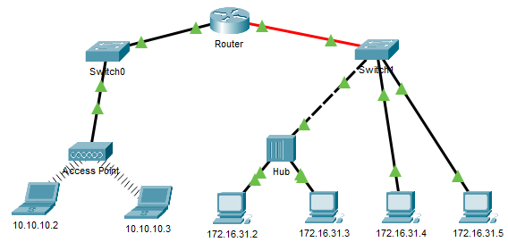

---

> **ВАЖНО**
> 
> Форма для ответов на вопросы будет доступна только при развертывании лабораторной работы 

---

## Топология

## Задачи

Часть 1: Собрать информацию PDU для локальной сети связи

Часть 2: Собрать информацию PDU для удаленной сетевой связи

## Общие сведения

Это упражнение оптимизировано для просмотра единиц данных протокола (PDU). Устройства уже настроены. Вам необходимо в режиме моделирования собрать сведения о единице данных протокола (PDU), а также ответить на ряд вопросов о собираемых данных.

## Инструкции

### Часть 1. Сбор информации PDU для локальной сети связи

**Примечание.** Просмотрите вопросы для повторения из части 3, прежде чем приступать к части 1. По ним вы сможете понять, какие типы данных необходимо будет собрать.

**Шаг 1. Соберите сведения о единице данных протокола (PDU) по мере перемещения пакета с адреса 172.16.31.5 в адрес 172.16.31.2**

1.  Нажмите **172.16.31.5** и откройте окно **Command Prompt** (командная строка).

2.  Введите команду **ping 172.16.31.2**.

3.  Перейдите в режим моделирования и повторите команду **ping 172.16.31.2**. Единица данных протокола (PDU) будет показана рядом с **172.16.31.5**.

4.  Нажмите единицу данных протокола (PDU) и запишите следующие данные на вкладке **OSI Model** и **Outbound PDU Layer**.

    -   MAC-адрес назначения: **000C:85CC:1DA7**.

    -   MAC-адрес источника: **00D0:D311:C788**.

    -   IP-адрес источника: **172.16.31.5**.

    -   IP-адрес назначения: **172.16.31.2**.

    -   На устройстве: **172.16.31.5**.

5.  Нажмите **Capture / Forward** (стрелка вправо с вертикальной чертой), чтобы переместить единицу данных протокола (PDU) на следующее устройство. Соберите аналогичные сведения из шага 1Г. Повторяйте процедуру до тех пор, пока единица данных протокола (PDU) не достигнет места назначения. Запишите полученные сведения о единице данных протокола (PDU) в электронную таблицу в формате, показанном в таблице ниже.

**Пример формата электронной таблицы**

| На устройстве | Адрес MAC-адрес | MAC-адрес источника | IPv4-адрес источника | IPv4-адрес назначения |
|---------------|-----------------|---------------------|----------------------|-----------------------|
| 172.16.31.5   | 000C:85CC:1DA7  | 00D0:D311:C788      | 172.16.31.5          | 172.16.31.2           |
| Switch1       | 000C:85CC:1DA7  | 00D0:D311:C788      | —                    | —                     |
| узел          | —               | —                   | —                    | —                     |
| 172.16.31.2   | 00D0:D311:C788  | 000C:85CC:1DA7      | 172.16.31.2          | 172.16.31.5           |

**Шаг 2. Соберите дополнительные сведения о единице данных пакета (PDU) с помощью других эхо-запросов**

Повторите процедуру, описанную в шаге 1, и соберите сведения для следующих проверок.

-   Эхо-запрос с 172.16.31.2 на адрес 172.16.31.3

-   Эхо-запрос с 172.16.31.4 на адрес 172.16.31.5

Вернитесь в режим реального времени (Realtime).

### Часть 2. Сбор информации PDU для удаленной сетевой связи

Для связи с удаленными сетями необходим шлюз. Изучите процесс, который происходит соединения устройств в удаленной сети. Обратите пристальное внимание на используемые MAC-адреса.

**Шаг 1. Соберите сведения о единице данных протокола (PDU) по мере перемещения пакета с адреса 172.16.31.5 в адрес 10.10.10.2.**

1.  Нажмите **172.16.31.5** и откройте окно **Command Prompt** (командная строка).

2.  Введите команду **ping 10.10.10.2**.

3.  Перейдите в режим моделирования и повторите команду **ping 10.10.10.2**. Единица данных протокола (PDU) будет показана рядом с **172.16.31.5**.

4.  Нажмите единицу данных протокола (PDU) и запишите следующие данные на вкладке **Outbound PDU Layer** (уровень исходящей PDU).

    -   MAC-адрес назначения: 00D0:BA8E:741A

    -   MAC-адрес источника: 00D0:D311:C788

    -   IP-адрес источника: 172.16.31.5

    -   IP-адрес назначения: 10.10.10.2

    -   На устройстве: 172.16.31.5

    - Ответьте на вопрос №1

5.  Нажмите **Capture / Forward** (стрелка вправо с вертикальной чертой), чтобы переместить единицу данных протокола (PDU) на следующее устройство. Соберите аналогичные сведения из шага 1Г. Повторяйте процедуру до тех пор, пока единица данных протокола (PDU) не достигнет места назначения. Запишите полученные сведения о единице данных протокола (PDU) после пингования 172.16.31.5 в электронную таблицу в формате, показанном в таблице ниже.

| На устройстве | Адрес MAC-адрес | MAC-адрес источника | IPv4-адрес источника | IPv4-адрес назначения |
|---------------|-----------------|---------------------|----------------------|-----------------------|
| 172.16.31.5   | 00D0:BA8E:741A  | 00D0:D311:C788      | 172.16.31.5          | 10.10.10.2            |
| Коммутатор 1  | 00D0:BA8E:741A  | 00D0:D311:C788      | —                    | —                     |
| Маршрутизатор | 0060:2F84:4AB6  | 00D0:588C:2401      | 172.16.31.5          | 10.10.10.2            |
| Switch0       | 0060:2F84:4AB6  | 00D0:588C:2401      | —                    | —                     |
| Точка доступа | —               | —                   | —                    | —                     |
| 10.10.10.2    | 00D0:588C:2401  | 0060:2F84:4AB6      | 10.10.10.2           | 172.16.31.5           |

### Часть 3. Вопросы для повторения

Ответьте на следующие вопросы относительно сбора данных:

- вопрос №2

- вопрос №3

- вопрос №4

- вопрос №5

- вопрос №6

- вопрос №7

- вопрос №8

- вопрос №9

- вопрос №10

- вопрос №11

- вопрос №12

- вопрос №13

- вопрос №14

- вопрос №15

- вопрос №16

- вопрос №17

- вопрос №18

- вопрос №19

- вопрос №20

- вопрос №21

<!-- [Скачать файл Packet Tracer для локального запуска](./assets/9.1.3-lab.pka) -->
