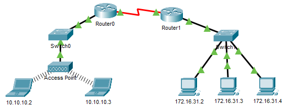

## Топология

## Таблица адресации

| Устройство  | Интерфейс | MAC-адрес      | Интерфейс коммутатора |
|-------------|-----------|----------------|-----------------------|
| Router0     | Gg0/0     | 0001.6458.2501 | G0/1                  |
| Router0     | S0/0/0    | —              | —                     |
| Router1     | G0/0      | 00E0.F7B1.8901 | G0/1                  |
| Router1     | S0/0/0    | —              | —                     |
| 10.10.10.2  | Wireless  | 0060.2F84.4AB6 | F0/2                  |
| 10.10.10.3  | Wireless  | 0060.4706.572B | F0/2                  |
| 172.16.31.2 | F0        | 000C.85CC.1DA7 | F0/1                  |
| 172.16.31.3 | F0        | 0060.7036.2849 | F0/2                  |
| 172.16.31.4 | G0        | 0002.1640.8D75 | F0/3                  |

## Задачи

Часть 1. Анализ ARP-запроса

Часть 2. Изучение таблицы МАС-адресов коммутатора

Часть 3. Анализ процесса ARP в удаленных подключениях

## Общие сведения

Это упражнение оптимизировано для просмотра единиц данных протокола (PDU). Устройства уже настроены. Вам необходимо в режиме моделирования собрать сведения о единице данных протокола (PDU), а также ответить на ряд вопросов о собираемых данных.

## Инструкции

### Часть 1. Анализ ARP-запроса

**Шаг 1. Создайте ARP-запросы, отправив эхо-запросы на адрес 172.16.31.3 с 172.16.31.2.**

1.  Нажмите **172.16.31.2** и откройте окно **Command Prompt** (Командная строка).

2.  Выполните команду **arp -d**, чтобы очистить таблицу ARP.

3.  Перейдите в режим **Simulation** (Моделирование) и выполните команду **ping 172.16.31.3**. Будет создано две единицы данных протокола PDU. Команда **ping** не может отправить ICMP-пакет, не зная MAC-адрес назначения. Поэтому компьютер отправляет широковещательный кадр ARP, чтобы найти MAC-адрес назначения.

4.  Нажмите кнопку **Capture/Forward** (Захватить/переадресовать) один раз. Единица данных протокола (PDU) ARP перемещается на **Switch1** (Коммутатор 1), а единица данных протокола (PDU) ICMP исчезает, ожидая ARP-ответ. Откройте единицу данных протокола (PDU) и запишите MAC-адрес назначения.

    Вопрос: Этот адрес есть в таблице выше?

    **Введите ваш ответ здесь.**

5.  Нажмите **Capture / Forward** (Захватить/переадресовать), чтобы переместить единицу данных протокола (PDU) на следующее устройство.

    Вопросы:

    Сколько копий единицы данных протокола (PDU) создал **Switch1**?

    **Введите ваш ответ здесь.**

    Какой IP-адрес имеет устройство, которое приняло единицу данных протокола (PDU)?

    **Введите ваш ответ здесь.**

6.  Откройте единицу данных протокола (PDU) и изучите уровень 2.

    Вопрос: Что произошло с MAC-адресами источника и назначения?

    **Введите ваш ответ здесь.**

7.  Нажимайте кнопку **Capture/Forward** (Захватить/переадресовать) до тех пор, пока единица данных протокола (PDU) не вернется на узел **172.16.31.2**.

    Вопрос: Сколько копий единицы данных протокола (PDU) создал коммутатор для ответа на ARP-запрос?

    **Введите ваш ответ здесь.**

**Шаг 2. Изучите таблицу ARP.**

1.  Обратите внимание, что ICMP-пакет снова появился. Откройте единицу данных протокола (PDU) и взгляните на MAC-адрес.

    Вопрос: MAC-адреса источника и назначения соответствуют их IP-адресам?

    **Введите ваш ответ здесь.**

2.  Вернитесь обратно в режим **реального времени**, и команда ping завершится.

3.  Нажмите **172.16.31.2** и выполните команду **arp –a**.

    Вопросы:

    Какому IP-адресу соответствует запись MAC-адреса?

    **Введите ваш ответ здесь.**

    В общем случае, когда оконечное устройство отправляет ARP-запрос?

    **Введите ваш ответ здесь.**

### Часть 2. Изучение таблицы MAC-адресов коммутатора

**Шаг 1. Сгенерируйте дополнительный трафик для заполнения таблицы MAC-адресов коммутатора.**

1.  На узле **172.16.31.2** выполните команду **ping 172.16.31.4**.

2.  Нажмите кнопку **10.10.10.** 2 и откройте **командную строку**.

3.  Введите команду **ping 10.10.10.3**.

    Вопрос: Сколько ответов было отправлено и получено?

    **Введите ваш ответ здесь.**

**Шаг 2. Изучите таблицу MAC-адресов на коммутаторах.**

1.  Нажмите **Switch1** (Коммутатор 1) и откройте вкладку **CLI** (Интерфейс командной строки). Выполните команду **show mac-address-table**.

    Вопрос: Совпадают ли записи с указанными в таблице выше?

    **Введите ваш ответ здесь.**

2.  Нажмите **Switch0** (Коммутатор 0) и откройте вкладку **CLI** (Интерфейс командной строки). Выполните команду **show mac-address-table**.

    Вопросы:

    Совпадают ли записи с указанными в таблице выше?

    **Введите ваш ответ здесь.**

    Почему два MAC-адреса связаны с одним портом?

    **Введите ваш ответ здесь.**

### Часть 3. Анализ процесса ARP в удаленных подключениях

**Шаг 1. Сгенерируйте трафик ARP.**

1.  Нажмите **172.16.31.2** и откройте окно **Command Prompt** (Командная строка).

2.  Введите команду **ping 10.10.10.1**.

3.  Введите **arp –a**.

    Вопрос: Какой IP-адрес имеет новая запись в таблице ARP?

    **Введите ваш ответ здесь.**

4.  Выполните команду **arp -d** , чтобы очистить таблицу ARP и перейти в режим **моделирования**.

5.  Повторите команду ping для адреса 10.10.10.1.

    Вопрос: Сколько единиц данных протокола (PDU) появилось?

    **Введите ваш ответ здесь.**

6.  Нажмите кнопку **Capture/Forward** (Захватить/переадресовать). Нажмите единицу данных протокола (PDU), которая теперь находится на **Switch1**.

    Вопрос: Какой IP-адрес назначения ARP-запроса?

    **Введите ваш ответ здесь.**

7. IP-адрес назначения не 10.10.10.1.

    Вопрос: Почему?

    **Введите ваш ответ здесь.**

**Шаг 2. Проанализируйте таблицу ARP на Router1.**

1.  Перейдите в режим **реального времени**. Нажмите **Router1** (Маршрутизатор 1) и откройте вкладку **CLI** (Интерфейс командной строки).

2.  Войдите в привилегированный режим EXEC и выполните команду **show mac-address-table**.

    Вопрос: Сколько MAC-адресов в таблице? Почему?

    **Введите ваш ответ здесь.**

3.  Выполните команду **show arp**.

    Вопросы:

    Есть ли запись для **172.16.31.2**?

    **Введите ваш ответ здесь.**

    Что происходит с первым эхо-запросом, когда маршрутизатор отвечает на ARP-запрос?

    **Введите ваш ответ здесь.**

[Скачать файл Packet Tracer для локального запуска](./assets/9.2.9-packet-tracer---examine-the-arp-table_ru-RU.pka)
