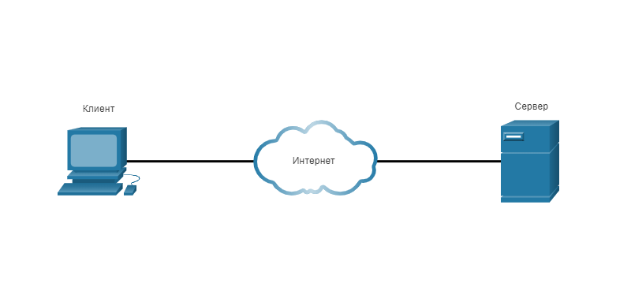
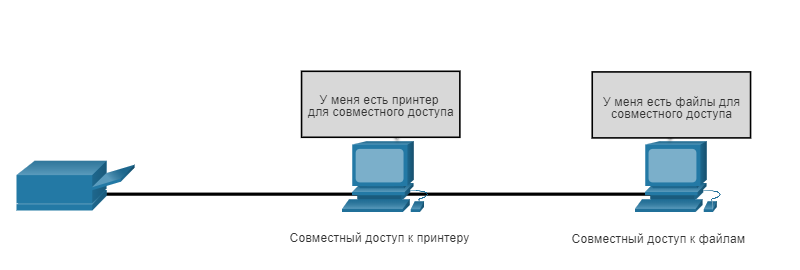
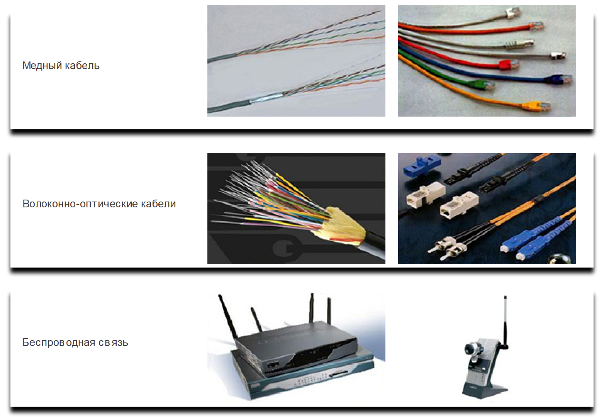
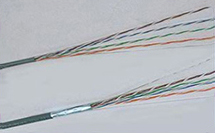
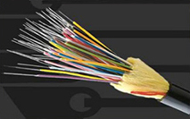
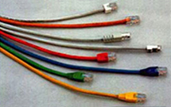

<!-- verified: agorbachev 21.04.2022 -->

# Компоненты сети

<!-- 1.2.1 -->
## Роли узла

Если вы хотите быть частью глобального интернет-сообщества, ваш компьютер, планшет или смартфон сначала должны быть подключены к сети. Эта сеть должна быть подключена к Интернету. В этом разделе рассматриваются части сети. Посмотрите, распознаете ли вы эти компоненты в вашей собственной домашней или школьной сети!

Все компьютеры, подключенные к сети и непосредственно участвующие в сетевом взаимодействии, считаются узлами или хостами. Узлы также называют оконечными устройствами. Некоторые хосты также называются клиентами. Однако термин «хосты» конкретно относится к устройствам в сети, которым присвоен номер для целей связи. Этот номер идентифицирует узел в определенной сети. Этот номер называется IP-адресом. IP-адрес определяет хост и сеть, к которой подключен хост.

Серверы — это компьютеры с установленным программным обеспечением, позволяющим предоставлять данные (например, доступ к электронной почте или веб-страницам) другим оконечным устройствам в сети. Для работы каждой службы необходимо отдельное серверное программное обеспечение. Например, для работы веб-служб в сети на узле должно быть установлено ПО веб-сервера. Компьютер с серверным программным обеспечением может одновременно обслуживать одного или несколько клиентов.

Как упоминалось ранее, клиенты являются типом хоста. Клиенты имеют программное обеспечение для запроса и отображения информации, полученной с сервера, как показано на рисунке.

<!-- /courses/itn-dl/aeec9260-34fa-11eb-ad9a-f74babed41a6/af1e29b0-34fa-11eb-ad9a-f74babed41a6/assets/2d8351d2-1c25-11ea-81a0-ffc2c49b96bc.svg -->

<!--
клиентский компьютер и сервер, подключенный через облако, символизирующее Интернет
-->

Примером клиентского программного обеспечения является веб-браузер, например Chrome или FireFox. Кроме того, на одном компьютере можно запускать несколько типов клиентского программного обеспечения. Например, у пользователя есть возможность проверять электронную почту, просматривать веб-страницы, обмениваться мгновенными сообщениями и слушать аудиопоток. В таблице перечислены три распространенных типа серверного программного обеспечения.

| Тип | Описание |
| --- | --- |
| Эл. почта | На сервере электронной почты выполняется серверное ПО электронной почты. Клиенты используют почтовое ПО, такое как Microsoft Outlook, для получения доступа к почте на сервере. |
| Интернет | На веб-сервере запущено серверное ПО. Клиенты используют браузерное программное обеспечение, такое как Windows Internet Explorer, для получения доступа к веб-страницам на сервере. |
| Файл | На файловом сервере в центральном пункте хранятся корпоративные и пользовательские файлы. Клиентские устройства получают доступ к этим файлам с помощью клиентского ПО, такого как Windows Explorer. |

<!-- 1.2.2 -->
## Одноранговые сети

Обычно клиентское и серверное программное обеспечение запускается на разных компьютерах, но эти роли может играть и один компьютер. В небольших корпоративных и домашних сетях многие компьютеры работают и как серверы, и как клиенты. Такие сети называются одноранговыми.

<!-- /courses/itn-dl/aeec9260-34fa-11eb-ad9a-f74babed41a6/af1e29b0-34fa-11eb-ad9a-f74babed41a6/assets/2d83c700-1c25-11ea-81a0-ffc2c49b96bc.svg -->

Изображение представляет собой небольшую одноранговую сеть с принтером слева, соединенным с точкой совместного доступа к печати в середине и соединенным с точкой обмена файлами справа. Под топологией идет список достоинств и недостатков одноранговой сети. Достоинства: одноранговая сеть проста в настройке, имеет менее сложную структуру, требует меньше затрат, поскольку сетевые устройства и выделенные серверы могут не понадобиться, и может использоваться для решения простых задач, таких как передача файлов и совместное использование принтеров. Недостатки: одноранговая сеть не имеет централизованного администрирования, не обладает масштабируемостью, у нее низкий уровень безопасности, все устройства могут одновременно выполнять функции и клиентов и серверов, что приводит к снижению их быстродействия.

Преимущества одноранговой сети:

* Легкость установки
* Менее запутанно
* Сокращение расходов (поскольку сетевые устройства и выделенные серверы могут не потребоваться)
* Возможность использовать для простых задач, таких как передача файлов и совместное использование принтеров.

Недостатки одноранговой сети:

* Нет централизованного управления
* Не вполне безопасна
* Не масштабируется
* Все устройства могут выступать как в качестве клиента, так и сервера, что может замедлить их работу.

<!-- 1.2.3 -->
## Оконечные устройства

Сетевые устройства, с которыми пользователи знакомы лучше всего - это оконечные устройства. Каждому оконечному устройству в сети назначается адрес, чтобы устройства можно было отличить. Если оконечное устройство инициирует обмен данными, то в качестве получателя сообщения оно использует адрес оконечного устройства назначения.

Оконечное устройство является либо отправителем (источником), либо получателем (адресатом) сообщения, передаваемого по сети.

Топология физической сети показывает локальную сеть с двумя пользователями: IP-телефон, компьютер и сервер, подключенный к коммутатору. Физический канал соединяет коммутатор LAN с пограничным маршрутизатором, который соединяет локальную сеть и межсетевую сеть. Межсетевая сеть состоит из четырех маршрутизаторов, соединенных в топологии полной сети. Граничный маршрутизатор объединяет межсетевую сеть и вторую локальную сеть, которая также состоит из двух пользователей: IP-телефона, ПК и сервера. При запуске анимации сообщение исходит от одного из пользователей первой локальной сети и отправляется от пользователя, к коммутатору и к пограничному маршрутизатору, который граничит с сетью. В межсетевом пространстве сообщение направляется на другой маршрутизатор, который граничит со второй локальной сетью. Сообщение пересылается во вторую локальную сеть через коммутатор и конечному пользователю назначения. Текст под изображением гласит: данные отправляются из одного оконечного устройства, проходят по сети и поступают на другое оконечное устройство.

<!-- 1.2.4 -->
## Промежуточные устройства

Промежуточные устройства подключают отдельные конечные устройства к сети. Они могут подключить несколько отдельных сетей и создать объединенную сеть. Такие устройства обеспечивают подключение и прохождение потоков данных по сети.

Для определения пути передачи сообщения промежуточные устройства используют адрес оконечного устройства назначения в сочетании с информацией о связях в сети. Примеры распространенных промежуточных устройств и перечень их функций показаны на рисунке.

<!-- /courses/itn-dl/aeec9260-34fa-11eb-ad9a-f74babed41a6/af1e29b0-34fa-11eb-ad9a-f74babed41a6/assets/2d846342-1c25-11ea-81a0-ffc2c49b96bc.svg -->

На рисунке показаны символы пяти распространенных промежуточных устройств и описаны некоторые их функции. В верхней части находится беспроводной маршрутизатор, коммутатор локальной сети и маршрутизатор. Ниже приведен коммутатор и устройство брандмауэра. Промежуточные сетевые устройства выполняют некоторые или все из следующих функций: воссоздание и ретрансляция сигналов данных; предоставление информации о том, какие пути существуют в сети и сетевой инфраструктуре; уведомление других устройств об ошибках и нарушениях связи; направление данных по другим путям при разрыве канала связи; классификация и направление сообщений в соответствии с приоритетами; разрешение или запрет передачи данных в зависимости от настроек безопасности. Примечание. Не показан устаревший концентратор Ethernet. Концентратор Ethernet также называют многопортовым ретранслятором. Ретрансляторы регенерируют и ретранслируют сигналы связи. Обратите внимание, что все промежуточные устройства выполняют функцию ретранслятора.
Промежуточные сетевые устройства выполняют некоторые из этих функций или сразу все.

* Ретрансляторы регенерируют и ретранслируют сигналы связи.
* Сохранение информации о существующих путях в сети и между сетями.
* Уведомление других устройств об ошибках и сбоях в процессе коммуникации.
* Направление данных по альтернативному маршруту при выходе канала из строя.
* Классификация и направление сообщений согласно приоритетам.
* Разрешение или запрет потока данных в зависимости от настроек безопасности.

**Примечание:** Не показан устаревший концентратор Ethernet. Концентратор Ethernet также называют многопортовым ретранслятором. Ретрансляторы регенерируют и ретранслируют сигналы связи. Обратите внимание, что все промежуточные устройства выполняют функцию ретранслятора.

<!-- 1.2.5 -->
## Средства сетевого подключения

Коммуникация передается по среде передачи данных. Среда передачи данных предоставляет собой канал, по которому сообщение передается от источника к адресату.

Современные сети используют в первую очередь три типа носителей для соединения устройств, как показано на рисунке:

* **Металлические провода в кабелях**  — данные кодируются в электрические импульсы.
* **Стеклянные или пластиковые волокна (оптоволоконный кабель)** — данные кодируются в световые импульсы.
* **Беспроводная передача** - Данные кодируются посредством модуляции конкретных частот электромагнитных волн.

<!-- 
/courses/itn-dl/aeec9260-34fa-11eb-ad9a-f74babed41a6/af1e29b0-34fa-11eb-ad9a-f74babed41a6/assets/2d84d873-1c25-11ea-81a0-ffc2c49b96bc.svg -->

Критерии выбора средства подключения.

* На какое максимальное расстояние средcтва подключения способны передавать сигнал?
* В какой среде будут установлены носители?
* Какие объемы данных будут передаваться по этой среде и с какой скоростью?
* Какова стоимость средства подключения и его установки?

Существуют три образа распространенных отвечающих критериям сетевых носителей, которые следует использовать при выборе сетевых носителей. На верхнем изображении показаны провода витой пары и разъемы, используемые с медными носителями. Среднее изображение представляет собой многожильный волоконно-оптический кабель и волоконно-оптические разъемы. Нижнее изображение показывает беспроводные устройства, включая маршрутизатор и камеру. Критерии, которые следует учитывать при выборе сетевых носителей: каково максимальное расстояние, на которое носители могут успешно переносить сигнал? В какой среде будут установлены носители? Какие объемы данных будут передаваться по этой среде и с какой скоростью? Какова стоимость средства подключения и его установки?

| Медный кабель | Волоконно-оптические кабели | Беспроводная связь |
| --- | --- | --- |
|  |  |  |
|  |  |  |
<!-- 1.2.6 -->
<!-- quiz -->

