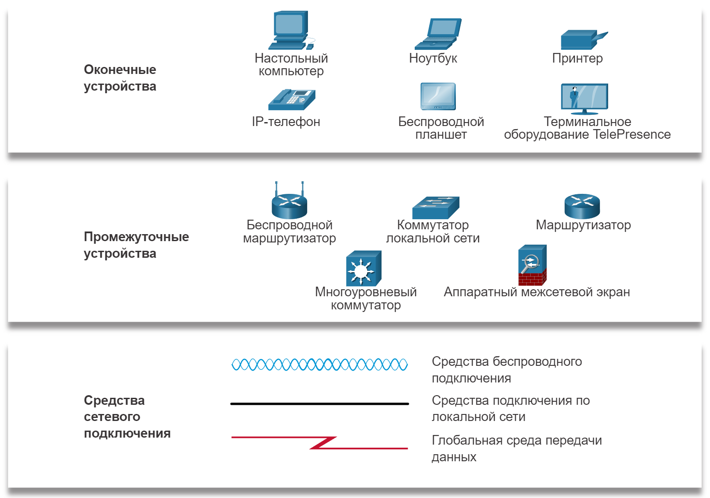

<!-- verified: agorbachev 21.04.2022 -->

# Представления и топологии сетей

<!-- 1.3.1 -->
## Представления сети

Сетевые архитекторы и администраторы должны уметь показать, как будут выглядеть их сети. Они должны иметь возможность легко видеть, какие компоненты подключаются к другим компонентам, где они будут расположены и как они будут подключены. Для представления различных устройств и каналов, из которых состоит сеть, на схемах сетей часто используются символы, такие как на рисунке.

<!-- /courses/itn-dl/aeec9260-34fa-11eb-ad9a-f74babed41a6/af1e29b2-34fa-11eb-ad9a-f74babed41a6/assets/2d86d442-1c25-11ea-81a0-ffc2c49b96bc.svg -->

Изображение показывает символы, используемые в схемах сети. Вверху находятся следующие конечные устройства: настольный компьютер, ноутбук, принтер, IP-телефон, беспроводной стол и конечная точка TelePresence. Посередине находятся следующие промежуточные устройства: беспроводной маршрутизатор, коммутатор локальной сети, маршрутизатор, многоуровневый коммутатор и устройство межсетевого экрана.  Внизу расположены следующие сетевые средства массовой информации: синие волны, изображающие беспроводные носители, сплошная черная линия, изображающая носители локальной сети, и красный световой болт, изображающий носители глобальной сети.

Схема обеспечивает наглядный способ понимания, каким образом устройства в большой сети связаны между собой. Этот тип изображения сети называется схемой топологии. Способность понимать логические представления физических сетевых компонентов имеет критическое значение в визуализации организации и функционирования сети.

В дополнение к этим представлениям используется специальная терминология для описания того, как каждое из этих устройств и носители соединяются друг с другом:

* **Сетевые интерфейсные платы (Network Interface Card, NIC)** служат для подключения устройства к сети.
* **Физический порт** — разъем на сетевом устройстве, через который кабели подключены к компьютеру или другому сетевому устройству.
* **Интерфейс** — специализированные порты в сетевом устройстве, которые подключаются к отдельным сетям. Поскольку маршрутизаторы используются для связывания сетей, порты маршрутизатора называются сетевыми интерфейсами.

**Примечание**: Термины «порт» и «интерфейс» часто взаимозаменяемы.

<!-- 1.3.2 -->
## Топологические схемы

Диаграммы топологии являются обязательной документацией для всех, кто работает с сетью. Они представляют визуальную карту соединений в сети. Существует два типа топологических диаграмм: физические и логические.

**Диаграмма физической топологии**

Схемы физической топологии — физическое расположение промежуточных устройств и кабельных линий. Можно видеть, что комнаты, в которых расположены эти устройства, помечены в этой физической топологии.

<!-- /courses/itn-dl/aeec9260-34fa-11eb-ad9a-f74babed41a6/af1e29b2-34fa-11eb-ad9a-f74babed41a6/assets/2d879792-1c25-11ea-81a0-ffc2c49b96bc.svg -->

Топология физической сети показывает шесть комнат, каждая из которых выделена светло-желтым прямоугольником, с различными сетевыми устройствами и кабелями.  С левой стороны находится серверная комната с надписью комната 2158.  Он содержит маршрутизатор с маркировкой R1, установленный на полке 1 стойки 1 с шестью кабельными соединениями.  Кабель в верхней части подключается к облаку с надписью Интернет.  Кабель слева подключается к коммутатору с надписью S1, установленному на полке 2 стойки 1.  S1 подключен к трем серверам: веб-серверу, установленному на полке 1 стойки 2, почтовому серверу, установленному на полке 2 стойки, и файловому серверу, установленному на полке 3 стойки 2. Кабель, подключенный к нижней части R1, подключается к коммутатору с полотчатой S2 установлен на стойке 1 полка 3.  S2 имеет два соединения, ведущие к принтеру и ПК в ИТ-офисе с пометкой комната 2159.  R1 имеет три кабеля справа, подключенных к трем коммутаторам, расположенным в комнате 2124.  Верхний коммутатор имеет маркировку S3 и установлен на полке 1 стойки 1.  Средний коммутатор имеет маркировку S4 и установлен на стойке 1 полке 2.  Нижний коммутатор имеет маркировку S5 и установлен на полке 1 стойки 3.  S3 имеет кабель слева, подключенный к ноутбуку в комнате, помеченной как класс 1 комната 2125.  S4 имеет кабель слева, подключенный к ноутбуку в комнате, помеченной как класс 2, комната 2126.  S5 имеет кабель слева, подключенный к ноутбуку в комнате, помеченной как класс 3 комната 2127.

**Диаграмма логической топологии**

Диаграмма логической топологии иллюстрирует устройства, порты и схему адресации сети, как показано на рисунке. Вы можете увидеть, какие конечные устройства подключены к каким промежуточным устройствам и какие носители используются.

<!-- /courses/itn-dl/aeec9260-34fa-11eb-ad9a-f74babed41a6/af1e29b2-34fa-11eb-ad9a-f74babed41a6/assets/2d880cc0-1c25-11ea-81a0-ffc2c49b96bc.svg -->

Топология логической сети показывает устройства, метки портов и схему сетевой адресации.  В середине изображения находится маршрутизатор с надписью R1.  Порт с надписью G0/0 подключается к облаку в верхней части помеченного как Интернет.  Порт с надписью G0/1 подключается слева к коммутатору с надписью S1 на порту G0/1.  S1 подключен к трем серверам.  S1 и серверы выделены светло-желтым кругом с надписью 192.168.10.0 сверху.  Порт F0/1 на S1 подключается к веб-серверу.  Порт F0/2 на S1 подключается к почтовому серверу.  Порт F0/3 на S1 подключается к файловому серверу.  Порт F0/1 на R1 подключается внизу к коммутатору с надписью S2.  S2 подключается к принтеру и ПК, все из которых выделены в светло-желтый круг с сетью 192.168.11.0, написанной внизу.  Слева от R1 расположены три дополнительных соединения, каждое из которых подключается к коммутатору на порту G0/1, который затем подключается к ноутбуку на порту F0/1. Каждый коммутатор и ноутбук выделены желтым цветом и отображается сетевой адрес.  Порт G0/0 R1 подключается вверху к коммутатору S3 в сети 192.168.100.0.  Порт G1/1 R1 соединяется посередине с коммутатором S4 в сети 192.169.101.0.  Порт G1/2 на R1 подключается внизу к коммутатору с надписью S5 в сети 192.168.102.0.

На данном этапе курса вам достаточно знать о топологиях, показанных на схемах физической и логической топологии. Более сложные примеры вы можете найти в Интернете по запросу «схемы сетевой топологии». Если вы добавите слово «Cisco» в поисковую фразу, вы найдете множество топологий с использованием значков, которые похожи на те, что вы видели на этих рисунках.

<!-- 1.3.3 -->
<!-- quiz -->

