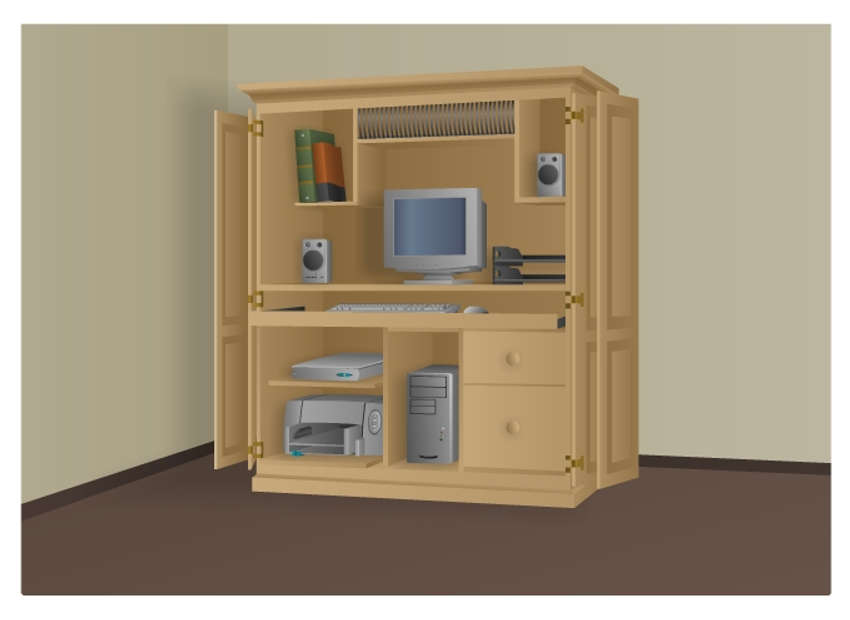
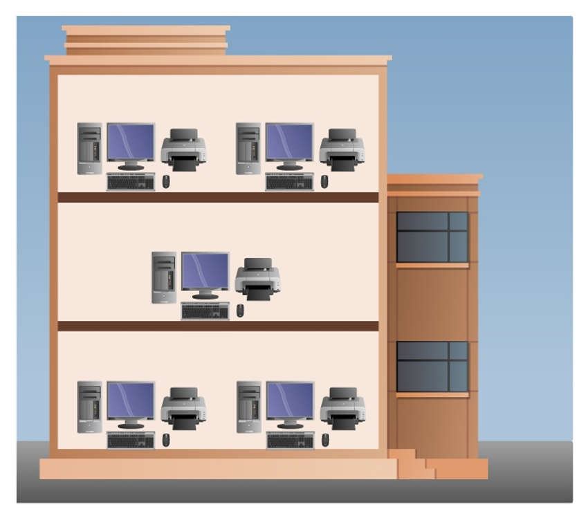
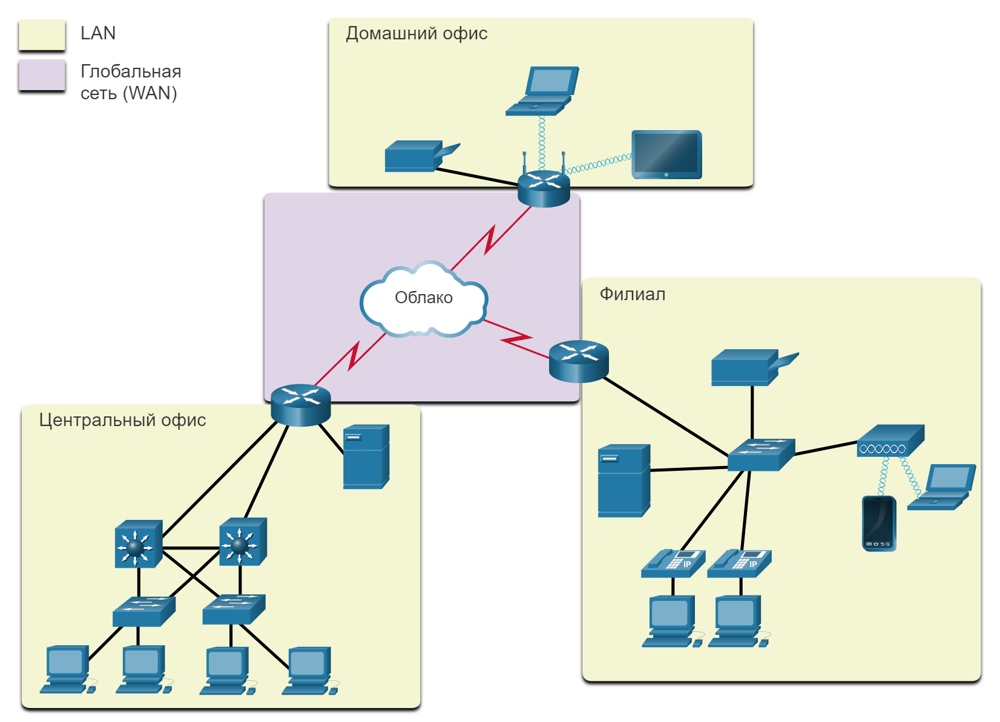

<!-- verified: agorbachev 03.05.2022 -->

<!-- 1.4.1 -->
## Сети различного размера

Теперь, когда вы знакомы с компонентами, составляющими сети, и их представлениями в физических и логических топологиях, вы можете узнать о различных типах сетей.

Сети могут быть любого размера, начиная с простых сетей из двух компьютеров и заканчивая системами, соединяющими миллионы устройств.

Простые домашние сети позволяют обмениваться ресурсами, такими как принтеры, документы, изображения и музыка, между несколькими локальными конечными устройствами.

Сети малого офиса и домашнего офиса (SOHO) позволяют людям работать из дома или из удаленного офиса. Многие индивидуальные предприниматели используют эти типы сетей для рекламы и продажи продуктов, заказа расходных материалов и общения с клиентами.

На предприятиях и в крупных организациях используются более крупные сети, чтобы сотрудники могли собирать, хранить и получать информацию на сетевых серверах. Сети позволяют наладить связь через электронную почту, мгновенный обмен сообщениями, а также с помощью инструментов совместной работы. Многие организации используют подключение своей сети к Интернету для предоставления продуктов и услуг клиентам.

На сегодняшний день Интернет является крупнейшей сетью мира. На самом деле понятие «Интернет» означает «сеть всех сетей». Интернет буквально представляет собой объединение подключенных друг к другу частных и общедоступных сетей.

В небольших корпоративных и домашних сетях многие компьютеры работают и как серверы, и как клиенты. Такие сети называются одноранговыми.

**Небольшие домашние сети**

Небольшие домашние сети обеспечивают связь нескольких компьютеров между собой и выход в Интернет.

**Небольшие домашние/офисные сети**

Небольшие домашние или офисные сети (SOHO) позволяют подключаться к корпоративной сети или получать доступ к централизованным и совместно используемым ресурсам из дома или удаленного офиса.

**Средние и крупные сети**

Средние и крупные сети, например, используемые корпорациями или образовательными учреждениями, могут связывать множество местоположений с сотнями или тысячами хостов.

**Глобальные сети**

Глобальная электронная сеть Интернет является сетью сетей, связывающей миллионы компьютеров по всему миру.

<!-- /courses/itn-dl/aeec9260-34fa-11eb-ad9a-f74babed41a6/af1e50c0-34fa-11eb-ad9a-f74babed41a6/assets/2d8ca0a1-1c25-11ea-81a0-ffc2c49b96bc.svg -->

<!-- 1.4.2 -->
## Сети LAN и WAN

Сетевые инфраструктуры могут значительно отличаться по следующим критериям.

* Площадь покрытия
* Количество подключенных пользователей
* Количество и типы доступных служб
* Область ответственности

Двумя наиболее распространенными типами сетевых инфраструктур являются локальные сети (LAN) и глобальные сети (WAN). LAN - это сетевая инфраструктура, которая обеспечивает доступ пользователям и конечным устройствам в небольшой географической зоне. Обычно локальная сеть используется в подразделении предприятия, дома или сети малого бизнеса. Глобальная сеть (WAN) -— сетевая инфраструктура, предоставляющая доступ к другим сетям на большой территории; обычно принадлежит большим корпорациям или провайдерам телекоммуникационных услуг и находится под их управлением. На рисунке показаны локальные сети, подключенные к глобальной сети.

<!-- /courses/itn-dl/aeec9260-34fa-11eb-ad9a-f74babed41a6/af1e50c0-34fa-11eb-ad9a-f74babed41a6/assets/2d8cc7b3-1c25-11ea-81a0-ffc2c49b96bc.svg -->

В топологии сети показаны три LAN, подключенные по каналу глобальной сети в центре. Легенда показывает, что LAN выделены желтым цветом, а WAN - светло-фиолетовым.  WAN находится в центре схемы. Он содержит символ облака, обозначенный облаком с красными WAN соединениями с тремя маршрутизаторами.  Каждый маршрутизатор находится частично в глобальной сети, а частично в локальной сети. В левом нижнем углу находится центральная локальная сеть LAN.  Он содержит сервер, два многоуровневых коммутатора, два коммутатора LAN и четыре компьютера. В правом нижнем углу находится LAN Филиала.  Он содержит коммутатор, сервер, принтер, два IP-телефона, подключенных к ПК, и беспроводную точку доступа с беспроводными подключениями к ноутбуку и смартфону. В правом верхнем углу находится LAN домашнего офиса.  Он содержит беспроводной маршрутизатор с проводным подключением к принтеру и беспроводные подключения к ноутбуку и монитору.

**LAN**

Сети LAN - сетевая инфраструктура, которая охватывает небольшую территорию. Особенности LAN:

* Сети LAN связывают оконечные устройства в ограниченной области, например в доме, школе, офисном здании или комплексе зданий.
* Сети LAN обычно администрирует одна организация или частное лицо. Административный контроль осуществляется на уровне сети и управляет политиками безопасности и контроля доступа.
* Как показано на рисунке, сети LAN предоставляют высокоскоростной доступ к внутренним оконечным и промежуточным устройствам.

<!-- /courses/itn-dl/aeec9260-34fa-11eb-ad9a-f74babed41a6/af1e50c0-34fa-11eb-ad9a-f74babed41a6/assets/2d8d15d1-1c25-11ea-81a0-ffc2c49b96bc.svg -->

Диаграмма представляет собой иллюстрацию локальной сети. В центре схемы находится коммутатор. На коммутаторе имеется четыре подключения Ethernet. В левом верхнем углу находится подключение к ПК. Ниже подключение к компьютеру за столом работника. Ниже другое подключение к компьютеру за столом работника. В левом нижнем углу находится подключение к IP-телефону. Справа от коммутатора находится подключение к серверу. 
Сеть, обслуживающая квартиру, небольшое здание или небольшой комплекс зданий, считается локальной сетью (LAN).

**WAN**

На рисунке показана глобальная сеть, которая соединяет две локальные сети. Глобальная сеть — это сетевая инфраструктура, которая охватывает обширную территорию. Глобальными сетями обычно управляют операторы связи (SP) или Интернет-провайдеры (ISP).

Особенности WAN:

* Сети WAN связывают локальные сети в обширных географических областях, таких как города, штаты, регионы, страны или континенты.
* Управляют глобальными сетями обычно различные операторы связи.
* Сети WAN обычно обеспечивают менее скоростные соединения между локальными сетями.

<!-- /courses/itn-dl/aeec9260-34fa-11eb-ad9a-f74babed41a6/af1e50c0-34fa-11eb-ad9a-f74babed41a6/assets/2d8d3ce0-1c25-11ea-81a0-ffc2c49b96bc.svg -->

На рисунке показаны две ветви LAN, подключенные через канал WAN. Обе локальные сети выделены светло-желтым полем и состоят из центрального коммутатора, подключенного к трем компьютерам, IP-телефона, сервера и маршрутизатора. Два маршрутизатора подключены через красный канал WAN. Слева — ветвь 1 LAN, а справа — ветвь 2 LAN.

<!-- 1.4.3 -->
## Интернет

Интернет — это объединение взаимосвязанных сетей в мировом масштабе. На данном рисунке Интернет показан как объединение подключенных друг к другу сетей LAN и WAN.

<!-- /courses/itn-dl/aeec9260-34fa-11eb-ad9a-f74babed41a6/af1e50c0-34fa-11eb-ad9a-f74babed41a6/assets/2d8d63f3-1c25-11ea-81a0-ffc2c49b96bc.svg -->

На рисунке сети LAN используют сервисы WAN для соединения друг с другом. Пять многоуровневых коммутаторов с избыточными связями отображаются внутри большого облака.  Вокруг края облака расположены семь маршрутизаторов, подключенных к различным локальным сетям.  Существует больничная LAN, школьная LAN, бизнес-LAN, государственная LAN и три домашних LAN. Сети LAN используют сервисы WAN для соединения друг с другом.

Некоторые сети LAN в примере подключены друг к другу через сеть WAN. Затем глобальные сети соединяются между собой. Красные линии соединения глобальных сетей отображают все многообразие способов подключения сетей. Глобальные сети могут соединяться друг с другом посредством медных проводов, оптоволоконного кабеля и беспроводной передачи данных (на рисунке не показана).

Интернет не принадлежит какому-либо лицу или группе людей. Обеспечение эффективного общения с помощью такой разнообразной инфраструктуры требует применения последовательных и общепризнанных технологий и стандартов, а также совместной работы многих учреждений, администрирующих сети. Существуют организации, которые были разработаны для поддержки структуры и стандартизации интернет-протоколов и процессов. Эти организации включают в себя Инженерную группу по развитию Интернета (Internet Engineering Task Force, IETF), Ассоциацию по присвоению имен и номеров портов (International Corporation for Assigned Names and Numbers, ICANN) и Совет по архитектуре сети Интернет (Internet Architecture Board, IAB), а также многие другие.

<!-- 1.4.4 -->
## Внутренние сети и внешние сети

Есть два других термина, которые похожи на термин Интернет: интранет и экстранет.

Термин «Интранет» обозначает частные сети LAN и WAN, принадлежащие конкретной организации. Доступ к Интранету имеется только у членов и сотрудников организации, а также у других лиц с надлежащими полномочиями.

Организация может использовать Экстранет для защищенного и безопасного доступа сотрудников, которые работают в других организациях, но которым необходим доступ к данным компании. Вот несколько примеров экстранета:

* Компания, предоставляющая доступ внешним поставщикам или подрядчикам.
* Больница, где используется система записи к врачам, которые имеют возможность назначать дату приема пациентов.
* Местное управление образования, предоставляющее школам своего района данные о размере бюджета и кадрах.

На рисунке показаны уровни доступа различных групп к интрасети компании, экстрасети компании и Интернету.

<!-- /courses/itn-dl/aeec9260-34fa-11eb-ad9a-f74babed41a6/af1e50c0-34fa-11eb-ad9a-f74babed41a6/assets/2d8db213-1c25-11ea-81a0-ffc2c49b96bc.svg -->

<!-- 1.4.5 -->
<!-- quiz -->