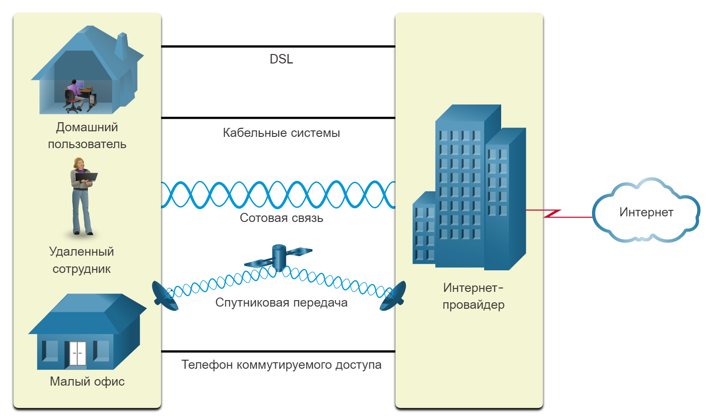
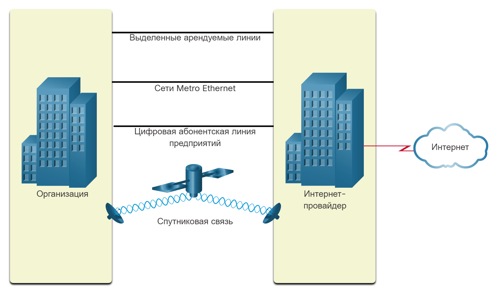

<!-- verified: agorbachev 21.04.2022 -->

# Подключение к Интернету

<!-- 1.5.1 -->
## Технологии доступа в Интернет

Итак, теперь у вас есть базовое понимание компонентов сети и различных типов сетей. Но как на самом деле подключить пользователей и организации к Интернету? Как вы, возможно, догадались, есть много разных способов сделать это.

Домашние пользователи, удаленные сотрудники компаний и малые офисы, как правило, для доступа в Интернет нуждаются в подключении к поставщикам услуг Интернета (ISP). Варианты подключения существенно меняются в зависимости от интернет-провайдера и географического местоположения. Однако популярные варианты включают в себя широкополосную кабельную сеть, широкополосную цифровую абонентскую линию (DSL), беспроводные глобальные сети и мобильные сервисы.

Организациям обычно нужен доступ к другим корпоративным узлам и Интернету. Для бизнес-сервисов, в том числе веб-конференций, IP-телефонов, центров обработки и хранения данных требуются быстрые соединения. ISP часто предлагают межфирменные соединения бизнес-класса. Популярные услуги бизнес-класса включают DSL, арендуемые линии и сеть Metro Ethernet.

<!-- 1.5.2 -->
## Интернет-подключение для дома и небольшого офиса

На рисунке показаны стандартные варианты подключения малых и домашних офисов.

<!-- /courses/itn-dl/aeec9260-34fa-11eb-ad9a-f74babed41a6/af1e50c2-34fa-11eb-ad9a-f74babed41a6/assets/2d8f86d2-1c25-11ea-81a0-ffc2c49b96bc.svg -->

<!--
стандартные варианты подключения малых и домашних офисов
-->

* **Кабельное подключение**  — обычно предлагают поставщики услуг кабельного телевидения. Данные передаются по тому же кабелю, который используется для передачи сигналов кабельного телевидения. Этот способ обеспечивает подключения к Интернету с высокой пропускной способностью и постоянным доступом к сети.
* **DSL**  — цифровая абонентская линия обеспечивает постоянное подключение к Интернету с высокой пропускной способностью. DSL использует телефонные линии связи. Обычно небольшие и домашние офисы используют асимметричные линии DSL (ADSL), в которых данные пользователю передаются с большей скоростью, чем от пользователя.
* **Сотовая связь**  — для доступа в Интернет используется мобильная телефонная сеть. В любой точке, где доступен сигнал сотовой сети, можно получить доступ в Интернет. Производительность будет ограничена возможностями телефона и базовой станции, к которой он подключен.
* **Спутниковая связь** — спутниковые интернет-каналы можно использовать в районах, где нет других способов подключения. Для использования спутниковых антенн необходимо, чтобы спутник находился в зоне прямой видимости.
* **Телефонный коммутируемый доступ** — это экономичный вариант подключения с использованием любой телефонной линии и модема. Низкая пропускная способность коммутируемой линии обычно недостаточна для передачи большого объема данных. Однако такая линия может быть полезна для мобильного доступа в пути.

Способ подключения зависит от географического местоположения пользователей и наличия в регионе оператора связи.

<!-- 1.5.3 -->
## Интернет-подключение для предприятий

Корпоративные варианты подключения отличаются от вариантов для домашнего пользователя. Компании может требоваться более высокая пропускная способность, выделенная линия и управляемые услуги. Доступные варианты подключения зависят от технологий, которые используют операторы связи, находящиеся рядом.

На рисунке показаны стандартные варианты подключения для предприятий.

<!-- /courses/itn-dl/aeec9260-34fa-11eb-ad9a-f74babed41a6/af1e50c2-34fa-11eb-ad9a-f74babed41a6/assets/2d8ffc02-1c25-11ea-81a0-ffc2c49b96bc.svg -->

<!--
типичные варианты подключения для предприятий
-->

* **Выделенная арендованная линия** — арендованные линии представляют собой зарезервированные каналы в сети оператора связи, обеспечивающие связь между географически удаленными офисами для передачи голоса и данных в частной сети. Плата за аренду таких каналов связи обычно взимается ежемесячно или ежегодно.
* **Metro Ethernet** - это иногда называется Ethernet WAN. В этом модуле мы будем называть его Metro Ethernet. Metro Ethernet позволяет расширить технологию доступа к локальной сети на глобальную сеть. О технологии локальных сетей Ethernet вы узнаете из следующих глав.
* **DSL для бизнеса** - корпоративное DSL-подключение доступно в различных форматах. Популярностью пользуются симметричные цифровые абонентские линии (Symmetric Digital Subscriber Lines, SDSL), аналогичные абонентской версии DSL, но обеспечивающие одинаковую скорость при получении и отправке данных.
* **Спутниковая связь** — способна обеспечить соединение при отсутствии проводных решений.

Способ подключения зависит от географического местоположения пользователей и наличия в регионе оператора связи.

<!-- 1.5.4 -->
## Конвергентная сеть

**Традиционные отдельные Сети**

В качестве примера рассмотрим учебное здание, построенное 30 лет назад. В некоторых аудиториях были проложены кабели передачи данных, телефонной сети и телевидения. Эти сети были разрознены, а значит, не могли взаимодействовать друг с другом. Все сети использовали разные технологии для передачи сигнала. В каждой сети для обеспечения успешной связи использовался свой собственный набор правил и стандартов. Несколько сервисов работает в нескольких сетях.

<!-- /courses/itn-dl/aeec9260-34fa-11eb-ad9a-f74babed41a6/af1e50c2-34fa-11eb-ad9a-f74babed41a6/assets/2d909840-1c25-11ea-81a0-ffc2c49b96bc.svg -->

<!--
отдельные компьютерные, телефонные и широковещательные сети
-->

**Конвергентные сети**

Сегодня разрозненные сети данных, телефонные и видео сети объединяются. В отличие от выделенных сетей конвергентные сети позволяют передавать данные, голос и видео между различными типами устройств при использовании одной и той же сетевой инфраструктуры. Сетевая инфраструктура использует одни и те же правила, соглашения и стандарты реализации. Конвергентные сети передачи данных обеспечивают доступ к нескольким сервисам в рамках одной сети.

<!-- /courses/itn-dl/aeec9260-34fa-11eb-ad9a-f74babed41a6/af1e50c2-34fa-11eb-ad9a-f74babed41a6/assets/2d913481-1c25-11ea-81a0-ffc2c49b96bc.svg -->

<!--
Конвергентные сети передачи данных обеспечивают доступ к нескольким сервисам в рамках одной сети.
-->

<!-- 1.5.5 -->
## Packet Tracer. Представление сети

В этом задании вы подробно узнаете о том, как использовать программу Packet Tracer в качестве средства моделирования представлений сети.

[Открыть описание в PDF](./assets/1.5.7-packet-tracer---network-representation_ru-RU.pdf)

[Скачать файл для Packet Tracer](./assets/1.5.7-packet-tracer---network-representation_ru-RU.pka)
