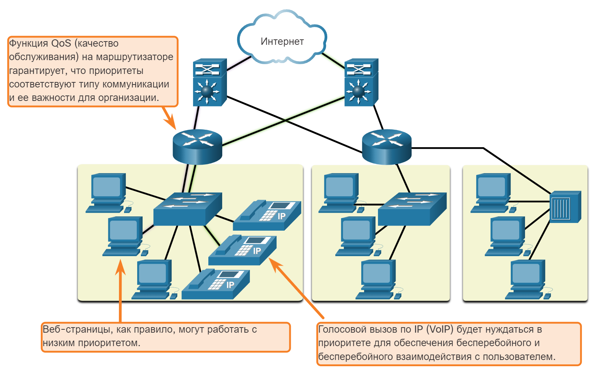

<!-- verified: agorbachev 03.05.2022 -->

<!-- 1.6.1 -->
## Сетевая архитектура

Вы когда-нибудь были заняты работой в Интернете, только чтобы «отключить интернет»? Как вы знаете, к настоящему времени интернет не вышел из строя, вы просто потеряли связь с ним. Это очень расстраивает. Поскольку так много людей в мире полагаются на доступ к сети, чтобы работать и учиться, очень важно, чтобы сети были надежными. В этом контексте надежность означает больше, чем ваше подключение к Интернету. В этом разделе рассматриваются четыре аспекта надежности сети.

Роль сети изменилась. Сеть, используемая только для передачи данных, превратилась в систему, которая соединяет пользователей и устройства, а также передает информацию в конвергентной сетевой среде. Чтобы сеть могла эффективно работать и развиваться в такой среде, необходимо использовать стандартную сетевую архитектуру.

Сети также поддерживают широкий спектр приложений и услуг. Они должны работать по многим различным типам кабелей и устройств, которые составляют физическую инфраструктуру. Термин «сетевая архитектура» в этом контексте относится к технологиям, которые поддерживают инфраструктуру, а также к запрограммированным услугам и правилам или протоколам, которые служат для передачи данных в сети.

По мере развития сетей мы узнали, что существует четыре основных характеристики, которые должны учитывать сетевые архитекторы для удовлетворения ожиданий пользователей:

* Отказоустойчивость
* Масштабируемость
* Качество обслуживания (QoS)
* Безопасность

<!-- 1.6.2 -->
## Отказоустойчивость

Отказоустойчивая сеть - это сеть, которая ограничивает количество уязвимых устройств во время сбоя. Она также построена так, чтобы быстро восстанавливаться при возникновении отказа. Эти сети используют несколько путей передачи данных от источника к месту назначения. Если один путь недоступен, сообщения можно немедленно отправить по другой линии связи. Наличие нескольких путей к месту назначения называется резервированием.

Реализация сети с коммутацией пакетов является одним из способов обеспечения избыточности надежными сетями. При коммутации пакетов трафик делится на пакеты, которые направляются по сети общего доступа. Такое единое сообщение, как электронное письмо или видеопоток, делится на множество блоков данных, называемых пакетами. Каждый пакет содержит информацию об адресе источника и месте назначения сообщения. Маршрутизаторы в сети коммутируют пакеты в зависимости от текущего состояния сети. Это значит, что пакеты данных одного сообщения могут идти к месту назначения различными путями. Как показано на рисунке, динамическое изменение маршрута в случае недоступности канала связи не влияет на пользователя, пользователь этого не замечает.

<!-- /courses/itn-dl/aeec9260-34fa-11eb-ad9a-f74babed41a6/af1e50c4-34fa-11eb-ad9a-f74babed41a6/assets/2d929412-1c25-11ea-81a0-ffc2c49b96bc.svg -->

Топология сети состоит из четырех маршрутизаторов с избыточными каналами. Вверху диаграммы находится облако Интернета с двумя соединениями внизу, каждое из которых ведет к маршрутизатору. Ниже этих маршрутизаторов находится подключение к другому маршрутизатору. Каждый нижний маршрутизатор подключается обратно к обоим маршрутизаторам, которые подключаются к Интернету. Маршрутизатор в левом нижнем углу подключен к коммутатору с тремя настольными компьютерами и тремя IP-телефонами. Маршрутизатор в правом нижнем углу подключен к коммутатору с тремя настольными компьютерами. Верхний левый маршрутизатор имеет красный круг с диагональной линией. Верхний правый маршрутизатор имеет зеленую стрелку, ведущую в Интернет. В текстовом поле написано: избыточные соединения позволяют использовать альтернативные пути в случае сбоя устройства; пользовательский интерфейс не влияет.

<!-- 1.6.3 -->
## Масштабируемость

Масштабируемая сеть быстро расширяется для поддержки новых пользователей и приложений. При этом не ухудшается производительность служб, к которым обращаются существующие пользователи. На рисунке показано, как можно легко добавить новую сеть к существующей. Помимо этого, масштабируемость сетей возможна благодаря тому, что проектировщики следуют принятым стандартам и протоколам. Это позволяет поставщикам программного и аппаратного обеспечения сосредоточиться на улучшении продуктов и услуг без необходимости разрабатывать новый набор правил для работы в сети.

<!-- /courses/itn-dl/aeec9260-34fa-11eb-ad9a-f74babed41a6/af1e50c4-34fa-11eb-ad9a-f74babed41a6/assets/2d92e232-1c25-11ea-81a0-ffc2c49b96bc.svg -->

Топология сети состоит из четырех маршрутизаторов с избыточными связями, включая два подключения к облаку Интернета. Существует три локальных сети, одна из которых была недавно добавлена. Текст внизу: Можно дополнительно подключать к Интернету новых пользователей и даже целые сети без снижения производительности для существующих пользователей.

<!-- 1.6.4 -->
## Качество обслуживания

Современные сети предъявляют все более высокие требования к качеству обслуживания (QoS). Новые веб-приложения, например передача голоса и видео в режиме реального времени, задают более высокие требования к качеству предоставляемых услуг. Приходилось ли вам когда-нибудь смотреть видео с постоянными разрывами и паузами? За счет объединения функций передачи данных, голоса и видео в одной сети QoS становится основным механизмом предотвращения перегрузок сети и надежной доставки контента всем пользователям.

Перегрузка сети возникает, когда спрос на каналы связи превышает возможности сети. Пропускная способность сети измеряется в количестве бит, передаваемых за одну секунду, то есть в битах в секунду (бит/с). При параллельных попытках передачи информации спрос на каналы связи может превышать возможности сети. Это создает перегрузки сети.

Когда объем трафика превышает возможности доставки по сети, устройства помещают пакеты в очередь в памяти и удерживают их до тех пор, пока не будут доступны ресурсы передачи. На рисунке один пользователь запрашивает веб-страницу, а другой совершает телефонный звонок. Благодаря политике QoS маршрутизатор обрабатывает поток данных и голосовой трафик, отдавая приоритет голосовой связи в случае перегрузки сети.

<!-- /courses/itn-dl/aeec9260-34fa-11eb-ad9a-f74babed41a6/af1e50c4-34fa-11eb-ad9a-f74babed41a6/assets/2d930943-1c25-11ea-81a0-ffc2c49b96bc.svg -->

Топология сети с компьютерами и IP-телефонами, подключенными к коммутатору, подключенному к маршрутизатору, который управляет качеством обслуживания путем приоритизации трафика

<!-- 1.6.5 -->
## Безопасность сети

Сетевая инфраструктура, сервисы и данные, которые содержатся в устройствах, подключенных к сетям, представляют собой важные личные и корпоративные активы. Существует два типа проблем безопасности сети, которые необходимо учесть: безопасность сетевой инфраструктуры и безопасность информации.

Обеспечение безопасности инфраструктуры сети включает в себя физическую защиту всех устройств, которые необходимы для сетевых подключений, и предотвращение несанкционированного доступа к установленному на них ПО управления, как показано на рисунке.

<!-- /courses/itn-dl/aeec9260-34fa-11eb-ad9a-f74babed41a6/af1e50c4-34fa-11eb-ad9a-f74babed41a6/assets/2d935763-1c25-11ea-81a0-ffc2c49b96bc.svg -->

Топология сети с ПК и IP-телефонами, подключенными к коммутатору, который подключен к маршрутизатору, который может защитить сеть с помощью программного и аппаратного обеспечения безопасности и путем предотвращения физического доступа к сетевым устройствам.

Сетевые администраторы также должны защищать информацию, содержащуюся в пакетах, передаваемых по сети, и информацию, хранящуюся на устройствах, подключенных к сети. Существует три основных требования для достижения безопасности сети:

* **Конфиденциальность**  — только указанные и авторизованные получатели могут иметь доступ к данным.
* **Целостность**  — гарантия того, что информация не была изменена в процессе передачи от исходного пункта к месту назначения.
* **Доступность**  — своевременный и надежный доступ к данным для авторизованных пользователей.

<!-- 1.6.6 -->
<!-- quiz -->