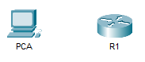

## Топология



## Задачи

Часть 1. Проверка конфигурации маршрутизатора по умолчанию

Часть 2. Настройка и проверка начальной конфигурации маршрутизатора

Часть 3. Сохранение файла текущей конфигурации

## Общие сведения

В этом упражнении вы выполните основные настройки маршрутизатора. Вы обеспечите безопасность доступа к интерфейсу командной строки (CLI) и порту консоли с помощью зашифрованных и открытых паролей. Также вы настроите сообщения для пользователей, входящих в систему маршрутизатора. Эти сообщения служат для предупреждения пользователей о запрете несанкционированного доступа. В завершение вы проверите и сохраните текущую конфигурацию.

## Инструкции

### Часть 1. Проверка конфигурации маршрутизатора по умолчанию

**Шаг 1. Установите подключение к консоли маршрутизатора R1.**

1.  Выберите кабель **Console** (Консольный) из списка доступных подключений.

2.  Нажмите **PCA** и выберите разъем **RS 232**.

3.  Нажмите **R1** и выберите **Console** (Консольный).

4.  Нажмите **PCA**, откройте вкладку **Desktop** (Рабочий стол) и выберите **Terminal** (Терминал).

5.  Нажмите кнопку **OK**, а затем клавишу **ENTER**. Теперь вы можете настроить маршрутизатор **R1**.

**Шаг 2. Войдите в привилегированный режим и проверьте текущую конфигурацию.**

В привилегированном режиме EXEC доступны все команды маршрутизатора. Но поскольку многие привилегированные команды задают рабочие параметры, привилегированный доступ должен быть защищен паролем во избежание несанкционированного использования.

1.  Перейдите в привилегированный режим EXEC, выполнив команду **enable**.

    ```
    Router> enable
    Router#
    ```

    Обратите внимание, что командная строка изменилась, указывая на привилегированный режим EXEC.

2.  Введите команду **show running-config**.

    ```
    Router# show running-config
    ```

    Вопросы:

    Как называется узел маршрутизатора?

    **Введите ваш ответ здесь.**

    Сколько у маршрутизатора интерфейсов Fast Ethernet?

    **Введите ваш ответ здесь.**

    Сколько у маршрутизатора интерфейсов Gigabit Ethernet?

    **Введите ваш ответ здесь.**

    Сколько у маршрутизатора последовательных интерфейсов?

    **Введите ваш ответ здесь.**

    Каков диапазон значений, отображаемых в vty-линиях?

    **Введите ваш ответ здесь.**

3.  Отображает текущее содержимое NVRAM.

    ```
    Router# show startup-config
    startup-config is not present
    ```

    Вопрос: Почему маршрутизатор отвечает сообщением **startup-config is not present** (startup-config отсутствует)?

    **Введите ваш ответ здесь.**

### Часть 2. Настройка и проверка начальной конфигурации маршрутизатора

Для настройки параметров маршрутизатора, возможно, потребуется переключаться между режимами настройки. Обратите внимание, как изменяется командная строка при перемещении через режимы конфигурации IOS.

**Шаг 1. Настройте начальные параметры на маршрутизаторе R1.**

**Примечание.** Если вы не можете запомнить команды, см. содержимое этого раздела. Команды используются те же, что и для настройки коммутатора.

1.  Введите **R1** в качестве имени хоста.

2.  Создайте текст сообщения текущего дня: **Unauthorized access is strictly prohibited** (Несанкционированный доступ строго запрещен).

3.  Зашифруйте все открытые пароли.

    Используйте следующие пароли.

    1.  Привилегированный режим EXEC, незашифрованный: **cisco**

    2.  Привилегированный режим EXEC, зашифрованный: **itsasecret.**

    3.  Консольный режим: **letmein**

**Шаг 2. Проверьте начальные параметры на маршрутизаторе R1.**

1.  Проверьте начальные параметры, просмотрев конфигурацию маршрутизатора R1.

    Вопрос: Какую команду вы будете использовать?

    **Введите ваш ответ здесь.**

2.  Закройте текущий консольный сеанс. Появится сообщение:

    ```
    R1 con0 is now available
    Press RETURN to get started.
    ```

3.  Нажмите клавишу **ENTER**. Отобразится сообщение:

    ```
    Unauthorized access is strictly prohibited.
    User Access Verification
    Password:
    ```

    Вопросы:

    Зачем на всех маршрутизаторах должен быть баннер с сообщением текущего дня (MOTD)?

    **Введите ваш ответ здесь.**

    Если вам не предлагается ввести пароль до того, как вы получите приглашение пользователя EXEC, какую команду консоли вы забыли настроить?

    **Введите ваш ответ здесь.**

4.  Введите пароли, необходимые для возврата в привилегированный режим EXEC.

    Вопросы:

    Почему пароль **enable secret** позволяет перейти в привилегированный режим EXEC, а пароль **enable password** больше не действителен?

    **Введите ваш ответ здесь.**

    Если установить на маршрутизаторе другие пароли, они будут храниться в файле конфигурации в открытом или зашифрованном виде? Дайте пояснение.

    **Введите ваш ответ здесь.**

### Часть 3. Сохранение файла текущей конфигурации

**Шаг 1. Сохраните файл конфигурации в NVRAM.**

1.  Вы настроили исходные параметры маршрутизатора **R1**. Теперь выполните резервное копирование файла конфигурации в NVRAM и убедитесь, что внесенные изменения не были потеряны при перезагрузке системы или отключении питания.

    Вопросы:

    Какую команду нужно ввести, чтобы сохранить конфигурацию в NVRAM?

    **Введите ваш ответ здесь.**

    Какая самая короткая и однозначная версия этой команды?

    **Введите ваш ответ здесь.**

    Какая команда отображает содержимое NVRAM?

    **Введите ваш ответ здесь.**

2.  Убедитесь, что все настроенные параметры записаны. Если нет, проанализируйте вывод и определите, какие команды не были выполнены или были введены неправильно. Вы также можете нажать кнопку **Check Results** в окне с инструкциями.

**Шаг 2. Дополнительно: сохраните файл загрузочной конфигурации во флеш-память.**

Работа с флеш-накопителем маршрутизатора будет подробнее рассмотрена в последующих главах, но сейчас вам будет полезно узнать, что в качестве дополнительной процедуры резервного копирования файл загрузочной конфигурации можно сохранить во флеш-память. По умолчанию маршрутизатор загружает стартовую конфигурацию из NVRAM. Но если память NVRAM будет повреждена, загрузочную конфигурацию можно будет восстановить, скопировав её из флеш-памяти.

Выполните следующие действия, чтобы сохранить загрузочную конфигурацию во флеш-память.

1.  Проверьте содержимое флеш-памяти, выполнив команду **show flash**:

    ```
    R1# show flash
    ```

    Вопросы:

    Сколько файлов хранится во флеш-памяти в данный момент?

    **Введите ваш ответ здесь.**

    Какой из этих файлов, по вашему мнению, является образом IOS?

    **Введите ваш ответ здесь.**

    Почему вы считаете, что этот файл — образ IOS?

    **Введите ваш ответ здесь.**

2.  Сохраните файл загрузочной конфигурации во флеш-память, выполнив следующую команду:

    ```
    R1# copy startup-config flash
    Destination filename [startup-config]
    ```

    Маршрутизатор предложит сохранить файл во флеш-памяти с названием в квадратных скобках. Если вы согласны, нажмите клавишу **ENTER**. Если нет, введите подходящее название и нажмите клавишу **ENTER**.

3.  С помощью команды **show flash** убедитесь, что файл загрузочной конфигурации теперь хранится во флеш-памяти.

[Скачать файл Packet Tracer для локального запуска](./assets/10.1.4-lab.pka)
