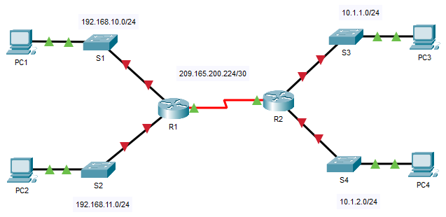

## Топология



## Таблица адресации

| Устройство | Интерфейс    | IP-адрес        | Маска подсети   | Шлюз по умолчанию |
|------------|--------------|-----------------|-----------------|-------------------|
| R1         | G0/0         | 192.168.10.1    | 255.255.255.0   | —                 |
| R1         | G0/1         | 192.168.11.1    | 255.255.255.0   | —                 |
| R1         | S0/0/0 (DCE) | 209.165.200.225 | 255.255.255.252 | —                 |
| R2         | G0/0         | 10.1.1.1        | 255.255.255.0   | —                 |
| R2         | G0/1         | 10.1.2.1        | 255.255.255.0   | —                 |
| R2         | S0/0/0       | 209.165.200.226 | 255.255.255.252 | —                 |
| PC1        | NIC          | 192.168.10.10   | 255.255.255.0   | 192.168.10.1      |
| PC2        | NIC          | 192.168.11.10   | 255.255.255.0   | 192.168.11.1      |
| PC3        | NIC          | 10.1.1.10       | 255.255.255.0   | 10.1.1.1          |
| PC4        | NIC          | 10.1.2.10       | 255.255.255.0   | 10.1.2.1          |

## Задачи

Часть 1. Отображение сведений о маршрутизаторе

Часть 2. Настройка интерфейсов маршрутизатора

Часть 3. Проверка конфигурации

## Общие сведения

В этом упражнении вы будете использовать различные команды **show** для отображения текущего состояния маршрутизатора. Затем вы будете использовать таблицу адресации для настройки интерфейсов Ethernet маршрутизатора. В завершение вы воспользуетесь командами для проверки и тестирования своих конфигураций.

**Примечание.** Маршрутизаторы в этом упражнении уже частично настроены. Некоторые из конфигураций не рассмотрены в данном курсе, но они нужны для того, чтобы помочь вам в использовании команд проверки.

### Часть 1. Отображение сведений о маршрутизаторе

**Шаг 1. Отобразите сведения об интерфейсе на маршрутизаторе R1.**

**Примечание**. Чтобы получить доступ к командной строке, щелкните устройство и откройте вкладку **CLI** (Интерфейс командной строки). Пароль консоли — **cisco**. Пароль привилегированного режима EXEC — **class**.

1.  Какая команда выводит статистику по всем интерфейсам, настроенным на маршрутизаторе?

    **Введите ваш ответ здесь.**

2.  Какая команда выводит сведения только об интерфейсе Serial 0/0/0?

    **Введите ваш ответ здесь.**

3.  Введите команду, чтобы отобразить статистику по интерфейсу Serial 0/0/0 на маршрутизаторе R1, и ответьте на следующие вопросы.

    1.  Какой IP-адрес настроен на маршрутизаторе **R1**?

        **Введите ваш ответ здесь.**

    2.  Какую пропускную способность имеет интерфейс Serial 0/0/0?

        **Введите ваш ответ здесь.**

4.  Введите команду, чтобы отобразить статистику по интерфейсу GigabitEthernet 0/0, и ответьте на следующие вопросы.

    1.  Какой IP-адрес на маршрутизаторе **R1**?

        **Введите ваш ответ здесь.**

    2.  Какой MAC-адрес имеет интерфейс GigabitEthernet 0/0?

        **Введите ваш ответ здесь.**

    3.  Какую пропускную способность (BW) имеет интерфейс GigabitEthernet 0/0?

        **Введите ваш ответ здесь.**

**Шаг 2. Отобразите сводный список интерфейсов маршрутизатора R1.**

1.  Какая команда выводит краткую сводку по текущим интерфейсам, их состояниям и назначенным им IP-адресам?

    **Введите ваш ответ здесь.**

2.  Введите команду на каждом маршрутизаторе и ответьте на следующие вопросы.

    1.  Сколько последовательных интерфейсов на маршрутизаторах **R1** и **R2**?

        **Введите ваш ответ здесь.**

    2.  Сколько интерфейсов Ethernet на маршрутизаторах **R1** и **R2**?

        **Введите ваш ответ здесь.**

3.  Являются ли все интерфейсы Ethernet на маршрутизаторе **R1** одинаковыми? Если ответ «Нет», объясните различия.

    **Введите ваш ответ здесь.**

**Шаг 3. Отобразите таблицу маршрутизации на маршрутизаторе R1.**

1.  Какая команда выводит на экран содержимое таблицы маршрутизации?

    **Введите ваш ответ здесь.**

2.  Введите команду на маршрутизаторе **R1** и ответьте на следующие вопросы.

    1.  Сколько в таблице подключенных маршрутов (имеют код **C**)?

        **Введите ваш ответ здесь.**

    2.  Какой маршрут представлен в списке?

        **Введите ваш ответ здесь.**

    3.  Каким образом маршрутизатор обрабатывает пакет, предназначенный для сети, которая отсутствует в таблице маршрутизации?

        **Введите ваш ответ здесь.**

### Часть 2. Настройка интерфейсов маршрутизатора

**Шаг 1. Настройте интерфейс GigabitEthernet 0/0 на маршрутизаторе R1.**

1.  Введите указанные ниже команды для задания адреса и активирования интерфейса GigabitEthernet 0/0 на маршрутизаторе **R1**.

    ```
    R1(config)# interface gigabitethernet 0/0
    R1(config-if)# ip address 192.168.10.1 255.255.255.0
    R1(config-if)# no shutdown
    %LINK-5-CHANGED: Interface GigabitEthernet0/0, changed state to up
    %LINEPROTO-5-UPDOWN: Line protocol on Interface GigabitEthernet0/0, changed state to up
    ```

2.  Рекомендуется указать описание для каждого интерфейса, что поможет при документировании сведений о сети. Настройте описание интерфейса, указав, к какому устройству он подключен.

    ```
    R1(config-if)# description LAN connection to S1
    ```

3.  **R1** теперь должен иметь возможность пинговать PC1.

    ```
    R1(config-if)# end
    %SYS-5-CONFIG_I: Configured from console by console
    R1# ping 192.168.10.10

    Type escape sequence to abort.
    Sending 5, 100-byte ICMP Echos to 192.168.10.10, timeout is 2 seconds:
    .!!!!
    Success rate is 80 percent (4/5), round-trip min/avg/max = 0/2/8 ms
    ```

**Шаг 2. Настройте остальные интерфейсы Gigabit Ethernet на маршрутизаторах R1 и R2.**

1.  Используя данные из таблицы адресации, завершите настройку интерфейсов на маршрутизаторах **R1** и **R2**. Для каждого интерфейса выполните следующие действия.

    1.  Введите IP-адрес и активируйте интерфейс.

    2.  Введите соответствующее описание.

2.  Проверьте конфигурации интерфейсов.

**Шаг 3. Создайте резервную копию конфигураций в NVRAM.**

Вопрос: Сохраните файлы конфигурации на обоих маршрутизаторах в NVRAM. Какую команду вы использовали?

**Введите ваш ответ здесь.**

### Часть 3. Проверка конфигурации.

**Шаг 1. Проверьте конфигурации интерфейсов с помощью соответствующих команд.**

1.  Выполните команду **show ip interface brief** на маршрутизаторах **R1** и **R2**, чтобы быстро убедиться в том, что интерфейсы имеют правильные IP-адреса и находятся в активном состоянии.

    Вопросы:

    Сколько интерфейсов настроено на маршрутизаторах **R1** и **R2** с IP-адресом и находятся в активном состоянии («up»)?

    **Введите ваш ответ здесь.**

    Какая часть конфигурации интерфейса НЕ отображается в выходных данных команды?

    **Введите ваш ответ здесь.**

    С помощью каких команд можно проверить эту часть конфигурации?

    **Введите ваш ответ здесь.**

2.  Выполните команду **show ip route** на маршрутизаторах **R1** и **R2**, чтобы просмотреть текущие таблицы маршрутизации, и ответьте на следующие вопросы.

    Вопросы:

    1.  Сколько подключенных маршрутов (имеют код **C**) отображается на каждом маршрутизаторе?

        **Введите ваш ответ здесь.**

    2.  Сколько маршрутов OSPF (имеют код **O**) отображается на каждом маршрутизаторе?

        **Введите ваш ответ здесь.**

    3.  Если маршрутизатор содержит данные обо всех маршрутах в сети, тогда количество прямых маршрутов и динамически полученных маршрутов (OSPF) должно равняться общему количеству локальных (LAN) и глобальных (WAN) сетей. Сколько локальных (LAN) и глобальных (WAN) сетей присутствует в топологии?

        **Введите ваш ответ здесь.**

    4.  Соответствует ли это число количеству маршрутов C и O, показанных в таблице маршрутизации?

        **Введите ваш ответ здесь.**

        **Примечание.** Если вы ответили «Нет», значит, вы настроили не все параметры. Пересмотрите шаги в части 2.

**Шаг 2. Проверьте сквозное подключение через сеть.**

Теперь вы должны иметь возможность отправить эхо-запросы на любой ПК с любого ПК в сети. Кроме того, вы должны иметь возможность отправлять эхо-запросы на активные интерфейсы маршрутизаторов. Например, указанные ниже тесты должны быть успешно выполнены.

-   В командной строке на компьютере PC1 отправьте эхо-запрос компьютеру PC4.

-   В командной строке на маршрутизаторе R2 отправьте эхо-запрос компьютеру PC2.

**Примечание.** Чтобы упражнение было проще выполнять, коммутаторы в нем не настроены. Вы не сможете их пинговать.

[Скачать файл Packet Tracer для локального запуска](./assets/10.3.4-lab.pka)
