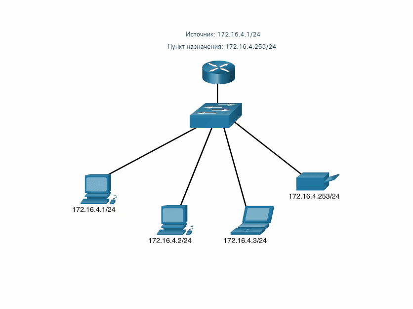

<!-- verified: agorbachev 03.05.2022 -->

<!-- 11.2.1 -->
## Одноадресная рассылка

В предыдущем разделе вы узнали, что в структуре адреса IPv4 есть сетевая часть и часть узла. Отправить пакет с исходного устройства можно разными спомобами, которые влияют на адреса назначения IPv4.

При одноадресной передаче одно устройство отправляющему сообщение другому в режиме «один одному».

Одноадресный пакет имеет IP-адрес назначения, который передается одному получателю. Исходный IP-адрес может быть только одноадресным, так как пакет можно отправить только из одного источника. Не важно, является ли конечный IP-адрес одноадресным, широковещательным или многоадресным.

На анимации показан пример одноадресной рассылки.

**Примечание**: В этом курсе любая коммуникация между устройствами является одноадресной, если не указано иное.

IPv4-адреса узла являются одноадресными и входят в диапазон от 1.1.1.1 до 223.255.255.255. Однако в этом диапазоне есть множество адресов, зарезервированных для особых целей. Такие адреса рассмотрим позже.

<!-- 11.2.2 -->
## Широковещательная рассылка

При широковещательной рассылке одно устройство отправляет сообщение остальным устройствам в сети в режиме «один ко всем».

Пакет широковещательной рассылки содержит IPv4-адрес назначения, в узловой части которого только единицы (1).

**Примечание:** IPv4 использует широковещательные пакеты. Однако, широковещательных пакетов в IPv6 нет.

Широковещательный пакет должен обрабатываться всеми устройствами в одном домене широковещательной рассылки. Домен широковещательной рассылки идентифицирует все узлы в одном  сегменте сети. Есть два типа широковещательной рассылки: прямая и ограниченная. Прямая рассылка передается всем узлам в конкретной сети. Например, узел в сети 172.16.4.0/24 отправляет пакет на адрес 172.16.4.255. Ограниченная широковещательная рассылка отправляется на адрес 255.255.255.255. По умолчанию, маршрутизаторы не пересылают широковещательные рассылки.

На анимации показан пример ограниченной широковещательной рассылки.

Широковещательный пакет использует ресурсы в сети и заставляет каждый принимающий узел обрабатывать этот пакет. Поэтому трафик широковещательной рассылки должен нужно ограничить, чтобы не снижать производительность сети и устройств. Поскольку маршрутизаторы разделяют домены широковещательной рассылки, разделение сетей может повысить производительность благодаря устранению чрезмерного трафика.

**Направленная широковещательная рассылка**

В дополнение к широковещательному адресу 255.255.255.255 для каждой сети существует широковещательный IPv4 адрес, в узловой части которого присутствуют только единицы (1). Например, направленный широковещательный адрес для 192.168.1.0/24 — 192.168.1.255. Этот адрес обеспечивает связь со всеми узлами в сети. Чтобы отправить данные всем хостам в сети, узел может отправить один пакет на широковещательный адрес сети.

Устройство, не подключенное напрямую к сети назначения, осуществляет широковещательную передачу с IP-адресом так же, как и одноадресные IP-пакеты, предназначенные узлу в этой сети. Когда направленный широковещательный пакет достигает маршрутизатора, напрямую подключенного к сети назначения, этот пакет транслируется в сети назначения.

**Примечание**: Из-за действий злоумышленников и проблем с безопасностью направленные широковещательные рассылки по умолчанию отключаются, начиная с Cisco IOS версии 12.0 с командой глобальной конфигурации **no ip directed-broadcasts**.

<!-- 11.2.3 -->
## Многоадресная рассылка

Многоадресная рассылка уменьшает трафик, позволяя узлу отправлять один пакет выбранной группе узлов, подписаных на группу многоадресной рассылки.

Многоадресный пакет — это пакет с IP-адресом назначения для многоадресной рассылки. Для неё в протоколе IPv4 зарезервированы адреса от 224.0.0.0 до 239.255.255.255.

Узлы, которые получают конкретные многоадресные данные, называются клиентами многоадресной рассылки. Они используют сервисы, запрошенные программой клиента для подписки на группу.

Каждая группа многоадресной рассылки представлена одним групповым IPv4-адресом назначения. Когда IPv4-узел подписывается на группу многоадресной рассылки, он обрабатывает пакеты, адресованные на этот групповой адрес и адресованные на его уникальный индивидуальный адрес.

Протоколы маршрутизации, такие как OSPF, используют многоадресную передачу. Например, маршрутизаторы с включенной функцией OSPF взаимодействуют друг с другом, используя зарезервированный адрес многоадресной рассылки OSPF 224.0.0.5. Только устройства с поддержкой OSPF будут обрабатывать эти пакеты с адресом IPv4 назначения 224.0.0.5. Все остальные устройства будут игнорировать эти пакеты.

На анимации показано, как клиенты получают пакеты многоадресной рассылки.

<!-- 11.2.4 -->
<!-- ## Упражнение - одноадресная, широковещательная или многоадресная рассылка -->

