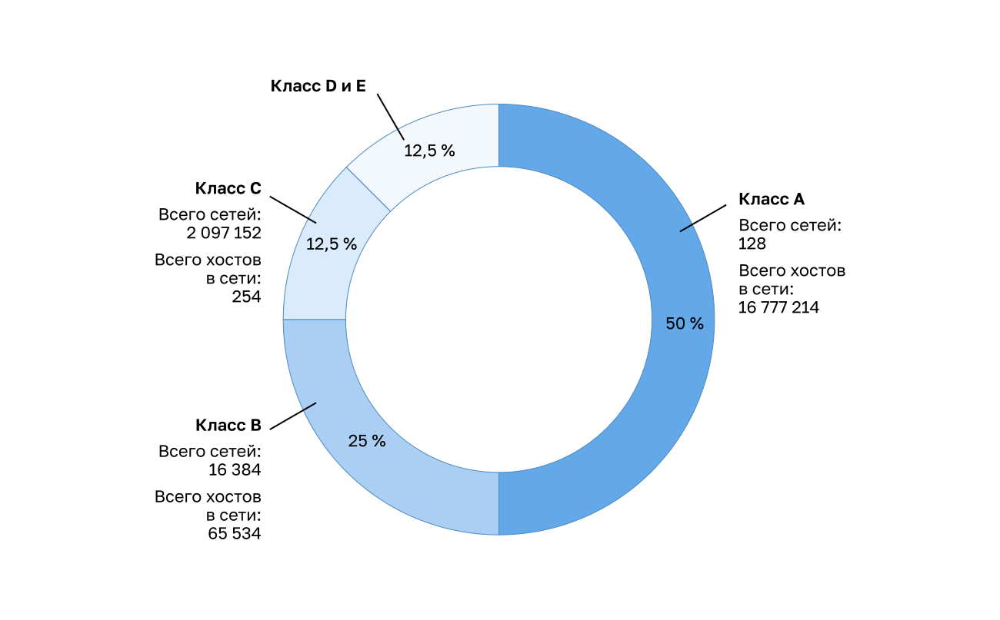
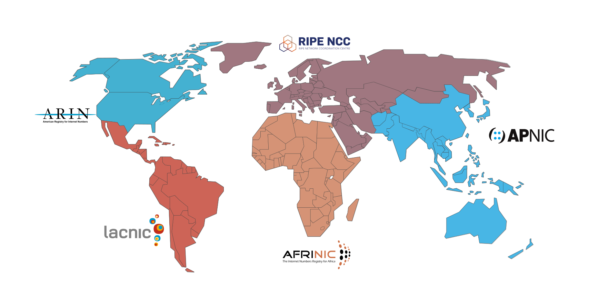

<!-- verified: agorbachev 03.05.2022 -->

<!-- 11.3.1 -->
## Общедоступные и частные адреса IPv4
Вместе с различными способами передачи пакета IPv4 существуют различные типы адресов IPv4. Одни из них нельзя для выхода в Интернет, а другие специально выделены для маршрутизации в Интернет. Некоторые используются для проверки соединения, а другие назначаются самостоятельно. Как сетевой администратор, вы хорошо познакомитесь с типами IPv4 адресов, но пока вы должны хотя бы знать, что это такое и когда их использовать.

Публичные IPv4-адреса — это адреса, которые глобально маршрутизируются между маршрутизаторами интернет-провайдеров (Internet Service Provider, ISP). Однако не все доступные адреса можно использовать в Интернете. Существуют блоки адресов, называемые частными адресами, которые в большинстве компаний назначаются в качестве IPv4-адресов внутренних хостов.

Частные адреса IPv4 ввели в середине 1990-х годов из-за исчерпания адресного пространства. Частные IPv4-адреса не уникальны и могут использоваться в любой внутренней сети.

**Примечание**: Долгосрочным решением проблемы истощения адресов IPv4 был IPv6.

| **Сетевой адрес и префикс** | **Диапазон частных адресов RFC 1918** |
| --- | --- |
| 10.0.0.0/8 | 10.0.0.0 - 10.255.255.255 |
| 172.16.0.0/12 | 172.16.0.0 - 172.31.255.255 |
| 192.168.0.0/16 | 192.168.0.0 - 192.168.255.255 |

**Примечание**: Частные адреса определяются в RFC 1918 и иногда называют адресное пространство RFC 1918.

<!-- 11.3.2 -->
## Маршрутизация в Интернет

Большинство внутренних сетей, от крупных предприятий до домашних сетей, используют частные IPv4-адреса для адресации всех внутренних устройств (интрасети), включая хосты и маршрутизаторы. Однако частные адреса не являются глобально маршрутизируемыми.

На рисунке клиентские сети 1, 2 и 3 отправляют пакеты за пределы своих внутренних сетей. Эти пакеты имеют исходный IPv4 адрес, который является частным адресом, и адрес назначения IPv4, который является общедоступным (глобально маршрутизируемым). Пакеты с частным адресом должны быть отфильтрованы (отброшены) или транслированы в публичный адрес перед отправкой пакета интернет-провайдеру.

")


Прежде чем интернет-провайдер сможет переслать этот пакет, он должен преобразовать исходный частный адрес IPv4 в публичный с помощью преобразования сетевых адресов (NAT). NAT выполняет преобразование между частными и общедоступными адресами IPv4. Это обычно выполняется на маршрутизаторе, который обеспечивает соединение между внутренней сетью и сетью ISP. Частные IPv4-адреса в интрасети организации будут преобразованы в общедоступные IPv4 адреса перед маршрутизацией в Интернет.

**Примечание**: Несмотря на то, что устройство с частным IPv4-адресом не доступно напрямую с другого устройства через Интернет, IETF не рассматривает частные IPv4-адреса или NAT в качестве эффективных мер безопасности.

У организаций с доступными в Интернете ресурсами, такими как веб-сервер, также будут устройства с общедоступными IPv4-адресами. Как показано на рисунке, эта часть сети известна как DMZ (демилитаризованная зона). Маршрутизатор на рисунке не только выполняет маршрутизацию, он также выполняет NAT и выступает в качестве брандмауэра для обеспечения безопасности.


**Примечание:** Частные адреса IPv4 обычно используются в образовательных целях вместо использования публичного адреса IPv4, который, скорее всего, принадлежит организации.

<!-- 11.3.3 -->
<!-- ## Задание. Разрешение или блокировка IPv4-адресов -->

<!-- 11.3.4 -->
## IPv4-адреса специального назначения

Некоторые адреса (например, сетевые и широковещательные) нельзя назначать узлам. Также есть особые адреса, которые можно назначать узлам, но с ограниченными способами взаимодействия этих узлов в сети.

**Адреса типа "петля" (Loopback)**

Адреса loopback (127.0.0.0 /8 или от 127.0.0.1 до 127.255.255.254): чаще определяются как только один адрес 127.0.0.1. Это особые адреса, с помощью которых узлы направляют трафик самим себе. Например, узлы могут его использовать для проверки работоспособности конфигурации TCP/IP, как показано на рисунке. Посмотрите, как адрес loopback 127.0.0.1 отвечает на эхо-запрос **ping**. Также обратите внимание, как любой адрес в этом блоке адресов возвращает пакет на локальный узел (например, см. процесс отправки второй команды **ping** на рисунке).

```
C:\Users\NetAcad> ping 127.0.0.1
Pinging 127.0.0.1 with 32 bytes of data:
Reply from 127.0.0.1: bytes=32 time<1ms TTL=128
Reply from 127.0.0.1: bytes=32 time<1ms TTL=128
Reply from 127.0.0.1: bytes=32 time<1ms TTL=128
Reply from 127.0.0.1: bytes=32 time<1ms TTL=128
Ping statistics for 127.0.0.1:
    Packets: Sent = 4, Received = 4, Lost = 0 (0% loss),
Approximate round trip times in milli-seconds:
    Minimum = 0ms, Maximum = 0ms, Average = 0ms
C:\Users\NetAcad> ping 127.1.1.1
Pinging 127.1.1.1 with 32 bytes of data:
Reply from 127.1.1.1: bytes=32 time<1ms TTL=128
Reply from 127.1.1.1: bytes=32 time<1ms TTL=128
Reply from 127.1.1.1: bytes=32 time<1ms TTL=128
Reply from 127.1.1.1: bytes=32 time<1ms TTL=128
Ping statistics for 127.1.1.1:
    Packets: Sent = 4, Received = 4, Lost = 0 (0% loss),
Approximate round trip times in milli-seconds:
    Minimum = 0ms, Maximum = 0ms, Average = 0ms
C:\Users\NetAcad>
```

**Локальные адреса канала**

Локальные адреса канала (169.254.0.0 /16 или от 169.254.0.1 до 169.254.255.254) также называют адресами автоматической частной IP-адресации (APIPA). С их помощью клиенты DHCP Windows самостоятельно авполняют настройку при отсутствии доступных DHCP-серверов. Локальные адреса связи можно использовать в одноранговом соединении, но обычно так не делают.

<!-- 11.3.5 -->
## Устаревшая классовая адресация

В 1981 г. IPv4-адреса в сети Интернет назначали с помощью классовой адресации согласно RFC 790 (назначенные адреса). Заказчикам выделялся сетевой адрес на основе одного из трех классов: A, B или C.

* **класс A  (от 0.0.0.0/8 до 127.0.0.0/8)**  — для очень крупных сетей с более 16 млн адресов хостов, сетевой адрес обозначали фиксированным префиксом /8 с первым октетом, остальные три октета определяли адреса хостов;
* **класс B (от 128.0.0.0/16 до 191.255.0.0/16)** — для средних и крупных сетей, содержащих приблизительно 65 000 адресов хостов, сетевой адрес обозначали фиксированным префиксом /16 с двумя старшими октетами для обозначения сетевого адреса, оставшиеся два октета определяли адреса хостов;
* **класс C  (от 192.0.0.0/24 до 223.255.255.0/24)** — для небольших сетей, содержащих не более 254 хостов, сетевой адрес обозначали префиксом /24 с тремя старшими октетами, и последний октет определял адреса хостов.

**Примечание**: Также существуют многоадресный блок класса D (от 224.0.0.0 до 239.0.0.0) и блок экспериментальных адресов класса E (от 240.0.0.0 до 255.0.0.0).

Когда компьютеров, использующих Интернет, было мало, классовая адресация была эффективным средством распределения адресов. Как показано на рисунке, у сетей классов A и B очень большое количество адресов узлов, а у сетей класса C — очень мало. На сети класса А приходится 50% сетей IPv4. Это привело к тому, что большинство доступных адресов IPv4 не используются.




В середине 1990-х годов, с появлением World Wide Web (WWW), классовая адресация устарела для эффективного распределения ограниченного адресного пространства IPv4. Классовое распределение адресов заменили бесклассовой адресацией, которая используется сегодня. Она игнорирует правила классов (A, B, C). Общедоступные сетевые адреса IPv4 (сетевые адреса и маски подсети) выделяются на основе допустимого числа адресов.

<!-- 11.3.6 -->
## Назначение IP-адресов

Публичные IPv4-адреса — это адреса, которые глобально маршрутизируют интеренет-провайдеры (Internet Service Provider, ISP). Публичные адреса IPv4 должны быть уникальными.

Назначение IPv4- и IPv6-адресов регулирует Администрация адресного пространства Интернет (IANA). IANA управляет блоками IP-адресов и распределяет их между региональными интернет-регистраторами (RIR). Пять RIR показаны на рисунке.

Региональные интернет-регистраторы (RIR) отвечают за распределение IP-адресов между интернет-провайдерами (ISP), которые, в свою очередь, предоставляют блоки IPv4-адресов организациям и менее крупным провайдерам. Организации могут получить свои адреса непосредственно от региональных интернет-регистраторов (RIR) (в зависимости от правил конкретного регионального интернет-регистратора (RIR)).

Региональные интернет-регистры




* **(AfriNIC)** Африканский сетевой информационный центр — Африка  
* **(APNIC)** Азиатско-Тихоокеанский сетевой информационный центр — Азиатско-Тихоокеанский регион  
* **(ARIN)** Американский реестр номеров в сети Интернет — Северная Америка.  
* **(LACNIC)** Региональный латиноамериканский и карибский реестр IP-адресов — Латинская Америка и некоторые острова Карибского моря  
* **(RIPE)** Réseaux IP Europeans  — Европа, Ближний Восток и Центральная Азия.

<!-- 11.3.7 -->
<!-- ## Упражнение - публичные или частные IPv4-адреса -->

<!-- 11.3.8 -->
<!-- quiz -->

