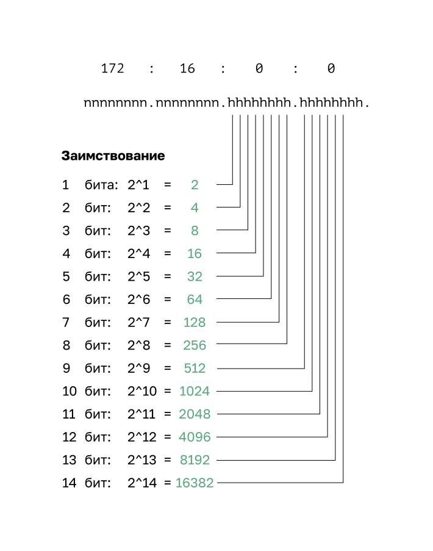
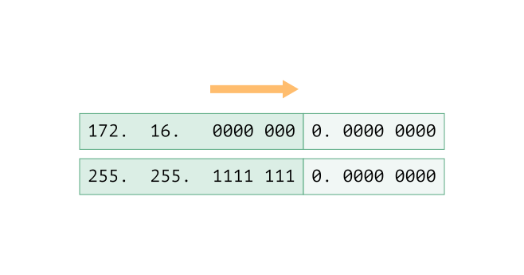
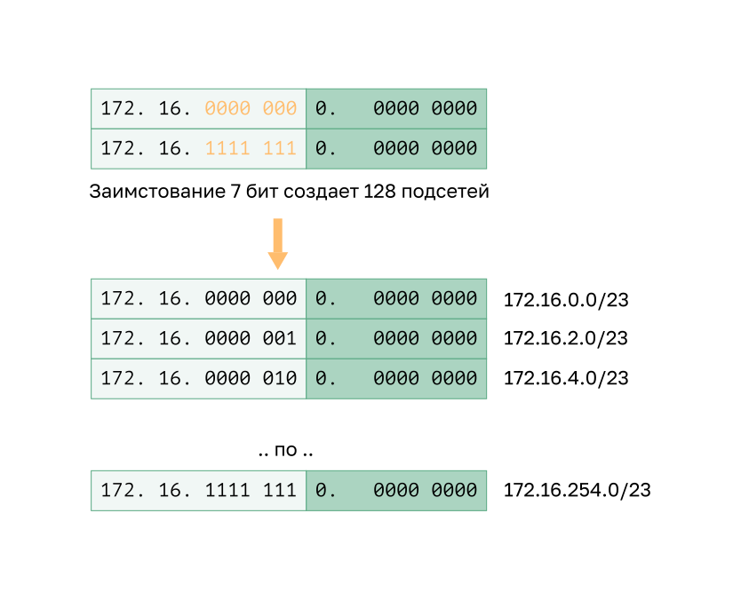
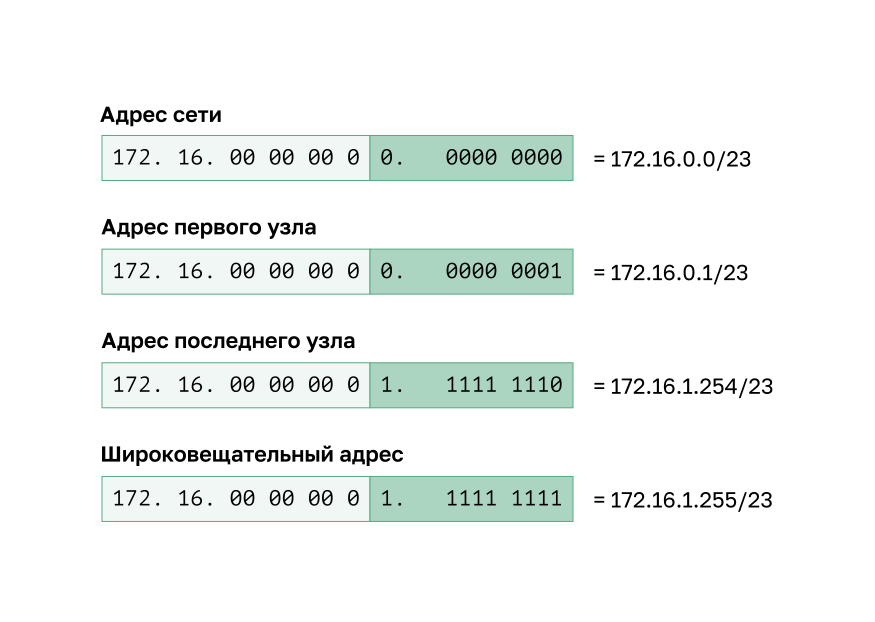
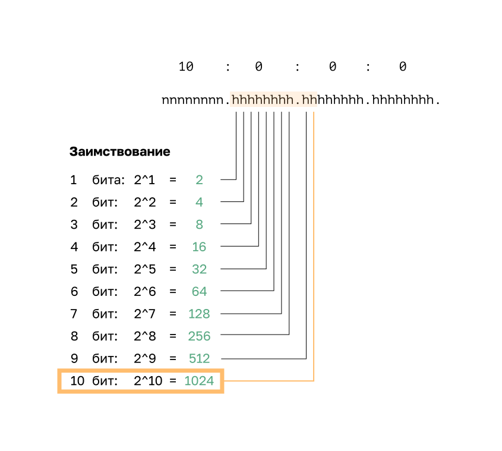
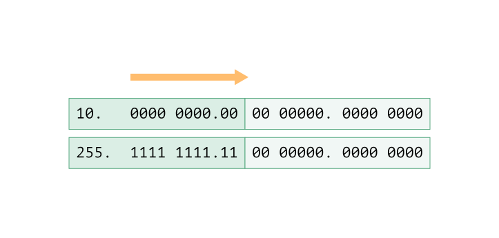
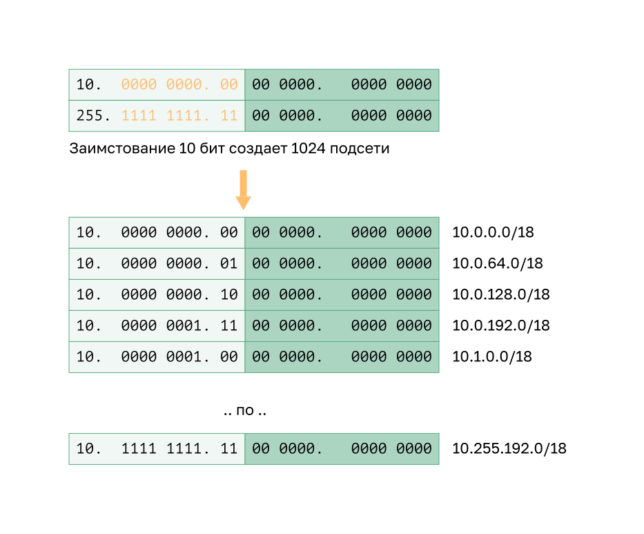
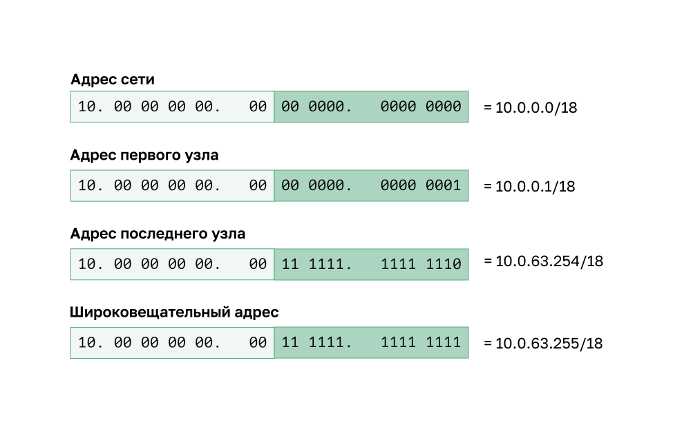

<!-- verified: agorbachev 03.05.2022 -->

<!-- 11.6.1 -->
## Создание подсетей с префиксом /16

Некоторые подсети проще других. В этом разделе объясняем, как создать подсети, у каждой из которых одинаковое количество узлов.

Если требуется большее количество подсетей, нужна IPv4-сеть с большим числом битов в узловой части для заимствования. Например, адрес сети 172.16.0.0 имеет маску по умолчанию /16 или 255.255.0.0. Этот адрес имеет по 16 бит в сетевой и узловой части. 16 бит в узловой части можно использовать для создания подсетей. В таблице на рисунке представлены все возможные сценарии разделения на подсети с префиксом /16.

| **Длина префикса** | **Маска подсети** | **Сетевой адрес (n = сеть; h = узел)** | **# Количество подсетей** | **# Количество хостов** |
| --- | --- | --- | --- | --- |
| /17 | 255.255.128.0 | `nnnnnnnn.nnnnnnnn.nhhhhhhh.hhhhhhhh` `11111111.11111111.10000000.00000000` | **2** | 32766 |
| /18 | 255.255.192.0 | `nnnnnnnn.nnnnnnnn.nnhhhhhh.hhhhhhhh` `11111111.11111111.11000000.00000000` | **4** | 16382 |
| /19 | 255.255.224.0 | `nnnnnnnn.nnnnnnnn.nnnhhhhh.hhhhhhhh` `11111111.11111111.11100000.00000000` | **8** | 8 190 |
| /20 | 255.255.240.0 | `nnnnnnnn.nnnnnnnn.nnnnhhhh.hhhhhhhh` `11111111.11111111.11110000.00000000` | **16** | 4 094 |
| /21 | 255.255.248.0 | `nnnnnnnn.nnnnnnnn.nnnnnhhh.hhhhhhhh` `11111111.11111111.11111000.00000000` | **32** | 2 046 |
| /22 | 255.255.252.0 | `nnnnnnnn.nnnnnnnn.nnnnnnhh.hhhhhhhh` `11111111.11111111.11111100.00000000` | **64** | 1 022 |
| /23 | 255.255.254.0 | `nnnnnnnn.nnnnnnnn.nnnnnnnh.hhhhhhhh` `11111111.11111111.11111110.00000000` | **128** | 510 |
| /24 | 255.255.255.0 | `nnnnnnnn.nnnnnnnn.nnnnnnnn.hhhhhhhh` `11111111.11111111.11111111.00000000` | **256** | 254 |
| /25 | 255.255.255.128 | `nnnnnnnn.nnnnnnnn.nnnnnnnn.nhhhhhhh` `11111111.11111111.11111111.10000000` | **512** | 126 |
| /26 | 255.255.255.192 | `nnnnnnnn.nnnnnnnn.nnnnnnnn.nnhhhhhh` `11111111.11111111.11111111.11000000` | **1024** | 62 |
| /27 | 255.255.255.224 | `nnnnnnnn.nnnnnnnn.nnnnnnnn.nnnhhhhh` `11111111.11111111.11111111.11100000` | **2048** | 30 |
| /28 | 255.255.255.240 | `nnnnnnnn.nnnnnnnn.nnnnnnnn.nnnnhhhh` `11111111.11111111.11111111.11110000` | **4 096** | 14 |
| /29 | 255.255.255.248 | `nnnnnnnn.nnnnnnnn.nnnnnnnn.nnnnnhhh` `11111111.11111111.11111111.11111000` | **8 192** | 6 |
| /30 | 255.255.255.252 | `nnnnnnnn.nnnnnnnn.nnnnnnnn.nnnnnnhh` `11111111.11111111.11111111.11111100` | **16 384** | 2 |

Хотя вам не нужно запоминать эту таблицу, вы должны хорошо понимать, как генерируется каждое значение в таблице. Не бойтесь размера таблицы. Большой она получилась из-за дополнительных 8 бит, которые можно заимствовать, и таким образом количество подсетей и узлов просто увеличивается.

<!-- 11.6.2 -->
## Создание 100 подсетей с помощью префикса /16

Рассмотрим крупное предприятие, которому необходимо хотя бы 100 подсетей, и которое выбрало частный адрес 172.16.0.0/16 в качестве адреса внутренней сети.

Заимствуя биты из адреса /16, начните с третьего октета, продолжая слева направо. Заимствуйте один бит каждый раз до тех пор, пока не будет достигнуто число бит, необходимое для создания 100 подсетей.

На рисунке показано количество подсетей, которое можно создать при заимствовании битов из третьего и четвертого октетов. Обратите внимание, что теперь может быть заимствовано до 14 бит из узловой части.

Чтобы удовлетворить потребности предприятия, потребуется заимствовать 7 бит (то есть 27 = 128 подсетей), как показано на рисунке.

Рассмотрим сеть 172.16.0.0/23. Как вы помните, маска подсети должна изменяться для отражения заимствованных бит. В этом примере при заимствовании семи бит маска будет расширена на 7 бит в третьем октете. В десятичном формате маска будет иметь вид 255.255.254.0 или префикс /23, поскольку третий октет в двоичном формате имеет вид 11111110, а четвертый октет — 00000000.

На рисунке показаны результирующие подсети от 172.16.0.0/23 до 172.16.254.0/23.

После заимствования 7 бит для подсети в третьем октете остался один бит в узловой части, а в четвертом октете — 8 бит в узловой части. В общей сложности осталось 9 не заимствованных бит. 29 результатов в 512 общих адресах узлов. Первый адрес зарезервирован для сетевого адреса, а последний — для широковещательного адреса, поэтому вычитание для этих двух адресов (29 - 2) равно 510 доступных адресов хоста для каждой подсети /23.

Как показано на рисунке, адрес первого узла в первой подсети — 172.16.0.1, а адрес последнего узла — 172.16.1.254.

<!-- 11.6.3 -->
## Создание 1000 подсетей с помощью префикса /8

Некоторым организациям, например, небольшим операторам связи или крупным предприятиям, может потребоваться еще большее количество подсетей. В качестве примера возьмем небольшого оператора связи, которому требуется 1000 подсетей для клиентов. Каждому клиенту потребуется большое пространство в узловой части для создания собственных подсетей.

Сетевой адрес интернет-провайдера 10.0.0.0 255.0.0.0 или 10.0.0.0/8. Значит, при разделении на подсети для заимствования доступно 8 бит в сетевой части адреса и 24 бита в узловой части. Так небольшой оператор связи разобьет на подсети всю сеть 10.0.0.0/8.

Как и всегда, для создания подсети нужно позаимствовать биты из узловой части адреса исходной сети. Начиная с первого слева доступного бита в узловой части, мы будем заимствовать по одному биту за раз, пока не получим количество бит, необходимых для создания 1000 подсетей. Как видно из рисунка 1, 10 бит потребуется заимствовать для создания 1024 подсетей. (210=1024). Это означает, что потребуется заимствовать 8 бит во втором октете и 2 дополнительных бита в третьем.

На рисунке показан адрес сети и результирующая маска подсети, которая преобразуется в 255.255.192.0 или префикс 10.0.0.0/18.

На рисунке показаны результирующие подсети, созданные путем заимствования 10 бит, от 10.0.0.0/18 до 10.255.192.0/18.

Заимствование 10 бит для создания подсетей, оставляет 14 битов хоста для каждой подсети. Вычитание двух узлов в подсети (по одному для сетевого и широковещательного адреса) равняется 214 - 2 = 16382 узлов в подсети. Это означает, что каждая из 1000 подсетей может поддерживать до 16382 узлов. На рисунке  показаны особенности первой подсети.

<!-- 11.6.4 -->
## Видео: организация подсетей по нескольким октетам

Посмотрите видеоролик о том, как использовать «магическое число» для классовых границ бит.

<!-- 11.6.5 -->
<!-- ## Упражнение. Расчет маски подсети -->

<!-- 11.6.6 -->
<!--## Лабораторная работа: расчет подсетей IPv4

В этой лабораторной работе вы выполните следующие задачи.

* Часть 1: Определение подсетей по IPv4-адресу
* Часть 2: Расчет подсетей по IPv4-адресу

[Описание лабораторной работы (pdf)](./assets/11.6.6-lab---calculate-ipv4-subnets_ru-RU.pdf)
-->
