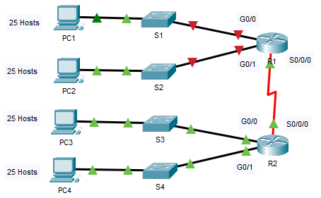

## Топология

## Таблица адресации

| Устройство | Интерфейс | IP-адрес | Маска подсети | Шлюз по умолчанию |
|------------|-----------|----------|---------------|-------------------|
| R1         | G0/0      |          |               |                   |
| R1         | G0/1      |          |               |                   |
| R1         | S0/0/0    |          |               |                   |
| R2         | G0/0      |          |               |                   |
| R2         | G0/1      |          |               |                   |
| R2         | S0/0/0    |          |               |                   |
| S1         | VLAN 1    |          |               |                   |
| S2         | VLAN 1    |          |               |                   |
| S3         | VLAN 1    |          |               |                   |
| S4         | VLAN 1    |          |               |                   |
| PC1        | NIC       |          |               |                   |
| PC2        | NIC       |          |               |                   |
| PC3        | NIC       |          |               |                   |
| PC4        | NIC       |          |               |                   |

## Задачи

Часть 1. Разработка схемы IP-адресации

Часть 2. Назначение сетевым устройствам IP-адресов и проверка подключения

## Сценарий

В этом упражнении вам предоставляется сетевой адрес 192.168.100.0/24 для подсети, и вы должны составить схему IP-адресации сети, изображенной в Packet Tracer. Для каждой локальной сети (LAN) в сети требуется по крайней мере, 25 адресов для оконечных устройств, коммутатора и маршрутизатора. Для соединения между маршрутизаторами R1 и R2 потребуется по одному IP-адресу на каждом конце канала.

## Инструкции

### Часть 1. Разработка схемы IP-адресации

**Шаг 1. Разбейте сеть 192.168.100.0/24 на нужное количество подсетей.**

Вопросы:

- ответьте на вопрос №1

- ответьте на вопрос №2

- ответьте на вопрос №3

- ответьте на вопрос №4

    **Примечание.** Если ваш ответ — менее 25 узлов, значит, вы позаимствовали слишком много бит.

5.  Рассчитайте двоичное значение для первых пяти подсетей. Первые две подсети были созданы для вас.

    | Подсеть | Сетевой адрес | Бит 7 | Бит 6 | Бит 5 | Бит 4 | Бит 3 | Бит 2 | Бит 1 | Бит 0 |
    |---------|---------------|-------|-------|-------|-------|-------|-------|-------|-------|
    | 0       | 192.168.100.  | 0     | 0     | 0     | 0     | 0     | 0     | 0     | 0     |
    | 1       | 192.168.100.  | 0     | 0     | 1     | 0     | 0     | 0     | 0     | 0     |
    | 2       | 192.168.100.  |       |       |       |       |       |       |       |       |
    | 3       | 192.168.100.  |       |       |       |       |       |       |       |       |
    | 4       | 192.168.100.  |       |       |       |       |       |       |       |       |

6.  Рассчитайте двоичное и десятичное значение новой маски подсети.

    | Первый октет            | Второй Октет            | Третий октет            | Маска бит 7                | Маска бит 6 | Маска бит 5 | Маска бит 4 | Маска бит 3 | Маска бит 2 | Маска бит 1 | Маска бит 0 |
    |-------------------------|-------------------------|-------------------------|----------------------------|-------------|-------------|-------------|-------------|-------------|-------------|-------------|
    | 11111111                | 11111111                | 11111111                |                            |             |             |             |             |             |             |             |
    | Первый десятичный октет | Второй десятичный октет | Третий десятичный октет | Четвертый десятичный октет |             |             |             |             |             |             |             |
    | 255\.                   | 255\.                   | 255\.                   |                            |             |             |             |             |             |             |             |

7.  Заполните **Таблицу подсетей**, перечислив десятичные значения всех доступных подсетей, первый и последний используемый адрес хоста и адрес трансляции. Повторяйте эти действия до тех пор, пока все адреса не будут внесены в список.

    Примечание. **Возможно, потребуется заполнить не все строки.**

    **Таблица подсетей**

    | Номер подсети | Адрес подсети | Первый используемый адрес узла | Последний используемый адрес узла | Широковещательный адрес |
    |---------------|---------------|--------------------------------|-----------------------------------|-------------------------|
    | **0**         |               |                                |                                   |                         |
    | **1**         |               |                                |                                   |                         |
    | **2**         |               |                                |                                   |                         |
    | **3**         |               |                                |                                   |                         |
    | **4**         |               |                                |                                   |                         |
    | **5**         |               |                                |                                   |                         |
    | **6**         |               |                                |                                   |                         |
    | **7**         |               |                                |                                   |                         |
    | **8**         |               |                                |                                   |                         |
    | **9**         |               |                                |                                   |                         |
    | **10**        |               |                                |                                   |                         |

**Шаг 2. Назначьте подсети для сети, показанной в топологии.**

1.  Назначьте подсеть 0 локальной сети (LAN), подключенной к интерфейсу GigabitEthernet 0/0 маршрутизатора R1: 192.168.100.0 /27

2.  Назначьте подсеть 1 локальной сети (LAN), подключенной к интерфейсу GigabitEthernet 0/1 маршрутизатора R1: 192.168.100.32 /27

3.  Назначьте подсеть 2 локальной сети (LAN), подключенной к интерфейсу GigabitEthernet 0/0 маршрутизатора R2: 192.168.100.64 /27

4.  Назначьте подсеть 3 локальной сети (LAN), подключенной к интерфейсу GigabitEthernet 0/1 маршрутизатора R2: 192.168.100.96 /27

5.  Назначьте подсеть 4 каналу WAN между маршрутизаторами R1 и R2: 192.168.100.128 /27

**Шаг 3. Задокументируйте схему адресации.**

Заполните **таблицу адресации**, используя следующие рекомендации.

1.  Назначьте первые используемые IP-адреса на каждую подсеть маршрутизатора R1 для двух каналов локальной сети (LAN) и одного канала WAN.

2.  Назначьте первые используемые IP-адреса на каждую подсеть маршрутизатора R2 для каналов локальной сети (LAN). Последний из используемых IP-адресов назначьте каналу WAN.

3.  Назначьте коммутаторам второй используемый IP-адрес в подключенных подсетях.

4.  Назначьте последние используемые IP-адреса компьютерам в каждой подсети.

### Часть 2. Назначение IP-адресов сетевым устройствам и проверка подключения

Основная часть параметров IP-адресации для данной сети уже настроена. Для завершения настройки адресации выполните следующие шаги. Динамическая маршрутизация EIGRP уже настроена между R1 и R2.

**Шаг 1. Настройте интерфейсы локальной сети R1.**

1.  Настройте оба интерфейса локальной сети с адресами из таблицы адресации.

2.  Настройте интерфейсы таким образом, чтобы узлы локальных сетей имели подключение к шлюзу по умолчанию.

**Шаг 2. Настройка IP-адресацию на S3.**

1.  Настройте интерфейс VLAN1 коммутатора с адресацией.

2.  Настройте коммутатор с адресом шлюза по умолчанию.

**Шаг 3. Настройка PC4.**

Настройте на PC4 адрес узла и шлюз по умолчанию.

**Шаг 4. Проверьте подключение.**

Подключение можно проверить только между маршрутизатором R1, коммутатором S3 и компьютером PC4. При этом необходимо отправлять эхо-запрос на каждый IP-адрес, перечисленный в **Таблице адресации**.

[Скачать файл Packet Tracer для локального запуска](./assets/11.7.5-lab.pka)
