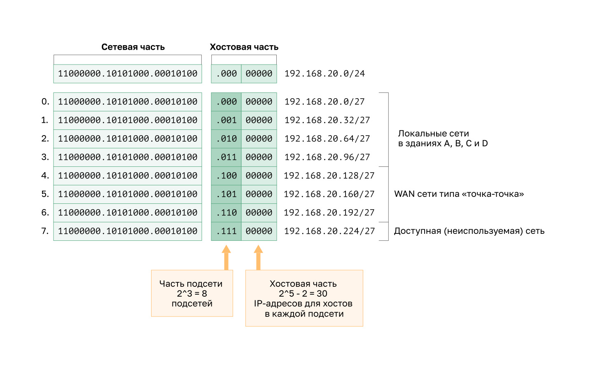
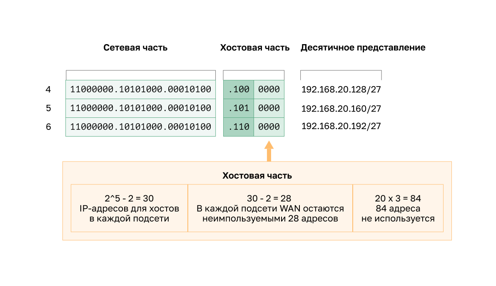
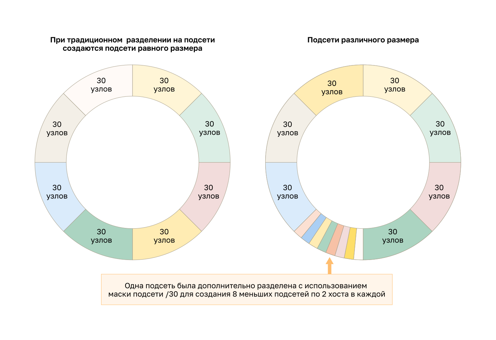
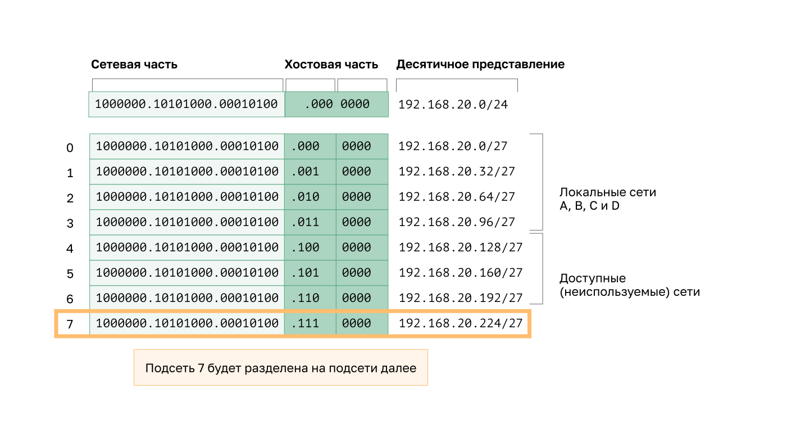
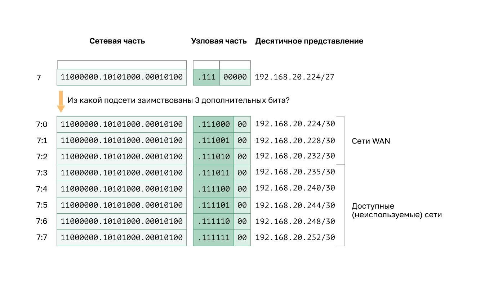

<!-- verified: agorbachev 03.05.2022 -->

<!-- 11.8.1 -->
## Видео: основы масок подсети переменной длины (variable length subnet mask, VLSM) 

Как упоминалось в предыдущем разделе, публичные и частные адреса влияют на способы размещения подсетей в вашей сети. На схемы подсетей влияют и другие проблемы. Стандартная схема подсетей /16 создает подсетис одинаковым количеством узлов. Не каждой из них потребуется столько хостов, поэтому многие IPv4 адреса остаются неиспользуемыми. Возможно, вам понадобится одна подсеть, содержащая еще много хостов. Именно для этого разработали маску подсети переменной длины (VLSM).

Посмотрите видео об основных методах и примерах VLSM.

<!-- 11.8.2 -->

<!-- 11.8.3 -->
## Эффективное использвование IPv4-адресов

Из-за истощения общего адресного пространства IPv4, использование доступных адресов узлов стало основной проблемой для подсетей IPv4.

**Примечание**: Более крупный адрес IPv6 позволяет гораздо проще планировать и распределять адреса, чем позволяет IPv4. Это одна из движущих сил для перехода на IPv6.

В традиционном разделении для каждой подсети выделяется одинаковое количество адресов. Если у всех подсетей одинаковые требования к количеству узлов, такие блоки адресов фиксированного размера будут эффективными. Как правило, с публичными адресами IPv4 это не так.

Например, в топологии, показанной на рисунке 1, используются семь подсетей: по одной для каждой из четырех локальных сетей (LAN) и по одной для каждого из трех каналов сети WAN между маршрутизаторами.

В традиционном разбиении на подсети с указанным адресом 192.168.20.0/24 из узловой части в последнем октете можно позаимствовать три бита, чтобы обеспечить создание семи подсетей. Как показано на рисунке 2, при заимствовании трех бит можно создать 8 подсетей, а оставшихся пяти бит в узловой части хватит для 30 адресов узлов в каждой подсети. Такая схема позволяет создать требуемые подсети и соответствует требованиям к узлу в крупнейших локальных сетях (LAN).

Эти семь подсетей могут быть назначены сетям LAN и WAN, как показано на рисунке.

Хотя при таком стандартном разделении на подсети обеспечивается соответствие требованиям к крупнейшим локальным сетям (LAN) и разделение пространства адресов на соответствующее количество подсетей, это все равно приводит к значительному необоснованному расходованию неиспользуемых адресов.

Например, в каждой подсети для трех каналов WAN требуется только два адреса. Поскольку каждая из подсетей содержит 30 доступных для использования адресов, в каждой из подсетей оказывается 28 неиспользуемых адресов. Как показано на рисунке 3, в результате мы получаем 84 неиспользуемых адреса (28x3).

Кроме того, это также ограничивает расширение сети в будущем, уменьшая общее число доступных подсетей. Такое неэффективное использование адресов характерно для традиционного разделения на подсети, это подразумевает нецелесообразное расходование ресурсов.

Разделение подсети на несколько подсетей или использование маски подсети переменной длины (VLSM) позволяет предотвратить появление избыточных адресов.

<!-- 11.8.4 -->
## VLSM

Обратите внимание, что во всех предыдущих примерах разделения на подсети ко всем подсетям применялась одна маска подсети. Это означает, что все подсети содержат одинаковое число доступных адресов узлов. Как показано на рисунке, при традиционной схеме разделения создаются подсети одинакового размера. Все они используют одну и ту же маску подсети. Как показано на рисунке, VLSM позволяет разделить пространство сети на неравные части. VLSM-маска подсети может варьироваться в зависимости от количества бит, которые были заимствованы для конкретной подсети. Эти биты образуют «переменную» часть маски.

VLSM разделяет подсети на подсети. Та же топология, которая использовалась ранее, показана на рисунке. Мы также будем использовать сеть 192.168.20.0/24 и разделим ее на семь подсетей, по одной для каждой из четырех локальных сетей и по одной для каждого из трех соединений между маршрутизаторами.

На рисунке показано, как сеть 192.168.20.0/24 разбилась на восемь подсетей одинакового размера с 30 используемыми адресами узлов в каждой подсети. Четыре подсети использовались для локальных сетей (LAN), а три подсети — для каналов  между маршрутизаторами.

Для подключения между маршрутизаторами требуется только два адреса узлов в подсети (один адрес узла для каждого интерфейса маршрутизатора). Сейчас все подсети имеют 30 используемых адресов узлов для каждой подсети. Чтобы использовать адреса эффективнее, с помощью VLSM можно создать более мелкие подсети для каналов между маршрутизаторами.

Для этого нужно разделить одну из подсетей. В этом примере последняя подсеть 192.168.20.224/27 будет дополнительно разбита на подсети с помощью маски 255.255.255.252 или /30.

Почему /30? Как вы помните, если известно необходимое количество адресов узлов, можно использовать формулу 2^n-2 (где n — количество оставшихся бит в узловой части). Чтобы получить два доступных адреса, в его узловой части должны остаться два бита.

Поскольку в разбитом на подсети адресном пространстве 192.168.20.224/27 имеются 5 бит в узловой части, 3 бита можно позаимствовать, а 2 бита оставить в узловой части, как показано на рисунке. На данном этапе расчеты в точности совпадают с расчетами при традиционном разбиении на подсети. Биты заимствуются, определяя диапазоны подсетей. На рисунке показано, как четыре подсети /27 были назначены локальным сетям и три подсети /30 были назначены межмаршрутизаторным каналам.

Такая схема VLSM-деления на подсети уменьшает количество адресов в подсети до подходящего сети размера. Разделение подсети 7 для сетей WAN оставляет доступными подсети 4, 5 и 6 для будущих сетей, а также 5 дополнительных подсетей для сетей WAN.

**Примечание**: При использовании VLSM, всегда начинайте с обеспечения соответствия требованиям к узлам в крупнейших подсетях. Продолжайте разделение, пока не будут удовлетворены требования к узлам в наименьшей подсети.

<!-- 11.8.5 -->
## Назначение адресов в топологии VLSM

При использовании VLSM-подсетей для сегментов локальной (LAN) и глобальной (WAN) сетей можно выделять адреса без ненужных потерь.

На рисунке показаны назначения сетевых адресов и IPv4 адреса, назначенные каждому интерфейсу маршрутизатора.

В стандартной схеме адресации IPv4-адрес первого узла в каждой подсети назначается LAN-интерфейсу маршрутизатора. У узлов в каждой подсети будут IPv4-адреса из диапазона этой подсети и соответствующую маску. Узлы будут использовать адрес подключенного LAN-интерфейса маршрутизатора в качестве адреса шлюза по умолчанию.

В таблице показаны сетевые адреса и диапазон адресов узлов для каждой сети. Адрес шлюза по умолчанию отображается для четырех локальных сетей.

|  | **Сетевой адрес** | **Диапазон адресов узлов** | **Адрес шлюза по умолчанию** |
| --- | --- | --- | --- |
| **Здание А** | 192.168.20.0/27 | 192.168.20.1/27 - 192.168.20.30/27 | 192.168.20.1/27 |
| **Здание В** | 192.168.20.32/27 | 192.168.20.33/27 - 192.168.20.62/27 | 192.168.20.33/27 |
| **Здание В** | 192.168.20.64/27 | 192.168.20.65/27 - 92.168.20.94/27 | 192.168.20.65/27 |
| **Здание B** | 192.168.20.96/27 | 192.168.20.97/27 - 192.168.20.126/27 | 192.168.20.97/27 |
| **R1-R2** | 192.168.20.224/30 | 192.168.20.225/30 - 192.168.20.226/30 |  |
| **Р2-Р3** | 192.168.20.228/30 | 192.168.20.229/30 - 192.168.20.230/30 |  |
| **R3-R4** | 192.168.20.232/30 | 192.168.20.233/30 - 192.168.20.234/30 |  |

<!-- 11.8.6 -->

<!-- ## Задание - Практика VLSM -->

