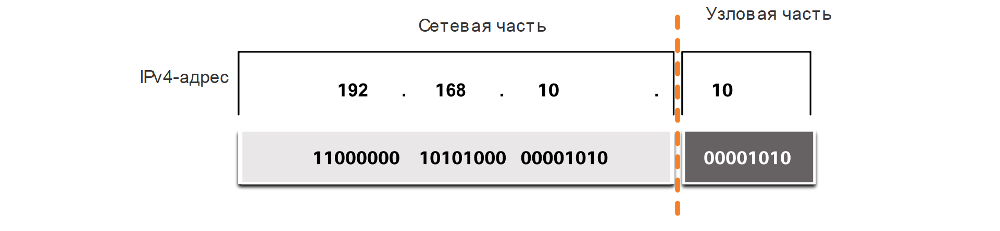
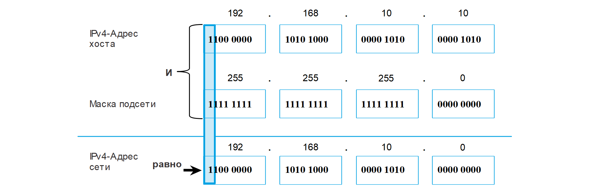

<!-- verified: agorbachev 03.05.2022 -->

<!-- 11.1.1 -->
## Сетевая и узловая части адреса

Адрес IPv4 является иерархическим и состоит из раздела сети и раздела хоста. Определяя ту или иную часть, необходимо обращать внимание не на десятичное значение, а на 32-битный поток, как показано на рисунке.

### IPv4-адрес

<!-- /courses/itn-dl/aeed55b0-34fa-11eb-ad9a-f74babed41a6/af229680-34fa-11eb-ad9a-f74babed41a6/assets/2e24c1f4-1c25-11ea-81a0-ffc2c49b96bc.svg -->

Биты в сетевой части адреса должны быть одинаковыми у всех устройств, находящихся в одной сети. Биты в хостовой части адреса должны быть уникальными для каждого хоста в сети. Если два узла имеют одну битовую комбинацию в определенной сетевой части 32-битного потока, то эти два узла находятся в одной и той же сети.

Но как узлы определяют, какая из частей 32-битного потока является сетевой, а какая — узловой? Это задача  маски подсети.

<!-- 11.1.2 -->
## Маска подсети

Как показано на рисунке, для назначения адреса IPv4 узлу требуется следующее:

* **IPv4 адрес**   - это уникальный IPv4 адрес хоста.
* **Маска подсети** \- используется для определения сетевой части и части хоста адреса IPv4.

### Конфигурация IPv4 на компьютере с Windows

**Примечание:** Для доступа к удаленным сетям требуется IPv4-адрес шлюза по умолчанию, а IPv4-адрес DNS-сервера необходим для преобразования доменных имен в IPv4-адреса.

Маска подсети IPv4 — это 32-битовое значение, которое отделяет сетевую часть адреса от хостовой части. При назначении устройству IPv4-адреса для определения адреса сети, к которому относится данное устройство, используется маска подсети. Сетевой адрес представляет все устройства в одной сети.

На следующем рисунке показана 32-битная маска подсети в десятичном и двоичном форматах с точками.

### Маска подсети

<!-- /courses/itn-dl/aeed55b0-34fa-11eb-ad9a-f74babed41a6/af229680-34fa-11eb-ad9a-f74babed41a6/assets/2e258543-1c25-11ea-81a0-ffc2c49b96bc.svg -->

Обратите внимание, что маска подсети представляет собой последовательную последовательность из единичных битов (1), за которой следует последовательная последовательность из нулевых битов (0).

Для идентификации сетевой и узловой части IPv4-адреса маска подсети побитово сравнивается с IPv4-адресом слева направо, как показано на рисунке.

### Связь адреса IPv4 с маской подсети

<!-- /courses/itn-dl/aeed55b0-34fa-11eb-ad9a-f74babed41a6/af229680-34fa-11eb-ad9a-f74babed41a6/assets/2e25ac53-1c25-11ea-81a0-ffc2c49b96bc.svg -->

Обратите внимание, что маска подсети на самом деле не содержит сетевой или узловой части IPv4-адреса; она лишь указывает компьютеру, где искать эти части в конкретном IPv4-адресе.

Сам процесс, используемый для определения сетевой и узловой частей адреса, называется логической операцией И (AND).

<!-- 11.1.3 -->
## Длина префикса

Представление сетевых адресов и адресов узлов путем в виде маски подсети в десятичном формате с точкой-разделителем может быть очень громоздким. К счастью, существует альтернативный, более простой, способ определения маски подсети, называемый длиной префикса.

Длина префикса означает количество бит, установленных в единицу (1) в маске подсети. Она обозначается наклонной чертой вправо («/»), после которой идет набор единиц. Следовательно, нужно подсчитать число битов в маске подсети и поставить перед этим значением косую черту.

Примеры см. в таблице. В первом столбце перечислены различные маски подсети, которые могут использоваться с адресом узла. Во втором столбце указан полученный 32-битный двоичный адрес. В последнем столбце указана полученная длина префикса.

### Сравнение масок подсети и длины префикса

| **Маска подсети** | **32-битный адрес** | **Длина префикса** |
| --- | --- | --- |
| 255.0.0.0 | `11111111.00000000.00000000.00000000` | /8 |
| 255.255.0.0 | `11111111.11111111.00000000.00000000` | /16 |
| 255.255.255.0 | `11111111.11111111.11111111.00000000` | /24 |
| 255.255.255.128 | `11111111.11111111.11111111.10000000` | /25 |
| 255.255.255.192 | `11111111.11111111.11111111.11000000` | /26 |
| 255.255.255.224 | `11111111.11111111.11111111.11100000` | /27 |
| 255.255.255.240 | `11111111.11111111.11111111.11110000` | /28 |
| 255.255.255.248 | `11111111.11111111.11111111.11111000` | /29 |
| 255.255.255.252 | `11111111.11111111.11111111.11111100` | /30 |

**Примечание**: Сетевой адрес также называется префиксом или сетевым префиксом. Длина префикса означает количество бит, установленных в единицу (1) в маске подсети.

При представлении адреса IPv4 с использованием длины префикса, адрес IPv4 записывается за ним длина префикса без пробелов. Например, 192.168.10.10 255.255.0 будет записан как 192.168.10.10/24. Об использовании различных типов длины префикса вы узнаете позже. Сейчас же мы будем говорить о маске подсети /24 (т.е. 255.255.255.0).

<!-- 11.1.4 -->
## Определение сети: логическое И

Логическая операция И — одна из трех основных двоичных операций, используемых в дискретной логике. Двумя другими операциями являются ИЛИ (OR) и НЕ (NOT). Операция И используется для определения сетевого адреса.

Логическое И — это сравнение двух битов, результаты которого показаны на рисунке ниже. Обратите внимание, что 1 И 1 = 1. Любая другая комбинация приводит к 0.

* 1 И 1 = 1
* 0 И 1 = 0
* 1 И 0 = 0
* 0 И 0 = 0

**Примечание**: В цифровой логике 1 представляет True, а 0 — False. При использовании операции AND оба входных значения должны быть True (1), чтобы результат был True (1).

Для того чтобы определить сетевой адрес IPv4-узла, к IPv4-адресу и маске подсети побитово применяется логическая операция И. Применение логической операции И к адресу и маске подсети в результате дает сетевой адрес.

Для демонстрации использования операции И для определения сетевого адреса рассмотрим узел с IPv4-адресом 192.168.10.10 и маской подсети 255.255.255.0, как показано на рисунке.

* **IPv4 адрес узла (192.168.10.10)**  - IPv4-адрес хоста в десятичном  формате с точками и в двоичном виде.
* **Маска подсети (255.255.255.0)** - Маска подсети узла в десятичном формате с точками и в двоичном виде.
* **Сетевой адрес (192.168.10.0)** - Логическая операция AND между адресом IPv4 и маской подсети приводит к тому, что сетевой адрес IPv4 отображается в десятичном формате с точками и в двоичном виде.

<!-- /courses/itn-dl/aeed55b0-34fa-11eb-ad9a-f74babed41a6/af229680-34fa-11eb-ad9a-f74babed41a6/assets/2e262180-1c25-11ea-81a0-ffc2c49b96bc.svg -->

Используя первую последовательность битов в качестве примера, обратите внимание, что операция логического И выполняется на 1 бите адресе хоста с 1 битом маски подсети. Это приводит к 1 биту  сетевого адреса. 1 И 1 = 1.

Операция логического И между адресом узла IPv4 и маской подсети приводит к созданию IPv4-адреса сети для этого узла. В этом примере операция логического И между адресом узла 192.168.10.10 и маской подсети 255.255.255.0 (/24) приводит к созданию IPv4-адреса сети 192.168.10.0/24. Это важная операция IPv4, так как она сообщает хосту, к какой сети он принадлежит.

<!-- 11.1.5 -->
## Видео: разновидности IP-адресов

В каждой сети есть три типа IP-адресов:

* Сетевой адрес
* Адрес хоста
* Широковещательный адрес

Посмотрите видео о том, как определяется сетевой адрес, адрес узла и адрес широковещательной рассылки для конкретного.

<iframe width="970" height="546" src="https://www.youtube.com/embed/7DoggTtOLN0" title="YouTube video player" frameborder="0" allow="accelerometer; autoplay; clipboard-write; encrypted-media; gyroscope; picture-in-picture" allowfullscreen></iframe>

<!-- 11.1.6 -->

**Сетевой адрес**

Сетевой адрес — это адрес, представляющий определенную сеть. Устройство принадлежит этой сети, если оно удовлетворяет трем критериям:

* Он имеет ту же маску подсети, что и сетевой адрес.
* Он имеет те же биты сети, что и сетевой адрес, как указано маской подсети.
* Он расположен в том же домене широковещательной рассылки, что и другие узлы с тем же сетевым адресом.

Узел определяет свой сетевой адрес, выполняя операцию логического И между  IPv4-адресом и маской подсети.

Как показано в таблице, сетевой адрес имеет все 0 бит в части узла, как определено маской подсети. В этом примере сетевой адрес — 192.168.10.0/24. Сетевой адрес не может быть назначен устройству.

|  | **Сетевая часть** | **Хостовая часть** | **Биты хоста** |
| --- | --- | --- | --- |
| Маска подсети **255.255.255**.0 или **/24** | `255 255 255` `11111111 11111111 11111111` | `0` `00000000` |  |
| Сетевой адрес **192.168.10**.0 или **/24** | `192 168 10` `11000000 10100000 00001010` | `0` `00000000` | Все 0 |
| Первый адрес **192.168.10**.1 или **/24** | `192 168 10` `11000000 10100000 00001010` | `1` `00000001` | Все 0 и 1 |
| Последний адрес **192.168.10**.254 или **/24** | `192 168 10` `11000000 10100000 00001010` | `254` `11111110` | Все 1 и 0 |
| Широковещательный адрес **192.168.10**.255 или **/24** | `192 168 10` `11000000 10100000 00001010` | `255` `11111111` | Все 1 |

**Адреса узлов**

Адреса узлов — это адреса, которые могут быть назначены устройству, например компьютеру, ноутбуку, смартфону, веб-камере, принтеру, маршрутизатору и т.д. Основной частью адреса являются биты, обозначенные 0 битами в маске подсети. Адреса хоста могут иметь любую комбинацию битов в части хоста, за исключением всех 0 битов (это будет сетевой адрес) или всех 1 битов (это будет широковещательный адрес).

Все устройства в одной сети должны иметь одинаковую маску подсети и одинаковые биты сети. Только биты хоста будут отличаться и должны быть уникальными.

Обратите внимание, что в таблице есть первый и последний адрес хоста:

* **Первый используемый адрес**  - этот первый узел в сети имеет все 0 бит с последним (самым правым) битом в 1 бит. В этом примере это 192.168.10.1/24.
* **Последний используемый адрес** - этот последний узел в сети имеет все 1 бит с последним (самым правым) битом в 0 бит. В этом примере это 192.168.10.254/24.

Любые адреса между 192.168.10.1/24 по 192.168.10.254/24 включительно могут быть назначены устройству в сети.

**Широковещательный адрес**

Широковещательный адрес — это адрес, который используется, когда он необходим для доступа ко всем устройствам в  IPv4-сети. Как показано в таблице, сетевой широковещательный адрес имеет все 1 бит в части узла, определяемой маской подсети. В этом примере сетевой адрес — 192.168.10.255/24. Широковещательный адрес не может быть назначен устройству.

<!-- /courses/itn-dl/aeed55b0-34fa-11eb-ad9a-f74babed41a6/af229680-34fa-11eb-ad9a-f74babed41a6/assets/2e266fa2-1c25-11ea-81a0-ffc2c49b96bc.svg -->

<!-- 11.1.7 -->
<!-- ## Упражнение - Логическое  И для определения сетевого адреса -->

<!-- 11.1.8 -->
<!-- quiz -->