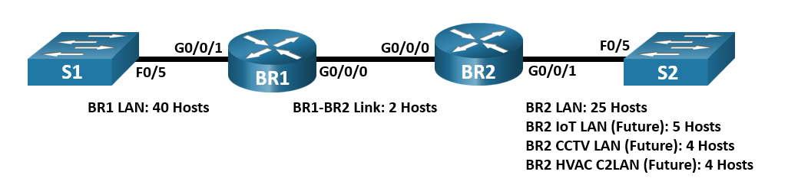

## Топология

## Задачи

Часть 1. Изучение требований к сети

Часть 2. Разработка схемы адресации VLSM

Часть 3. Подключение кабелей и настройка IPv4-сети

## Общие сведения/сценарий

Маска подсети произвольной длины (VLSM) предназначена для того, чтобы избежать пустой траты IP-адресов. При использовании VLSM сеть разделяется на подсети, а затем каждая подсеть разделяется снова. Этот процесс может повторяться несколько раз и позволяет создавать подсети различных размеров на основе количества узлов, необходимых для каждой сети. Для эффективного использования VLSM необходимо планирование адресов.

В этой лабораторной работе в режиме симуляции физического оборудования (PTPM) вам нужно разработать схему адресации для сети, изображенной на диаграмме топологии, используя адрес 192.168.33.128/25. Bспользуйте VLSM для обеспечения соответствия требованиям адресации IPv4. После создания схемы адресации VLSM вам нужно будет настроить интерфейсы на маршрутизаторах, указав соответствующие IP-адреса. Будущие локальные сети BR2 должны иметь выделенные адреса, но в настоящее время интерфейсы не будут настроены.

## Инструкции

### Часть 1. Изучение требований к сети

В этой части вам необходимо изучить требования к сети и разработать схему адресации VLSM для сети, изображенной на диаграмме топологии, используя сетевой адрес 192.168.33.128/25.

**Шаг 1. Определите количество доступных адресов узлов и подсетей.**

Вопросы:

Сколько адресов узлов доступно в сети /25?

**Введите ваш ответ здесь.**

Сколько всего адресов узлов требуется, исходя из топологии?

**Введите ваш ответ здесь.**

Сколько подсетей требует данная топология сети?

**Введите ваш ответ здесь.**

**Шаг 2. Определите самую большую подсеть.**

Вопросы:

Дайте описание этой подсети (например, BR1 LAN или канал BR1-BR2)?

**Введите ваш ответ здесь.**

Сколько IP-адресов требуется для самой большой подсети?

**Введите ваш ответ здесь.**

Какая маска подсети может поддерживать такое количество адресов узла?

**Введите ваш ответ здесь.**

Сколько всего адресов узла может поддерживать эта маска подсети?

**Введите ваш ответ здесь.**

Можно ли разделить сетевой адрес 192.168.33.128/25 на подсети для поддержки этой подсети?

**Введите ваш ответ здесь.**

Какие сетевые адреса образуются в результате данного разбиения на подсети?

**Введите ваш ответ здесь.**

В данной подсети используйте первый сетевой адрес.

**Шаг 3. Определите вторую по величине подсеть.**

Вопросы:

Дайте описание этой подсети.

**Введите ваш ответ здесь.**

Сколько IP-адресов требуется для второй по величине подсети?

**Введите ваш ответ здесь.**

Какая маска подсети может поддерживать такое количество адресов узла?

**Введите ваш ответ здесь.**

Сколько всего адресов узла может поддерживать эта маска подсети?

**Введите ваш ответ здесь.**

Возможно ли повторно организовать подсеть оставшейся подсети, поддерживая при этом данную подсеть?

**Введите ваш ответ здесь.**

Какие сетевые адреса образуются в результате данного разбиения на подсети?

**Введите ваш ответ здесь.**

В данной подсети используйте первый сетевой адрес.

**Шаг 4. Определите третью по величине подсеть.**

Вопросы:

Дайте описание этой подсети.

**Введите ваш ответ здесь.**

Сколько IP-адресов требуется для второй по величине подсети?

**Введите ваш ответ здесь.**

Какая маска подсети может поддерживать такое количество адресов узла?

**Введите ваш ответ здесь.**

Сколько всего адресов узла может поддерживать эта маска подсети?

**Введите ваш ответ здесь.**

Возможно ли повторно организовать подсеть оставшейся подсети, поддерживая при этом данную подсеть?

**Введите ваш ответ здесь.**

Какие сетевые адреса образуются в результате данного разбиения на подсети?

**Введите ваш ответ здесь.**

В данной подсети используйте первый сетевой адрес.

Используйте второй сетевой адрес для сети CCTV LAN.

Используйте третий сетевой адрес для локальной сети HVAC C2.

**Шаг 5. Определите четвертую по величине подсеть.**

Вопросы:

Дайте описание этой подсети.

**Введите ваш ответ здесь.**

Сколько IP-адресов требуется для второй по величине подсети?

**Введите ваш ответ здесь.**

Какая маска подсети может поддерживать такое количество адресов узла?

**Введите ваш ответ здесь.**

Сколько всего адресов узла может поддерживать эта маска подсети?

**Введите ваш ответ здесь.**

Возможно ли повторно организовать подсеть оставшейся подсети, поддерживая при этом данную подсеть?

**Введите ваш ответ здесь.**

Какие сетевые адреса образуются в результате данного разбиения на подсети?

**Введите ваш ответ здесь.**

В данной подсети используйте первый сетевой адрес.

### Часть 2. Разработка схемы адресации VLSM

В этой части вы задокументируете схему адресации VLSM.

**Шаг 1. Рассчитайте данные подсетей.**

Используя информацию, полученную в части 1, заполните следующую таблицу.

| Описание подсети   | Необходимое количество узлов | Сетевой адрес/CIDR | Адрес первого узла | Широковещательный адрес |
|--------------------|------------------------------|--------------------|--------------------|-------------------------|
| **BR1 LAN**        | 40                           |                    |                    |                         |
| **BR2 LAN**        | 25                           |                    |                    |                         |
| **BR2 IoT LAN**    | 5                            |                    |                    |                         |
| **BR2 CCTV LAN**   | 4                            |                    |                    |                         |
| **BR2 HVAC C2LAN** | 4                            |                    |                    |                         |
| **Канал BR1-BR2**  | 2                            |                    |                    |                         |

**Шаг 2. Заполните таблицу адресов интерфейсов.**

Назначьте первые адреса узла в подсети интерфейсам Ethernet. **BR1** должен быть назначен первый адрес узла в канале **BR1-BR2**.

| **Устройство** | **Интерфейс** | **IP-адрес** | **Маска подсети** | **Интерфейс устройства** |
|----------------|---------------|--------------|-------------------|--------------------------|
| **BR1**        | G0/0/0        |              |                   | Канал BR1-BR2            |
|                | G0/0/1        |              |                   | 40 узлов LAN             |
| **BR2**        | G0/0/0        |              |                   | Канал BR1-BR2            |
|                | G0/0/1        |              |                   | 25 хост LAN              |

### Часть 3. Подключение и настройка IPv4-сети

В этой части вы построите кабельную сеть в соответствии с топологией. Вам предстоит выполнить кабельное соединение и настроить три маршрутизатора, используя схему адресации VLSM, которую вы разработали в части 2.

**Шаг 1. Создайте сеть.**

1.  В главной стойке нажмите на маршрутизаторы и коммутаторы и перетащите их с полки в стойку.

2.  Соедините сетевые устройства в соответствии с топологией и включите питание всех устройств.

**Шаг 2. Настройте базовые параметры на каждом маршрутизаторе.**

1.  Установите консольное соединение между маршрутизатором и PC на столе.

2.  В окне терминала на PC установите терминальную сессию до маршрутизатора.

3.  Назначьте маршрутизаторам имя устройства.

4.  Назначьте **class** в качестве зашифрованного пароля доступа к привилегированному режиму на обоих маршрутизаторах.

5.  Назначьте **cisco** в качестве пароля консоли и включите запрос пароля при включении на обоих маршрутизаторах.

6.  Назначьте **cisco** в качестве пароля VTY и включите запрос пароля при включении на обоих маршрутизаторах.

7.  Зашифруйте открытые пароли на маршрутизаторах.

8.  Создайте баннер, который предупреждает о запрете несанкционированного доступа на обоих маршрутизаторах.

**Шаг 3. Настройте интерфейсы на каждом маршрутизаторе.**

1.  Назначьте IP-адрес и маску подсети каждому интерфейсу, руководствуясь таблицей, которую вы заполнили в части 2.

2.  Настройте описание для каждого интерфейса.

3.  Включите интерфейсы.

**Шаг 4. Сохраните конфигурацию на всех устройствах.**

**Шаг 5. Проверьте связь.**

1.  С **BR1**, запустите эхо-запрос до интерфейса G0/0/0 на BR2.

2.  С **BR2**, запустите эхо-запрос до интерфейса G0/0/0 на BR1.

3.  Если эхо-запросы не были отправлены, найдите и устраните неполадки подключений.

**Примечание.** Отправка эхо-запросов на LAN интерфейсы GigabitEthernet других маршрутизаторов не дадут результата. Чтобы другие устройства получили информацию об этих подсетях, требуется протокол маршрутизации. Интерфейсы GigabitEthernet также должны быть активированы (up/up), только после этого протокол маршрутизации сможет добавить подсети в таблицу маршрутизации. В данной лабораторной работе рассматривается VLSM и настройка интерфейсов.

## Вопрос для повторения

Каким образом можно быстро рассчитать сетевые адреса последовательных подсетей /30?

**Введите ваш ответ здесь.**

[Скачать файл Packet Tracer для локального запуска](./assets/11.10.2-packet-tracer---design-and-implement-a-vlsm-addressing-scheme---physical-mode_ru-RU.pka)
