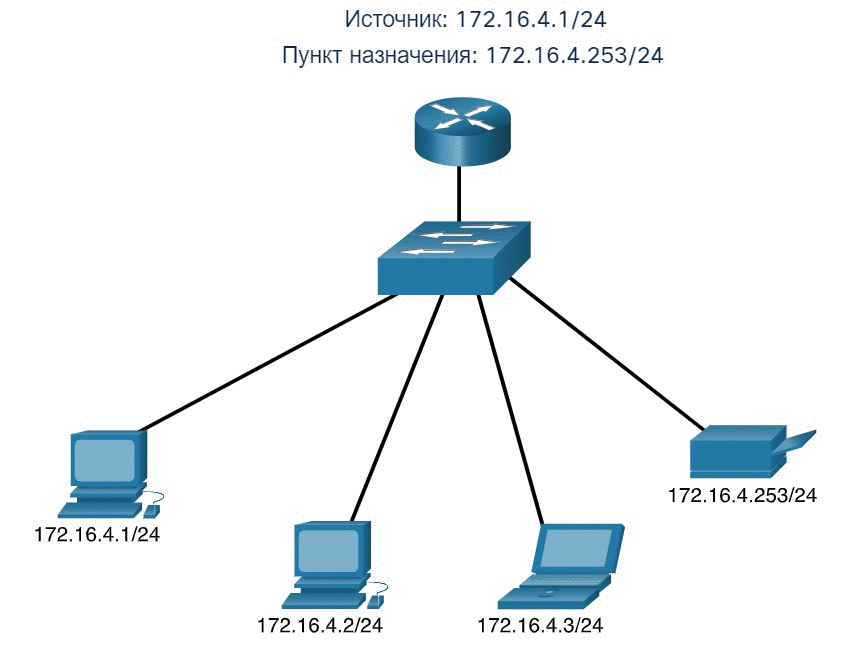
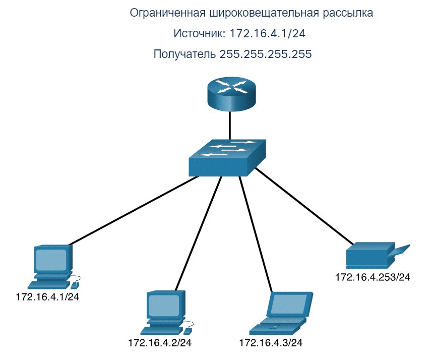
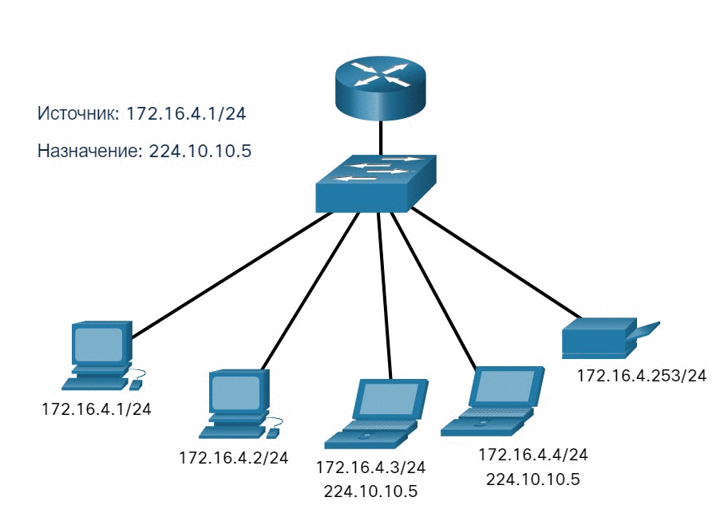

# Одноадресная, широковещательная и многоадресная рассылка IPv4

<!-- 11.2.1 -->
## Одноадресная рассылка

В предыдущем разделе вы узнали о структуре адреса IPv4; каждый из них имеет сетевую часть и часть узла. Существуют различные способы отправки пакета с исходного устройства, и эти различные передачи влияют на адреса назначения IPv4.

Одноадресная передача относится к одному устройству, отправляющему сообщение другому устройству в режиме один-в-один.

Одноадресный пакет имеет IP-адрес назначения, который является одноадресный адрес, который передается одному получателю. Исходный IP-адрес может быть только одноадресный адрес, так как пакет может быть получен только из одного источника. Это независимо от того, является ли конечный IP-адрес одноадресным, широковещательным или многоадресным.

На видео показан пример одноадресной рассылки.

**Примечание**: В этом курсе любая коммуникация между устройствами является одноадресной, если не указано иное.

IPv4-адреса узла являются одноадресными и входят в диапазон адресов от 1.1.1.1 до 223.255.255.255. Однако в этом диапазоне есть множество адресов, зарезервированных для специальных целей. Такие адреса будут рассмотрены позже.
***

<!-- 11.2.2 -->
## Широковещательная рассылка

Широковещательная рассылка связана с устройством, отправляющее сообщение всем остальным устройствам в сети в режиме «один-ко всем».

Пакет широковещательной рассылки содержит IPv4-адрес назначения, в узловой части которого присутствуют только единицы (1).

**Примечание:** IPv4 использует широковещательные пакеты. Однако, широковещательные пакеты в IPv6 отсутствуют.

Широковещательный пакет должен обрабатываться всеми устройствами в одном домене широковещательной рассылки. Домен широковещательной рассылки идентифицирует все узлы в одном сегменте сети. Есть два типа широковещательной рассылки: прямая и ограниченная. Прямая широковещательная рассылка передается всем узлам в конкретной сети. Например, узел в сети 172.16.4.0/24 отправляет пакет на адрес 172.16.4.255. Ограниченная широковещательная рассылка отправляется на адрес 255.255.255.255. По умолчанию, маршрутизаторы не пересылают широковещательные рассылки.

На видео показан пример ограниченной широковещательной рассылки.

Сеть на анимации состоит из трех хостов и принтера, подключенного к коммутатору и маршрутизатору. Анимация иллюстрирует хост с IP-адресом 172.16.4.1, отправляющим широковещательный пакет. Когда коммутатор получает широковещательный пакет, он пересылает все порты другим узлам, принтеру и маршрутизатору.

Широковещательный пакет использует ресурсы в сети и заставляет каждый принимающий узел в сети обрабатывать этот пакет. Таким образом, трафик широковещательной рассылки должен быть ограниченным, чтобы не влиять на производительность сети и других устройств. Поскольку маршрутизаторы разделяют домены широковещательной рассылки, разделение сетей может повысить производительность сети за счет устранения чрезмерного трафика широковещательной рассылки.

**Направленная широковещательная рассылка**

В дополнение к широковещательному адресу 255.255.255.255 для каждой сети имеется широковещательный IPv4 адрес. Пакет широковещательной рассылки содержит IPv4-адрес назначения, в узловой части которого присутствуют только единицы (1).. Например, направленный широковещательный адрес для 192.168.1.0/24 — 192.168.1.255. Этот адрес позволяет осуществлять связь со всеми узлами в этой сети. Чтобы отправить данные всем узлам в сети, узел может отправить один пакет, адресован широковещательному адресу сети.

Устройство, не подключенное напрямую к сети назначения, пересылает широковещательную передачу с IP-адресом так же, как и одноадресные IP-пакеты, предназначенные узлу в этой сети. Когда направленный широковещательный пакет достигает маршрутизатора, который напрямую подключен к сети назначения, этот пакет транслируется в сети назначения.

**Примечание:** Из-за проблем безопасности и предыдущих злоупотреблений со стороны злоумышленников, направленные широковещательные рассылки по умолчанию отключаются, начиная с Cisco IOS версии 12.0 с командой глобальной конфигурации **no ip directed-broadcasts**.
***

<!-- 11.2.3 -->
## Многоадресная рассылка

Многоадресная рассылка уменьшает трафик, позволяя узлу отправлять один пакет выбранной группе узлов, которые подписаны на группу многоадресной рассылки.

Многоадресный пакет — это пакет с IP-адресом назначения, который является адресом многоадресной рассылки. Для многоадресной рассылки в протоколе IPv4 зарезервированы адреса от 224.0.0.0 до 239.255.255.255.

Узлы, которые получают конкретные многоадресные данные, называются клиентами многоадресной рассылки. Клиенты многоадресной рассылки используют сервисы, запрошенные программой клиента для подписки на группу многоадресной рассылки.

Каждая группа многоадресной рассылки представлена одним групповым IPv4-адресом назначения. Когда IPv4-узел подписывается на группу многоадресной рассылки, он обрабатывает пакеты, адресованные на этот групповой адрес, а также пакеты, адресованные на его уникальный индивидуальный адрес.

Протоколы маршрутизации, такие как OSPF, используют многоадресную передачу. Например, маршрутизаторы с включенной функцией OSPF взаимодействуют друг с другом, используя зарезервированный адрес многоадресной рассылки OSPF 224.0.0.5. Только устройства с поддержкой OSPF будут обрабатывать эти пакеты с адресом IPv4 назначения 224.0.0.5. Все остальные устройства будут игнорировать эти пакеты.

На видео показано, как клиенты получают пакеты многоадресной рассылки.

***
<!-- 11.2.4 excersice -->
