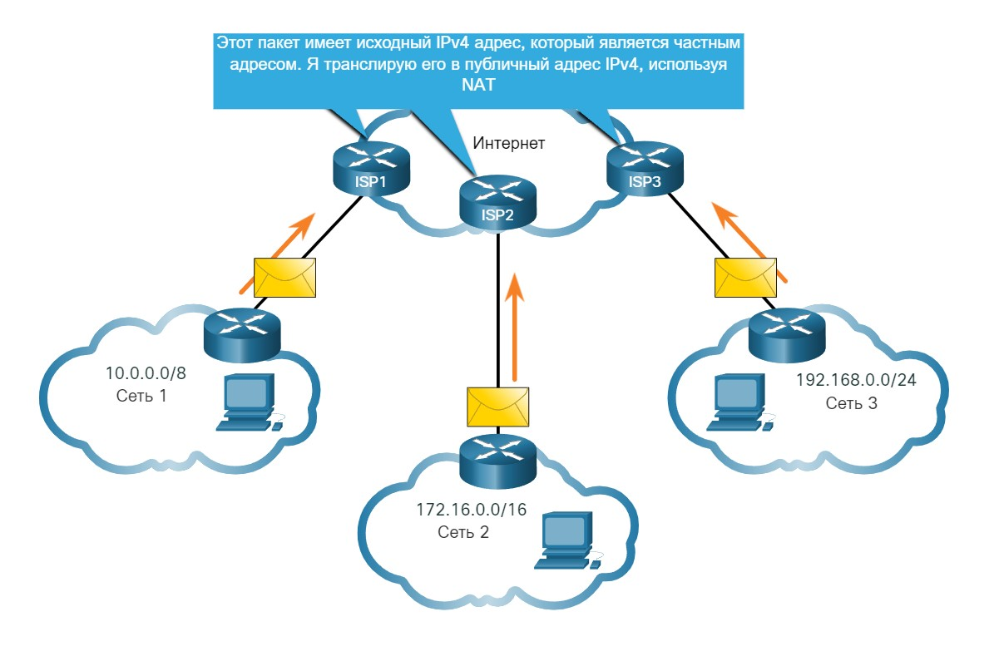
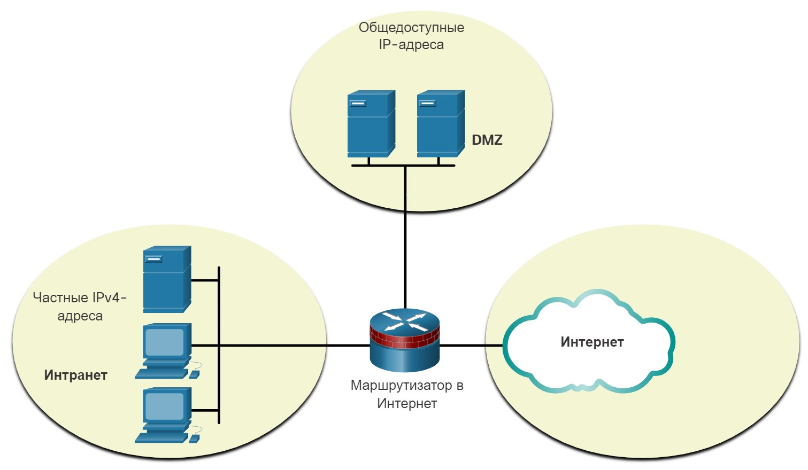
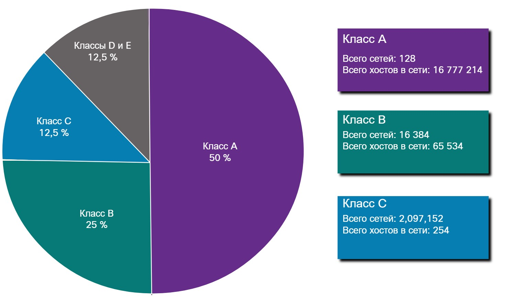

# Типы адресов IPv4

<!-- 11.3.1 -->
## Общедоступные и частные адреса IPv4
Так же, как существуют различные способы передачи пакета IPv4, существуют также различные типы адресов IPv4. Некоторые IPv4 адреса не могут использоваться для выхода в Интернет, а другие специально выделены для маршрутизации в Интернет. Некоторые из них используются для проверки соединения, другие назначаются самостоятельно. Как администратор сети, вы в конечном итоге будете очень знакомы с типами IPv4 адресов, но пока вы должны хотя бы знать, что это такое и когда их использовать.

Публичные IPv4-адреса представляют собой адреса, на глобальном уровне маршрутизируемые между маршрутизаторами интернет-провайдеров (Internet Service Provider, ISP). Однако, не все доступные IPv4-адреса можно использовать в Интернете. Имеются блоки адресов, называемые частными адресами, которые в большинстве компаний назначаются в качестве IPv4-адресов внутренних хостов.

В середине 1990-х гг. из-за исчерпания адресного пространства IPv4 были введены частные адреса IPv4. Частные адреса IPv4 не являются уникальными и могут использоваться в любой внутренней сети.

**Примечание:** Долгосрочным решением проблемы истощения адресов IPv4 был IPv6.

### Частные адреса IPv4 

|Сетевой адрес и префикс |Диапазон частных адресов RFC 1918 |
|-|-|
|10.0.0.0/8 |10.0.0.0 - 10.255.255.255 |
|172.16.0.0/12 |172.16.0.0 - 172.31.255.255 |
|192.168.0.0/16 |192.168.0.0 - 192.168.255.255 |

**Примечание:** Частные адреса определяются в RFC 1918 и иногда называют адресное пространство RFC 191
***

<!-- 11.3.2 -->

## Маршрутизация в Интернет
Большинство внутренних сетей, от крупных предприятий до домашних сетей, используют частные IPv4 адреса для адресации всех внутренних устройств (интрасети), включая хосты и маршрутизаторы. Однако, частные адреса не являются глобально маршрутизируемыми.

На рисунке клиентские сети 1, 2 и 3 отправляют пакеты за пределы своих внутренних сетей. Эти пакеты имеют исходный IPv4 адрес, который является частным адресом, и адрес назначения IPv4, который является общедоступным (глобально маршрутизируемым). Пакеты с частным адресом должны быть отфильтрованы (отброшены) или транслированы в публичный адрес перед отправкой пакета поставщику услуг Интернета.

### Частные адреса IPv4 и преобразование сетевых адресов (NAT)

<!-- /courses/itn-dl/aeed55b0-34fa-11eb-ad9a-f74babed41a6/af22bd90-34fa-11eb-ad9a-f74babed41a6/assets/2e2e10c1-1c25-11ea-81a0-ffc2c49b96bc.svg -->

Прежде чем поставщик услуг Интернета сможет переслать этот пакет, он должен преобразовать исходный адрес IPv4, который является частным адресом, в публичный адрес IPv4 с помощью преобразования сетевых адресов (NAT). NAT выполняет преобразование между частными и общедоступными адресами IPv4. Это обычно выполняется на маршрутизаторе, который обеспечивает соединение между внутренней сетью и сетью ISP. Частные IPv4 адреса в интрасети организации будут преобразованы в общедоступные IPv4 адреса перед маршрутизацией в Интернет.

**Примечание:** Несмотря на то, что устройство с частным IPv4-адресом не доступно напрямую с другого устройства через Интернет, IETF не рассматривает частные IPv4-адреса или NAT в качестве эффективных мер безопасности.

Организации, имеющие доступные в Интернете ресурсы, такие как веб-сервер, также будут иметь устройства с общедоступными IPv4-адресами. Как показано на рисунке, эта часть сети известна как DMZ (демилитаризованная зона). Маршрутизатор на рисунке не только выполняет маршрутизацию, он также выполняет NAT и выступает в качестве брандмауэра для обеспечения безопасности.

<!-- /courses/itn-dl/aeed55b0-34fa-11eb-ad9a-f74babed41a6/af22bd90-34fa-11eb-ad9a-f74babed41a6/assets/2e2e37d2-1c25-11ea-81a0-ffc2c49b96bc.svg -->

**Примечание:** Частные адреса IPv4 обычно используются в образовательных целях вместо использования публичного адреса IPv4, который, скорее всего, принадлежит организации.
***

<!-- 11.3.3 excercice -->

<!-- 11.3.4 -->
## IPv4-адреса специального назначения

Некоторые адреса (например, сетевые и широковещательные) нельзя назначать узлам. Также есть особые адреса, которые можно назначать узлам, но с ограничениями способов взаимодействия этих узлов в сети.

**адреса loopback**

Адреса loopback (127.0.0.0 /8 или от 127.0.0.1 до 127.255.255.254): чаще определяются как только один адрес 127.0.0.1— это особые адреса, которые используют узлы, чтобы направлять трафик самим себе. Например, они могут использоваться узлом, чтобы проверить работоспособность конфигурации TCP/IP, как показано на рисунке. Посмотрите, как адрес loopback 127.0.0.1 отвечает на эхо-запрос **ping**. Также обратите внимание, как любой адрес в этом блоке адресов возвращает пакет на локальный узел (например, см. процесс отправки второй команды **ping** на рисунке).

### Отправка эхо-запросов на интерфейс loopback

    C:\Users\NetAcad> ping 127.0.0.1
    Pinging 127.0.0.1 with 32 bytes of data:
    Reply from 127.0.0.1: bytes=32 time<1ms TTL=128
    Reply from 127.0.0.1: bytes=32 time<1ms TTL=128
    Reply from 127.0.0.1: bytes=32 time<1ms TTL=128
    Reply from 127.0.0.1: bytes=32 time<1ms TTL=128
    Ping statistics for 127.0.0.1:
        Packets: Sent = 4, Received = 4, Lost = 0 (0% loss),
    Approximate round trip times in milli-seconds:
        Minimum = 0ms, Maximum = 0ms, Average = 0ms
    C:\Users\NetAcad> ping 127.1.1.1
    Pinging 127.1.1.1 with 32 bytes of data:
    Reply from 127.1.1.1: bytes=32 time<1ms TTL=128
    Reply from 127.1.1.1: bytes=32 time<1ms TTL=128
    Reply from 127.1.1.1: bytes=32 time<1ms TTL=128
    Reply from 127.1.1.1: bytes=32 time<1ms TTL=128
    Ping statistics for 127.1.1.1:
        Packets: Sent = 4, Received = 4, Lost = 0 (0% loss),
    Approximate round trip times in milli-seconds:
        Minimum = 0ms, Maximum = 0ms, Average = 0ms
    C:\Users\NetAcad>

**Локальные адреса канала**

Локальные адреса канала или адреса автоматической частной IP-адресации (APIPA) 169.254.0.0 /16 или от 169.254.0.1 до 169.254.255.254 Они используются клиентом DHCP Windows для самостоятельной настройки в случае отсутствия доступных DHCP-серверов. Локальные адреса связи могут использоваться в одноранговом соединении, но не используются для этой цели.
***

<!-- 11.3.5 -->
## Устаревшая классовая адресация

В 1981 г. IPv4-адреса в сети Интернет назначались с помощью классовой адресации согласно RFC 790 (Назначенные адреса). Заказчикам выделялся сетевой адрес на основе одного из трех классов: A, B или C. Согласно стандарту RFC одноадресные диапазоны делятся на следующие классы.

- **Класс A (от 0.0.0.0/8 до 127.0.0.0/8)** разработан для очень крупных сетей, имеющих более 16 млн адресов хостов. Для обозначения сетевого адреса IPv4-адреса класса А использовали фиксированный префикс /8 с первым октетом. Остальные три октета использовались для адресов хостов.
- **Класс B (от 128.0.0.0/16 до 191.255.0.0/16)** разработан для поддержки потребностей средних и крупных сетей, содержащих приблизительно 65 000 адресов хостов. Адрес класса B использовал фиксированный префикс /16, два старших октета для обозначения сетевого адреса. Оставшиеся два октета определяли адреса хостов.
- **Класс C (от 192.0.0.0/24 до 223.255.255.0/24)** предназначен для небольших сетей с количеством хостов не более 254. Блоки адресов класса С использовали префикс /24 для трех старших октетов для указания адреса сети и последний октет для указания адресов хостов.

**Примечание:** Также имеется многоадресный блок класса D (от 224.0.0.0 до 239.0.0.0) и блок экспериментальных адресов класса E (от 240.0.0.0 до 255.0.0.0).

В то время, с ограниченным количеством компьютеров, использующих Интернет, классическая адресация была эффективным средством распределения адресов. Как показано на рисунке, сети классов A и B имеют очень большое количество адресов узлов, а класс C имеет очень мало. На сети класса А приходится 50% сетей IPv4. Это привело к тому, что большинство доступных адресов IPv4 не используются.

<!-- /courses/itn-dl/aeed55b0-34fa-11eb-ad9a-f74babed41a6/af22bd90-34fa-11eb-ad9a-f74babed41a6/assets/2e2ed415-1c25-11ea-81a0-ffc2c49b96bc.svg -->

В середине 1990-х годов, с появлением World Wide Web (WWW), классическая адресация устарела, чтобы более эффективно распределять ограниченное адресное пространство IPv4. Классовое распределение адресов было заменено бесклассовой адресацией, которая используется сегодня. Бесклассовая адресация игнорирует правила классов (A, B, C). Общедоступные сетевые адреса IPv4 (сетевые адреса и маски подсети) выделяются на основе числа адресов, которые могут быть оправданы.
***

<!-- 11.3.6 -->
## Назначение IP-адресов

Публичные IPv4-адреса представляют собой адреса, на глобальном уровне маршрутизируемые между маршрутизаторами интернет-провайдеров (Internet Service Provider, ISP). Публичные адреса IPv4 должны быть уникальными.

Назначение IPv4- и IPv6-адресов регулируется Администрацией адресного пространства Интернет (IANA) IANA управляет блоками IP-адресов и распределяет их между региональными интернет-регистраторами (RIR). Пять RIR показаны на рисунке.

Региональные интернет-регистраторы (RIR) отвечают за распределение IP-адресов между интернет-провайдерами (ISP), которые, в свою очередь, предоставляют блоки IPv4-адресов организациям и менее крупным провайдерам. Организации могут получить свои адреса непосредственно от региональных интернет-регистраторов (RIR) (в зависимости от правил конкретного регионального интернет-регистратора (RIR)).

Региональные интернет-регистры

<!-- /courses/itn-dl/aeed55b0-34fa-11eb-ad9a-f74babed41a6/af22bd90-34fa-11eb-ad9a-f74babed41a6/assets/2e2f4941-1c25-11ea-81a0-ffc2c49b96bc.svg -->

- **(AfriNIC)** Африканский сетевой информационный центр — Африка  
- **(APNIC)** Азиатско-Тихоокеанский сетевой информационный центр — Азиатско-Тихоокеанский регион  
- **(ARIN)** Американский реестр номеров в сети Интернет — Северная Америка.  
- **(LACNIC)** Региональный латиноамериканский и карибский реестр IP-адресов — Латинская Америка и некоторые острова Карибского моря  
- **(RIPE)** Réseaux IP Europeans  — Европа, Ближний Восток и Центральная Азия.

***

<!-- 11.3.7 excercise -->
<!-- 11.3.8 final test -->
