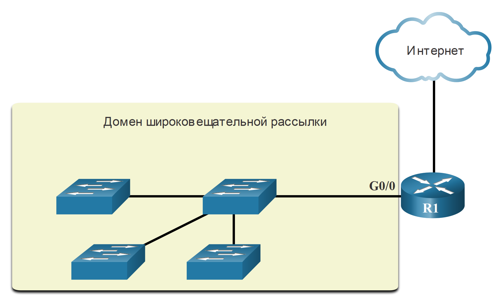
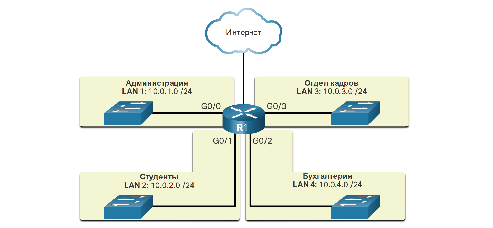

# Сегментация сети

<!-- 11.4.1 -->
##  Широковещательный домен и сегментация

Вы когда-нибудь получали электронное письмо, адресованное каждому человеку на работе или в школе? Это было широковещательная электронная почта. Надеюсь, в нем содержалась информация, которую каждый из вас должен был знать. Но часто широковещательная рассылка не очень актуальна для всех в списке рассылки. Иногда только часть населения должна читать эту информацию.

В локальной сети Ethernet устройства используют широковещательные передачи и протокол разрешения адресов (ARP) для поиска других устройств. ARP использует для отправки широковещательный адрес на уровне 2 с известным IPv4-адресу в локальной сети, чтобы обнаружить  MAC-адрес назначения. Устройства в локальных сетях Ethernet также находят другие устройства, использующие службы.  Узел, как правило, получает свои настройки IPv4-адреса с помощью протокола динамической настройки узла (DHCP), который осуществляет широковещательную рассылку в локальной сети, чтобы найти DHCP-сервер.

Коммутаторы выполняют широковещательную рассылку на все интерфейсы, за исключением того интерфейса, через который была получена рассылка. Например, если бы коммутатор, показанный на рисунке, получил широковещательную рассылку, он бы переслал ее другим коммутаторам и другим пользователям, подключенным к сети.

### Маршрутизаторы разделяют  домен широковещательной рассылки

<!-- /courses/itn-dl/aeed55b0-34fa-11eb-ad9a-f74babed41a6/af22bd92-34fa-11eb-ad9a-f74babed41a6/assets/2e3033a2-1c25-11ea-81a0-ffc2c49b96bc.svg -->

<!--
Маршрутизатор R1 подключается к коммутатору через интерфейс G0/0. Коммутатор подключается к трем другим коммутаторам. Домен широковещательной рассылки состоит из четырех коммутаторов и интерфейса маршрутизатора, к которому они подключены. Подключение маршрутизатора к Интернету не входит в домен широковещательной рассылки.
-->

Маршрутизаторы не выполняют широковещательную рассылку. Когда маршрутизатор получает широковещательную рассылку, он не пересылает ее на другие интерфейсы. Например, когда маршрутизатор R1 получает широковещательную рассылку на свой интерфейс Gigabit Ethernet 0/0, он не пересылает ее на другие интерфейсы.

Таким образом, каждый интерфейс маршрутизатора подключен к широковещательному домену, и широковещательные рассылки выполняются только в рамках определенного домена рассылки.

<!-- 11.4.2 -->
## Проблемы с крупными широковещательными доменами

Крупный широковещательный домен представляет собой сеть, соединяющую множество узлов. Проблема крупного широковещательного домена заключается в следующем: узлы могут генерировать избыточную рассылку и негативно влиять на работу сети. На рисунке локальная сеть LAN 1 связывает 400 пользователей, каждый из которых может генерировать трафик широковещательной рассылки. Это приводит к замедлению сетевых операций из-за значительного объема трафика, который он может вызвать, и замедление работы устройства, поскольку устройство должно принимать и обрабатывать каждый широковещательный пакет.

### Крупный домен широковещательной рассылки

<!-- /courses/itn-dl/aeed55b0-34fa-11eb-ad9a-f74babed41a6/af22bd92-34fa-11eb-ad9a-f74babed41a6/assets/2e305ab4-1c25-11ea-81a0-ffc2c49b96bc.svg -->

<!--
Маршрутизатор R1 подключается к коммутатору через интерфейс G0/0. Коммутатор подключается к трем другим коммутаторам. Домен широковещательной рассылки состоит из четырех коммутаторов и интерфейса маршрутизатора, к которому они подключены. Оно определяется как LAN1 с адресом 172.16.0.0/16. Подключение маршрутизатора к Интернету не входит в домен широковещательной рассылки.
-->

Для решения этой проблемы надо сократить размер сети, создав меньшие домены широковещательной рассылки. Такой процесс называется разделением на подсети. Такие более мелкие сети называются подсетями.

На рисунке, например, 400 пользователей локальной сети LAN 1 с сетевым адресом 172.16.0.0/16 были разделены на две подсети по 200 пользователей каждая — 172.16.0.0/24 и 172.16.1.0/24. Рассылка ограничивается более мелкими доменами широковещательной рассылки. Таким образом, широковещательная рассылка из локальной сети LAN 1 не распространится на сеть LAN 2.

### Обмен данными между сетями

<!-- /courses/itn-dl/aeed55b0-34fa-11eb-ad9a-f74babed41a6/af22bd92-34fa-11eb-ad9a-f74babed41a6/assets/2e3081c2-1c25-11ea-81a0-ffc2c49b96bc.svg -->

<!--
Маршрутизатор R1 подключен к двум локальным сетям, представляющим два разных домена широковещательной рассылки. Слева подключен через G0/0 коммутатор, поддерживающий 200 пользователей в локальной сети 1 с сетевым адресом 172.16.0.0/24. Справа подключен через G0/1 коммутатор, поддерживающий 200 пользователей в локальной сети 2 с сетевым адресом 172.16.1.0/24.
-->

Обратите внимание на изменение длины префикса с /16 на /24. Использование битов в узловой части для создания дополнительных подсетей — основа разделения на подсети.

**Примечание**: Термины «подсеть» и «сеть» часто используются как синонимы. Большинство сетей сами являются подсетями более крупных блоков адресов.

<!-- 11.4.3 -->
## Причины сегментации сетей

Разделение на подсети снижает общий объем сетевого трафика и повышает производительность сети. Кроме того, это дает возможность администраторам применять меры безопасности. Например, определить подсети, которым разрешено и которым не разрешено взаимодействовать друг с другом. Другая причина заключается в том, что он уменьшает количество устройств, пострадавших от ненормального широковещательного трафика из-за неправильных конфигураций, аппаратных и программных проблем или злонамеренных намерений.

Существует несколько способов использования подсетей для управления сетевыми устройствами.

### Местоположение

**Разделение на подсети по местоположению**

<!-- /courses/itn-dl/aeed55b0-34fa-11eb-ad9a-f74babed41a6/af22bd92-34fa-11eb-ad9a-f74babed41a6/assets/2e30a8d5-1c25-11ea-81a0-ffc2c49b96bc.svg -->

<!--
На диаграмме показано пятиэтажное здание с коммутаторами на каждом этаже.  Каждый коммутатор находится в другой LAN/подсети с разным сетевым адресом, подключенным к одному маршрутизатору R1 через другой гигабитный интерфейс Ethernet. На первом и пятом этажах показаны следующие подсети: LAN 1 имеет сетевой адрес 10.0.1.0/24 и подключен к G0/0; LAN 2 имеет сетевой адрес 10.0.2.0/24 и подключен к G0/1; LAN 3 имеет сетевой адрес 10.0.3.0/24 и подключен к G0/2; LAN 4 имеет сетевой адрес 10.0.4.0/ 24 и подключен к G0/3; и LAN 5 имеет сетевой адрес 10.0.5.0/24 и подключен к G0/4. R1 также имеет подключение к Интернету.
-->

### Группа или функция

**Разделение на подсети по группам или функциям**

<!-- /courses/itn-dl/aeed55b0-34fa-11eb-ad9a-f74babed41a6/af22bd92-34fa-11eb-ad9a-f74babed41a6/assets/2e30cfe6-1c25-11ea-81a0-ffc2c49b96bc.svg -->

<!--
На диаграмме показан маршрутизатор R1, соединяющий четыре LAN/подсети вместе, назначенные в соответствии с группой сотрудников. Подсеть администрации, LAN 1 по адресу 10.0.1.0/24, подключена к G0/0. Подсеть студентов, LAN 2 по адресу 10.0.2.0/24, подключена к G0/1. Подсеть Отдела кадров, LAN 3 по адресу 10.0.3.0/24, подключена к G0/3. Подсеть бухгалтерии, LAN 4 по адресу 10.0.4.0/24, подключена к G0/2. R1 также имеет подключение к Интернету.
-->

### Тип устройства

**Разделение на подсети по типу устройств**

<!-- /courses/itn-dl/aeed55b0-34fa-11eb-ad9a-f74babed41a6/af22bd92-34fa-11eb-ad9a-f74babed41a6/assets/2e30f6f7-1c25-11ea-81a0-ffc2c49b96bc.svg -->

<!--
На диаграмме показан маршрутизатор R1, соединяющий три LAN/подсети, назначенные в соответствии с типом устройства. LAN 1 по адресу 10.0.1.0/24 подключена к G0/0 и включает все хосты. LAN 2 по адресу 10.0.2.0/24 подключена к G0/1 и включает все принтеры. LAN 3 по адресу 10.0.3.0/24 подключена к G0/2 и включает в себя все серверы. R1 также имеет подключение к Интернету.
-->

Сетевые администраторы могут создавать подсети, используя любое другое подразделение, которое имеет смысл для сети. Обратите внимание, что на каждом рисунке для подсетей используется более длинный префикс, обозначающий сеть.

Понимание принципа разделения сети на подсети — главный навык, которым должен обладать каждый сетевой администратор. Разработаны различные методы, помогающие понять суть этого процесса. На первый взгляд разделение на сети может показаться сложным, но чем больше внимания вы будете уделять деталям и чем больше будете практиковаться, тем этот процесс станет для вас проще и понятнее.

<!-- 11.4.4 -->
<!-- quiz -->

