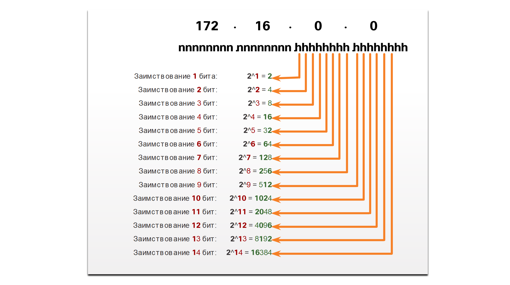
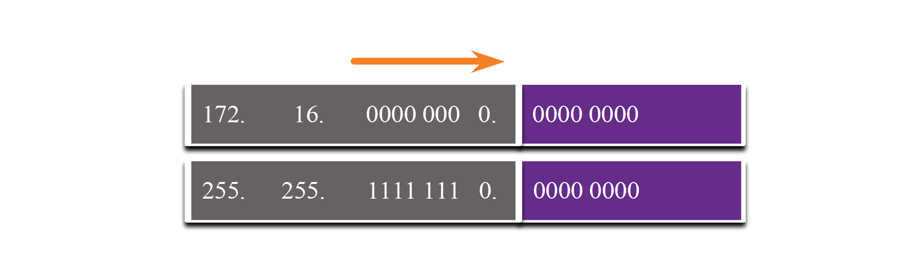
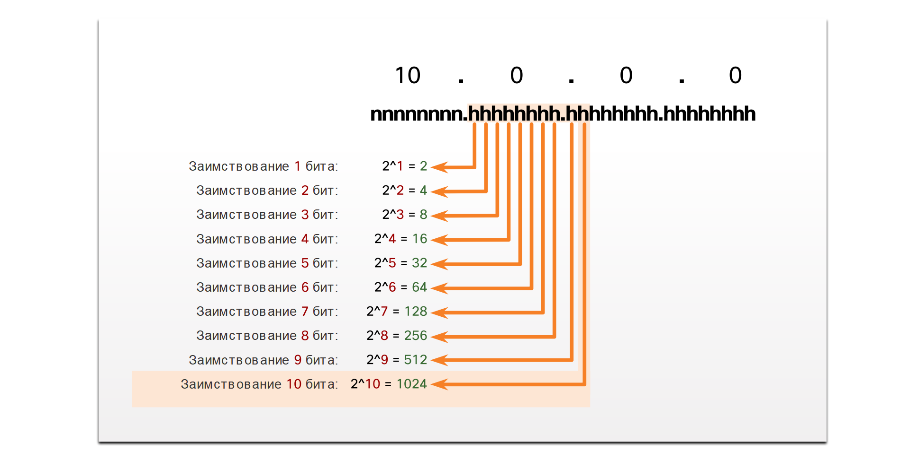

# Подсеть: /16 и /8

<!-- 11.6.1 -->
## Создание подсетей с префиксом /16

Некоторые подсети проще, чем другие подсети. В этом разделе объясняется, как создать подсети, каждая из которых имеет одинаковое количество узлов.

Если требуется большее количество подсетей, необходимо использовать IPv4-сеть с большим числом бит в узловой части для заимствования. Например, адрес сети 172.16.0.0 имеет маску по умолчанию /16 или 255.255.0.0. Этот адрес имеет по 16 бит в сетевой и узловой части. 16 бит в узловой части можно использовать для создания подсетей. В таблице на рисунке представлены все возможные сценарии разделения на подсети с префиксом /16.

### Subnet a /16 Network

| **Длина префикса** | **Маска подсети** |  **Сетевой адрес   (n = сеть; h = узел)**  | **# Количество подсетей** | **# Количество хостов** |
| --- | --- | --- | --- | --- |
| /17 | 255.255.128.0 | ` nnnnnnnn.nnnnnnnn.nhhhhhhh.hhhhhhhh ` ` 11111111.11111111.10000000.00000000 ` | **2** | 32766 |
| /18 | 255.255.192.0 | ` nnnnnnnn.nnnnnnnn.nnhhhhhh.hhhhhhhh ` ` 11111111.11111111.11000000.00000000 ` | **4** | 16382 |
| /19 | 255.255.224.0 | ` nnnnnnnn.nnnnnnnn.nnnhhhhh.hhhhhhhh ` ` 11111111.11111111.11100000.00000000 ` | **8** | 8 190 |
| /20 | 255.255.240.0 | ` nnnnnnnn.nnnnnnnn.nnnnhhhh.hhhhhhhh ` ` 11111111.11111111.11110000.00000000 ` | **16** | 4 094 |
| /21 | 255.255.248.0 | ` nnnnnnnn.nnnnnnnn.nnnnnhhh.hhhhhhhh ` ` 11111111.11111111.11111000.00000000 ` | **32** | 2 046 |
| /22 | 255.255.252.0 | ` nnnnnnnn.nnnnnnnn.nnnnnnhh.hhhhhhhh ` ` 11111111.11111111.11111100.00000000 ` | **64** | 1 022 |
| /23 | 255.255.254.0 | ` nnnnnnnn.nnnnnnnn.nnnnnnnh.hhhhhhhh ` ` 11111111.11111111.11111110.00000000 ` | **128** | 510 |
| /24 | 255.255.255.0 | ` nnnnnnnn.nnnnnnnn.nnnnnnnn.hhhhhhhh ` ` 11111111.11111111.11111111.00000000 ` | **256** | 254 |
| /25 | 255.255.255.128 | ` nnnnnnnn.nnnnnnnn.nnnnnnnn.nhhhhhhh ` ` 11111111.11111111.11111111.10000000 ` | **512** | 126 |
| /26 | 255.255.255.192 | ` nnnnnnnn.nnnnnnnn.nnnnnnnn.nnhhhhhh ` ` 11111111.11111111.11111111.11000000 ` | **1024** | 62 |
| /27 | 255.255.255.224 | ` nnnnnnnn.nnnnnnnn.nnnnnnnn.nnnhhhhh ` ` 11111111.11111111.11111111.11100000 ` | **2048** | 30 |
| /28 | 255.255.255.240 | ` nnnnnnnn.nnnnnnnn.nnnnnnnn.nnnnhhhh ` ` 11111111.11111111.11111111.11110000 ` | **4 096** | 14 |
| /29 | 255.255.255.248 | ` nnnnnnnn.nnnnnnnn.nnnnnnnn.nnnnnhhh ` ` 11111111.11111111.11111111.11111000 ` | **8 192** | 6 |
| /30 | 255.255.255.252 | ` nnnnnnnn.nnnnnnnn.nnnnnnnn.nnnnnnhh ` ` 11111111.11111111.11111111.11111100 ` | **16 384** | 2 |

Хотя вам не нужно запоминать эту таблицу, вам все равно нужно хорошее понимание того, как генерируется каждое значение в таблице. Не позволяйте размеру таблицы запугать вас. Большой она получилась из-за 8 дополнительных бит, которые можно заимствовать, и таким образом количество подсетей и узлов просто увеличивается.

<!-- 11.6.2 -->
## Создание 100 подсетей с помощью префикса /16

Рассмотрим крупное предприятие, которому необходимо хотя бы 100 подсетей, и которое выбрало частный адрес 172.16.0.0/16 в качестве адреса внутренней сети.

При заимствовании бит из адреса /16 начните заимствовать биты в третьем октете, продолжая слева направо. Заимствуйте один бит каждый раз до тех пор, пока не будет достигнуто число бит, необходимое для создания 100 подсетей.

На рисунке показано количество подсетей, которое может быть создано при заимствовании бит из третьего и четвертого октетов. Обратите внимание, что теперь может быть заимствовано до 14 бит из узловой части.

### Количество созданных подсетей

<!-- /courses/itn-dl/aeed55b0-34fa-11eb-ad9a-f74babed41a6/af22e4a0-34fa-11eb-ad9a-f74babed41a6/assets/2e32a4a4-1c25-11ea-81a0-ffc2c49b96bc.svg -->

<!--
На рисунке показано, как вычислить количество подсетей, созданных при заимствовании битов третьего и четвертого октетов сетевого адреса IPv4. Формула для определения количества созданных подсетей следующая -  2 в степени числа заимствованных битов. На рисунке показан адрес 172.16.0.0. Под ним находятся буквы nnnnnnnn.nnnnnnnn.hhhhhhhh.hhhhhhhh. Он начинается с заимствования первого h бит в третьем октете, что приводит к 2 в степени 1 = 2 подсетей. Когда первые два h бита в третьем октете заимствованы, формула равна 2 в степени  2 = 4. Это продолжается до тех пор, пока первые 14 h бит не будут заимствованы из третьего и четвертого октетов, в результате чего 2 в степени 14 = 16384. Последние два h бита в четвертом октете остаются прежними.
-->

Чтобы удовлетворить потребности предприятия, потребуется заимствовать 7 бит (то есть 27 = 128 подсетей), как показано на рисунке.

### Сеть 172.16.0.0/23

<!-- /courses/itn-dl/aeed55b0-34fa-11eb-ad9a-f74babed41a6/af22e4a0-34fa-11eb-ad9a-f74babed41a6/assets/2e364e26-1c25-11ea-81a0-ffc2c49b96bc.svg -->

<!--
На рисунке показано десятичное и битовое представление сетевого адреса, а под ним маска подсети, когда семь бит заимствованы в третьем октете для создания подсетей. Первые два октета показаны десятичными, а последние два октета показаны в двоичном формате. Сетевой адрес 172.16.0000 0000.0000 0000. Маска подсети — 255.255.1111 1110.0000 0000.
-->

Как вы помните, маска подсети должна изменяться для отражения заимствованных бит. В этом примере при заимствовании семи бит маска будет расширена на 7 бит в третьем октете. В десятичном формате маска будет иметь вид 255.255.254.0 или префикс /23, поскольку третий октет в двоичном формате имеет вид 11111110, а четвертый октет — 00000000.

На рисунке показаны результирующие подсети от 172.16.0.0/23 до 172.16.254.0/23.

### Полученные в результате разделения на  подсети с префиксом  /23

<!-- /courses/itn-dl/aeed55b0-34fa-11eb-ad9a-f74babed41a6/af22e4a0-34fa-11eb-ad9a-f74babed41a6/assets/2e367534-1c25-11ea-81a0-ffc2c49b96bc.svg -->

<!--
На рисунке показаны подсети, созданные при использовании маски подсети /23 с адресом 172.16.0.0. Во-первых, он показывает десятичное и битовое представление сетевого адреса, а под ним маска подсети. Первые два октета показаны десятичными, а последние два октета показаны в двоичном формате. Сетевой адрес 172.16.0000 0000.0000 0000. Маска подсети — 255.255.1111 1110.0000 0000. Первые два октета и первые семь бит в третьем октете затенены серым цветом, а последний бит в третьем октете и весь четвертый октет затенены фиолетовым цветом. При заимствовании 7 бит создаются 128 подсетей Ниже, он показывает первые три подсети и последнюю созданную подсеть. Первые два октета показаны десятичными, а последние два октета показаны в двоичном формате. Первая подсеть — 172.16.0000 0000.0000 0000 или 172.16.0.0/23. Вторая подсеть — 172.16.0000 0010.0000 0000 или 172.16.2.0/23. Третья подсеть — 172.16.0000 0100.0000 0000 или 172.16.4.0/23. Символы ...по...  используется, чтобы показать, что этот процесс продолжается до тех пор, пока не достигнет последней созданной подсети 172.16.1111 1110.0000 0000 или 172.16.254.0/23.
-->

После заимствования 7 бит для подсети в третьем октете остался один бит в узловой части, а в четвертом октете — 8 бит в узловой части. В общей сложности осталось 9 не заимствованных бит. 29 результатов в 512 общих адресов узлов. Первый адрес зарезервирован для сетевого адреса, а последний — для широковещательного адреса, поэтому вычитание для этих двух адресов (29 - 2) равно 510 доступных адресов хоста для каждой подсети /23.

Как показано на рисунке, адрес первого узла в первой подсети — 172.16.0.1, а адрес последнего узла — 172.16.1.254.

### Диапазон адресов подсети 172.16.0.0/23

<!-- /courses/itn-dl/aeed55b0-34fa-11eb-ad9a-f74babed41a6/af22e4a0-34fa-11eb-ad9a-f74babed41a6/assets/2e369c43-1c25-11ea-81a0-ffc2c49b96bc.svg -->

<!--
На рисунке показан диапазон адресов для подсети 172.16.0.0/23. Первые два октета показаны в десятичном виде, а последние два октета — в двоичном формате, затем адрес — в десятичном формате. Сетевой адрес: 172.16.0000 0000.0000 0000 = 172.16.0.0/23. Первый используемый адрес узла — 172.16.0000 0000.0000 0001 = 172.16.0.1/23. Последний  используемый адрес узла — 172.16.0000 0001.1111 1110 = 172.16.255.254/23. Широковещательный адрес  172.16.0000 0001.1111 1111 = 172.16.255.255/23.
-->

<!-- 11.6.3 -->
## Создание 1000 подсетей с помощью префикса /8

Некоторым организациям, например, небольшим операторам связи или крупным предприятиям, может потребоваться еще большее количество подсетей. В качестве примера возьмем небольшого оператора связи, которому требуется 1000 подсетей для клиентов. Каждому клиенту потребуется большое пространство в узловой части для создания собственных подсетей.

Интернет-провайдер имеет сетевой адрес 10.0.0.0 255.0.0.0 или 10.0.0.0/8. Это означает, что при разделении на подсети для заимствования доступно 8 бит в сетевой части адреса и 24 бита в узловой части. Таким образом, небольшой оператор связи разобьет на подсети всю сеть 10.0.0.0/8.

Как и всегда, для создания подсети нужно позаимствовать биты из узловой части адреса исходной сети. Начиная с первого слева доступного бита в узловой части, мы будем заимствовать по одному биту за один раз до тех пор, пока не получим количество бит, необходимых для создания 1000 подсетей. Как видно из рисунка 1, 10 бит потребуется заимствовать для создания 1024 подсетей. (210=1024). Это означает, что потребуется заимствовать 8 бит во втором октете и 2 дополнительных бита в третьем.

### Количество созданных подсетей

<!-- /courses/itn-dl/aeed55b0-34fa-11eb-ad9a-f74babed41a6/af22e4a0-34fa-11eb-ad9a-f74babed41a6/assets/2e36c354-1c25-11ea-81a0-ffc2c49b96bc.svg -->

<!--
На рисунке показано, как вычислить количество подсетей, созданных при заимствовании битов из второго и третьего октетов сетевого адреса IPv4. Формула для определения количества созданных подсетей следующая - 2 в степени числа заимствованных битов. На рисунке показан адрес 10.0.0.0. Под ним находятся буквы nnnnnnnn.hhhhhhhh.hhhhhhhh.hhhhhhhh. Он начинается с заимствования первого h бит во втором октете, что приводит к 2 в степени 1 = 2 подсетей. Когда первые два h бита во втором октете заимствованы, формула равна 2 в степени 2 = 4. Это продолжается до тех пор, пока первые 10 h бит не будут заимствованы из второго и третьего октетов, в результате чего 2 в степени 10 = 1024.
-->

На рисунке показан адрес сети и результирующая маска подсети, которая преобразуется в 255.255.192.0 или префикс 10.0.0.0/18.

### Сеть 10.0.0.0/18

<!-- /courses/itn-dl/aeed55b0-34fa-11eb-ad9a-f74babed41a6/af22e4a0-34fa-11eb-ad9a-f74babed41a6/assets/2e371171-1c25-11ea-81a0-ffc2c49b96bc.svg -->

<!--
На графике показано десятичное и битовое представление сетевого адреса, а под ним маска подсети, когда 10 бит заимствованы во втором и третьем октетах для создания подсетей. Первый октет отображается в десятичном формате, а последние три октета отображаются в двоичном формате. Сетевой адрес: 10.1111 1111.1100 0000.0000 0000 (должен быть 10.0000 0000.0000 0000 0000 при фиксированном). Маска подсети — 255.255.1111 1110.0000 0000.
-->

На рисунке показаны результирующие подсети, созданные путем заимствования 10 бит, от 10.0.0.0/18 до 10.255.128.0/18.

### Полученные в результате разделения на  подсети с префиксом  /18

<!-- /courses/itn-dl/aeed55b0-34fa-11eb-ad9a-f74babed41a6/af22e4a0-34fa-11eb-ad9a-f74babed41a6/assets/2e371176-1c25-11ea-81a0-ffc2c49b96bc.svg -->

<!--
На рисунке показаны подсети, созданные при использовании маски подсети /18 с адресом 10.0.0.0. Во-первых, он показывает десятичное и битовое представление сетевого адреса, а под ним маска подсети. Первый октет отображается в десятичном формате, а последние три октета отображаются в двоичном формате. Сетевой адрес: 10.0000 0000.0000 0000.0000 0000. Маска подсети — 255.1111 1111.1100 0000.0000 0000. Первый октет и следующие 10 бит затенены серым цветом, а остальные биты затенены фиолетовым цветом. Ниже текст гласит: заимствование 10 битов создает 1024 подсети. Ниже, он показывает первые пять подсетей и последнюю созданную подсеть. Первый октет отображается в десятичном формате, а последние три октета отображаются в двоичном формате. Первая подсеть — 10.0000 0000.0000 0000.0000 0000 или 10.0.0.0/18. Вторая подсеть — 10.0000 0000.0100 0000.0000 0000 или 10.0.64.0/18. Третья подсеть — 10.0000 0000.1000 0000.0000 0000 или 10.0.128.0/18. Четвертая подсеть — 10.0000 0000.1100 0000.0000 0000 или 10.0.192.0/18. Пятая подсеть — 10.0000 0001.0000 0000.0000 0000 или 10.1.0.0/18. Символы ..по.. используется, чтобы показать, что этот процесс продолжается до тех пор, пока не будет достигнут последняя созданная подсеть 10.1111 1111.1100 0000.0000 0000 или 10.255.192.0/18.
-->

Заимствование 10 бит для создания подсетей, оставляет 14 битов хоста для каждой подсети. Вычитание двух узлов в подсети (один для сетевого адреса и один для широковещательного адреса) равняется 214 - 2 = 16382 узлов в подсети. Это означает, что каждая из 1000 подсетей может поддерживать до 16382 узлов.

На рисунке  показаны особенности первой подсети.

### Диапазон адресов подсети 10.0.0.0/18

<!-- /courses/itn-dl/aeed55b0-34fa-11eb-ad9a-f74babed41a6/af22e4a0-34fa-11eb-ad9a-f74babed41a6/assets/2e373885-1c25-11ea-81a0-ffc2c49b96bc.svg -->

<!--
На рисунке показан диапазон адресов для подсети 10.0.0.0/18. Первый октет показан в десятичном виде, а последние три октета показаны в двоичном формате, затем адрес отображается в десятичном формате с точками. Сетевой адрес: 10.0000 0000.0000 0000.0000 0000 = 10.0.0.0/18. Первый адрес узла — 10.0000 0000.0000 0000.0000 0001 = 10.0.0.1/18. Последний адрес узла — 10.0000 0000.0011 1111.1110 = 10.0.63.254/18. Адрес вещания: 10.0000 0000.0011 1111. 1111 1111 = 10.0.63.255/18.
-->

<!-- 11.6.4 -->
## Видео - Организация подсетей по нескольким октетам

Нажмите Воспроизвести, чтобы посмотреть видеоролик о том, как использовать «магическое число» для классовых границ бит.

<video width="768" height="432" controls>
  <source src="./assets/11.6.4.mp4" type='video/mp4; codecs="avc1.42E01E, mp4a.40.2"'>
</video>

<!-- 11.6.5 -->
## Упражнение. Расчет маски подсети

Инструкции:

В этом задании дается маска подсети в десятичном формате. Введите двоичное представление маски подсети в поля октета. Кроме того, преобразуйте маску в префиксный формат записи в поле «Префиксная запись».

<!-- 11.6.6 -->
## Лабораторная работа - Расчет подсетей IPv4

В этой лабораторной работе вы выполните следующие задачи.

* Часть 1: Определение подсетей по IPv4-адресу
* Часть 2: Расчет подсетей по IPv4-адресу

[Расчет подсетей IPv4 (lab)](./assets/11.6.6-lab---calculate-ipv4-subnets.pdf)

