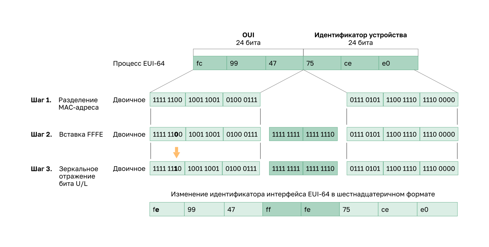

<!-- verified: agorbachev 03.05.2022 -->

<!-- 12.5.1 -->
## ICMPv6: сообщения RS и RA

Если вы не хотите статически настраивать GUAs IPv6, не нужно беспокоиться. Большинство устройств получают свои интерфейсы GUA IPv6 динамически. В этом разделе объясняется, как этот процесс работает с использованием сообщений объявления маршрутизатора (router advertisement, RA) и запроса маршрутизатора (router solicitation, RS). Эта тема становится довольно технической, но когда вы поймете разницу между тремя методами, которые может использовать реклама маршрутизатора, а также то, как процесс EUI-64 для создания идентификатора интерфейса отличается от случайно сгенерированного процесса, вы совершите огромный скачок в вашем опыте IPv6!

Существует три метода для сообщений RA:

* **Метод 1: StateLess Address Auto Configuration (SLAAC)** - «У меня есть все, что вам нужно, включая префикс, длину префикса и адрес шлюза по умолчанию».
* **Метод 2: SLAAC и DHCPv6.**  «Вот моя информация, но вам нужно получить другие сведения, такие как DNS-адреса от DHCPv6-сервера».
* **Метод 3: Stateful DHCPv6 (без SLAAC)** - «Я могу дать вам ваш адрес шлюза по умолчанию. Вам нужно попросить сервер DHCPv6 с сохранением состояния для всей вашей другой информации».

Для GUA устройство получает адрес динамически через сообщения протокола управления сообщениями Интернета версии 6 (ICMPv6). IPv6-маршрутизаторы каждые 200 секунд отправляют сообщения RA ICMPv6 всем устройствам в сети под управлением IPv6. Сообщение RA также будет отправлено в ответ на хост, отправляющий сообщение RS ICMPv6, которое является запросом на сообщение RA. Оба сообщения показаны на рисунке.


1. Сообщения RS отправляются на все маршрутизаторы IPv6 хостами, запрашивающими информацию об адресации.
2. Сообщения RA отправляются на все узлы IPv6. Если используется только SLAAC, функция RA включает сведения о префиксе сети, длине префикса и шлюзе по умолчанию.

Сообщения RA на интерфейсах Ethernet маршрутизатора IPv6. Маршрутизатор должен быть включен для маршрутизации IPv6, которая по умолчанию не включена. Чтобы маршрутизатор работал как IPv6-маршрутизатор, необходимо использовать команду глобальной настрйоки **ipv6 unicast-routing**.

Сообщение RA ICMPv6 указывает IPv6-устройству, как ему получить информацию по адресации. Окончательное решение зависит от операционной системы устройства. Сообщение RA ICMPv6 включает следующую информацию.

* **Префикс сети и длину префикса:** сообщают устройству, к какой сети оно относится
* **Адрес шлюза по умолчанию:** локальный IPv6-адрес канала, IPv6-адрес источника сообщения RA
* **DNS-адрес и имя домена:** адреса DNS-серверов и имя домена.

<!-- 12.5.2 -->
## SLAAC

Данный метод позволяет устройству создавать свой собственный GUA без услуг DHCPv6. При использовании SLAAC устройства получают всю необходимую информацию из сообщений Router Advertisement (RA) от ICMPv6-маршрутизатора.

По умолчанию сообщение RA предлагает принимающему устройству использовать данные в сообщении RA для создания собственного глобального индивидуального IPv6-адреса и получения иной информации. Участие DHCPv6-сервера не требуется.

SLAAC не предполагает сохранения состояния, что означает отсутствие центрального сервера (например, DHCPv6-сервера, запоминающего состояния адресов), выделяющего глобальные индивидуальные адреса и хранящего список устройств и их адресов. В случае применения SLAAC клиентское устройство использует информацию в сообщении RA для создания собственного глобального индивидуального адреса. Как показано на рисунке, две части адреса создаются следующим образом:

* **Префикс** - объявляется в сообщении RA.
* **Идентификатор интерфейса** - создается либо с помощью расширенного уникального идентификатора EUI-64, либо путем создания случайного 64-битного числа.


1. Маршрутизатор отправляет сообщение RA с префиксом для локального канала.
2. ПК использует SLAAC для получения префикса из сообщения RA и создает свой собственный идентификатор интерфейса.

<!-- 12.5.3 -->
## SLAAC и DHCPv6-сервер без сохранения состояния адресов

Интерфейс маршрутизатора может быть настроен на отправку объявлений маршрутизатора с помощью SLAAC и DHCPv6-сервера без сохранения состояния адресов (или только DHCPv6-сервера с сохранением состояния адресов).

Как показано на рисунке, с помощью этого метода, сообщение RA предполагает, что устройства используют следующее:

* SLAAC для создания собственного IPv6 GUA
* Локальный адрес канала маршрутизатора, IPv6-адрес источника RA, в качестве адреса шлюза по умолчанию
* DHCPv6-сервер, не сохраняющий состояния адресов, для получения другой информации, такой как адрес DNS-сервера и имя домена.

**Примечание**: DHCPv6-сервер без сохранения состояния адресов распределяет адреса DNS-серверов и имена доменов. Он не выделяет GUA.


1.  ПК отправляет RS всем маршрутизаторам IPv6: «Мне нужна информация адресации».
2.  Маршрутизатор отправляет сообщение RA всем узлам IPv6 с указанным способом 2 (SLAAC и DHCPv6). Здесь указаны ваш префикс, длина префикса и основной шлюз». Но вам нужно будет получить информацию DNS с сервера DHCPv6.
3.  ПК отправляет сообщение DHCPv6 Solicit на все серверы DHCPv6. «Я использовал SLAAC для создания адреса IPv6 и получения адреса шлюза по умолчанию, но мне нужна другая информация с сервера DHCPv6 без состояния. 

<!-- 12.5.4 -->
## DHCPv6 с поддержкой состояния

Интерфейс маршрутизатора можно настроить на отправку RA, используя только протокол DHCPv6 с сохранением состояния.

DHCPv6-сервер с сохранением состояния адресов аналогичен DHCP-серверу в системе IPv4. С помощью служб DHCPv6-сервера с сохранением состояния адресов устройство может автоматически получать данные адреса, включая глобальный индивидуальный адрес, длину префикса и адреса DNS-серверов.

Как показано на рисунке, с помощью этого метода, сообщение RA предполагает, что устройства используют следующее:

* Локальный адрес канала маршрутизатора, IPv6-адрес источника RA, в качестве адреса шлюза по умолчанию
* DHCPv6-сервер с сохранением состояния адресов для получения глобального индивидуального адреса, адрес DNS-сервера, имя домена и прочую необходимую информацию.


1.  ПК отправляет RS всем маршрутизаторам IPv6: «Мне нужна информация адресации».
2.  Маршрутизатор отправляет сообщение RA всем узлам IPv6 с указанным способом 3 (Stateful DHCPv6): «Я ваш шлюз по умолчанию, но вам нужно попросить сервер DHCPv6 с сохранением состояния для вашего IPv6 адреса и другой информации об адресации. «
3.  ПК отправляет сообщение DHCPv6 Solicit всем DHCPv6 серверам DHCPv6 «Я получил мой адрес шлюза по умолчанию из сообщения RA, но мне нужен адрес IPv6 и вся другая информация об адресации от сервера DHCPv6 с сохранением состояния. «

DHCPv6-сервер с сохранением состояния адресов выделяет и ведет список устройств и назначенных им IPv6-адресов. DHCP-сервер в IPv4-сети сохраняет состояния адресов.

**Примечание:** Адрес шлюза по умолчанию может быть получен только динамически из сообщения RA. DHCPv6-сервер, независимо от того, сохраняет ли он состояния адресов или нет, не предоставляет адрес шлюза по умолчанию.

<!-- 12.5.5 -->
## Генерация идентификатора интерфейса

Если сообщение RA имеет тип SLAAC либо SLAAC + для DHCPv6-сервера без сохранения состояния адресов, клиент должен генерировать собственный идентификатор интерфейса. Клиент получает из сообщения RA префиксную часть адреса, но должен создать собственный идентификатор интерфейса. Идентификатор интерфейса может быть создан с помощью EUI-64 или представлять собой случайно сгенерированное 64-битное число, как показано на рисунке.


1. Маршрутизатор посылает сообщение RA
2. Компьютер использует префикс в сообщении RA и использует либо EUI-64, либо случайное 64-битное число для генерации идентификатора интерфейса

<!-- 12.5.6 -->
## Процесс EUI-64

Организация IEEE разработала расширенный уникальный идентификатор (Extended Unique Identifier, EUI) или измененный процесс EUI-64. Этот процесс использует 48-битный MAC-адрес Ethernet клиента и в середину этого адреса вставляет еще 16 бит для создания 64-битного идентификатора интерфейса.

MAC-адреса Ethernet обычно имеют шестнадцатеричный формат и состоят из двух частей.

* **Уникальный идентификатор организации (Organizationally Unique Identifier, OUI)**  — это 24-битный (шесть шестнадцатеричных цифр) код поставщика, назначенный IEEE
* **Идентификатор устройства** — это уникальное 24-битное (шесть шестнадцатеричных цифр) значение с общим уникальным идентификатором организации (OUI).

Идентификатор интерфейса EUI-64 имеет двоичный формат и состоит из трех частей.

* 24-битный OUI на основе MAC-адреса клиента, в котором седьмой бит (универсально/локальный (U/L) бит) является обратным, т.е. если седьмой бит имеет значение 0, то он становится 1, и наоборот.
* В середину вставляется 16-битное значение FFFE (в шестнадцатеричном формате).
* 24-битный идентификатор устройства на основе MAC-адреса клиента.

Процесс EUI-64 проиллюстрирован на рисунке с помощью MAC-адреса маршрутизатора R1 GigabitEthernet FC99:4775:CEE0.




* **Шаг 1:** Разделите MAC-адрес между OUI и идентификатором устройства.
* **Шаг 2:** Вставьте шестнадцатеричное значение FFFE в двоичном формате 1111 1111 1111 1110.
* **Шаг 3:** Преобразуйте первые 2 шестнадцатеричных значения OUI в двоичный формат и отразите бит U/L (бит 7). В данном примере 0 в седьмом бите меняется на единицу.

В результате генерируется следующий EUI-64 идентификатор интерфейса FE99:47FF:FE75:CEE0.

**Примечание**: Использование обратного бита (U/L) и причины зеркального отражения его значения описаны в документе RFC 5342.

Пример выходных данных **ipconfig** команды показывает, что IPv6 GUA динамически создается с использованием SLAAC и процесса EUI-64. Самый простой способ определить, действительно ли адрес был создан с помощью EUI-64, — проверить, есть ли в середине идентификатора интерфейса значение **fffe**, как показано на рис. 3.

Преимущество EUI-64 MAC-адреса Ethernet заключается в том, что его можно использовать для определения идентификатора интерфейса. Кроме того, сетевые администраторы могут легко отслеживать IPv6-адрес до оконечных устройств с помощью уникального МАС-адреса. Тем не менее, это вызвало проблемы конфиденциальности у многих пользователей, которые опасались, что их пакеты могут быть отслежены до фактического физического компьютера. Во избежание таких опасений можно использовать случайно сгенерированный идентификатор интерфейса.

```
C:\> ipconfig 
Windows IP Configuration
Ethernet adapter Local Area Connection:
   Connection-specific DNS Suffix . :
   IPv6 Address. . . . . . . . . . . : 2001:db8:acad:1:fc 99:47ff:fe75:cee0 
   Link-local IPv6 Address . . . . . : fe80::fc99:47ff:fe75:cee0
   Default Gateway . . . . . . . . . : fe80::1
```

<!-- 12.5.7 -->
## Различные методы генерации идентификаторов

В зависимости от операционной системы устройство может использовать случайно сгенерированный идентификатор интерфейса вместо МАС-адресов и EUI-64. Например, начиная с Windows Vista в операционных системах Windows используется случайно сгенерированный идентификатор интерфейса вместо созданного через EUI-64. В ОС Windows XP и в предыдущих операционных системах Windows использовался EUI-64.

После создания идентификатора интерфейса либо с помощью EUI-64, либо через случайную генерацию его можно объединить с префиксом IPv6 из сообщения RA для создания глобального индивидуального адреса, как показано ниже.

```
C:\> ipconfig
Windows IP Configuration
Ethernet adapter Local Area Connection:
   Connection-specific DNS Suffix  . :
   IPv6 Address. . . . . . . . . . . : 2001:db8:acad:1:50a5:8a35:a5bb:66e1
   Link-local IPv6 Address . . . . . : fe80::50a5:8a35:a5bb:66e1
   Default Gateway . . . . . . . . . : fe80::1
```

**Примечание**: Чтобы обеспечить уникальный индивидуальный IPv6-адрес клиент может использовать процесс обнаружения дублирующихся адресов (Duplicate Address Detection, DAD). Это аналогично ARP-запросу собственного адреса. Отсутствие ответного сообщения означает, что адрес уникален.

<!-- 12.5.8 -->
<!-- quiz -->

