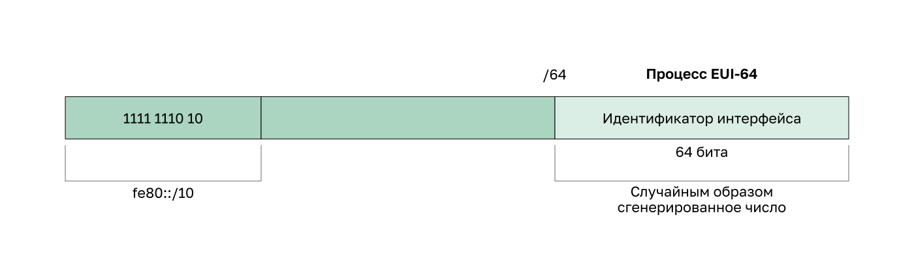

<!-- verified: agorbachev 03.05.2022 -->

<!-- 12.6.1 -->
## Динамические LLA

Все устройства IPv6 должны иметь LLA IPv6. Как и IPv6 GUAs, LLA можно создавать динамически. Независимо от того, как вы создаете свои LLA (и ваши GUAs), важно проверить конфигурацию всех адресов IPv6. В этом разделе описывается динамически генерируемые LLA и проверка конфигурации IPv6.

Как показано на рисунке, локальный адрес канала динамически создается с помощью префикса FE80::/10 и полученного с помощью процесса EUI-64 или случайно сгенерированного 64-битного идентификатора интерфейса.




<!-- 12.6.2 -->
## Специфика LLA в ОС Windows

Операционные системы, такие как Windows, обычно используют один метод и для создаваемого SLAAC GUA, и для динамически назначаемого LLA. См. выделенные области в следующих примерах, которые были показаны ранее.

**Идентификатор интерфейса, сгенерированный при помощи EUI-64**

```
C:\> ipconfig
Windows IP Configuration
Ethernet adapter Local Area Connection:
Connection-specific DNS Suffix . :
IPv6 Address. . . . . . . . . . . : 2001:db8:acad:1:fc99:47ff:fe75:cee0
Link-local IPv6 Address . . . . . : fe80::fc99:47ff:fe75:cee0
Default Gateway . . . . . . . . . : fe80::1
```

**Случайным образом сгенерированный 64-битный идентификатор интерфейса**

```
C:\> ipconfig
Windows IP Configuration
Ethernet adapter Local Area Connection:
   Connection-specific DNS Suffix  . :
   IPv6 Address. . . . . . . . . . . : 2001:db8:acad:1:50a5:8a35:a5bb:66e1
   Link-local IPv6 Address . . . . . : fe80::50a5:8a35:a5bb:66e1
   Default Gateway . . . . . . . . . : fe80::1
```

<!-- 12.6.3 -->
## Динамические LLA на маршрутизаторах Cisco

Маршрутизаторы Cisco автоматически создают локальный IPv6-адрес канала, когда интерфейсу назначается GUA. По умолчанию маршрутизаторы Cisco IOS используют процесс EUI-64 для создания идентификатора интерфейса всем LAA в IPv6-интерфейсах. Для последовательных интерфейсов маршрутизатор будет использовать MAC-адрес интерфейса Ethernet.

Напоминаем, что локальный адрес канала должен быть уникальным только в этом канале или сети. Однако недостаток динамически назначенного LLA — это слишком длинный идентификатор интерфейса. Он затрудняет определение и запоминание назначенных адресов. На примере показан МАС-адрес интерфейса GigabitEthernet 0/0 маршрутизатора R1. Этот адрес используется для динамического создания LLA на том же интерфейсе, а также для интерфейса Serial 0/1/0.

Чтобы было легче узнавать и запоминать эти адреса на маршрутизаторах, обычно выполняется статическая настройка локальных IPv6-адресов канала на маршрутизаторах.

**Пример динамического LLA с использованием EUI-64 на маршрутизаторе Cisco**

```
R1# show interface gigabitEthernet 0/0/0
GigabitEthernet0/0/0 is up, line protocol is up
  Hardware is ISR4221-2x1GE, address is 7079.b392.3640 (bia 7079.b392.3640)
(Output omitted)
R1# show ipv6 interface brief
GigabitEthernet0/0/0   [up/up]
    FE80::7279:B3FF:FE92:3640
    2001:DB8:ACAD:1::1
GigabitEthernet0/0/1   [up/up]
    FE80::7279:B3FF:FE92:3641
    2001:DB8:ACAD:2::1
Serial0/1/0            [up/up]
    FE80::7279:B3FF:FE92:3640
    2001:DB8:ACAD:3::1
Serial0/1/1            [down/down]
    unassigned
R1#
```

<!-- 12.6.4 -->
## Проверка конфигурации IPv6-адреса


**Команда ``show ipv6 interface brief``**

Команда **show interface**, приведенная выше, отображает MAC-адрес интерфейсов Ethernet. Процесс EUI-64 использует этот MAC-адрес для создания идентификатора интерфейса LLA. Команда **show ipv6 interface brief** отображает IPv6-адреса каждого интерфейса. а также сокращенные выходные данные [up/up] в той же строке. Они отображают состояние интерфейса на физическом и канальном уровнях. Аналогичные данные отображаются в столбцах «Состояние» и «Протокол» при выходных данных эквивалентной команды IPv4.

Обратите внимание, что каждый интерфейс имеет два IPv6-адреса. Первый адрес, который начинается с FE80, — это локальный индивидуальный адрес канала для интерфейса. Второй — настроенный GUA. При его назначении LLA автоматически присоединяется к интерфейсу. 

Кроме того, обратите внимание, что последовательный локальный адрес маршрутизатора R1 0/0/0 идентичен интерфейсу GigabitEthernet 0/0. Последовательные интерфейсы не имеют МАС-адресов Ethernet, поэтому операционная система Cisco IOS использует MAC-адрес первого доступного интерфейса Ethernet. Это возможно, потому что локальные интерфейсы канала должны быть уникальными только на данном канале.

**Вывод команды ``show ipv6 interface brief`` на R1**

```
R1# show ipv6 interface brief
GigabitEthernet0/0/0 [up/up] 
    FE80:: 1:1
    2001:DB8:ACAD:1::1
GigabitEthernet0/0/1 [up/up] 
    FE80::1:2
    2001:DB8:ACAD:2::1
Serial0/1/0 [up/up] 
    FE80::1:3
    2001:DB8:ACAD:3::1
Serial0/1/1 [down/down]
    unassigned
R1#
```

**Команда ``show ipv6 route``**

Как показано на примере, с помощью команды **show ipv6 route** можно проверить, занесены ли в таблицу маршрутизации IPv6-сети и IPv6-адреса конкретных интерфейсов. Команда **show ipv6 route** не отображает сети IPv4.

В таблице маршрутизации буква **C** напротив маршрута означает, что это сеть с прямым подключением. Когда интерфейс маршрутизатора настраивается с GUA и находится в активном состоянии (up/up), IPv6-префикс и длина префикса добавляются в таблицу IPv6-маршрутизации в качестве подключенного маршрута.

**Примечание**: **L** указывает на локальный маршрут, т. е. определенный IPv6-адрес, назначенный интерфейсу. Это не LLA. Локальные адреса не включены в таблицу маршрутизации, поскольку тх нельзя маршрутизировать.

Глобальный индивидуальный адрес IPv6, настраиваемый на интерфейсе, также заносится в таблицу маршрутизации в качестве локального маршрута с префиксом /128. Локальные маршруты используются таблицей маршрутизации для эффективной обработки пакетов с адресом назначения, равным адресу интерфейса маршрутизатора.

**Вывод команды ``show ipv6 route`` на R1**

```
R1# show ipv6 route
IPv6 Routing Table - default - 7 entries
Codes: C - Connected, L - Local, S - Static, U - Per-user Static route
<Output Omitted>
C 2001:DB8:ACAD:1::/64 [0/0]
     via GigabitEthernet0/0/0, directly connected 
L 2001:DB8:ACAD:1::1/128 [0/0]
     via GigabitEthernet0/0/0, receive  
C 2001:DB8:ACAD:2::/64 [0/0]
     via GigabitEthernet0/0/1, directly connected  
L 2001:DB8:ACAD:2::1/128 [0/0]
     via GigabitEthernet0/0/1, receive 
C 2001:DB8:ACAD:3::/64 [0/0]
     via Serial0/1/0, directly connected 
L 2001:DB8:ACAD:3::1/128 [0/0]
     via Serial0/1/0, receive 
L FF00::/8 [0/0]
     via Null0, receive
R1#
```

**Команда ``ping``**

Команда **ping** используется для проверки подключения 3-го уровня между маршрутизатором R1 и PC1. При отправке эхо-запроса на локальный адрес канала с маршрутизатора операционная система Cisco IOS запросит у пользователя открыть выходной интерфейс. Поскольку локальный адрес канала назначения может находиться на одном или нескольких каналах или сетях, маршрутизатору необходимо уточнить, на какой интерфейс отправлять эхо-запрос.

**Вывод команды ``ping`` на R1**

```
R1# ping 2001:db8:acad:1::10
Type escape sequence to abort.
Sending 5, 100-byte ICMP Echos to 2001:DB8:ACAD:1::10, timeout is 2 seconds:
!!!!!
Success rate is 100 percent (5/5), round-trip min/avg/max = 1/1/1 ms
R1#
```

<!-- 12.6.5 -->
<!-- syntax -->

