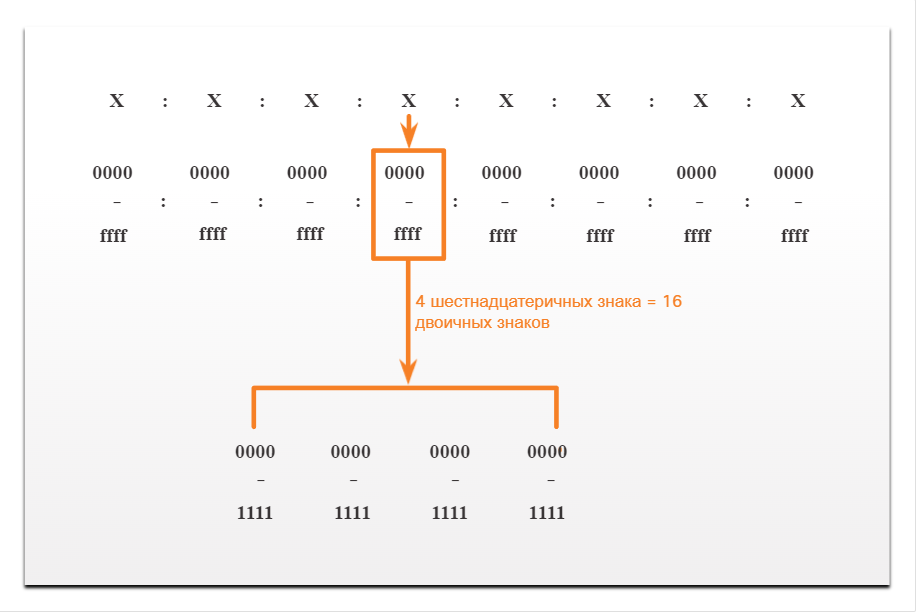

# Представление IPv6-адресов

<!-- 12.2.1 -->

## Форматы адресов IPv6

Первым шагом к изучению IPv6 в сетях является понимание способа написания и форматирования IPv6 адреса. Адреса IPv6 намного больше, чем адреса IPv4, поэтому мы вряд ли закончим их.

Длина IPv6-адресов составляет 128 бит, написанных в виде строки шестнадцатеричных значений. Каждые 4 бита представлены одной шестнадцатеричной цифрой, причем общее количество шестнадцатеричных значений равно 32, как показано на рисунке. IPv6-адреса нечувствительны к регистру, их можно записывать как строчными, так и прописными буквами.

### 16-битные сегменты или гекстеты

<!-- /courses/itn-dl/aeed55b2-34fa-11eb-ad9a-f74babed41a6/af2332c2-34fa-11eb-ad9a-f74babed41a6/assets/2e428324-1c25-11ea-81a0-ffc2c49b96bc.svg -->

**Предпочтительный формат**
Как показано на рисунке, формат записи адреса IPv6 ― x:x:x:x:x:x:x:x, где каждый x состоит из четырех шестнадцатеричных значений. Термин октет относится к восьми битам адреса IPv4. В IPv6-адресах сегмент из 16 бит или четырех шестнадцатеричных цифр неофициально называют гекстетом. Каждый х — это 1 гекстет, 16 бит или 4 шестнадцатеричные цифры.

Предпочтительный формат означает, что IPv6-адрес записан с помощью 32 шестнадцатеричных цифр. Тем не менее, это не самый оптимальный способ представления IPv6-адреса. Существуют два правила, которые помогают уменьшить количество цифр, необходимых для представления адреса IPv6.

Примеры записи IPv6-адресов в предпочтительном формате.

2001 : 0db8 : 0000 : 1111 : 0000 : 0000 : 0000: 0200 
2001 : 0db8 : 0000 : 00a3 : abcd : 0000 : 0000: 1234 
2001 : 0db8 : 000a : 0001 : c012 : 9aff : fe9a: 19ac 
2001 : 0db8 : aaaa : 0001 : 0000 : 0000 : 0000: 0000 
fe80 : 0000 : 0000 : 0000 : 0123 : 4567 : 89ab: cdef 
fe80 : 0000 : 0000 : 0000 : 0000 : 0000 : 0000: 0001 
fe80 : 0000 : 0000 : 0000 : c012 : 9aff : fe9a: 19ac 
fe80 : 0000 : 0000 : 0000 : 0123 : 4567 : 89ab: cdef 
0000 : 0000 : 0000 : 0000 : 0000 : 0000 : 0000: 0001 
0000 : 0000 : 0000 : 0000 : 0000 : 0000 : 0000: 0000 

<!-- 12.2.2 -->

## Правило 1. Пропуск начальных нулевых разрядов

Первое правило для сокращения записи IPv6-адресов — пропуск всех начальных 0 (нулей) в шестнадцатеричной записи. Вот четыре примера способов опустить ведущие нули:

* 01AB можно представить как 1AB
* 09f0 может быть представлен как 9f0
* 0a00 может быть представлен как a00
* 00AB можно представить как AB
Это правило применяется только к начальным нулям, а НЕ к конечным, иначе адрес будет непонятен. Например, гекстет «АВС» может быть представлен как «0АВС», либо как «АВС0» (а это разные значения).

### Omitting Leading 0s
| **Тип** |	**Формат** |
|Предпочитаемый формат |
2001 : 0db8 : 0000 : 1111 : 0000 : 0000 : 0000 : 0200|
|Без начальных нулей
2001 :  db8 :    0 : 1111 :    0 :    0 :    0 :  200|
|||
|||
|Предпочитаемый формат|
2001 : 0db8 : 0000 : 00a3 : ab00 : 0ab0 : 00ab : 1234|
|Без начальных нулей|
2001 :  db8 :    0 :   a3 : ab00 :  ab0 :   ab : 1234|
|||
|||
|Предпочитаемый формат|
2001 : 0db8 : 000a : 0001 : c012 : 90ff : fe90 : 0001|
|Без начальных нулей|
2001 :  db8 :    a :    1 : c012 : 90ff : fe90 :    1|
|||
|||
|Предпочитаемый формат|
2001 : 0db8 : aaaa : 0001 : 0000 : 0000 : 0000 : 0000|
|Без начальных нулей|
2001 :  db8 : aaaa :    1 :    0 :    0 :    0 :    0|
|||
|||
|Предпочитаемый формат|
fe80 : 0000 : 0000 : 0000 : 0123 : 4567 : 89ab : cdef|
|Без начальных нулей|
fe80 :    0 :    0 :    0 :  123 : 4567 : 89ab : cdef|
|||
|||
|Предпочитаемый формат|
fe80 : 0000 : 0000 : 0000 : 0000 : 0000 : 0000 : 0001|
|Без начальных нулей|
fe80 :    0 :    0 :    0 :    0 :    0 :    0 :    1|
|||
|||
|Предпочитаемый формат|
0000 : 0000 : 0000 : 0000 : 0000 : 0000 : 0000 : 0001|
|Без начальных нулей|
0 :    0 :    0 :    0 :    0 :    0 :    0 :    1|
|||
|||
|Предпочитаемый формат|
0000 : 0000 : 0000 : 0000 : 0000 : 0000 : 0000 : 0000|
|Без начальных нулей|
   0 :    0 :    0 :    0 :    0 :    0 :    0 :    0|

<!-- 12.2.3 -->

## Правило 2 - Двойной двоеточие

Второе правило для сокращения записи адресов IPv6 заключается в том, что двойное двоеточие (::) может заменить любую единую, смежную строку одного или нескольких 16-битных сегментов (гекстетов), состоящих из нулей. Например, 2001:db8:cafe:1:0:0:0:1 (ведущие 0s опущены) можно представить как 2001:db8:cafe:1::1. Двойное двоеточие (::) используется вместо трех гекстетов все-0 (0:0:0).

Двойное двоеточие (::) может использоваться в адресе только один раз, в противном случае в результате может возникнуть несколько адресов. Сочетание этого правила с методом пропуска нулей помогает значительно сократить запись IPv6-адреса. Обычно это называется сжатым форматом.

Вот пример неправильного использования двоеточия: 2001:db8::abcd::1234.

Двойная двоеточие используется дважды в приведенном выше примере. Ниже приведены возможные расширения этого адреса с неправильным сжатым форматом:

* 2001:db8::abcd:0000:0000:1234
* 2001:db8::abcd:0000:0000:0000:1234
* 2001:db8:0000:abcd::1234
* 2001:db8:0000:0000:abcd::1234

Если адрес содержит более одной смежной строки всех гексет, рекомендуется использовать двойное двоеточие (::) для самой длинной строки. Если строки равны, первая строка должна использовать двойное двоеточие (::).

### Omitting Leading 0s and All 0 Segments
| **Тип** | **Формат** |
|Предпочитаемый формат|
2001 : 0db8 : 0000 : 1111 : 0000 : 0000 : 0000 : 0200|
|Сжатое/место|
2001 :  db8 :    0 : 1111 :                    :  200|
|Сжатый формат|
2001:db8:0:1111::200|
|||
|Предпочитаемый формат|
2001 : 0db8 : 0000 : 0000 : ab00 : 0000 : 0000 : 0000|
|Сжатое/место|
2001 :  db8 :    0 :    0 : ab00 :: |
|Сжатый формат|
2001:db8:0:0:ab00::|
|||
|Предпочитаемый формат|
2001 : 0db8 : aaaa : 0001 : 0000 : 0000 : 0000 : 0000|
|Сжатое/место|
2001 :  db8 : aaaa :    1 ::|
|Сжатый формат|
2001:db8:aaaa:1::|
|||
|Предпочитаемый формат|
fe80 : 0000 : 0000 : 0000 : 0123 : 4567 : 89ab : cdef|
|Сжатое/место|
fe80 :                    :  123 : 4567 : 89ab : cdef|
|Сжатый формат|
fe80::123:4567:89ab:cdef|
|||
|Предпочитаемый формат|
fe80 : 0000 : 0000 : 0000 : 0000 : 0000 : 0000 : 0001|
|Сжатое/место|
fe80 :                                         :    1|
|Сжатый формат|
fe80::0|
|||
|Предпочитаемый формат|
0000 : 0000 : 0000 : 0000 : 0000 : 0000 : 0000 : 0001|
|Сжатое/место|
::                                                  1|
|Сжатый формат|
::1|
|||
|Предпочитаемый формат|
0000 : 0000 : 0000 : 0000 : 0000 : 0000 : 0000 : 0000|
|Сжатое/место|
::|
|Сокращенный|
::|