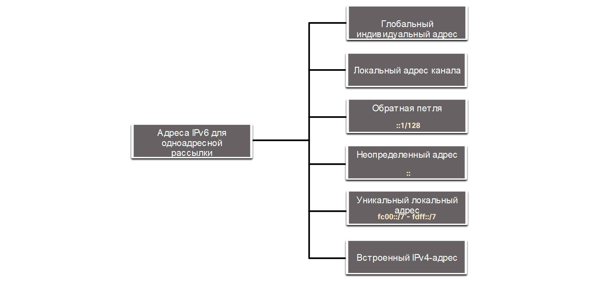

<!-- verified: agorbachev 03.05.2022 -->

<!-- 12.3.1 -->
## Одноадресный, многоадресный, произвольный

Как и в случае IPv4, существуют различные типы адресов IPv6. На самом деле, существует три широкие категории адресов IPv6:

* **Индивидуальный (или одноадресной рассылки, unicast)** : служит для однозначного определения интерфейса на устройстве под управлением протокола IPv6.
* **Групповой (или адрес многоадресной рассылки, multicast)** : используется для отправки одного IPv6-пакета на несколько адресов назначения.
* **Произвольный (или адрес произвольной рассылки, anycast)** : любой индивидуальный IPv6-адрес, который может быть назначен нескольким устройствам. Пакет, отправляемый на адрес произвольной рассылки, направляется к ближайшему устройству с этим адресом. Произвольные адреса в данном курсе не рассматриваются.

В отличие от IPv4, IPv6 не использует широковещательный адрес. Однако есть групповой IPv6-адрес для всех узлов, который дает аналогичный результат.

<!-- 12.3.2 -->
## Длина префикса IPv6-адреса

Как вы помните, префикс, или сетевая часть адреса IPv4, может быть обозначен маской подсети в десятичном формате с разделительными точками или длиной префикса (запись с наклонной чертой). Например, IPv4-адрес 192.168.1.10 с маской подсети в десятичном формате с разделительными точками 255.255.255.0 эквивалентен записи 192.168.1.10/24.

В IPv4 /24 называется префиксом. В IPv6 это называется длиной префикса. IPv6 не использует для маски подсети десятичное представление с разделительными точками. Как и IPv4, длина префикса представлена в виде косой черты и используется для указания сетевой части адреса IPv6.

Диапазон длины префикса может составлять от 0 до 128. Обычная длина префикса IPv6 для локальных сетей и большинства сетей других типов — /64, как показано на рисунке.

### Длина префикса IPv6-адреса

<!-- /courses/itn-dl/aeed55b2-34fa-11eb-ad9a-f74babed41a6/af2359d0-34fa-11eb-ad9a-f74babed41a6/assets/2e43e2b3-1c25-11ea-81a0-ffc2c49b96bc.svg -->

Это означает, что длина префикса, или сетевая часть адреса, составляет 64 бита, а оставшиеся 64 бита остаются для идентификатора интерфейса (хостовой части) адреса.

Настоятельно рекомендуется использовать 64-битный идентификатор интерфейса для большинства сетей. Это связано с тем, что автоконфигурация адресов без учета (SLAAC) использует 64 бита для идентификатора интерфейса. Это также упрощает создание и управление подсетями.

<!-- 12.3.3 -->
## Другие типы IPv6-адресов одноадресной рассылки

Индивидуальный адрес служит для однозначного определения интерфейса устройства под управлением протокола IPv6. Пакет, который отправляется на такой адрес, будет получен интерфейсом, назначенным для этого адреса. Как и в случае с протоколом IPv4, IPv6-адрес должен быть индивидуальным. IPv6-адрес назначения может быть как индивидуальным, так и групповым. На рисунке показаны различные типы одноадресных адресов IPv6.

### Адреса IPv6 для одноадресной рассылки

<!-- /courses/itn-dl/aeed55b2-34fa-11eb-ad9a-f74babed41a6/af2359d0-34fa-11eb-ad9a-f74babed41a6/assets/2e4430d4-1c25-11ea-81a0-ffc2c49b96bc.svg -->

В отличие от устройств IPv4, имеющих только один адрес, адреса IPv6 обычно имеют два одноадресных адреса:

* **Глобальный индивидуальный адрес**  аналогичен публичному IPv4-адресу. Эти адреса, к которым можно проложить маршрут по Интернету, являются уникальными по всему миру. Глобальные индивидуальные адреса могут быть настроены статически или присвоены динамически.
* **Локальный адрес канала (link-local address)** — это необходимо для каждого устройства с поддержкой IPv6. Локальные адреса канала используются для обмена данными с другими устройствами по одному локальному каналу. В протоколе IPv6 термин «канал» означает подсеть. Локальные адреса каналов ограничены одним каналом. Они должны быть уникальны только в рамках этого канала, поскольку вне канала к ним нельзя проложить маршрут. Другими словами, маршрутизаторы не смогут пересылать пакеты, имея локальный адрес канала источника или назначения.

<!-- 12.3.4 -->
## Примечание об уникальном локальном адресе

Уникальные локальные адреса (диапазон fc00::/7 до fdff::/7) пока не реализованы. Таким образом, этот модуль охватывает только конфигурацию GUA и LLA. Однако уникальные локальные адреса могут использоваться для адресов устройств, которые не должны быть доступны извне, таких как внутренние серверы и принтеры.

Уникальные локальные IPv6-адреса имеют некоторые общие особенности с частными адресами RFC 1918 для IPv4, но при этом между ними имеются и значительные различия.

* Уникальные локальные адреса используются для локальной адресации в пределах узла или между ограниченным количеством узлов.
* Уникальные локальные адреса могут использоваться для устройств, которым никогда не понадобится использование других сетей или получение из них данных.
* Уникальные локальные адреса не маршрутизируются глобально и не преобразуются в глобальный адрес IPv6.

**Примечание**: Многие сайты используют частные адреса RFC 1918, чтобы обеспечить безопасность или защитить сеть от потенциальных угроз. Однако обеспечение безопасности никогда не было целью технологий NAT/PAT, поэтому организация IETF всегда рекомендовала принимать соответствующие меры предосторожности при использовании маршрутизаторов в Интернете.

<!-- 12.3.5 -->
## Глобальные индивидуальные IPv6-адреса (GUA)

Глобальные индивидуальные IPv6-адреса (GUA) уникальны по всему миру и доступны для маршрутизации через Интернет IPv6. Эти адреса эквивалентны публичным IPv4-адресам. Корпорация по управлению доменными именами и IP-адресами (Internet Committee for Assigned Names and Numbers, ICANN), оператор Администрации адресного пространства Интернет (IANA) выделяет блоки IPv6-адресов пяти региональным интернет-регистраторам (RIR). В настоящее время назначаются только глобальные индивидуальные адреса с первыми тремя битами 001 или 2000::/3.

На рисунке показан диапазон значений для первого гекстета, где первая шестнадцатеричная цифра для доступных в настоящее время GUA начинается с 2 или 3. Это лишь 1/8 от всего доступного адресного пространства IPv6, за исключением очень незначительного количества других типов адресов индивидуальных и групповых адресов.

**Примечание**: Адрес 2001:0DB8::/32 зарезервирован для документации, в том числе в для использования в примерах.

<!-- /courses/itn-dl/aeed55b2-34fa-11eb-ad9a-f74babed41a6/af2359d0-34fa-11eb-ad9a-f74babed41a6/assets/2e44a602-1c25-11ea-81a0-ffc2c49b96bc.svg -->

На следующем рисунке показана структура и диапазон GUA.

### Адрес IPv6 с префиксом глобальной маршрутизации /48 и префиксом /64

<!-- /courses/itn-dl/aeed55b2-34fa-11eb-ad9a-f74babed41a6/af2359d0-34fa-11eb-ad9a-f74babed41a6/assets/2e44cd14-1c25-11ea-81a0-ffc2c49b96bc.svg -->

GUA состоит из трех частей:

* Префикс глобальной маршрутизации
* Идентификатор подсети
* Идентификатор интерфейса

<!-- 12.3.6 -->
## Структура GUA IPv6

**Префикс глобальной маршрутизации**

Префикс глобальной маршрутизации — это префиксальная или сетевая часть адреса, назначаемая интернет-провайдером заказчику или узлу. Например, поставщики услуг Интернета обычно назначают своим клиентам префикс глобальной маршрутизации /48. Префикс глобальной маршрутизации обычно зависит от политик поставщика услуг Интернета.

На предыдущем рисунке показан GUA с префиксом глобальной маршрутизации /48. Префиксы /48 — наиболее распространенные назначаемые префиксы глобальной маршрутизации, и именно они будут использоваться в большинстве примеров в рамках данного курса.

Например, IPv6-адрес 2001:0DB8:ACAD::/48 имеет префикс, который означает, что первые 48 бит (3 гекстета) (2001:0DB8:ACAD) — это префиксальная или сетевая часть адреса. Двойное двоеточие (::) перед длиной префикса /48 означает, что остальная часть адреса состоит из нулей. Размер префикса глобальной маршрутизации определяет размер идентификатора подсети.

**Идентификатор подсети**

Поле Идентификатор подсети — это область между префиксом глобальной маршрутизации и идентификатором интерфейса. В отличие от IPv4, где вы должны заимствовать биты из части узла для создания подсетей, IPv6 был разработан с учетом подсетей. Идентификатор подсети используется организациями для обозначения подсетей на своем сайте. Чем выше значение идентификатора подсети, тем больше существует подсетей.

**Примечание**: Многие организации получают префикс глобальной маршрутизации /32. При использовании рекомендованного префикса /64 для создания 64-битного идентификатора интерфейса остается 32-битный идентификатор подсети. Это означает, что организация с префиксом глобальной маршрутизации /32 и 32-разрядным идентификатором подсети будет иметь 4,3 миллиарда подсетей, каждая из которых будет иметь 18 квинтиллионов устройств на подсеть. Это столько подсетей, сколько публичных IPv4 адресов!

Адрес IPv6 на предыдущем рисунке имеет префикс глобальной маршрутизации /48, который является общим для многих корпоративных сетей. Это делает его особенно легким изучение различных частей адреса. В глобальном индивидуальном адресе с префиксом /64 первые четыре гекстета обозначают сетевую часть адреса, а четвертый гекстет — идентификатор подсети. Остальные четыре гекстета используются для идентификатора интерфейса.

**Идентификатор интерфейса**

Идентификатор IPv6-интерфейса эквивалентен узловой части IPv4-адреса. Термин «идентификатор интерфейса» используется в том случае, когда один узел может иметь несколько интерфейсов, каждый из которых имеет один или более IPv6-адресов. На рисунке показан пример структуры IPv6 GUA. Настоятельно рекомендуется использовать в большинстве случаев / 64 подсети, что создает 64-битный идентификатор интерфейса. 64-разрядный идентификатор интерфейса позволяет использовать 18 квинтиллионов устройств или хостов в подсети.

Подсеть /64 или префикс (Global Routing Prefix + Subnet ID) оставляет 64 бита для идентификатора интерфейса. Рекомендуется, чтобы устройства с поддержкой SLAAC могли создавать свой собственный 64-битный идентификатор интерфейса. Это также делает разработку плана адресации IPv6 простой и эффективной.

**Примечание**: В отличие от IPv4, при использовании протокола IPv6 устройству можно назначить адрес узла, состоящий из одних 0 или из одних 1. Адрес «все 1» может использоваться, поскольку широковещательные адреса не используются в IPv6. Можно также использовать адрес из одних 0, но он зарезервирован в качестве адреса произвольной рассылки маршрутизатора подсети, и его следует назначать только маршрутизаторам.

<!-- 12.3.7 -->
## Локальный IPv6-адрес канала

Локальный IPv6-адрес канала позволяет устройству обмениваться данными с другими устройствами с включенным протоколом IPv6 в том же канале (подсети) и только в нем. Пакеты с локальным адресом канала источника или назначения не могут быть направлены за пределы канала, в котором создается пакет.

GUA не является обязательным требованием. Однако каждый сетевой интерфейс с поддержкой IPv6 должен иметь LLA.

Если локальный адрес канала не настроен вручную на интерфейсе, устройство автоматически создает его самостоятельно, не обращаясь к DHCP-серверу. Узлы под управлением IPv6 создают локальный IPv6-адрес канала даже в том случае, если устройству не был назначен глобальный индивидуальный IPv6-адрес. Это позволяет устройствам под управлением IPv6 обмениваться данными с другими устройствами под управлением IPv6 в одной подсети,  в том числе со шлюзом по умолчанию (маршрутизатором).

IPv6 LLA находятся в диапазоне fe80::/10. /10 указывает, что первые 10 битов — 1111 1110 10xx хххх. Диапазон значений первого гекстета: от 1111 1110 10**00 0000** (fe80) до 1111 1110 10**11 1111**(febf).

На рисунке приводится пример осуществления связи с помощью групповых адресов для всех узлов. Компьютер может напрямую взаимодействовать с принтером с помощью LLA.

### Обмен данными между локальными IPv6-адресами канала

<!-- /courses/itn-dl/aeed55b2-34fa-11eb-ad9a-f74babed41a6/af2359d0-34fa-11eb-ad9a-f74babed41a6/assets/2e454243-1c25-11ea-81a0-ffc2c49b96bc.svg -->

На следующем рисунке показаны некоторые виды использования для IPv6 LLAs.

<!-- /courses/itn-dl/aeed55b2-34fa-11eb-ad9a-f74babed41a6/af2359d0-34fa-11eb-ad9a-f74babed41a6/assets/2e456952-1c25-11ea-81a0-ffc2c49b96bc.svg -->

1.  Маршрутизаторы используют LLA соседних маршрутизаторов для отправки обновлений маршрутизации.
2.  Узлы используют LLA локального маршрутизатора в качестве шлюза по умолчанию.

**Примечание**: Как правило, в качестве шлюза по умолчанию для других устройств в канале используется локальный адрес канала маршрутизатора.

Существует два способа получения локальных IPv6-адресов канала устройством:

* **Статически**  - Это означает, что устройство было настроено вручную.
* **Динамически**  - Это означает, что устройство создает свой собственный идентификатор интерфейса, используя случайно сгенерированные значения или метод Extended Unique Identifier (EUI), который использует MAC-адрес клиента вместе с дополнительными битами.

<!-- 12.3.8 -->
<!-- quiz -->

