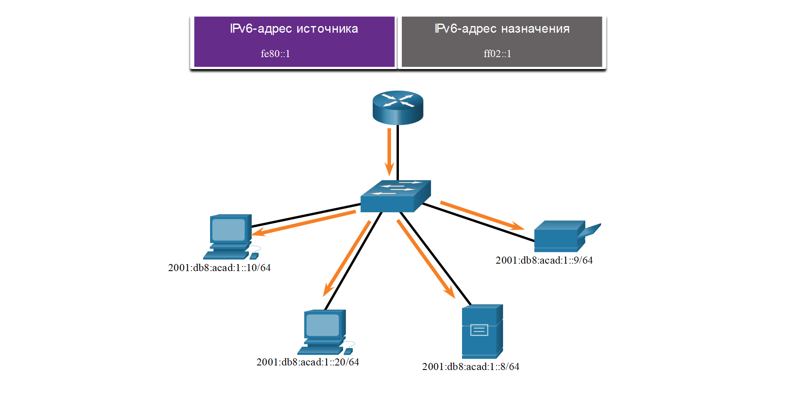
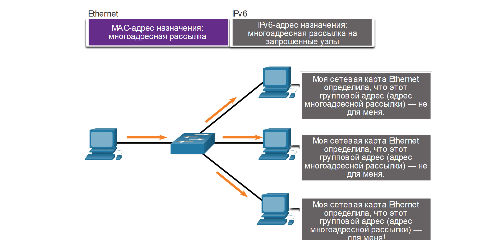

<!-- verified: agorbachev 03.05.2022 -->

<!-- 12.7.1 -->
## Присвоенные групповые IPv6-адреса

Ранее в этом модуле вы узнали, что существует несколько типов IPv6-адресов: одноадресные, многоадресные и произвольные. Этот раздел содержит более подробные сведения о многоадресных адресах.

Групповые IPv6-адреса аналогичны групповым IPv4-адресам. Как вы помните, групповой адрес используется для отправки одного пакета по одному или нескольким адресам назначения (группе многоадресной рассылки). Групповые адреса IPv6 имеют префикс FF00::/8

**Примечание**: Групповые адреса могут быть только адресами назначения, а не адресами источника.

Существует два типа групповых IPv6-адресов:

* Известные многоадресные адреса
* Групповой адрес запрашиваемого узла

<!-- 12.7.2 -->
## Известные адреса многоадресной рассылки IPv6

Назначены известные адреса многоадресной рассылки IPv6.  Присвоенные групповые адреса зарезервированы для заданных групп устройств. Присвоенный групповой адрес — это один адрес, используемый для осуществления связи с группой устройств, работающих на одном протоколе или сервисе. Присвоенные групповые адреса используются вместе с конкретными протоколами, например с протоколом DHCPv6.

Есть две распространенные группы присвоенных групповых IPv6-адресов:

* **ff02: Группа многоадресной рассылки для всех узлов FF02::1.**  Это группа многоадресной рассылки, в которую включены все устройства под управлением протокола IPv6. Пакет, отправленный этой группе, принимается и обрабатывается всеми IPv6-интерфейсами в канале или сети. Эта группа адресов работает так же, как широковещательный адрес в протоколе IPv4. На рисунке приводится пример осуществления связи с помощью групповых адресов для всех узлов. IPv6-маршрутизатор отправляет сообщения RA ICMPv6 группе многоадресной рассылки для всех узлов.
* **ff02::2 Группа глобальной конфигурации многоадресной группы**  - Это группа многоадресной рассылки, к которой присоединяются все маршрутизаторы IPv6. Маршрутизатор становится членом этой группы, когда он включен как маршрутизатор IPv6 с параметром **ipv6 unicast-routing**. Пакет, отправленный этой группе, принимается и обрабатывается всеми IPv6-маршрутизаторами в канале или сети.

### Многоадресная рассылка всех узлов IPv6: сообщение RA 

<!-- /courses/itn-dl/aeed55b2-34fa-11eb-ad9a-f74babed41a6/af2359d8-34fa-11eb-ad9a-f74babed41a6/assets/2e4d5890-1c25-11ea-81a0-ffc2c49b96bc.svg -->

Устройства под управлением протокола IPv6 отправляют сообщения RS ICMPv6 на групповой адрес для всех маршрутизаторов. Сообщение RS запрашивает сообщение RA у IPv6-маршрутизатора, которое поможет устройству в процессе адресной конфигурации. Маршрутизатор IPv6 отвечает сообщением RA, как показано на рисунке.

<!-- 12.7.3 -->
## Групповые IPv6-адреса запрашиваемых узлов

Групповой адрес запрашиваемых узлов аналогичен групповому адресу для всех узлов. Преимущество группового адреса запрашиваемых узлов заключается в том, что он соответствует специальному адресу многоадресной рассылки Ethernet. Это позволяет сетевой плате Ethernet отфильтровывать кадр, анализируя MAC-адрес назначения без его отправки в IPv6-процесс, чтобы убедиться, что устройство действительно является узлом назначения IPv6-пакета.

<!-- /courses/itn-dl/aeed55b2-34fa-11eb-ad9a-f74babed41a6/af2359d8-34fa-11eb-ad9a-f74babed41a6/assets/2e4d7fa2-1c25-11ea-81a0-ffc2c49b96bc.svg -->

<!-- 12.7.4 -->
## Исследовательская работа: определение IPv6-адресов [(описание в PDF)](./assets/12.7.4-lab---identify-ipv6-addresses.pdf)

В этой работе вам необходимо выполнить следующие задачи:

* Часть 1: Определение различных типов IPv6-адресов
* Часть 2: Изучение IPv6-адреса сетевого интерфейса и узла
* Часть 3: Отработка правил сокращения IPv6-адресов

