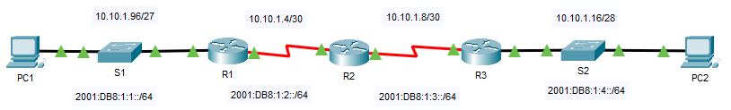

---

> **ВАЖНО**
> 
> Форма для ответов на вопросы будет доступна только при развертывании лабораторной работы 

---

## Топология



## Таблица адресации

| Устройство | Интерфейс | IP адрес/префикс   |                 | Шлюз по умолчанию |
|------------|-----------|--------------------|-----------------|-------------------|
| R1         | G0/0      | 10.10.1.97         | 255.255.255.224 | —                 |
| R1         | G0/0      | 2001:db8:1:1::1/64 |                 |                   |
| R1         | S0/0/1    | 10.10.1.6          | 255.255.255.252 | —                 |
| R1         | S0/0/1    | 2001:db8:1:2::2/64 |                 |                   |
| R1         | S0/0/1    | fe80::1            |                 |                   |
| R2         | S0/0/0    | 10.10.1.5          | 255.255.255.252 | —                 |
| R2         | S0/0/0    | 2001:db8:1:2::1/64 |                 |                   |
| R2         | S0/0/1    | 10.10.1.9          | 255.255.255.252 | —                 |
| R2         | S0/0/1    | 2001:db8:1:3::1/64 |                 |                   |
| R2         | S0/0/1    | fe80::2            |                 |                   |
| R3         | G0/0      | 10.10.1.17         | 255.255.255.240 | —                 |
| R3         | G0/0      | 2001:db8:1:4::1/64 |                 |                   |
| R3         | S0/0/1    | 10.10.1.10         | 255.255.255.252 | —                 |
| R3         | S0/0/1    | 2001:db8:1:3::2/64 |                 |                   |
| R3         | S0/0/1    | fe80::3            |                 |                   |
| PC1        | NIC       |                    |                 |                   |
| PC1        | NIC       |                    |                 |                   |
| PC2        | NIC       |                    |                 |                   |
| PC2        | NIC       |                    |                 |                   |

## Задачи

Часть 1. Заполнение таблицы адресации

Часть 2. Проверка подключения с помощью команды ping

Часть 3. Определение пути с помощью трассировки маршрута

## Общие сведения

Двойной стек позволяет сосуществовать адресам IPv4 и IPv6 в одной сети. В этом упражнении вы изучите внедрение двойного стека, включая документирование конфигурации IPv4 и IPv6 для оконечных устройств, проверку связи по IPv4- и IPv6-протоколов с помощью команды **ping** и трассировку пути по IPv4 и IPv6.

### Часть 1. Заполнение таблицы адресации

**Шаг 1. Проверьте IPv4-адресацию с помощью команды ipconfig.**

1.  Щелкните **PC1** и откройте **Command Prompt** (Командная строка).

2.  Введите команду **ipconfig /all** для сбора данных об IPv4-адресе. Заполните **таблицу адресации**, указав IPv4-адрес, маску подсети и шлюз по умолчанию.

3.  Щелкните **PC2** и откройте **Command Prompt** (Командная строка).

4.  Введите команду **ipconfig /all** для сбора данных об IPv4-адресе. Заполните **таблицу адресации**, указав IPv4-адрес, маску подсети и шлюз по умолчанию.

**Шаг 2. Проверьте IPv6-адресацию с помощью команды ipv6config.**

1.  На **PC1** введите команду **ipv6config /all** для сбора данных об IPv6-адресе. Заполните **таблицу адресации**, указав IPv6-адрес, префикс подсети и шлюз по умолчанию.

2.  На **PC2** введите команду **ipv6config /all** для сбора данных об IPv6-адресе. Заполните **таблицу адресации**, указав IPv6-адрес, префикс подсети и шлюз по умолчанию.

### Часть 2. Проверка подключения с помощью команды ping

**Шаг 1. Проверьте IPv4-соединение с помощью команды ping.**

1.  C **PC1** отправьте эхо-запрос на IPv4-адрес **PC2**.

    - ответьте на вопрос №1

2.  C **PC2** отправьте эхо-запрос на IPv4-адрес **PC1**.

    - ответьте на вопрос №2

**Шаг 2. Проверьте IPv6-соединение с помощью команды ping.**

3.  C **PC1** отправьте эхо-запрос на IPv6-адрес **PC2**.

    - ответьте на вопрос №3

4.  C **PC2** отправьте эхо-запрос на IPv6-адрес **PC1**.

    - ответьте на вопрос №4

### Часть 3. Определение пути с помощью отслеживания маршрута

**Шаг 1. Используйте команду tracert для определения IPv4-пути.**

1.  На **PC1** выполните трассировку маршрута до **PC2**.

    ```
    PC> tracert 10.10.1.20
    ```

    Вопросы:

    - ответьте на вопрос №5

    - ответьте на вопрос №6

2.  На **PC2** выполните трассировку маршрута до **PC1**.

    Вопросы:

    - ответьте на вопрос №7

    - ответьте на вопрос №8

**Шаг 2. Используйте команду tracert для определения IPv6-пути.**

1.  На **PC1** выполните трассировку маршрута до IPv6-адреса **PC2**.

    ```
    PC> tracert 2001:db8:1:4::a
    ```

    Вопросы:

    - ответьте на вопрос №9

    - ответьте на вопрос №10

2.  На **PC2** выполните трассировку маршрута до Pv6-адреса **PC1**.

    Вопросы:

    - ответьте на вопрос №11

    - ответьте на вопрос №12

[Скачать файл Packet Tracer для локального запуска](./assets/13.2.6-lab.pka)
