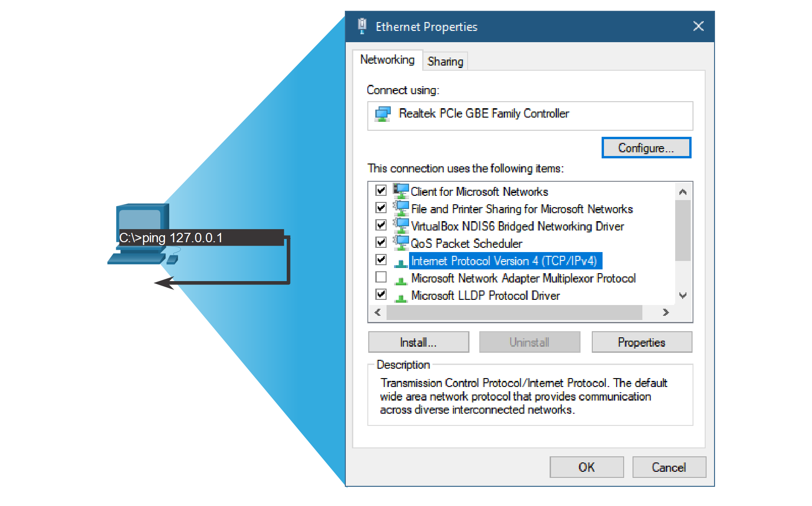

# Тестирование при помощи ping и traceroute

<!-- 13.2.1 -->
## Ping - Тест связанности

В предыдущем разделе вы были представлены инструменты **ping** и traceroute (**tracert**). В этом разделе вы узнаете о ситуациях, в которых используется каждый инструмент, и о том, как его использовать. Ping - это утилита тестирования IPv4 и IPv6, которая использует эхо-запрос ICMP и эхо-сообщения для проверки соединения между хостами.

Для проверки соединения с другим узлом в сети с помощью команды **ping** на узловой адрес отправляется эхо-запрос. Если узел с указанным адресом получает эхо-запрос, он отправляет эхо-ответ. После получения каждого эхо-ответа служба эхо-тестирования предоставляет данные о времени, прошедшем между отправкой **ping**-запроса и получением ответа. Это позволяет измерить производительность сети.

У команды ping предусмотрен интервал ожидания ответа. Если в течение этого интервала ответ не получен, команда ping выдает сообщение об отсутствии ответа. Обычно это свидетельствует о наличии проблемы, но также это может указывать на то, что в сети работают функции безопасности, которые блокируют ping-запросы. Обычно для первого эхо-запроса требуется выполнить разрешение адреса (ARP или ND) перед отправкой эхо-запроса ICMP.

После отправки всех запросов утилита **ping** выдает отчет, содержащий уровень успешности запросов и среднее суммарное время доставки запросов и получения ответов.

Типы тестов подключения, выполненных с использованием **ping**, включают следующее:

* Отправка ping-запросов на локальный loopback-адрес
* Проверьте связь со шлюзом по умолчанию.
* Установка связи с удаленным узлом с помощью команды ping

<!-- 13.2.2 -->
## Запустите ping до интерфейса loopback.

Ping может использоваться для проверки внутренней конфигурации IPv4 или IPv6 на локальном хосте. Для выполнения этой проверки отправим **ping** на адрес loopback 127.0.0.1 для IPv4 (::1 для IPv6).

Ответ от адреса 127.0.0.1 для IPv4 или :: 1 для IPv6 означает, что IP-сеть настроена на хосте правильно. Этот ответ поступает с сетевого уровня. Однако ответ не является признаком того, что адреса, маски или шлюзы были настроены верно. Он также ничего не говорит о состоянии более низкого уровня сетевого стека. Этот ответ является просто результатом проверки IP-сети на сетевом уровне. Если мы получаем сообщение об ошибке, это означает, что протокол TCP/IP не работает на данном хосте.

<!-- /courses/itn-dl/aeed55b4-34fa-11eb-ad9a-f74babed41a6/af23cf00-34fa-11eb-ad9a-f74babed41a6/assets/2e54d2a4-1c25-11ea-81a0-ffc2c49b96bc.svg -->

* Успешная отправка эхо-запроса на локальный узел подтверждает, что TCP/IP установлен и работает на локальном узле.
* При отправке ping-запроса на 127.0.0.1 исходное устройство отправляет эхо-запрос самому себе.

<!--
показывает диалоговое окно свойств Ethernet показывает, что протокол Интернета версии 4 (TCP/IPv4) установлен и активен, что доказано с помощью ping до 127.0.0.1
-->

<!-- 13.2.3 -->
## Проверка связи со шлюзом по умолчанию.

Команду **ping** также можно использовать для проверки способности хоста обмениваться данными по локальной сети. Обычно это делается путем отправки эхо-запроса на IP-адрес шлюза хоста. Успешная отправка **ping**-запроса на шлюз позволяет убедиться, что хост и интерфейс маршрутизатора, выступающий в роли шлюза, нормально функционируют в данной локальной сети.

Для этой проверки чаще всего используется адрес шлюза, поскольку маршрутизатор практически всегда находится в рабочем состоянии. Если адрес шлюза не отвечает, **ping**-запрос может быть отправлен на IP-адрес другого, заведомо рабочего хоста локальной сети.

Если шлюз или другой узел отвечает на запрос, значит, локальный узел может успешно работать в локальной сети. Если шлюз не отвечает, а другой узел отвечает, то проблема может быть с интерфейсом маршрутизатора, выступающим в роли шлюза.

Первая возможная причина: на узле был настроен неверный адрес шлюза. Вторая возможная причина: интерфейс маршрутизатора функционирует нормально, но установленная система безопасности препятствует обработке или отправке ответов на ping-запросы.

<!-- /courses/itn-dl/aeed55b4-34fa-11eb-ad9a-f74babed41a6/af23cf00-34fa-11eb-ad9a-f74babed41a6/assets/2e556ee0-1c25-11ea-81a0-ffc2c49b96bc.svg -->

Хост отправляет запрос на шлюз по умолчанию, отправив ICMP эхо-запрос. Шлюз по умолчанию отправляет эхо-ответ, подтверждающий подключение.

<!--
На рисунке показано диалоговое окно свойств Ethernet, настроенное со статическим IP-адресом, маской подсети и шлюзом по умолчанию. Топология показывает, что компьютер отправляет эхо-запрос шлюзу маршрутизатора по умолчанию, а маршрутизаторы ответят на эхо-ответ.
-->

<!-- 13.2.4 -->
## Установка связи с удаленным узлом с помощью команды ping

Команду ping также можно использовать для проверки способности хоста обмениваться данными с другими сетями. С локального узла можно отправить эхо-запрос на рабочий IPv4-узел удаленной сети, как показано на рисунке. Маршрутизатор использует таблицу IP-маршрутизации для пересылки пакетов.

Если ping-запрос был отправлен успешно, можно проверить межсетевое взаимодействие на большом участке. Успешная отправка межсетевого **ping**-запроса подтверждает подключение к локальной сети, работоспособность маршрутизатора, выполняющего роль шлюза, а также работоспособность других маршрутизаторов на пути между локальной сетью и сетью удаленного узла.

Кроме того, может быть проверена работоспособность удаленного узла. Если бы удаленный узел не мог передавать данные за пределы своей локальной сети, он бы не ответил на эхо-запрос.

**Примечание**: Многие сетевые администраторы ограничивают или запрещают ввод ICMP-сообщений в корпоративную сеть; в связи с этим меры по обеспечению безопасности могут стать причиной отсутствия **ping**-ответа.

<!--
анимация показывает эхо-запрос ping в удаленную сеть, маршрутизируемый через маршрутизатор, и эхо-ответ, направляемый обратно из удаленной сети
-->

<!-- 13.2.5 -->
## Traceroute — тестирование пути

Команда ping используется для проверки соединения между двумя узлами, но не позволяет получить информацию об устройствах, находящихся между ними. Команда traceroute (**tracert**) — это утилита, позволяющая составить список переходов, по которым успешно проходит эхо-запрос на пути к узлу назначения. Данный список может дать важную подтверждающую информацию, а также информацию о поиске и устранении неполадок. Если запрос доходит до узла назначения, утилита trace заносит в список интерфейс каждого маршрутизатора на пути между узлами. Если на каком-то переходе на маршруте происходит сбой передачи данных, то адрес последнего маршрутизатора, ответившего на трассировку, может указать на место нахождения проблемы или ограничения системы безопасности.

**Round Trip Time (RTT)**

Утилита traceroute определяет суммарное время прохождения сигнала в прямом и обратном направлениях (RTT) для каждого перехода на маршруте и сообщает о возможном отсутствии ответа на одном из переходов. RTT — это время, которое требуется на доставку пакета на удаленный узел и получения ответа от этого узла. Символ звездочки (*) используется для обозначения потерянного пакета или отсутствия ответа на пакет.

Эта информация может использоваться для поиска проблемного маршрутизатора в пути или может указывать на то, что маршрутизатор настроен не отвечать на запросы. Если результат команды показывает большое время ответа или потерю данных на каком-то переходе, это признак того, что ресурсы маршрутизатора или его соединений могут быть на исходе.

**IPv4 TTL и IPv6 Hop Limit**

Утилита traceroute использует значение в поле TTL в IPv4 и в поле предела переходов (Hop Limit) в IPv6 в заголовках 3-го уровня (вместе с сообщением ICMP о превышении интервала ожидания).

Нажмите Воспроизвести, чтобы просмотреть, как утилита Traceroute использует TTL.

<!--
показывает трассировку удаленной сети, пересекающей три маршрутизатора. traceroute будет принимать 4 эхо-запроса, чтобы добраться до места назначения
-->

Первая последовательность сообщений, отправленных командой traceroute, в поле TTL будет иметь значение 1. Данное значение TTL вызывает превышение интервала ожидания ответа на IPv4-пакет на первом маршрутизаторе. Затем маршрутизатор отвечает сообщением ICMPv4 Time Exceeded. Теперь traceroute знает адрес первого перехода.

Затем traceroute постепенно увеличивает значение в поле TTL (2, 3, 4 и т. д.) для каждой последовательности сообщений. Таким образом трассируются адреса каждого перехода, по мере того как превышение интервала ожидания ответа происходит дальше на маршруте. Значение в поле TTL продолжает увеличиваться до тех пор, пока не будет достигнут узел назначения, или до определенного, заранее установленного максимального уровня.

После достижения последнего узла назначения этот хост отвечает сообщением ICMP о недоступности порта или эхо-ответом ICMP (вместо сообщения ICMP о превышении интервала ожидания).

<!-- 13.2.6 -->
## Packet Trace - Проверка адресации IPv4 и IPv6

Протоколы IPv4- и IPv6 могут сосуществовать в одной сети. Использование команд и отображение результатов в командной строке на компьютере несколько отличается.

[Проверка адресации IPv4 и IPv6 (pdf)](./assets/13.2.6-packet-tracer---verify-ipv4-and-ipv6-addressing.pdf)

[Проверка адресации IPv4 и IPv6 (pka)](./assets/13.2.6-packet-tracer---verify-ipv4-and-ipv6-addressing.pka)

<!-- 13.2.7 -->
## Packet Tracer - Использование Ping и Traceroute для проверки сетевого подключения

Это задание посвящено проблемам соединения между узлами. Помимо получения и документирования сетевых параметров, вы будете находить проблемы и принимать меры для восстановления соединения.

[использование Ping и Traceroute для проверки сетевого подключения (pdf)](./assets/13.2.7-packet-tracer---use-ping-and-traceroute-to-test-network-connectivity.pdf)

[использование Ping и Traceroute для проверки сетевого подключения (pka)](./assets/13.2.7-packet-tracer---use-ping-and-traceroute-to-test-network-connectivity.pka)

