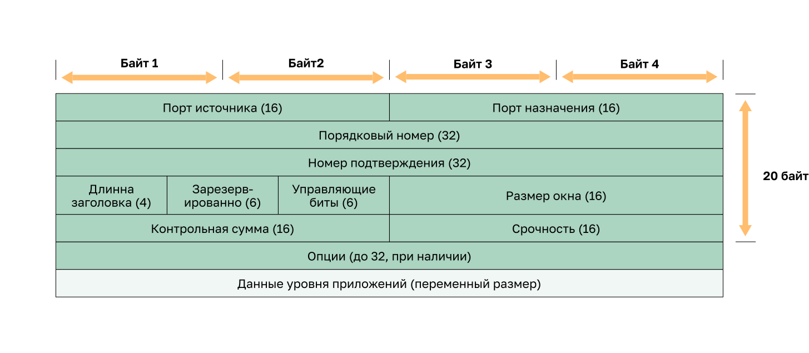
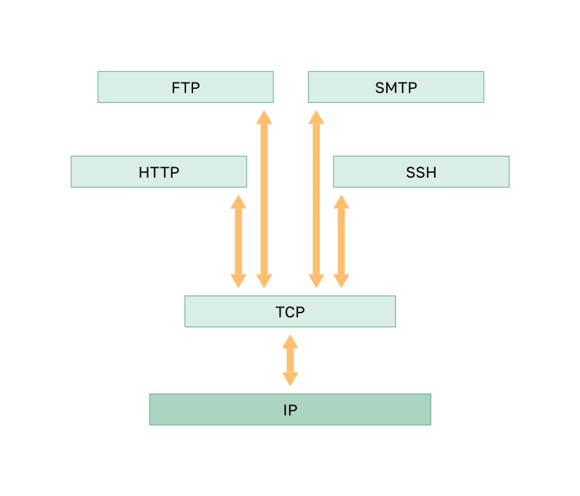

<!-- verified: agorbachev 03.05.2022 -->

<!-- 14.2.1 -->
## Функции протокола TCP

В предыдущем разделе вы узнали, что TCP и UDP — два протокола транспортного уровня. В этом разделе узнаем подробнее о функциях TCP и разберемся, когда лучше использовать его вместо UDP.

Чтобы понять различия между протоколами TCP и UDP, необходимо выяснить, как каждый из них обеспечивает надежность, а также как они отслеживают сеансы связи.

Помимо поддержки таких базовых функций, как сегментация данных и повторная компоновка, протокол TCP также обеспечивает дополнительные возможности:

* **Установление сессии —**  перед пересылкой любого трафика протокол с установлением соединения согласовывает и настраивает постоянное соединение (или сеанс) между устройством источника и устройством назначения. Сеанс позволяет устройствам согласовать объем трафика, который можно переслать в заданный момент времени, а также тщательно контролировать передачу данных между этими двумя устройствами.
* **Гарантия надежной доставки —**  при передаче по сети один из сегментов может быть поврежден или полностью утрачен. TCP обеспечивает гарантированную доставку на узел назначения абсолютно всех сегментов данных, отправленных источником.
* **Обеспечение доставки в нужном порядке —**  поскольку в сетях используется несколько маршрутов с разными скоростями передачи, в процессе доставки данных их порядок может измениться. Используя нумерацию и упорядочивание сегментов, TCP гарантирует, что они будут собраны в правильном порядке.
* **Управление потоком передачи данных —**  ресурсы сетевых узлов, такие как память или вычислительные мощности, ограничены. Когда протокол TCP получает информацию, что эти ресурсы используются слишком активно, он может потребовать от отправляющего приложения снизить скорость потока данных. Для этого TCP регулирует количество информации, передаваемой источником. Функция управления потоком передачи данных предотвращает повторную отправку данных, когда ресурсы получающего узла перегружены.

Для получения дополнительных сведений о TCP ознакомьтесь с [RFC 793](http://rfc.com.ru/rfc793.htm).

<!-- 14.2.2 -->
## Заголовок протокола TCP

TCP отслеживает состояние сеанса передачи данных. Для этого протокол TCP фиксирует, какую информацию он отправил и какая информация была подтверждена. Сеанс связи с контролем состояния начинается с установления сеанса обмена данными и прекращается по его завершении.

Сегмент TCP добавляет 20 байт (то есть 160 бит) накладных расходов при инкапсуляции данных уровня приложения. На рисунке показан заголовок TCP.

<!-- 14.2.3 -->
## Поля заголовка TCP

Таблица идентифицирует и описывает десять полей в заголовке TCP.

| **Поля заголовка TCP** | **Описание** |
| --- | --- |
| **Порт источника**  | 16-битное поле, используемое для идентификации исходного приложения по номеру порта. |
| **Порт назначения** | 16-битное поле, используемое для идентификации приложения назначения по номеру порта. |
| **Порядковый номер** | 32-битное поле, используемое для пересборки данных. |
| **Номер подтверждения**  | 32-битное поле, используемое для указания того, что данные были получены, и следующий байт, ожидаемый от источника. |
| **Длина заголовка**  | 4-битное поле, известное как «смещение данных», которое указывает на длину заголовка сегмента TCP. |
| **Зарезервировано**  | 6-битное поле зарезервировано для использования в будущем. |
| **Управляющие биты**  | Используемое 6-битное поле, включающее битовые коды или флаги, указывающие на назначение и функция сегмента TCP |
| **Размер окна**  | 16-битное поле, используемое для указания количества байтов, которые могут быть приняты за один момент. |
| **Контрольная сумма**  | 16-битное поле, используемое для проверки ошибок заголовка и данных датаграммы. |
| **Срочно**  | 16-битное поле, используемое для указания срочности содержащихся данных. |

<!-- 14.2.4 -->
## Приложения, использующие протокол TCP

Протокол TCP — это отличный пример того, как различные уровни набора протоколов TCP/IP могут выполнять определенные роли. TCP сам разделяет поток данных на сегменты, обеспечивает надежность их передачи, управляет потоком и изменяет порядок сегментов. TCP освобождает приложение от необходимости брать на себя управление любой из этих задач. Приложения, подобные тем, которые показаны на рисунке, могут просто отправить поток данных протоколу транспортного уровня и использовать сервисы TCP.

<!-- 14.2.5 -->
<!-- quiz -->

