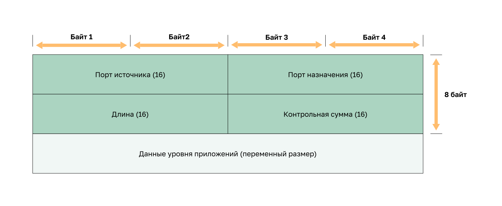
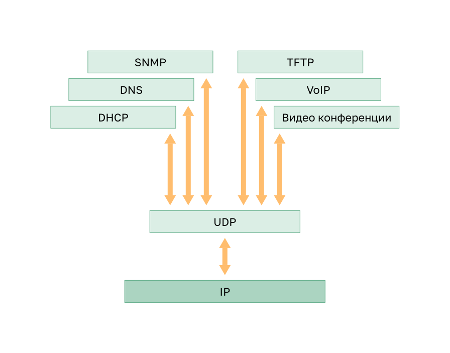

<!-- verified: agorbachev 03.05.2022 -->

<!-- 14.3.1 -->
## Функции протокола UDP

В этом разделе рассмотрим UDP, узнаем его функции и разберемся, когда лучше использовать его вместо TCP.  UDP — это облегченный транспортный протокол с негарантированной доставкой. Он предлагает такую же сегментацию и повторную сборку данных, как и протокол TCP, но при этом не обеспечивает надежность и управление потоком.

UDP — настолько простой протокол, что обычно описывается с точки зрения того, чего он не предоставляет по сравнению с протоколом TCP.

Функции UDP:

* данные восстанавливаются в том порядке, в котором получены;
* потерянные сегменты повторно не отправляются;
* без установления сеанса связи;
* без уведомления отправителя о доступности ресурса.

Для получения дополнительных сведений о UDP ознакомьтесь с [RFC 768](http://rfc.com.ru/rfc768.htm).

<!-- 14.3.2 -->
## Заголовок протокола UDP

UDP — это протокол без отслеживания состояния (stateless. Значит, ни клиент, ни сервер не обязаны отслеживать состояние сеанса связи. Если при использовании UDP в качестве транспортного протокола требуется надежность передачи данных, ее должно обеспечивать само приложение.

Основное требование для передачи видео и голоса по сети в реальном времени — постоянный высокоскоростной поток. Приложения для передачи видео и голоса допускают потери едва заметного количества данных, и отлично подходят для использования протокола UDP.

Единицы информации, передаваемые по протоколу UDP, называются датаграммами или сегментами. Они отправляются без гарантии доставки протоколом транспортного уровня.

Заголовок UDP намного проще, чем заголовок TCP, потому что он имеет только четыре поля и требует 8 байт (т.е. 64 бита). На рисунке показан заголовок TCP.

<!-- 14.3.3 -->
## Поля заголовка UDP

Таблица идентифицирует и описывает четыре поля в заголовке UDP.

| **Поля заголовка UDP** | **Описание** |
| --- | --- |
| **Порт источника**  | 16-битное поле, используемое для идентификации исходного приложения по номеру порта. |
| **Порт назначения** | 16-битное поле, используемое для идентификации приложения назначения по номеру порта. |
| **Длина**  | 16-битное поле, указывающее длину заголовка датаграммы UDP. |
| **Контрольная сумма**  | 16-битное поле, используемое для проверки ошибок заголовка и данных датаграммы. |

<!-- 14.3.4 -->
## Приложения, использующие протокол UDP

Лучше всего подходят для работы с протоколом UDP три типа приложений:

* **мультимедийные приложения и передача видео в режиме реального времени —** могут допускать небольшие потери данных с минимальными задержками (например, VoIP или потоковое видео);
* **простые приложения запросов и ответов —** простые операциями, где хост отправляет запрос и может получить или не получить ответ (например, DNS и DHCP);
* **приложения, самостоятельно обеспечивающие надежность передачи данных —** ненаправленный обмен данными, при котором управление потоком, обнаружение ошибок, отправка подтверждений и восстановление после сбоев не требуются или выполняются самим приложением (например, SNMP и TFTP).

На рисунке указаны приложения, требующие UDP.

И хотя DNS и SNMP по умолчанию используют протокол UDP, они также могут использовать и TCP. DNS — когда размер запроса или ответа превышает 512 байт (например, когда в DNS-ответе содержится большое количество разрешений имен). Аналогичным образом при определенных обстоятельствах администратор сети может настроить SNMP на использование протокола TCP.

<!-- 14.3.5 -->
<!-- quiz -->

