<!-- verified: agorbachev 03.05.2022 -->

<!-- 14.5.1 -->
## Процессы TCP-сервера

Вы уже знаете основы TCP. Понимание роли номеров портов поможет вам разобраться в деталях процесса связи TCP. В этом разделе вы узнаете о трехстороннем рукопожатии TCP и о завершении сеанса.

Каждый процесс приложения сервере использует номер порта. Он автоматически назначается или настраивается системным администратором вручную.

Не допускается использование двумя различными службами на сервере одного и того же порта с одинаковым протоколом транспортного уровня. Например, приложение веб-сервера и приложение передачи файлов, которые запущены на одном узле, нельзя настроить на использование одного и того же порта (например, TCP-порта 80).

Активное серверное приложение, которому присвоен определенный порт, считается открытым. Это значит, что транспортный уровень может принимать и обрабатывать сегменты, направляемые на этот порт. Принимается любой входящий запрос, адресованый правильному сокету, а данные передаются приложению сервера. На сервере можно открыть одновременно несколько портов, по одному для каждого активного приложения.

Клиент 1 запрашивает веб-службы, а Клиент 2 запрашивает службу электронной почты, используя известные порты (например, веб-службы — порт 80, службы электронной почты — порт 25).

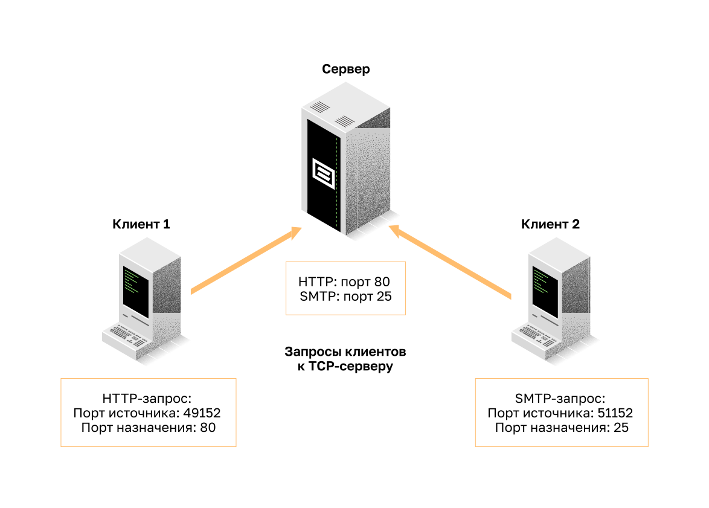

Запросы динамически генерируют номер порта источника. В этом случае клиент 1 использует порт источника 49152, а клиент 2 — порт источника 51152.

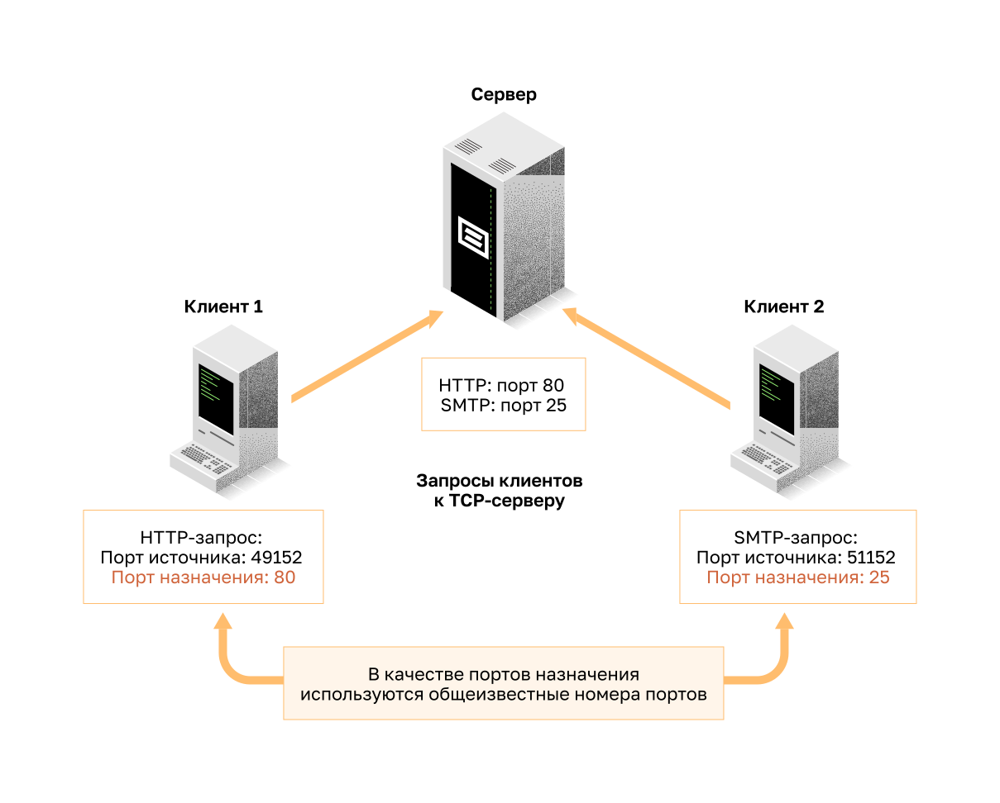

Когда сервер отвечает на запросы клиента, он меняет порты назначения и источника исходного запроса.

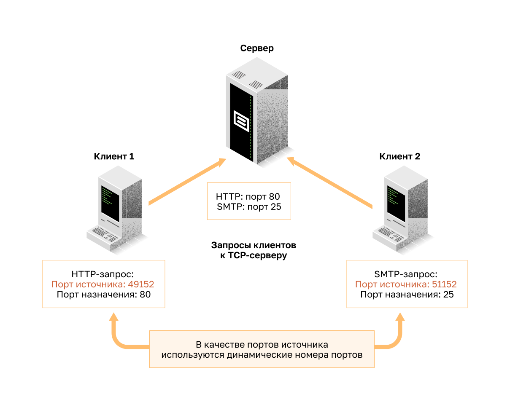

Обратите внимание, что у ответа сервера на веб-запрос теперь порт назначения 49152, а у ответа электронной почты — 51152.

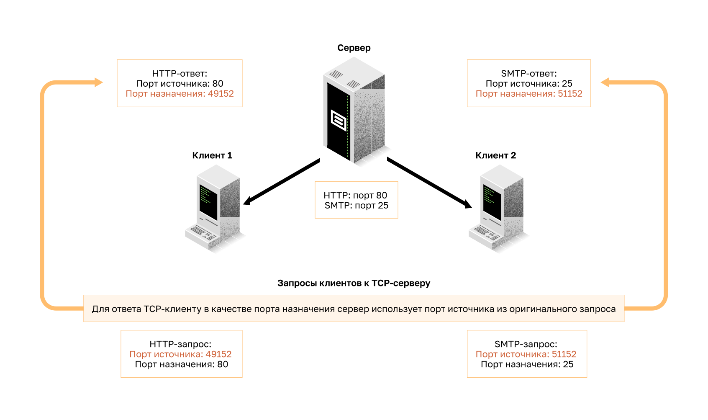

Порт источника в ответе сервера — исходный порт назначения в первоначальных запросах.

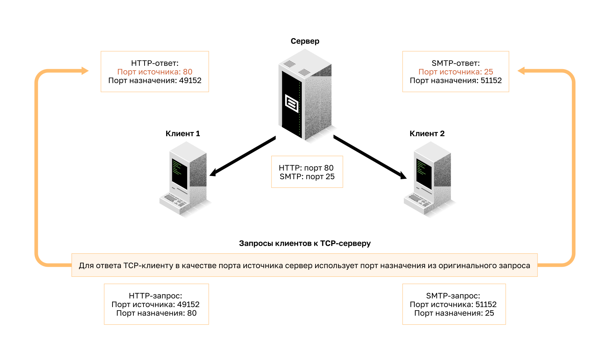

<!-- 14.5.2 -->
## Установление TCP-соединения

В некоторых странах при встрече двух человек принято обмениваться рукопожатиями. Обе стороны понимают это как сигнал для дружеского приветствия. Подключения в сети осуществляются примерно так же. В соединениях TCP клиент хоста устанавливает подключается к серверу, используя процесс трехстороннего рукопожатия.

**Шаг 1. SYN** — инициирующий клиент запрашивает сеанс связи типа «клиент-сервер» с сервером.

**Шаг 2. ACK и SYN** — сервер подтверждает сеанс обмена данными «клиент-сервер» и запрашивает сеанс обмена данными «сервер-клиент».

**Шаг 3. ACK** — инициирующий клиент подтверждает сеанс связи «сервер-клиент».

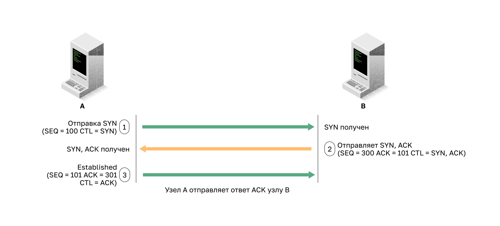

Трехстороннее рукопожатие подтверждает, что узел назначения доступен для связи. В этом примере узел A проверил, что узел B доступен.

<!-- 14.5.3 -->
## Прекращение TCP-соединения

Чтобы прекратить соединение, в заголовке сегмента нужно поставить управляющий флаг Finish (FIN). Для завершения каждого одностороннего TCP-сеанса используется двухстороннее квитирование (рукопожатие, handshake), которое состоит из сегмента FIN и сегмента ACK (подтверждение). Следовательно, чтобы завершить один сеанс связи, поддерживаемый протоколом TCP, необходимы четыре операции обмена данными, которые завершат оба сеанса. Прекращение может инициировать клиент или сервер.

В этом примере термины клиент и сервер используются в качестве ссылки для простоты, но любые два хоста, которые имеют открытый сеанс, могут инициировать процесс завершения.

**Шаг 1. FIN** — когда у клиента больше нет данных для отправки в потоке, он отправляет сегмент с установленным флагом FIN.

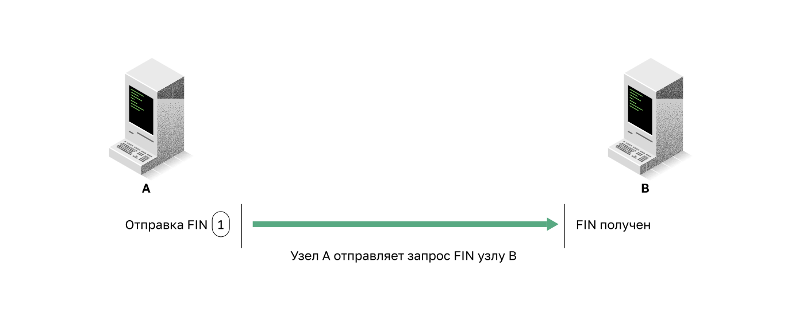

**Шаг 2. ACK** — сервер отправляет подтверждение ACK, чтобы подтвердить получение FIN для завершения сеанса связи «клиент-сервер».

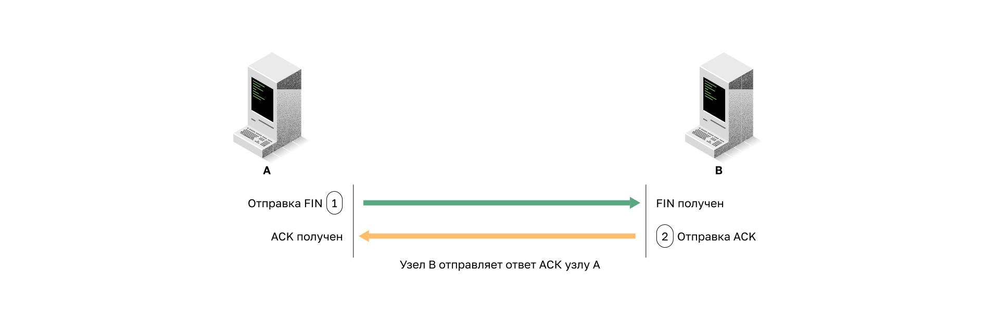

**Шаг 3. FIN** — сервер отправляет клиенту флаг FIN для завершения сеанса связи между сервером и клиентом.

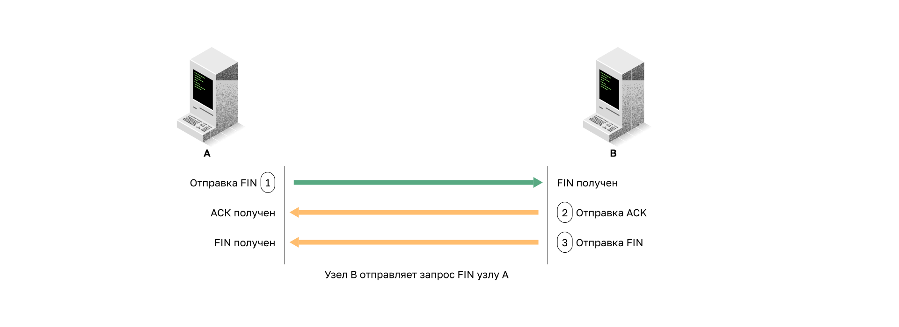

**Шаг 4. ACK** — клиент отправляет в ответ флаг ACK, чтобы подтвердить получение флага FIN от сервера.

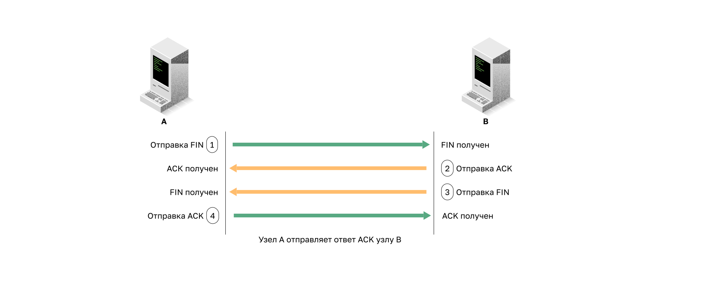

После подтверждения всех сегментов, сеанс закрывается.

<!-- 14.5.4 -->
## Анализ трехстороннего рукопожатия TCP

Узлы отслеживают каждый сегмент данных, передаваемых во время сеанса, и обмениваются полученной информацией с использованием сведений в заголовке TCP. TCP — это полнодуплексный протокол, в котором каждое соединение представляет два односторонних сеанса связи. Чтобы установить соединение, узлы используют трехстороннее рукопожатие. Как показано на рисунке, управляющие биты в заголовке TCP указывают на ход и состояние соединения.

Функции трехстороннего рукопожатия:

* определяет, есть ли в сети устройство назначения;
* проверяет, есть ли на устройстве назначения активная служба и принимает ли она запросы на номер порта назначения, который инициирующий клиент планирует использовать;
* информирует устройство назначения, что клиент источника планирует установить сеанс связи на этом номере порта.

После обмена данными все сеансы закрываются, а соединение прерывается. Механизмы подключения и осуществления сеанса связи включают функции TCP для надежности.

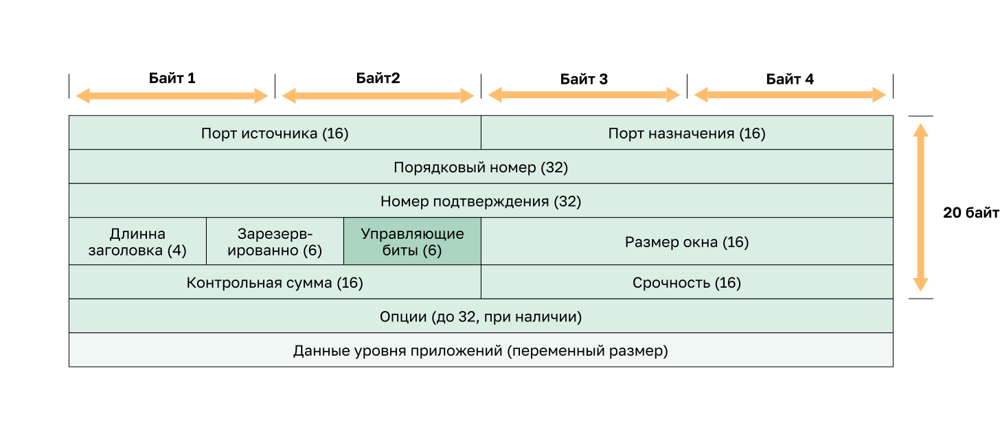

Шесть бит в поле битов управления в заголовке сегмента TCP называются флагами. Каждый флаг представляет собой бит, который либо включен, либо выключен.

Флаги шести битов управления выглядят следующим образом:

* **URG** — флаг «Указатель важности» (Urgent pointer). Устанавливают, если нужно передать ссылку на поле указателя срочности;
* **ACK** — флаг подтверждения. Используют, чтобы установить соединение и завершить сеанс;
* **PSH** — флаг «Push». При нормальном потоке передачи данных система получателя не будет подтверждать получение каждого пакета сразу же после его получения. Вместо этого система получателя в течении некоторого времени будет собирать и хранить полученные данные в буфере, пока не передаст их приложению пользователя. Пакет PUSH инструктирует систему получателя немедленно передать все полученные ранее данные из буфера в приложение пользователя и сразу же отправить сообщение с подтверждением;
* **RST** — Флаг RST. Используют для сброса соединения при ошибке или превышении времени ожидания;
* **SYN** — синхронизирует порядковые номера, используемые при установке соединения;
* **FIN** — больше нет данных от отправителя, используется при завершении сеанса.

<!-- 14.5.5 -->
## Видео: трехэтапное рукопожатие TCP

Посмотрите видео о трехстороннем рукопожатии TCP в программе Wireshark.

<!-- 14.5.6 -->
<!-- quiz -->

