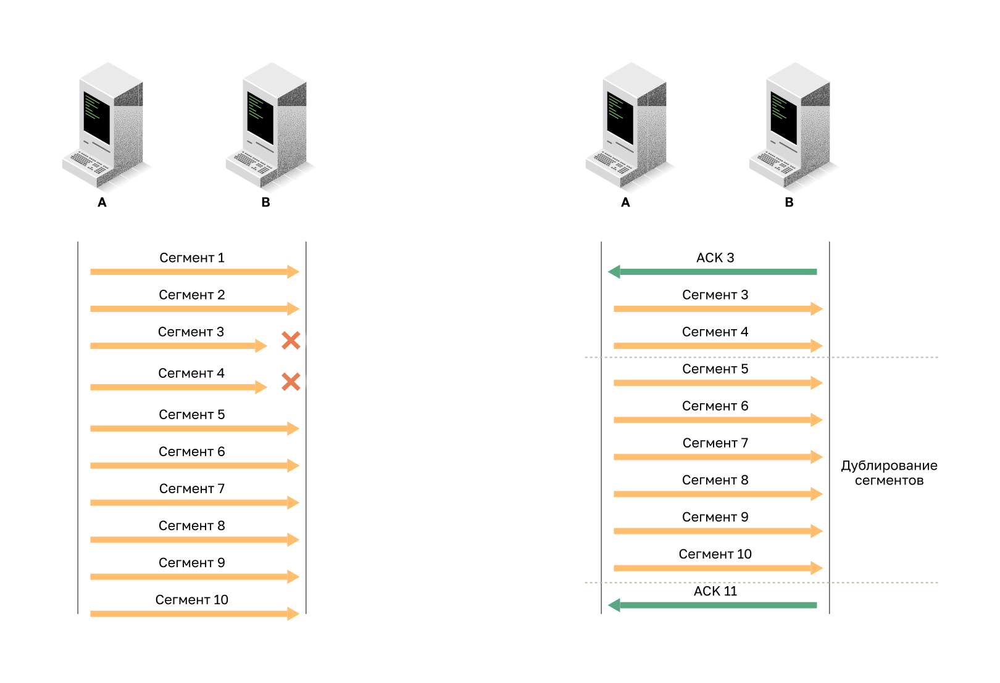
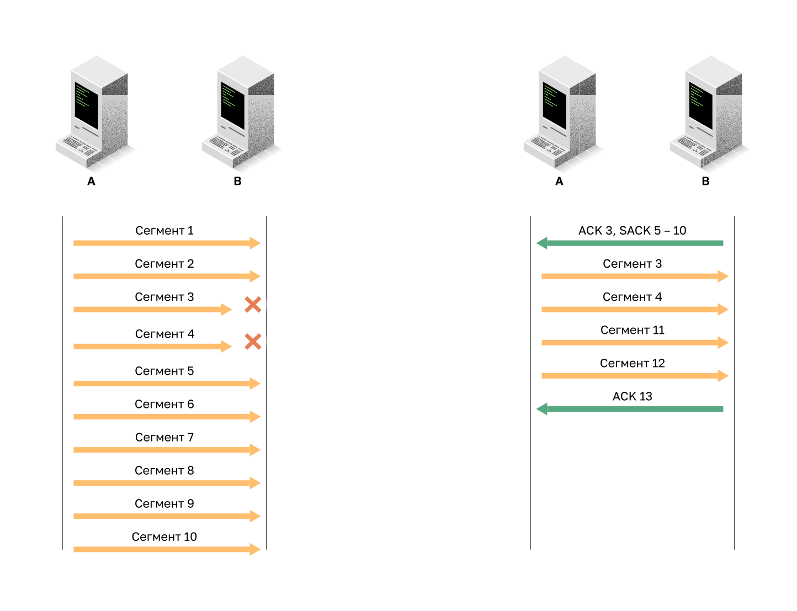
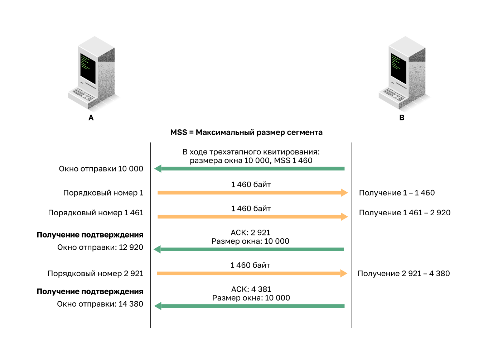
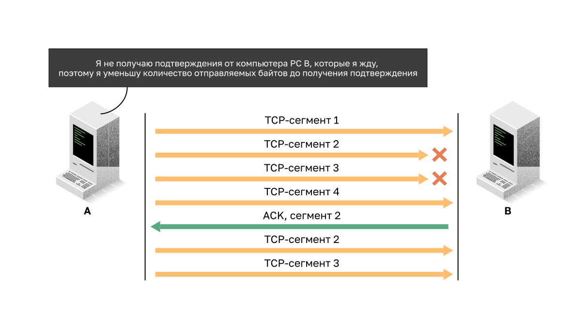

<!-- verified: agorbachev 03.05.2022 -->

<!-- 14.6.1 -->
## Гарантированная и упорядоченная доставка

Причина, по которой TCP является лучшим протоколом для некоторых приложений, заключается в том, что, в отличие от UDP, он повторно отправляет отброшенные пакеты и нумерует пакеты, чтобы указать их правильный порядок перед доставкой. TCP также может помочь поддерживать поток пакетов, чтобы устройства не перегружались. В этом разделе подробно рассматриваются эти особенности TCP.

Могут быть случаи, когда сегменты TCP не приходят к месту назначения. В других случаях сегменты TCP могут поступать в неправильном порядке. Для того чтобы получатель смог расшифровать изначальное сообщение, данные в этих сегментах повторно собираются в исходном порядке. Для этого в заголовке каждого пакета указываются порядковые номера. Порядковый номер соответствует порядковому номеру первого байта данных сегмента TCP.

Во время настройки сеанса связи задается начальный порядковый номер сеанса (ISN). Этот номер ISN представляет собой стартовое значение счётчика байт, переданных удалённому приложению. По мере передачи данных во время сеанса порядковый номер увеличивается на число переданных байтов. Такое отслеживание байтов данных позволяет однозначно определять и подтверждать каждый сегмент. Можно выяснить, какие сегменты отсутствуют.

Номер ISN не обязательно должен начинаться с «1», фактически это случайное число. Это позволяет предотвратить определенный тип вредоносных атак. Для удобства в примерах в этой главе в качестве номера ISN используется число 1.

Порядковые номера сегментов указывают порядок повторной сборки и упорядочения полученных сегментов, как показано на рисунке.

Получающий TCP-процесс помещает данные из сегмента в получающий буфер. Сегменты располагаются в соответствии с порядковыми номерами и после повторной сборки передаются на уровень приложений. Все сегменты, которые поступают с несоответствующими порядковыми номерами, сохраняются для последующей обработки. Затем, когда поступают сегменты с отсутствующими байтами, такие сегменты обрабатываются по порядку.

<!-- 14.6.2 -->
## Видео: порядковые номера и подтверждения

Одной из функций протокола TCP является гарантированная доставка каждого из сегментов получателю. Службы TCP на узле назначения подтверждают данные, полученные им от приложения источника.

Посмотрите видео, посвященное порядковым номерам и подтверждениям TCP.

<!-- 14.6.3 -->
## Потеря данных и повторная передача

Независимо от того, насколько хорошо разработана сеть, иногда происходит потеря данных. Протокол TCP обеспечивает возможности для управления потерянными сегментами. Среди них — механизм повторной передачи сегментов с данными, получение которых не было подтверждено.

До последующих усовершенствований, TCP мог подтвердить только ожидаемый следующий байт. Например, на рисунке, используя номера сегментов для простоты, узел A отправляет сегменты с 1 по 10 на узел B. Если все сегменты прибывают, за исключением сегментов 3 и 4, узел B отвечает с подтверждением, указав, что следующим сегментом является сегмент 3. Хост А понятия не имеет, прибыли ли какие-либо другие сегменты или нет. Таким образом, узел A будет повторно переслать сегменты 3-10. Если все повторные сегменты  переданы успешно, сегменты с 5 по 10 будут дубликатами. Это может привести к задержкам, перегрузкам и неэффективности.

В настоящее время серверные операционные системы обычно используют опциональную функцию TCP, называемую выборочным подтверждением (SACK), согласованную во время трехстороннего рукопожатия. Если оба узла поддерживают SACK, принимающее устройство может явно определить, какие сегменты (байты) были получены, включая любые сегменты прерывания. Поэтому отправляющему хосту нужно будет только повторно передать недостающие данные. Например, на следующем рисунке, снова используя номера сегментов для простоты, узел A отправляет сегменты с 1 по 10 на узел B. Если все сегменты прибывают, кроме сегментов 3 и 4, узел B может подтвердить, что он получил сегменты 1 и 2 (ACK 3), и выборочно подтвердить сегменты с 5 по 10 (SACK 5-10). Хост A должен будет только повторно отправить сегменты 3 и 4.

**Примечание**: TCP обычно отправляет ACK для каждого следующего пакета, но другие факторы, выходящие за рамки данного раздела, могут изменить это поведение.

TCP использует таймеры, чтобы узнать, сколько времени ждать перед повторной отправкой сегмента. Нажмите кнопку «Воспроизведение» на рисунке, чтобы посмотреть видео, а затем щелкните ссылку для загрузки PDF-файла. Из этого видеоролика и PDF-файла вы узнаете о потерях данных и повторной передаче сегментов.

<!-- 14.6.4 -->
## Видео: потеря данных и повторная передача

Нажмите кнопку Play (Воспроизведение) на рисунке, чтобы ознакомиться с учебным материалом, посвященным повторной передаче TCP.

<!-- 14.6.5 -->
## Управление потоком

Протокол TCP обеспечивает механизмы для управления потоком данных. Управление потоком данных - это объем данных, которые получатель может получить и надежно обработать. Управление потоком позволяет поддерживать надежность передачи по протоколу TCP, регулируя скорость потока данных между узлами источника и назначения в течение определенного сеанса. Для этого, в заголовке TCP имеется 16-битное поле, которое называется размером окна.

На рисунке приведен пример размера окна и подтверждений.

### Размер окна и подтверждения

Размер окна определяет количество байтов, которые могут быть отправлены до ожидания подтверждения. Номер подтверждения — номер следующего ожидаемого байта.

Размер окна — это количество байтов, которое устройство назначения способно принять и обработать за один раз во время сеанса TCP. В этом примере первоначальный размер окна узла PC B для представленного сеанса TCP установлен равным 10 000 байт. Начиная с первого байта (с порядковым номером 1), последним байтом, который узел PC A может отправить без получения подтверждения, будет 10 000-й байт. Это называется окном отправки ПК А. Размер окна включен в каждый сегмент TCP, поэтому получатель может изменить размер окна в любое время в зависимости от доступности буфера.

Изначальный размер окна согласуется во время установления сеанса TCP в процессе трехстороннего квитирования. Устройство источника должно ограничить количество байтов данных, отправленных устройству назначения, в соответствии с размером окна последнего. Только после получения подтверждения приема байтов устройством источника оно может продолжить отправку остальных данных в этом сеансе. Обычно узел назначения не дожидается получения всех байтов для заданного размера окна, чтобы отправить подтверждение. По мере получения и обработки байтов узел назначения отправляет подтверждения, чтобы сообщить узлу источника о возможности продолжать отправку дополнительных байтов.

Например, ясно, что ПК B не будет ждать, пока все 10000 байтов будут получены, прежде чем отправлять подтверждение. Это означает, что ПК A может настраивать свое окно отправки, когда он получает подтверждения от ПК B. Как показано на рисунке, когда ПК A получает подтверждение с номером подтверждения 2921, который является следующим ожидаемым байтом. Окно отправки ПК A будет увеличиваться 2 920 байт. Это изменит окно отправки с 10 000 байт до 12 920. После этого узел PC A может продолжить отправку следующих 10 000 байт на узел PC B, пока на 12 920-м байте не будет достигнуто новое окно отправки.

Процесс отправки подтверждений узлом назначения по мере обработки полученных байтов и непрерывная регулировка окна отправки источника называются скользящими окнами. В предыдущем примере, окно отправки ПК A увеличивается или перемещается на 2 921 байт от 10 000 до 12 920.

Когда доступное пространство в буфере узла назначения снижается, он может уменьшить размер окна и сообщить узлу источника о том, сколько байт теперь источнику следует отправлять без получения подтверждения.

**Примечание**: Устройства обычно используют протокол скользящих окон. Получатель обычно отправляет подтверждение после получения каждых 2 сегментов. Количество таких сегментов, после которых отправляется подтверждение, может варьироваться. Преимущество скользящих окон состоит в том, что этот протокол позволяет отправителю передавать сегменты непрерывно в том случае, если получатель подтверждает получение предыдущих сегментов. Подробные сведения о скользящих окнах не рассматриваются в этой учебной программе.

<!-- 14.6.6 -->
### Максимальный размер сегмента (MSS)

На рисунке источник передает 1460 байт данных в каждом сегменте. Обычно это максимальный размер сегмента (MSS), который может получить конечное устройство. MSS является частью поля параметров в заголовке TCP, который определяет наибольший объем данных в байтах, которые устройство может получить в одном сегменте TCP. Размер MSS не включает заголовок TCP. MSS обычно включается во время трехстороннего рукопожатия.

Обычный MSS составляет 1 460 байт при использовании IPv4. Узел определяет значение своего поля MSS путем вычитания размера заголовков IP и TCP из размера MTU для Ethernet. На интерфейсе Ethernet размер MTU по умолчанию равен 1500 байт. Если вычесть заголовок IPv4 размером 20 байт и заголовок TCP размером 20 байт, то размер MSS по умолчанию будет равен 1460 байт, как показано на рисунке.

<!-- 14.6.7 -->
### Предотвращение перегрузок

В случае возникновения перегрузки в сети перегруженный маршрутизатор перестает обрабатывать пакеты. Когда пакеты с сегментами TCP не доходят до своего узла назначения, они не подтверждаются. Определив скорость передачи данных, при которой сегменты TCP отправляются, но не подтверждаются, узел источника может примерно определить уровень загруженности сети.

В случае перегрузки происходит повторная передача потерянных сегментов TCP с узла источника. При отсутствии должного контроля над повторной передачей подобная отправка потерянных сегментов TCP может только ухудшить ситуацию. Помимо отправки в сеть новых пакетов с сегментами TCP возникает эффект обратной связи, когда переданные повторно потерянные сегменты TCP еще больше перегружают сеть. Во избежание таких ситуаций и для предотвращения перегрузок сети в протоколе TCP предусмотрен ряд соответствующих механизмов, таймеров и алгоритмов.

Когда узел источника обнаруживает, что сегменты TCP не подтверждаются своевременно или не подтверждаются вовсе, он может сократить количество байтов, которые он отправляет, прежде чем получит подтверждение. Как показано на рисунке, ПК A чувствует, что существует перегрузка и, следовательно, уменьшает количество байтов, которые он отправляет перед получением подтверждения от ПК B.

Подтверждения нумеруются по следующему полученному байту, а не по номеру сегмента. Номера сегментов упрощены в целях наглядности.

Следует отметить, что узел источника сокращает именно количество неподтвержденных байтов, которые он отправляет, а не размер окна, определенный узлом назначения.

**Примечание:** Подробные сведения о механизмах, таймерах и алгоритмах, используемых для предотвращения перегрузок, не включены в этот курс.

<!-- 14.6.8 -->
<!-- quiz -->

