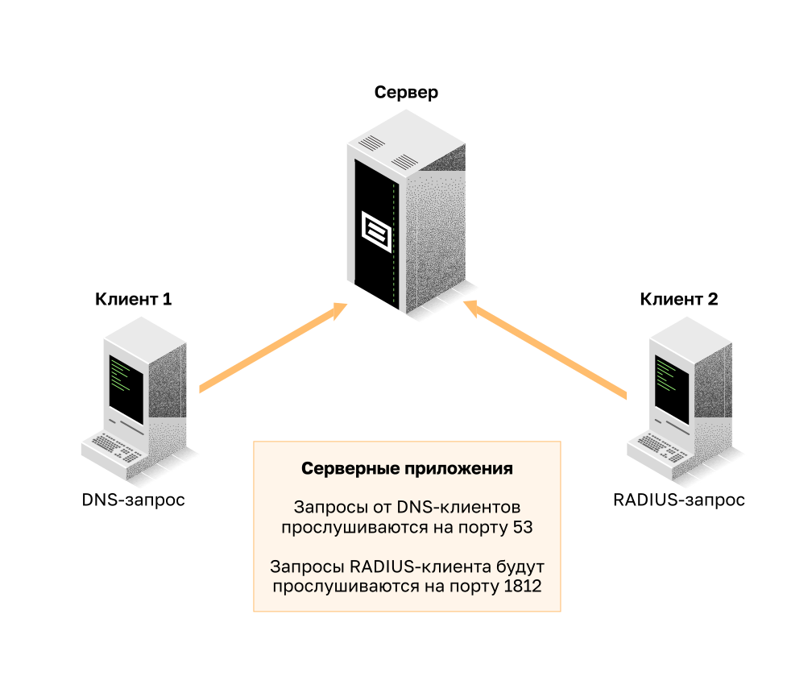
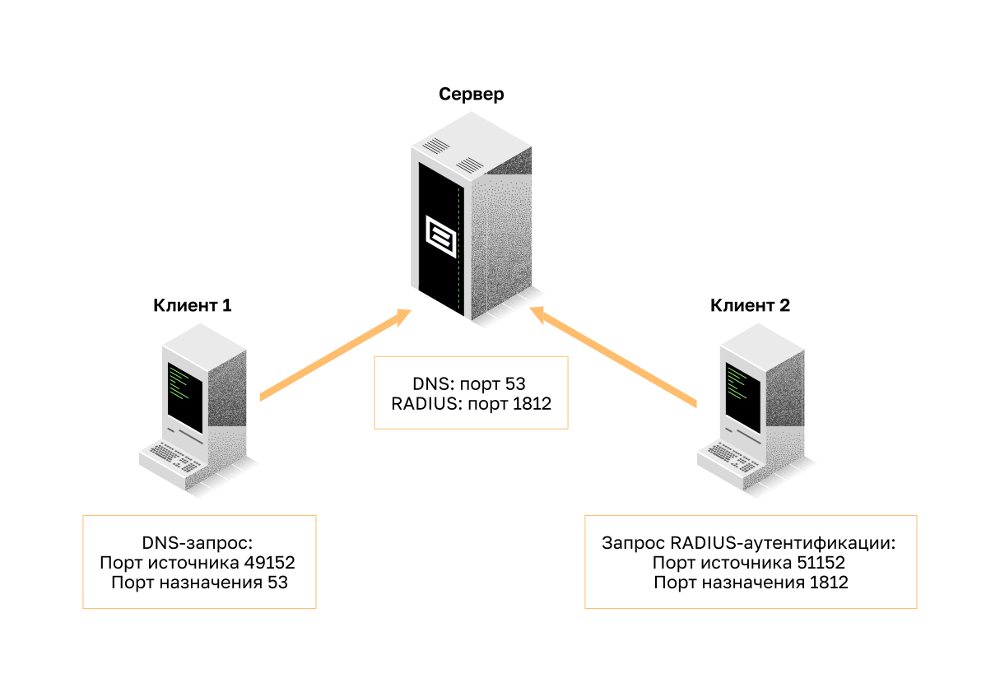
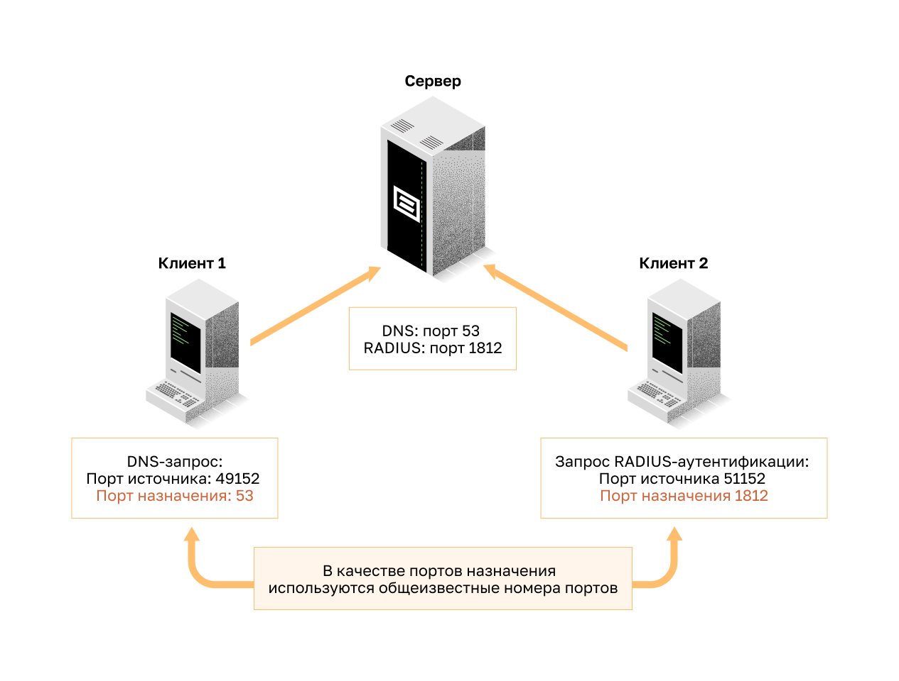
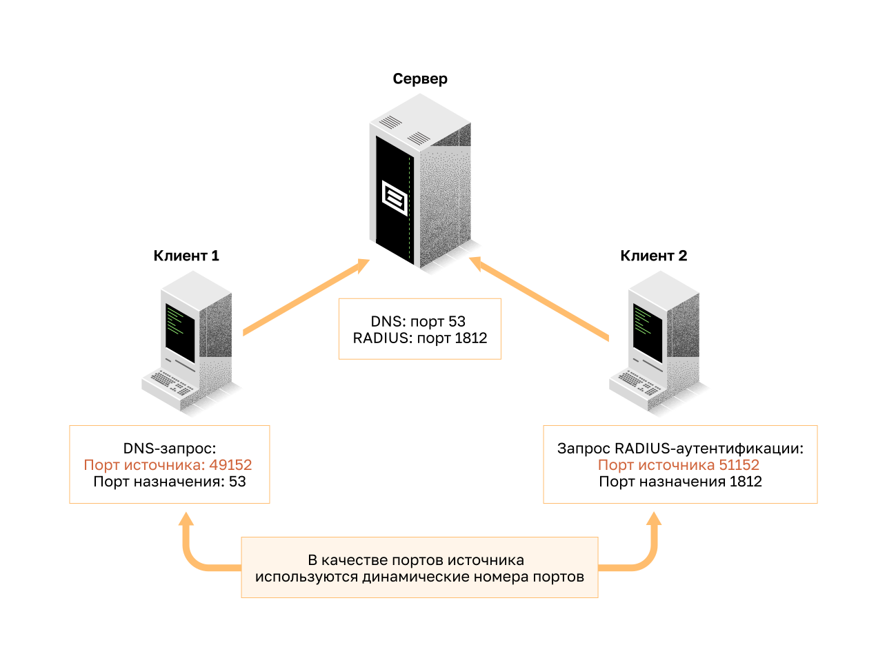
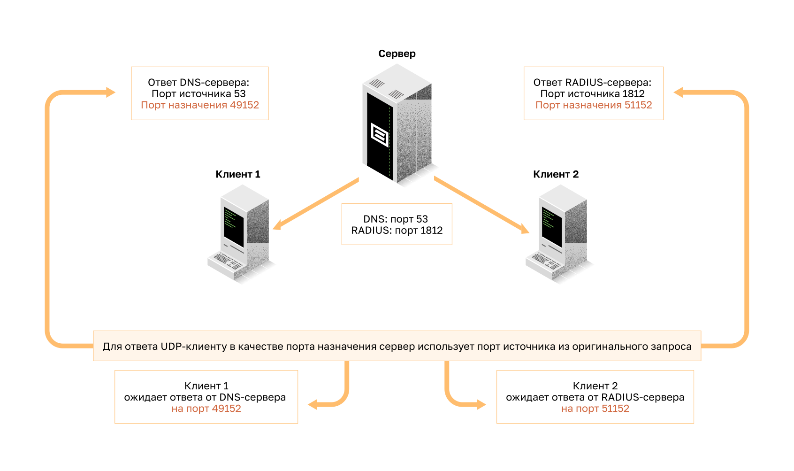
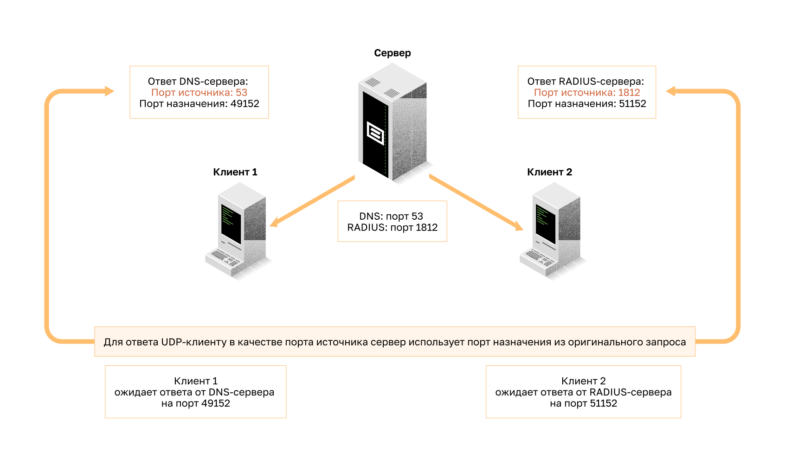

<!-- verified: agorbachev 03.05.2022 -->

<!-- 14.7.1 -->
## UDP: низкие накладные расходы или надежность?

Как объяснялось ранее, UPD идеально подходит для связи, которая должна быть быстрой, например VoIP. В этом разделе подробно объясняется, почему UDP идеально подходит для некоторых типов передач. Как показано на рисунке, UDP не устанавливает соединение. Протокол UDP обеспечивает передачу данных с меньшими накладными расходами, поскольку он имеет небольшой заголовок датаграммы и не обменивается управляющим трафиком.

<!-- 14.7.2 -->
## Сборка датаграмм UDP

Как и в случае с сегментами TCP, когда на узел назначения отправляются датаграммы UDP, они могут использовать разные пути и прибыть в неправильном порядке. Протокол UDP не отслеживает порядковые номера, как это делает TCP. Как показано на рисунке, у UDP нет способа повторно скомпоновать датаграммы вё порядке, который использовался при их передаче.

Таким образом, протокол UDP просто повторно собирает данные в том порядке, в котором он их принял, и пересылает их приложению. Если последовательность данных важна для работы приложения, оно должно определить правильную последовательность и выбрать оптимальный способ обработки данных.

<!-- 14.7.3 -->
## Процессы и запросы UDP-сервера

Как и приложениям, использующим TCP, серверным приложениям на основе UDP присваиваются известные или зарегистрированные номера портов, как показано на рисунке. Когда эти приложения или процессы запущены на сервере, они принимают данные, совпадающие с присвоенным номером порта. Если UDP получает датаграмму, адресованную одному из этих портов, он пересылает данные соответствующему приложению, исходя из его номера порта.

**Примечание:** Сервер RADIUS (Remote Authentication Dial-in User Service ― удаленная аутентификация абонента телефонной сети), изображенный на рисунке, предоставляет службы аутентификации, авторизации и учета для управления доступом пользователей. Подробные сведения о работе сервера RADIUS не включены в данный курс.

<!-- 14.7.4 -->
## Процессы UDP-клиента

Как и в случае с TCP, клиентское приложение запрашивает данные и инициирует обмен с сервером. Процесс UDP-клиента динамически выбирает номер порта из диапазона и использует его в качестве порта источника для сеанса связи. Как правило, порт назначения — это общеизвестный или зарегистрированный номер порта, присвоенный процессу сервера.

Когда клиент выбрал порты источника и назначения, эта же пара портов указывается в заголовке всех датаграмм, которые используются в процессе пересылки. Чтобы сервер мог вернуть данные клиенту, номера портов источника и назначения в заголовке датаграммы указываются в обратном порядке.

Клиент 1 отправляет запрос DNS с использованием известного порта 53, а клиент 2 запрашивает службы аутентификации RADIUS с помощью зарегистрированного порта 1812.

Запросы клиентов динамически генерируют номера портов источника. В этом случае клиент 1 использует порт источника 49152, а клиент 2 использует порт источника 51152.

Когда сервер отвечает на запросы клиента, он меняет порты назначения и источника исходного запроса.

Ответ сервера на запрос DNS теперь является порт назначения 49152, а ответ проверки подлинности RADIUS теперь порт назначения 51152.

Порт источника в ответе сервера является исходным портом назначения в первоначальных запросах.

<!-- 14.7.5 -->
<!-- quiz -->

