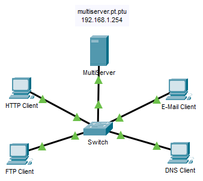

---

> **ВАЖНО**
> 
> Форма для ответов на вопросы будет доступна только при развертывании лабораторной работы 

---

## Топология

## Задачи

Часть 1. Генерация сетевого трафика в режиме моделирования

Часть 2. Изучение функциональных возможностей протоколов TCP и UDP

## Общие сведения

Это упражнение по моделированию позволит понять основы протоколов TCP и UDP для более подробного их изучения в дальнейшем. Режим моделирования Packet Tracer дает вам возможность просматривать состояние различных PDU, когда они перемещаются по сети.

Режим моделирования программы Packet Tracer позволяет просматривать все протоколы и относящиеся к ним PDU. Ниже представлены шаги для поэтапного ознакомления с процессом запроса сервисов с помощью различных приложений, доступных на клиентском ПК. Вы можете изучить функциональные особенности протоколов TCP и UDP, а также возможности мультиплексирования и функцию номеров портов при определении локального приложения, запросившего данные или отправляющего их. Packet Tracer не засчитывает это действие.

## Инструкции

### Часть 1. Генерация сетевого трафика в режиме моделирования и просмотр мультиплексирования.

**Шаг 1. Сгенерируйте трафик для заполнения таблиц протокола разрешения адресов (ARP).**

Выполните указанные ниже действия, чтобы уменьшить объем сетевого трафика, отображаемого при моделировании.

1.  Нажмите **MultiServer** (Мультисервер) и выберите на вкладке **Desktop** (Рабочий стол) элемент **Command Prompt** (Командная строка).

2.  Введите команду **ping -n 1 192.168.1.255** . Вы пингуете широковещательный адрес для клиентской локальной сети. Команда будет отправлять только один запрос ping, а не обычные четыре. Это займет несколько секунд, поскольку каждое устройство в сети отвечает на запрос ping от MultiServer.

3.  Закройте окно **MultiServer (Мультисервер).**

**Шаг 2. Сгенерируйте веб-трафик (HTTP).**

1.  Перейдите в режим моделирования.

2.  Нажмите кнопку **HTTP Client** и откройте **веб-браузер** с рабочего стола.

3.  В поле URL-адреса введите **192.168.1.254** и нажмите кнопку **Go**. В окне топологии появятся конверты (единицы PDU).

4.  Сверните (но не закрывайте) окно **HTTP Client** (HTTP-клиент).

**Шаг 3. Сгенерируйте FTP-трафик.**

1.  Нажмите **FTP-клиент** и откройте **командную строку** на рабочем столе.

2.  Введите команду **ftp 192.168.1.254**. В окне моделирования появятся единицы PDU.

3.  Сверните (но не закрывайте) окно **FTP Client**(FTP-клиент).

**Шаг 4. Сгенерируйте DNS-трафик.**

1.  Нажмите DNS Client и выберите **Command Prompt**(Командная строка).

2.  Введите команду **nslookup multiserver.pt.ptu**. В окне моделирования появится единица PDU.

3.  Сверните (но не закрывайте) окно **DNS Client (DNS-клиент).**

**Шаг 5. Сгенерируйте трафик электронной почты.**

1.  Нажмите **E-Mail Client**(Почтовый клиент) и откройте **E Mail** (Эл. почта) на Рабочем столе.

2.  Нажмите кнопку **Compose** (Создать) и введите следующие сведения:

    1.  To (Получатель): **user@multiserver.pt.ptu**

    2.  **Subject (Тема):** укажите тему сообщения

    3.  E-Mail Body (Текст письма): **введите текст письма**

3.  Нажмите **Send (Отправить)**.

4.  Сверните (но не закрывайте) окно **E-Mail Client** (Почтовый клиент).

**Шаг 6. Убедитесь, что трафик сгенерирован и готов для моделирования.**

Теперь на панели моделирования должны быть записи PDU для каждого клиентского компьютера.

**Шаг 7. Изучите процесс мультиплексирования при передаче трафика по сети.**

Теперь вы будете использовать **кнопку Захват/Переадресация** на панели моделирования, чтобы наблюдать за различными протоколами, перемещающимися по сети.

**Примечание**: Кнопка Capture/Forward (Захватки/Вперед) ' **\>\|** ' представляет собой маленькую стрелку, указывающую вправо с вертикальной линией рядом с ней.

1.  Нажмите кнопку **Capture/Forward (Захватить/вперед)** один раз. Все PDU передаются на коммутатор.

2.  Нажмите « **Capture/Forward**» шесть раз и наблюдайте за PDU с разных хостов, пока они путешествуют по сети. Обратите внимание, что в любой момент времени только одна PDU может передаваться по проводу в каждом направлении.

    Вопросы:

    - ответьте на вопрос №1

### Часть 2. Изучение функциональных возможностей протоколов TCP и UDP

**Шаг 1. Изучите HTTP-трафик, когда клиенты обмениваются данными с сервером.**

1.  Нажмите **Reset Simulation** (Сбросить моделирование).

2.  Фильтрация трафика отображается в данный момент только для **HTTP** и **TCP** PDU. Чтобы отфильтровать отображаемый трафик:

    1.  Нажмите кнопку **Edit Filters (Редактировать фильтры)** и измените состояние флажка **Show All/None (Показать все/ничего).**

    2.  Выберите протоколы **HTTP** и **TCP**. Нажмите красную кнопку «x» в правом верхнем углу окна «Редактировать фильтры», чтобы закрыть ее. В разделе Visible Events (Видимые события) теперь должны отображаться только PDU-единицы **HTTP**- и **TCP**-трафика.

3.  Откройте браузер на HTTP-клиенте и введите **192.168.1.254** в поле URL. Нажмите кнопку **Перейти** , чтобы подключиться к серверу по протоколу HTTP. Сверните окно HTTP Клиента.

4.  Нажмите «**Capture/Forward**», пока не появится PDU для HTTP. Обратите внимание, что цвет конверта в окне топологии совпадает с цветовым кодом PDU HTTP в панели моделирования.

    - ответьте на вопрос №2

5.  Нажмите конверт PDU для отображения сведений о PDU. Перейдите на вкладку **Outbound PDU Details** (Сведения об исходящем PDU) и прокрутите вниз со второго до последнего раздела.

    Вопросы:

    - ответьте на вопрос №3

    - ответьте на вопрос №4

6.  Посмотрите на значение в поле Флаги, которое находится рядом с полем Окно. Значения справа от «b» представляют TCP-флаги, установленные для данного этапа обмена данными. Каждое из шести мест соответствует флагу. Наличие «1» в любом месте указывает на то, что флаг установлен. За один раз можно установить несколько флагов. Значения флагов показаны ниже.

    | Место флага | **6** | **5** | **4** | **3** | **2** | **1** |
    |-------------|-------|-------|-------|-------|-------|-------|
    | Значение    | URG   | ACK   | PSH   | RST   | SYN   | FIN   |

    - ответьте на вопрос №5

7.  Закройте PDU и нажимайте кнопку **Capture/Forward** пока PDU не вернется на узел **HTTP Client**.

8.  Нажмите конверт PDU и откройте вкладку **Inbound PDU Details**(Сведения о входящей PDU).

    - ответьте на вопрос №6

9.  Нажмите по HTTP PDU, который **HTTP-клиент** подготовил для отправки в **MultiServer** . Это начало сеанса связи по протоколу HTTP. Щелкните второй конверт PDU и откройте вкладку **Outbount PDU Details** (Сведения об исходящей PDU).

    - ответьте на вопрос №7

10. Моделирование будет сброшено.

**Шаг 2. Изучите FTP-трафик, когда клиенты обмениваются данными с сервером.**

1.  Откройте командную строку на рабочем столе клиента FTP. Запустите FTP-соединение, введя **ftp 192.168.1.254**.

2.  Откройте панель моделирования и измените **Edit Filters** (Редактировать фильтры), чтобы отображались только протоколы **FTP** и **TCP**.

3.  Нажмите кнопку **Capture/Forward** (Захватить/переадресовать). Нажмите на второй конверт PDU и откройте его.

    Откройте вкладку **Outbound PDU Details** (Сведения о входящей PDU) и перейдите вниз к TCP разделу.

4.  Запишите значения параметров **SRC PORT**, **DEST PORT**, **SEQUENCE NUM** и **ACK NUM**.

    - ответьте на вопрос №8

5.  Закройте PDU и нажимайте кнопку **Capture/Forward** пока PDU не вернется на узел **FTP Client** с флажком.

6.  Нажмите конверт PDU и откройте вкладку **Inbound PDU Details**(Сведения о входящей PDU).

    - ответьте на вопрос №9

7.  Щелкните вкладку **Outbound PDU Details** (Сведения об исходящей PDU).

    - ответьте на вопрос №10

8.  Закройте PDU и нажимайте кнопку **Capture/Forward** до тех пор, пока вторая PDU не вернется на узел **FTP Client**. Единица PDU обозначена другим цветом.

9.  Нажмите PDU и откройте вкладку **Inbound PDU Details**(Сведения о входящей PDU). Прокрутите страницу вниз до раздела TCP.

    - ответьте на вопрос №11

10. Нажмите Reset Simulation (Сбросить моделирование).

**Шаг 3. Изучите DNS-трафик, когда клиенты обмениваются данными с сервером.**

1.  Повторите действия, описанные в части 1, чтобы создать DNS-трафик.

2.  Откройте панель моделирования, нажмите кнопку **Edit Filters**(Редактировать фильтры) и измените параметры применения фильтров, чтобы отображались только протоколы **DNS** и **UDP**.

3.  Щелкните конверт PDU и откройте его.

4.  Посмотрите детали модели OSI для исходящего PDU.

    Вопросы:

    - ответьте на вопрос №12

5.  Откройте вкладку Сведения о исходящих PDU и найдите раздел UDP форматов PDU. Запишите значения параметров **SRC PORT** и **DEST PORT**.

    - ответьте на вопрос №13

6.  Закройте **PDU** и нажимайте кнопку **Capture/Forward** пока PDU не вернется на узел **DNS Client**.

7.  Нажмите конверт PDU и откройте вкладку **Inbound PDU Details**(Сведения о входящей PDU).

    Вопросы:

    - ответьте на вопрос №14

    - ответьте на вопрос №15

8.  Нажмите Reset Simulation (Сбросить моделирование).

**Шаг 4. Изучите трафик электронной почты, когда клиенты обмениваются данными с сервером.**

1.  Повторите действия, описанные в части 1, чтобы отправить электронное письмо на **адрес user@multiserver.pt.ptu**.

2.  Откройте панель моделирования, нажмите кнопку **Edit Filters** (Редактировать фильтры) и измените параметры применения фильтров, чтобы отображались только протоколы **POP3, SMTP** и **TCP**.

3.  Нажмите конверт PDU и откройте его.

4.  Откройте вкладку**Outbound PDU Details** и перейдите вниз к последнему разделу.

    Вопросы:

    - ответьте на вопрос №16

5.  Запишите значения параметров **SRC PORT**, **DEST PORT**, **SEQUENCE NUM** и **ACK NUM**. 
    
    - ответьте на вопрос №17

6.  Закройте **PDU** и нажимайте кнопку **Capture/Forward (Захватить/вперед)** до тех пор, пока PDU не вернется на узел **E-mail Client** с флажком.

7.  Нажмите конверт TCP и откройте вкладку **Inbound PDU Details**(Сведения о входящей PDU).

    - ответьте на вопрос №18

8.  Щелкните вкладку **Outbound PDU Details** (Сведения об исходящей PDU).

    - ответьте на вопрос №19

9.  Это второй **PDU** другого цвета, который **E-Mail Client** подготовил для отправки в **MultiServer.** Это начало сеанса передачи электронной почты. Щелкните второй конверт PDU и откройте вкладку **Outbount PDU Details** (Сведения об исходящей PDU).

    Вопросы:

    - ответьте на вопрос №20

    - ответьте на вопрос №22

[Скачать файл Packet Tracer для локального запуска](./assets/14.8.1-lab.pka)
